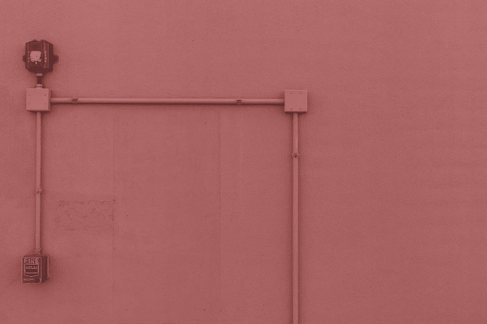

# 极简软件架构

> 原文：<https://itnext.io/minimalist-software-architecture-426888684e60?source=collection_archive---------1----------------------->

## 构建大规模多区域分布式系统的经验教训

没有人是一座孤岛，软件系统也不是。当设计一个系统时，软件架构师通常需要选择依赖项——基础设施、认证、存储，等等。当我刚开始在 IBM 承担软件架构的责任时，我倾向于选择完成工作的依赖项，但是很快我就学到了这个教训:做一个极简主义者。只有在绝对需要的时候才引入新的依赖项。

信用:[像素](https://pixabay.com/users/Pexels-2286921/)/像素

# 什么是依赖，真的？

答案似乎很简单。如果你的系统依赖某样东西来运行，这就是依赖。然而，这只是冰山一角。依赖关系需要:

*   存在:无论您的系统走到哪里，它都会跟到哪里。
*   合规性:它符合您的系统要求的相同合规性。
*   《UX》:它让你的用户快乐。
*   维护:你需要花费额外的资源来维护。

当然，在选择依赖项时还有许多其他因素，但我觉得这些都值得一谈。

# 存在:一个战争故事

在 IBM Watson，像在许多其他全球企业一样，我们的系统部署在世界各地。在设计内部 SaaS 时，我们的团队希望使用由另一个 IBM 团队托管的数据库即服务。我们在我们的开发环境中用它做了一个原型，甚至在我们的美国生产中做了 alpha 展示。一切看起来都很棒。

然而，当我们被要求在截止日期前将我们的系统部署到欧洲和澳大利亚等非美国地区时，我们意识到数据库团队有自己的全球部署时间表。我们可以等待它们，或者在代码中创建一个标志，根据数据库的存在禁用一些功能。

我们最终选择了后者。但是它给我们的部署带来了碎片化，这给我们的 CI/CD 管道带来了更多的麻烦。这也给我们的代码库带来了不必要的复杂性。当我们添加新特性时，我们需要考虑两种情况(有或没有数据库)。如果你有 n 个依赖项，你可能会以依赖项存在情况的 2^N 组合结束。不用说，这将是一场噩梦。

这就是为什么当你选择依赖时，要保证无论你在哪里，它都会存在。

# 服从

今天，关于计算系统的规定和法规比以往任何时候都多。如果你的公司服务于欧盟公民，你可能会受到 GDPR。如果你希望在美国为医疗保健企业服务，你必须满足 HIPAA。所有这些法规都对您的系统和依赖项提出了要求。就像您需要确保存在一样，您需要保证您的依赖项满足相同的遵从性。否则，一旦他们违反了规定，你的系统也就完了。

# 《UX》:卡夫卡溪流 vs 弗林克

当你设计一个框架并把代码给其他人使用而不是托管一个 SaaS 时，用户体验更重要。请记住，当用户邀请你的框架到他们家里时，他们也必须欢迎依赖关系。

以卡夫卡流和阿帕奇弗林克为例。在构建基于 Kafka 的流处理管道时，我研究了这两者。一些快速上下文:Kafka 是一个开源的分布式队列系统，Kafka Streams 是一个基于 Kafka 的框架，帮助处理 Kafka 中的数据。Flink 可以完成类似的任务。

Kafka Streams 和 Flink 各有利弊，但对我来说，最大的障碍是它们的依赖性。卡夫卡流只需要卡夫卡，我们已经有了。另一方面，Flink 需要 Zookeeper 集群来实现 HA(高可用性)。我们自己没有资源来托管这样一个集群；因此，我们选择了卡夫卡溪流，而不是弗林克。

# 维护

添加一个新的依赖项还会产生隐藏的维护成本，例如额外的指标、监控和警报、故障场景和自动化。依赖关系会变得很慢，或者干脆失败，你的系统需要有逻辑来检测和处理它们。当您部署您的系统时，您的连续交付系统应该设置好一切，包括依赖关系，所以新的依赖关系通常意味着您的自动化中的新逻辑。为额外的工作做好准备！

如果你喜欢这篇文章，[在 Medium 上关注我](https://medium.com/@nealhu)！我撰写关于分布式系统和软件架构的文章，例如:

*   [自动化友好的软件系统以及如何构建它们](/automation-friendly-software-systems-and-how-to-build-them-7a7c5e3c1a15)。向更好的自动化方向设计软件系统的技巧
*   [在使用 Kustomize](/before-you-use-kustomize-eaa9529cdd19) 之前。流行的 Kubernetes 配置管理工具 Kustomize 的优缺点