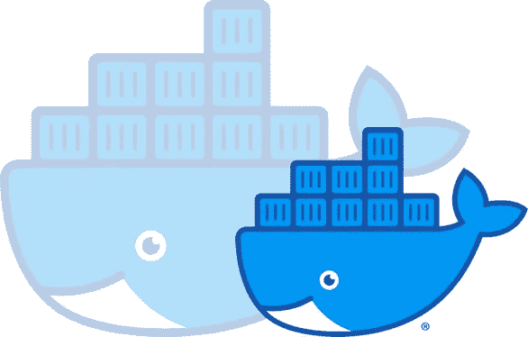
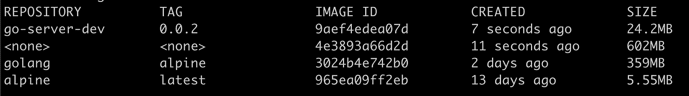

# 利用 Docker 多阶段构建最小化 GO 资源大小

> 原文：<https://itnext.io/minimize-go-resource-size-with-docker-multi-stage-build-3b03cb9787e1?source=collection_archive---------4----------------------->



最近，我一直在探索 [Golang](https://golang.org/) 。鉴于我的后端经验主要是在 NodeJS 中，我预计会有一个急剧的学习曲线。但是到目前为止，并没有我预期的那么多拉头发。GO 在强制执行严格的模式、规则和类型的同时保持语法的简洁性和代码的效率之间取得了良好的平衡。

由于 GO 是一种编译语言，并作为可执行文件运行，我们可以利用 Docker 17 的一个特性，[多阶段构建](https://docs.docker.com/develop/develop-images/multistage-build/)。这个特性允许开发人员使用一个基本映像作为构建器，使用一个更有效或更小的映像作为最终资源的映像。本质上，多阶段允许您在另一个阶段使用一个阶段中的工件。

这样做的主要好处是可以部署更小的映像。它还可以缩短开发生命周期中的构建时间，因为您可以选择所需的最少资源。

让我们看看如何:

在我的例子中，我将创建一个包含大部分配置的`Dockefile`和两个`docker-compose`文件来说明如何支持多种构建环境，这是任何真实服务都应该具备的。

**Docker 撰写**

支持多种部署环境是一个非常典型的现实需求。当然，你不会看到 docker-compose 这样做。但是我一直更喜欢 docker-compose，因为它的设置更简单，而且不需要在 docker 构建命令中加入变量。

对于我的例子，我创建了两个 docker-compose 文件，主要区别是环境变量*、ENV。这个变量可以用来定义 GO 程序将使用哪个环境文件。*

为了发展:

**docker-compose-dev.yml**

```
version: '3.5'
services:
  go-server:
    build:
      args:
     **   - ENV=dev**
      context: .
    image: go-server-dev
    container_name: go-server-box-dev
    ports:
      - "9000:9000"
```

对于生产:

**docker-compose.yml**

```
version: '3.5'
services:
  go-server:
    build:
      args:
    **    - ENV=prod**
      context: .
    image: go-server
    container_name: go-server-box
    ports:
      - "4445:9000"
```

这就是我们需要的 docker-compose 文件。这两个文件将构建在同一个 Dockerfile 文件上。

**Dockerfile (** [**要诀**](https://gist.github.com/cherihung/08dd99f520865a10e11fc19ab65af06e) **)**

# 构建阶段

**选择操作系统映像并定义阶段(#1)**

一个独立的围棋程序执行起来并不需要太多。对于最小的资源，我想使用`alpine`作为`final` *阶段*操作系统，它只有大约 5mb。因此，反过来，为了减少不同平台的复杂性，我将使用`golang:alpine`作为`builder` *阶段*操作系统。

要定义一个阶段，只需将名称放在`AS`之后，与您定义将图像放在哪里在同一行。正如您将看到的，我不会引用 docker-compose 文件中的每个`stage`。但是使用 `[target](https://docs.docker.com/compose/compose-file/#target)` [从 3.4 版](https://docs.docker.com/compose/compose-file/#target)[开始 docker-compose 肯定支持。](https://docs.docker.com/compose/compose-file/#target)

**添加标签(#2)**

我发现给我的`builder`形象贴上标签是个好习惯。这样，我可以通过标签轻松地过滤它，并在成功构建后删除它:

```
docker image prune --filter label=stage=builder -f
```

**安装编译器依赖项(#3)**

在步骤#3 中，它展示了一个安装只编译依赖项的例子— `gcc`和`libc-dev`。要进一步优化流程，您可以创建一个已经包含其他依赖项的基础映像。

我还可以选择定义一个工作目录。减少阶段间混淆的良好实践。

**将所有源文件复制到构建(#4)**

为了准备构建，复制所有的 GO 源文件。

**构建 GO 程序(#5)**

```
CGO_ENABLED=0 GOOS=linux go build -a
```

这个命令相当标准，因为我在很多例子中都遇到过。

首先，`CGO_ENABLED=0`禁用 CGO，因为我是在 alpine 上构建的，要在 alpine 上运行，目标是使用`GOOS=linux`的 Linux。禁用它可以消除编译跨平台依赖项的需要。`-a`标志执行强制重建。

***至此，围棋程序编译完毕！*** 👍

# 末级

**开始最终构建并读入环境变量(#6、#7)**

一旦第一个`build`阶段完成，我们继续下一个阶段，命名为`final`，在这里它使用`golang:alpine`图像作为基础。我们还读入 docker-compose 文件中定义的任何构建参数。在示例中，它只是一个`ENV`变量。

**复制编译好的 GO 可执行文件和环境文件(#8)**

设置了`ENV`之后，下面的`COPY`命令从`build`阶段构建的工件中复制可执行文件和相应的 env 文件:

```
COPY --from=builder /workspace/mygoexecutable .
COPY --from=builder /workspace/_envs/env_$ENV.yaml ./_envs/
```

**定义状态命令**

与任何 Docker 流程一样，最后一步是定义在容器启动时做什么( **#9** )。对于一个 GO 程序，最简单的命令就是执行可执行文件:`CMD [ “./mygoexecutable” ]`

**Docker 构建命令**

把它们绑在一起。现在我们可以运行 docker 构建命令:

```
docker-compose up --build -d
```

看看图像大小的差异:



对于上下文——我在这里构建的示例 GO 服务是一个带有健康检查的非常简单的 HTTP 服务器，它使用了 [Gin-Tonic framework](https://github.com/gin-gonic/gin) 。

我们从列表中看到，用于建筑的基础`golang:alpine`图像是 **359MB** 。`build`包含所有依赖项和编译程序的 stage 镜像增加到 **602MB** 。

然而，由于只能部署 GO 可执行文件，我们最终只能得到一个微小的 **24.2MB** 映像`go-server-dev:0.0.2`！💪