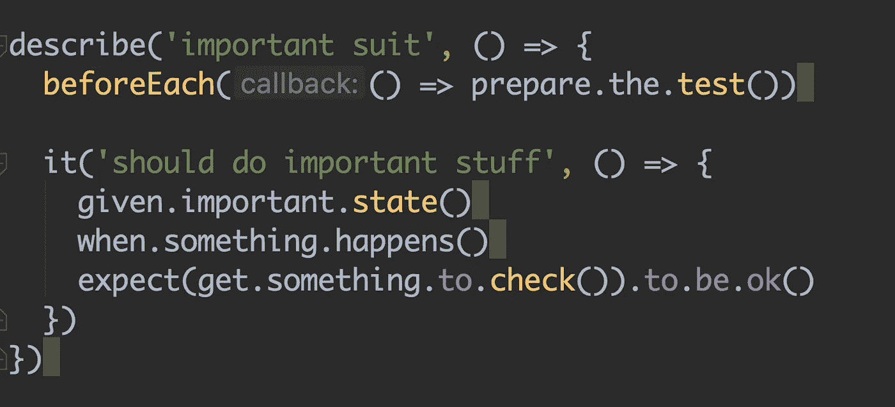
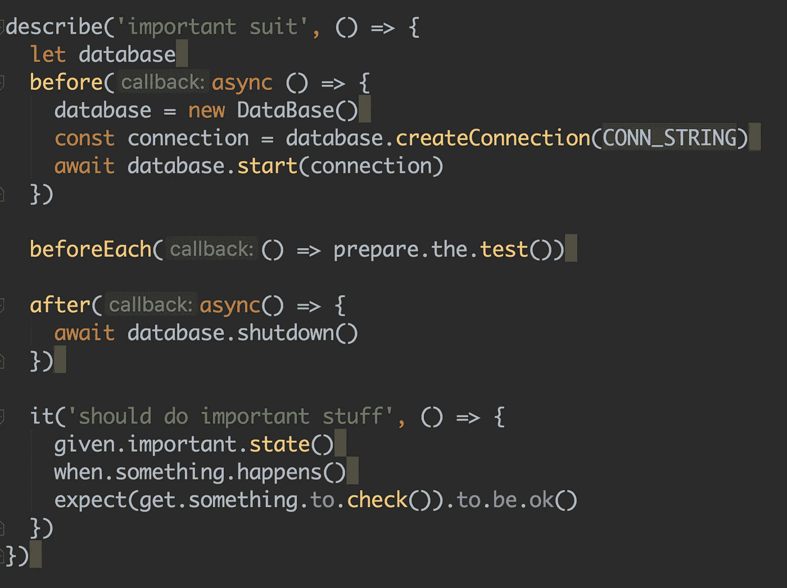
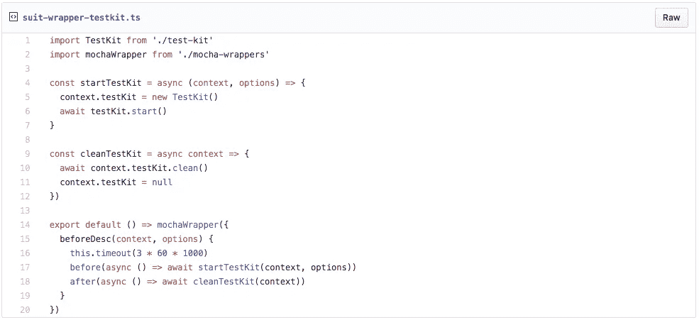
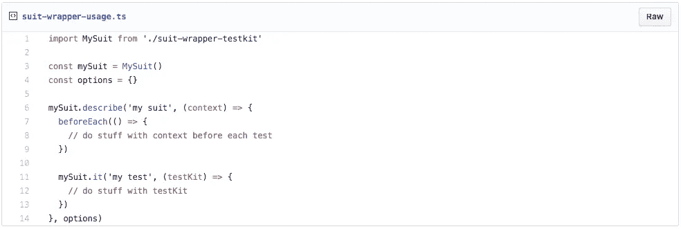

# 如何减少你的测试样本

> 原文：<https://itnext.io/minimize-your-tests-boilerplate-a871bcf72650?source=collection_archive---------5----------------------->

## 套件包装简介

测试应该是可读的，并且包含理解测试用例所需的最少信息。额外的数据和样板文件会分散读者的注意力，让他们更难理解系统的行为。

减少额外的信息和样板文件有很多方法。其中之一是使用测试驱动程序，它保存了如何运行被测单元的实现细节，并让测试自己做什么。另一种技术是使用测试套件将外部资源的使用卸载到具有清晰 API 的套件中。

驱动程序、测试工具包和其他技术非常有用，也非常值得推荐，但是，它们很容易因为大量的样板文件而适得其反。例如，假设您想要启动一个数据库(当然是在内存中！).您需要从一个连接开始，然后可能通过运行`before`和`after`块中的代码来关闭它——这些代码与测试并不直接相关，只是为了支持它。

测试变得单调乏味，可读性更差。想想需要更多样板文件和启动代码的其他用法。此外，要创建另一个使用相同样板代码的套件，您需要复制/粘贴相同的代码，这会导致代码重复，使系统更难维护。

# 什么是西装包装纸？

套件包装器可以帮助我们去除与代码不直接相关的样板文件，而是属于正在使用的测试套件/其他工具。套装包装器保存准备样板并无缝运行它。

suit wrappers 实现与测试框架如`mocha`、`jest`和`jasmine`紧密耦合，并为测试提供干净的 API。为了实现这一点，我们将使用隐式执行的`before`和`after`语句来扩展套件。

套装包装由 3 部分组成:

*   测试框架包装器——提供用特定实现包装测试框架功能的能力。
*   测试套件包装器——使用测试框架包装器，并扩展特定的测试套件功能。
*   测试套件——没有额外样板代码的实际测试。

## 测试框架包装器

测试框架包装器提供了创建定制包装器的功能，并引入了包括测试套件功能的定制套件。
例如，摩卡包装纸:

在上面的例子中，我们导出了一个 API，它获得了一个`conf`条目，这个条目包含了我们想要添加到 suit 中的实现。给定一个 T1，我们可以在 T2 阻塞之前运行它。同样的道理也适用于`afterDesc`、`beforeIt`和`afterIt`。

## 测试套件包装

测试套件包装器使用测试框架包装器，并为测试套件提供额外的功能。例如，我们可以在这里实现启动和关闭我们想要使用的外部数据库的功能，或者我们想要在测试前后运行的任何其他功能。

## 测试服使用

测试套件使用测试套件包装器，并通过简单地使用`mySuit.describe`和`mySuit.it`将上下文和测试套件对象暴露给测试。测试在没有额外代码的情况下获得了额外的功能，并使测试更加精简。

上面的测试看起来简洁明了，然而，很多事情正在进行。在测试实际运行之前，测试套件`before`模块执行，然后套件`beforeEach`运行，然后是测试，最后是测试套件`after`模块。

# 放弃

套装包装器，作为测试驱动和测试套件，是我们工具包中的工具。我们应该明智地使用它们，因为它们对于简单的场景来说可能是过度的。这种误用会导致过于复杂，并导致代码库不可维护。

为了明智地使用这些工具，我建议在不使用工具的情况下编写测试，然后搜索一个实际上会使代码更好的工具。这是我们在遇到一个混乱的测试时所做的——我们尝试的所有其他工具都没有完成工作，测试变得更干净，最后我们想到了套件包装器。

照片由 [Goh Rhy Yan](https://unsplash.com/@gohrhyyan?utm_source=medium&utm_medium=referral) 在 [Unsplash](https://unsplash.com?utm_source=medium&utm_medium=referral) 上拍摄

一方面，suit 包装器的使用会导致共享对象的使用，这些对象很容易被创建，并且会使测试在没有明显原因的情况下失败。由测试包包装器来启动和清理测试包，并维护上下文，这样就不会发生这样的事情。另一方面，suit wrappers 可以将对象保存在内存中，并在每次测试之间对环境进行软清理，因此可以更快地运行测试。

你可以在这里找到所有的例子:
[https://gist . github . com/alonn 24/e 18 Fe 297 fcfd 8 ad 5 ca 47 ce 020944 D2 d 9](https://gist.github.com/alonn24/e18fe297fcfd8ad5ca47ce020944d2d9)

感谢您的阅读！对这个问题有意见吗？请评论！我很想听听这件事。