# 开发人员的最小工作量 Web 可访问性

> 原文：<https://itnext.io/minimum-efforts-web-accessibility-for-developers-9bca02dd63ff?source=collection_archive---------5----------------------->

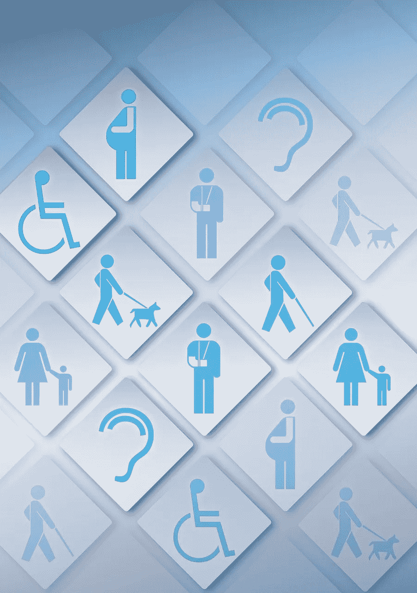

在我参与的几乎所有项目中，可访问性都是次要的。在最好的情况下。通常情况下，根本没有考虑到这一点。我的大多数客户不准备为可访问性付费。只要有一点点知识，开发人员就可以通过使 web 解决方案更易访问来为用户带来改变。这篇文章将有助于做到这一点，并将重点放在两个主要领域:帮助屏幕阅读器和管理焦点。

许多可访问性方面取决于设计和 UX。这些超出了本文的范围。相反，我们专注于与开发者相关的项目。

## 开发人员控制范围内的关键要点:

*   使用语义标记
*   咨询 WAI-ARIA 创作实践
*   保持 HTML 元素的视觉顺序与源代码中的顺序相同

# 了解屏幕阅读器导航

让我们不要假装是屏幕阅读器用户，只看他们实际上是如何使用屏幕阅读器的。谷歌技术项目经理维克托·察兰(Victor Tsaran)的屏幕录像是一个很好的展示:

很快，对吧？我们需要慢一点来理解用户如何使用屏幕阅读器导航。通过特殊的组合键，用户可以从一个元素移动到另一个元素。目前，活动元素以边框突出显示。

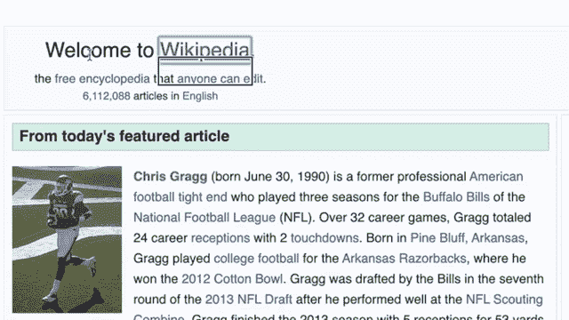

看起来和 focus 差不多。然而，与 focus 相比，屏幕阅读器浏览所有的页面元素。例如，使用“tab”键的焦点导航将跳过段落，而屏幕阅读器导航将访问它。

逐个探索每个元素并不是很有成效。屏幕阅读器技术提供了几个导航菜单来加速与页面的交互。在 mac 的 voiceover 中，这些菜单由 rotor 提供。打开转子的热键是 VO+U。用户可以更改设置和可用菜单列表。让我们探索默认菜单。英文维基百科主页将是探索转子菜单的一个很好的候选。

## 链接

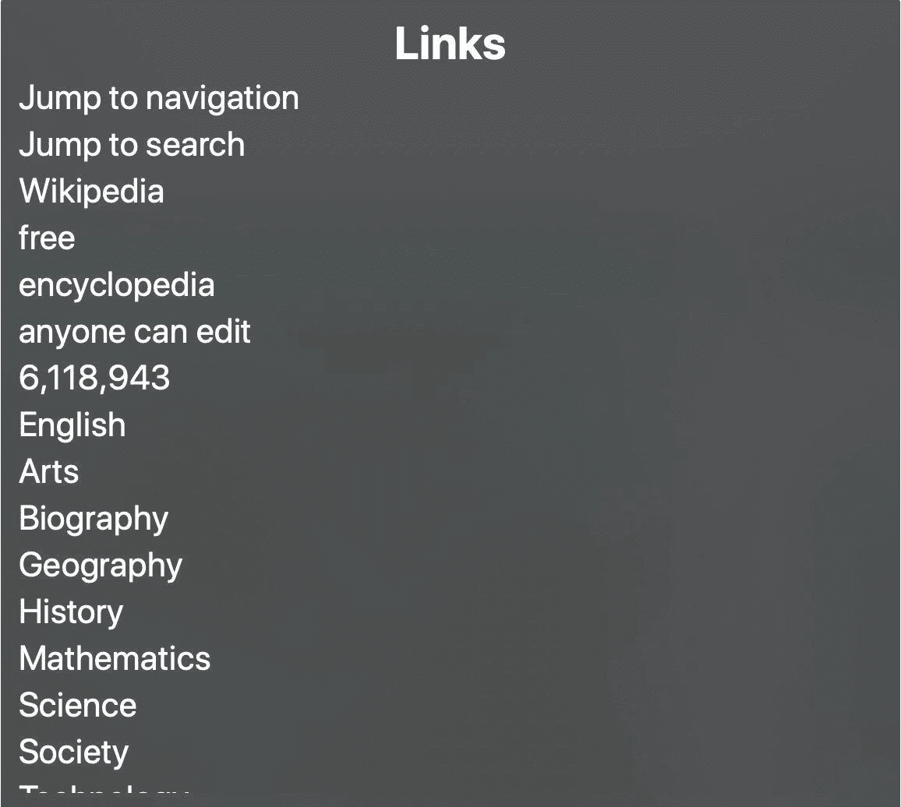

这是页面链接列表。你可以在这里看到链接文本。您可能会发现一些没有语义意义的链接。比如这个大数字 6118943。没有上下文——链接周围的文本——就不可能理解。如果我们考虑改变链接文本，这可能会很棘手。视觉外观是原因之一，但也可能有其他原因。

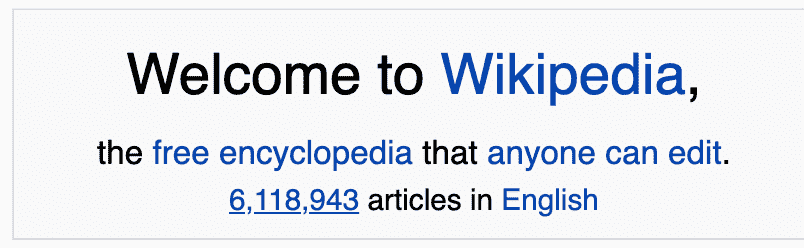

在这种情况下，链接的描述性文本可能是“6，118，943 篇英语文章”但是它需要嵌套链接，因为“英语”已经是一个链接了。嵌套链接不是一个好主意。更可靠的选择是添加一个 ARIA 属性，为屏幕阅读器提供特殊文本。它可以是带有文本的 [aria-label](https://www.w3.org/TR/wai-aria-1.1/#aria-label) ，带有逗号分隔的 DOM 元素 id 的[aria-label by](https://www.w3.org/TR/wai-aria-1.1/#aria-labelledby)或[aria-descripted by](https://www.w3.org/TR/wai-aria-1.1/#aria-describedby)，其中的内容将用于公告。

## 标题

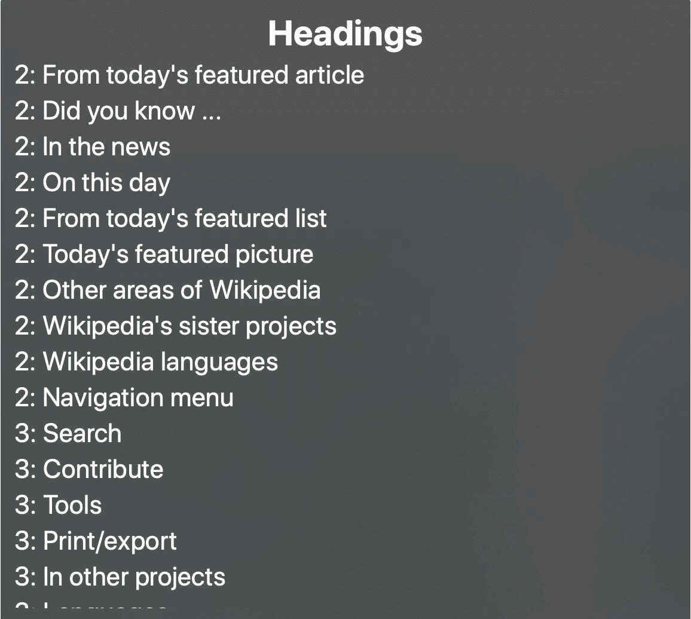

这是页面轮廓。所有的标题都按照标记中相同的顺序和层次结构列出。这是理解页面结构和浏览页面的一种非常方便的方式。标记中标题的良好使用将对屏幕阅读器用户有很大帮助。它是如此方便的大纲，我甚至安装了一个浏览器扩展来拥有相同的大纲。

## 表单控件

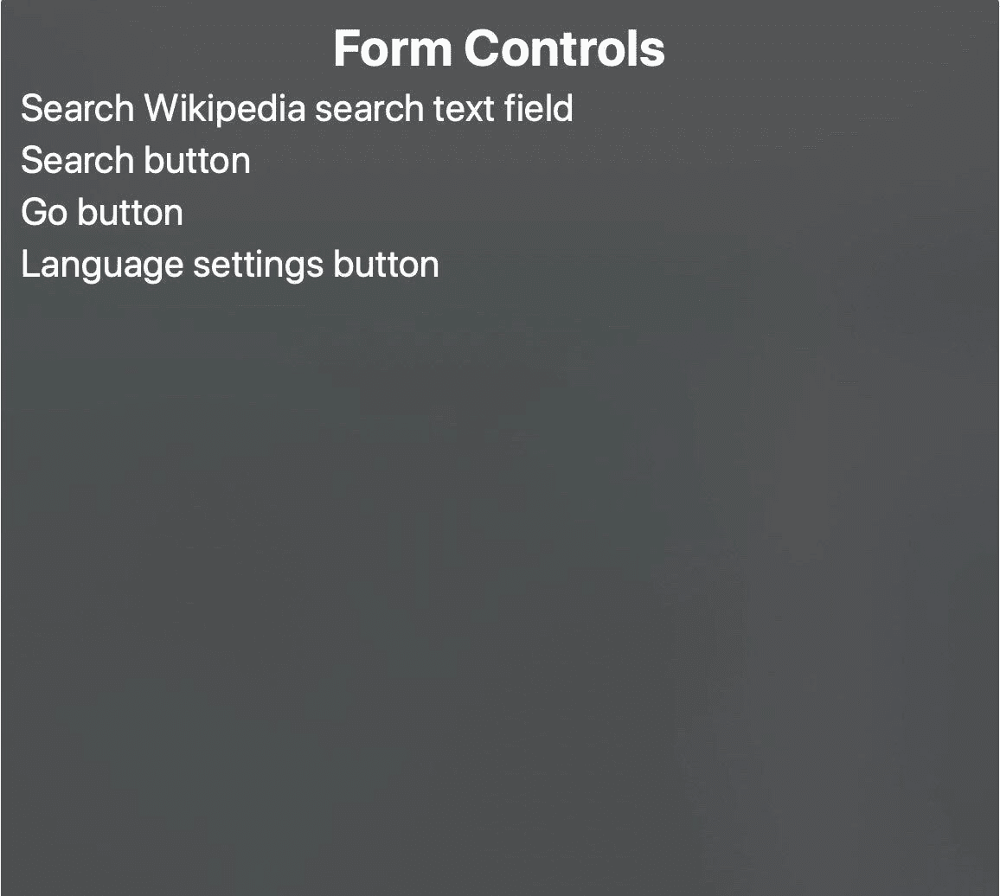

输入、下拉列表、文本区域和其他控件都在这里结束。一旦您自己实现了控制，您可能会想起它。WAI-ARIA 创作实践将帮助您指导如何使您的控件列在这里。

## 网络热点

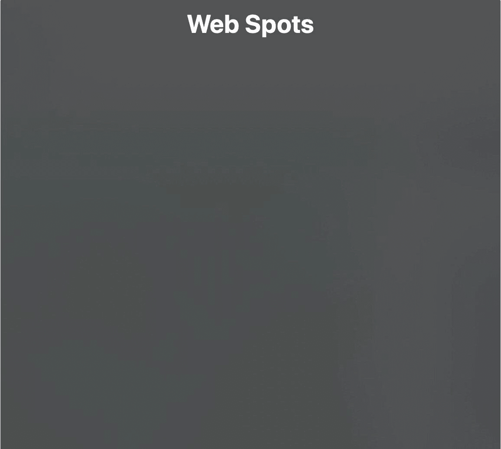

网斑是一个灰色区域。找到合适的文档并不容易。维基百科都不用。让我们跳过这一个。

## 陆标

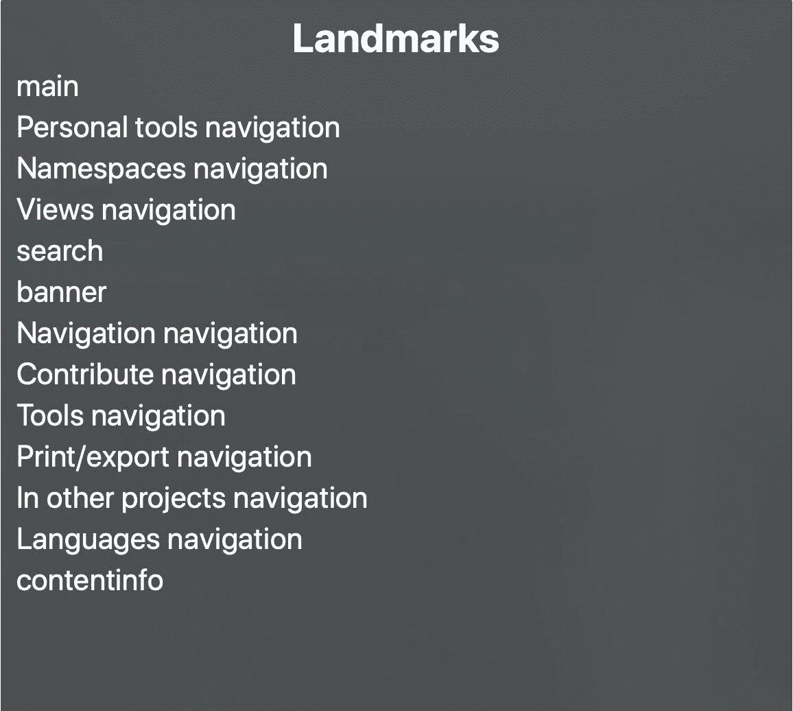

下面列出了具有特定角色的 HTML 元素。你可能还记得“角色”属性。这就是我说的角色。对于大多数里程碑式的角色，都有一个隐含角色的 HTML 元素。这些是“页眉”、“页脚”、“主页面”、“小节”、“导航”、“表单”、“旁白”。对于一些 HTML 元素来说，这有点棘手。只有当“header”元素的直接父元素是“body”时，它才意味着具有里程碑式的作用。

只有一个地标没有语义 HTML 元素。这是搜索。开发人员需要将值为“search”的角色属性添加到搜索表单的“form”标记中。

## 文章

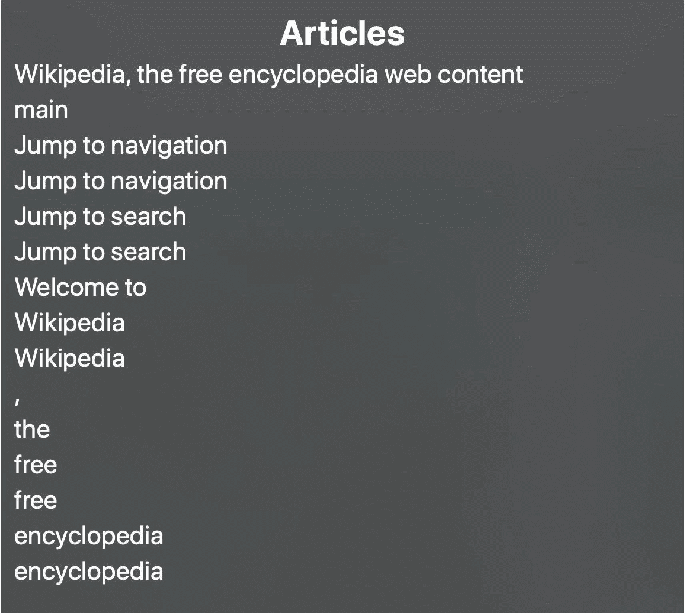

文章菜单和网站一样——记录很少，维基百科也不关心。让我们跳过它。

## 亮点

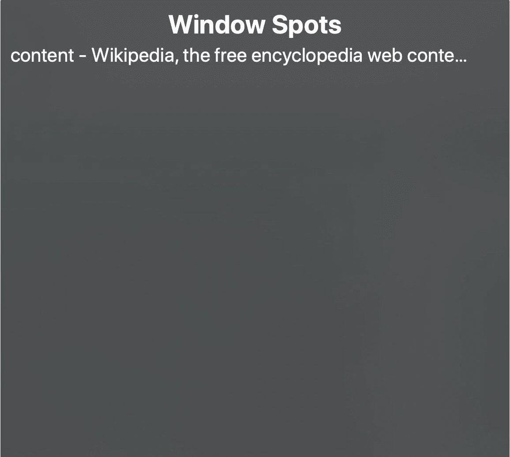

这是一个操作系统级别。我们作为 web 开发人员无法控制它。

这是所有默认的转子菜单。是时候探索我们能做些什么来让屏幕阅读器体验更好了。

# 改善屏幕阅读器体验

## 请参考“WAI-ARIA 创作实践”文档

有一个非常详细的文档可以帮助我们: [WAI-ARIA 创作实践文档](https://www.w3.org/TR/wai-aria-practices-1.1/)。本文档提供了关于如何使用 WAI-ARIA 创建可访问的、丰富的互联网应用程序的指导。它描述了开发人员可能不清楚的注意事项，并推荐了使用 WAI-ARIA 角色、状态和属性来使小部件、导航和行为可访问的方法。

如果您决定自己实现一个小部件，您也应该参考这个文档。这将有助于指导最流行的部件。它包括预期行为、可访问性考虑和键盘交互。我希望这篇文档会改变你的想法，你会使用组件库，而不是重新发明轮子。请记住以下五点:

## 1.使用语义标记

这大概是最重要的一点。语义帮助屏幕阅读器建立更好的体验。与开发人员可以更好地理解语义上有意义的代码一样，屏幕阅读器也可以更好地处理它。所有语义 HTML 元素都应用了隐含的 ARIA 属性。例如，这两个标记示例对于屏幕阅读器来说具有相同的含义。

虽然大多数开发人员从未考虑过它，但是语义元素提供了许多隐含的信息。基于这些信息，屏幕阅读器宣布页面内容并构建导航。

## 2.使用标题标签(h1、h2、h3 等)构建页面轮廓。)

屏幕阅读器根据标题构建目录。标题标签的正确使用为用户提供了一个很好的页面概览和方便的导航。

避免仅出于样式目的使用标题标签。同样，如果非标题元素是标题，也要避免将它们设计成标题的样子。

## 3.提供上下文无关的链接文本或替代文本

与标题一样，屏幕阅读器提供了搜索链接和导航链接的机会。规范的反模式是一个链接文本“阅读更多”如果没有链接周围的上下文，它不会提供任何有用的信息。作为替代，考虑使用更多的描述性文字，如“阅读更多关于狐猴的信息”另一个选择是为屏幕阅读器添加一个带有文本的 [aria-label](https://www.w3.org/TR/wai-aria-1.1/#aria-label) 或[aria-label edby](https://www.w3.org/TR/wai-aria-1.1/#aria-labelledby)属性。

属性方法也适用于视觉链接。比如 ng-bootstrap 网站上的 npm 链接(下面截图)。您可能会在下载计数旁边看到一个 npm 徽标。屏幕阅读器不能描述 SVG 内容，需要 ARIA 属性的帮助才能做出正确的声明。

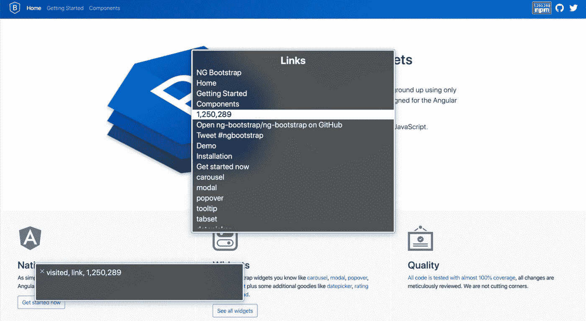

## 4.设置图像的 alt 属性

对于独立图像，“alt”应该是图像内容的简短描述。那是容易的部分。剩下的就有点棘手了。

如果一个图像被放置在链接中，屏幕阅读器会使用图像的“alt”属性来显示该链接。在这里，对图像的描述可能会很混乱。例如，在 ng-bootstrap 网站上有一个带有 alt“盾上的 B 字母”的徽标图像，会让人很难理解这个链接指向哪里。

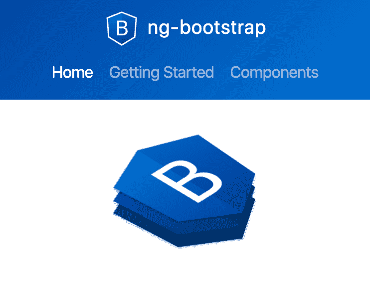

在某些情况下，不希望屏幕阅读器显示某些图像。考虑一个带有图标的导航链接。像这样链接到搜索页面:

这种标记被称为“放大镜搜索”这有点令人困惑。删除“alt”属性会导致公布图像文件名，这在这里是不希望的。为了使事情更容易理解，我们可以将“alt”设置为空字符串。图像根本不会被公布。

## 5.设置 lang 属性

lang 属性是一个全局属性。这意味着它可以用于任何 HTML 元素。将 lang 设置在顶级“html”元素中是一个很好的做法。任何内容语言不同于顶级语言的 HTML 元素都应该有自己的“lang”属性。

下面是 [HTML 语言代码参考](https://www.w3schools.com/tags/ref_language_codes.asp)帮助你找到合适的语言代码。

# 焦点

焦点决定了键盘事件在页面中的位置。对于用户来说，从视觉上识别哪个元素是焦点通常很好。虽然设计师决定了实际的外观和感觉，但开发人员是应用这些风格的人。一件讨厌的事情在这里等着我们。只有当用户使用键盘快捷键导航时，他们才可能期望获得聚焦元素的视觉样式。当你点击按钮或输入文本时，你知道焦点在哪里，而不需要特殊的视觉轮廓。不幸的是，浏览器在这方面并不一致。对于某些元素，有些浏览器会在单击时添加焦点样式。没有已知的方法使这种行为一致。对于特定的情况，只有一些特别的方法。如果您的 UX 专家不接受默认的浏览器行为，请做好痛苦的准备。

让我们来探讨作为开发人员，我们如何影响焦点体验。

## 管理可聚焦元素

我们可以利用“tabindex”属性。有两个合法值:

*   负值(通常是 tabindex="-1 ")意味着该元素不能通过可聚焦导航访问，但是可以通过 Javascript 聚焦。用 JavaScript 创建可访问的小部件最有用。
*   tabindex="0 "意味着元素应该可以通过键盘导航获得焦点，但是它的顺序是由它在源代码中的顺序定义的。

任何正数都是代码味。用正 tabindex 属性值建立的焦点顺序很容易被重构打破。几乎不可能将包含正 tabindex 的小部件重用到富含小部件的页面中。

这意味着保持可聚焦项顺序的最佳方式是将元素的可视顺序与源代码顺序同步。我们可能会不小心使它失去同步。一个常见的警告是用 CSS 属性 float 改变顺序。如下例所示，文本为“One”的元素出现在右边，而在源代码中，它出现在第一个位置。焦点将首先导航到这个元素，只有在它导航到具有令人困惑的文本“Two”的元素之后。

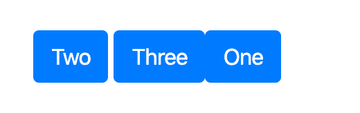

另一个警告是，当元素在 DOM 中的位置无关紧要时，定位是固定的或绝对的。粘性页脚就是一个很好的例子。很容易忘记按照逻辑顺序放置它，因为它根本不会改变视觉外观。

保持正确的焦点顺序最简单的方法是偶尔用键盘在页面内导航。

# 在你离开之前

我祝贺你对网页可访问性和改善用户体验的方法有了更好的了解！

本文绝不是一个全面的指南。可访问性是一个非常广泛而复杂的话题。作为一名 web 开发人员，这篇文章只需要你具备一些知识就可以马上应用。

如果你想了解更多，我强烈推荐谷歌的免费无障碍课程[。这是一个很好的实用资源。](https://www.udacity.com/course/web-accessibility--ud891)

感谢阅读和分享！

***
*最初发布于*[*https://www . mobiquity . com/insights/minimum-efforts-web-accessibility-for-developers*](https://www.mobiquity.com/insights/minimum-efforts-web-accessibility-for-developers)