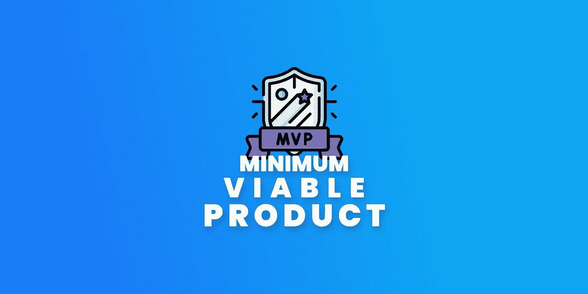
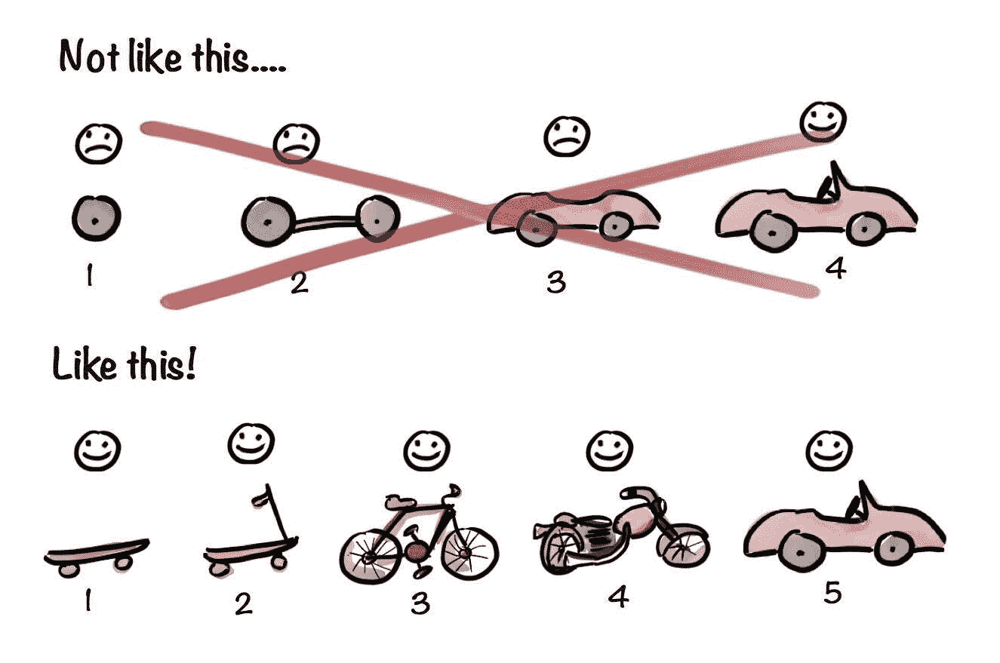
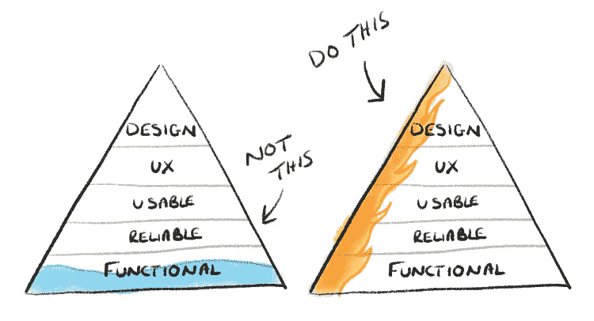

# 最小可行产品(又名 MVP)

> 原文：<https://itnext.io/minimum-viable-product-aka-mvp-5555ed6f511d?source=collection_archive---------2----------------------->

## 每个开发者都应该知道！

亨里克·克尼伯格

构建一个复杂的应用程序是一门艺术，但如果我们处理不当，这个过程可能是有害的。让我们谈谈那个。

我会用小测验来解释。希望这个概念对你有用。

我们开始吧！

# 快速测验！

## 问题 1:

假设我们有两个应用程序在使用。

1.  你只能购买物品，但你不会有任何麻烦，这是快速和稳定的
2.  您可以购买、租赁、退货、销售、预订、交付、现场支持、优惠券、折扣、视频通话等，但它不稳定、速度慢，有时还会崩溃

## 你喜欢用哪一个？

这就是问题所在，而 **MVP** 就是我们正在寻找的答案！

## 问题 2:

让我们假设现在我们看到的两家科技公司

1.  他们说，他们将在一个月内发布具有基本功能的应用程序，并表示他们将及时添加新功能。一年后，你将完全获得该应用程序，你可以从第二个月开始创业，直到永远
2.  他们说，他们将发布应用程序完全完成，什么时候会完成应用程序？1 年后！

## 你喜欢和哪一个一起工作？

第一个更有意义，对吗？因为他们在自己的公司使用 **MVP** 方法

## 问题 3:

让我们再次假设，你是一家将要倒闭的公司的投资者。

1.  你发布了有核心功能的 app 并试水。你意识到由于一些原因你不能这样做，结果你浪费了一点时间和金钱。
2.  你在应用完美的时候发布了它，然后试水失败了

## 你喜欢哪一个？

我猜你知道答案:)

# 所以基本上好处是什么？

1.  专注于构建核心
2.  早期测试机会
3.  用户智能和收集反馈
4.  允许市场验证
5.  开发一款应用所需的时间更少
6.  预算友好

只是一个有用的图表

## 临终遗言

这篇文章只是给你一个关于 MVP 的基本概念，更多信息请查看这些文章！他们很有帮助！

 [## 构建最小可行产品(MVP)的逐步指南

### 那是 1999 年。有一个年轻人想拥有一双特别的鞋子。他去了一个离他家很近的商场…

www.netsolutions.com](https://www.netsolutions.com/insights/how-to-build-an-mvp-minimum-viable-product-a-step-by-step-guide/)  [## 如何构建一个最小可行的产品？

### 并不是每个缩短的产品实际上都是 MVP。以下是在创建 MVP 时你应该避免的七个常见错误…

gearheart.io](https://gearheart.io/articles/how-build-minimum-viable-product-mvp/)  [## 如何通过 3 个步骤构建成功的最小可行产品(MVP)

### 建立一个创业公司！你恍然大悟，对自己说:这真是个好主意！怎么没人想到……

祭坛. io](https://altar.io/features-inside-mvp-3-steps-know-answer/) 

# 感谢您的阅读！

如果你喜欢这篇文章，请点击👏按钮(你知道你可以升到 50 吗？)