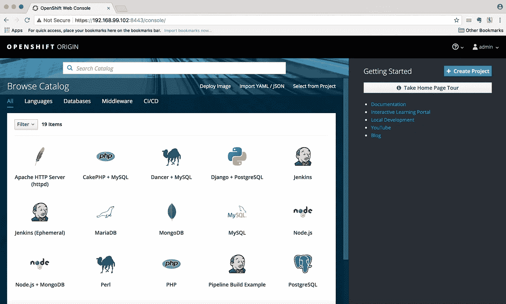
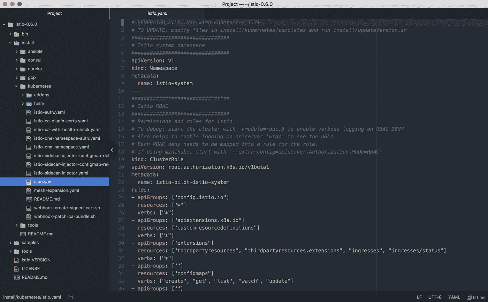
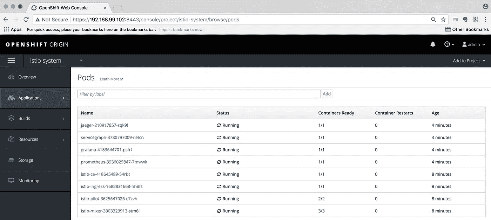

# Minishift + Istio 启动并运行

> 原文：<https://itnext.io/minishift-istio-up-and-running-93bd125fe310?source=collection_archive---------3----------------------->

**定义** : Minishift，Service Mesh，Istio。

**Minishift** —一个帮助我们通过在虚拟机内部运行单节点 OpenShift 集群来本地运行 OpenShift 的工具。

**服务网格** —需要专用基础设施层的微服务网络，该基础设施层提供负载平衡、流量管理、路由、可观察性，如监控、日志记录、指标、跟踪、安全策略、身份验证以及针对入侵和 DDoS 攻击的保护。基本上，如果我们要构建云原生微服务应用，我们需要服务网格。服务网格的一般概念包括:

*   控制平面:Linkerd、NGINX、Envoy、Traefik
*   数据平面:Istio、Nelson、SmartStack

Istio —连接、管理和保护微服务的开放平台。默认情况下，Istio 的数据平面由一组部署为 sidecars 的智能代理(Envoy)组成。Istio 可以与 Linkerd 和 NGINX 集成，作为 Envoy 的替代。Istio 可以部署在各种环境中，例如:

*   库伯内特斯
*   游牧者和执政官
*   尤里卡
*   云铸造厂
*   阿帕奇 Mesos


图片由 Istio 提供

现在，我们将在 MacOS Sierra 上设置 Minishift + Istio，用于本地开发、测试和学习。

**先决条件:**

1 —自制

2 —虚拟框

**用家酿安装 Minishift。**

```
$ brew cask install minishift

Updating Homebrew...

==> Auto-updated Homebrew!

Updated 2 taps (caskroom/cask, homebrew/core).

==> New Formulae

gitlab-gem

==> Satisfying dependencies

==> Downloading https://github.com/minishift/minishift/releases/download/v1.15.1/minishift-1.15.1-darwin-amd64.tgz

Already downloaded: /Users/sai/Library/Caches/Homebrew/Cask/minishift*--1.15.1.tgz*

==> Verifying checksum for Cask minishift

==> Installing Cask minishift

==> Linking Binary 'minishift' to '/usr/local/bin/minishift'.

🍺  minishift was successfully installed!
```

**使用 virtualbox 启动 Minishift。**

```
$ minishift start *--vm-driver=virtualbox*

*-- Starting profile 'minishift'*
*-- Checking if requested OpenShift version 'v3.7.2' is valid ... OK*
*-- Checking if requested OpenShift version 'v3.7.2' is supported ... OK*
*-- Checking if requested hypervisor 'virtualbox' is supported on this platform ... OK*
*-- Checking if VirtualBox is installed ... OK*
*-- Checking the ISO URL ... OK*
*-- Downloading OpenShift binary 'oc' version 'v3.7.2'*
 38.18 MiB / 38.18 MiB [======================================================================================================================================================================] 100.00% 0s*-- Downloading OpenShift v3.7.2 checksums ... OK*
*-- Checking if provided oc flags are supported ... OK*
*-- Starting local OpenShift cluster using 'virtualbox' hypervisor ...*
*-- Minishift VM will be configured with ...*
   Memory:    2 GB
   vCPUs :    2
   Disk size: 20 GB

   Downloading ISO 'https://github.com/minishift/minishift-b2d-iso/releases/download/v1.2.0/minishift-b2d.iso'
 40.00 MiB / 40.00 MiB [======================================================================================================================================================================] 100.00% 0s
*-- Starting Minishift VM .......................... OK*
*-- Checking for IP address ... OK*
*-- Checking for nameservers ... OK*
*-- Checking if external host is reachable from the Minishift VM ...*
   Pinging 8.8.8.8 ... OK
*-- Checking HTTP connectivity from the VM ...*
   Retrieving http://minishift.io/index.html ... OK
*-- Checking if persistent storage volume is mounted ... OK*
*-- Checking available disk space ... 0% used OK*
   Importing 'openshift/origin:v3.7.2'  CACHE MISS
   Importing 'openshift/origin-docker-registry:v3.7.2'  CACHE MISS
   Importing 'openshift/origin-haproxy-router:v3.7.2'  CACHE MISS
*-- OpenShift cluster will be configured with ...*
   Version: v3.7.2
Starting OpenShift using openshift/origin:v3.7.2 ...
Pulling image openshift/origin:v3.7.2
Pulled 1/4 layers, 26% complete
Pulled 2/4 layers, 62% complete
Pulled 3/4 layers, 81% complete
Pulled 4/4 layers, 100% complete
Extracting
Image pull complete
OpenShift server started.

The server is accessible via web console at:
    https://192.168.99.102:8443

You are logged in as:
    User:     developer
    Password: <any value>

To login as administrator:
    oc login -u system:admin

*-- Exporting of OpenShift images is occuring in background process with pid 43990.*
```

**设置环境。**

```
$ eval $(minishift oc-env)
$ eval $(minishift docker-env)
$ oc login $(minishift ip):8443 -u admin -p admin
Login successful.

You don't have any projects. You can try to create a new project, by running

    oc new-project <projectname>
```

**浏览 OpenShift Web 控制台**

**$(minishift ip):8443。登录用户名:admin，密码:admin**



OpenShift Web 控制台

```
$ oc get users
Error from server (Forbidden): User "admin" cannot list users at the cluster scope: User "admin" cannot list all users in the cluster (get users)

$ oc get projects
No resources found.
```

**以“开发者”身份登录。请查看输出的详细信息。(例如:开发者帐户没有列出用户的权限。)**

```
$ oc login -u developer -p developer
Login successful.

You have one project on this server: "myproject"

Using project "myproject".
$ oc get users
Error from server (Forbidden): User "developer" cannot list users at the cluster scope: User "developer" cannot list all users in the cluster (get users)

$ oc whoami
developer
```

**使用 system:admin 登录(作为集群管理员运行)。**

```
$ oc login -u system:admin

You have access to the following projects and can switch between them with 'oc project <projectname>':

  * default
    kube-public
    kube-system
    myproject
    openshift
    openshift-infra
    openshift-node

Using project "default".

Sais-MacBook-Pro:~ sai$ oc whoami
system:admin

$ oc get users
NAME        UID                                    FULL NAME   IDENTITIES
admin       a25341a0-3f43-11e8-8fd4-c2b0403aac41               anypassword:admin
developer   1cfb7fd1-3f43-11e8-8fd4-c2b0403aac41               anypassword:developer
```

**将集群管理员角色分配给管理员，并使用管理员重新登录。现在管理员用户帐户可以做“oc 获取用户”。**

```
$ oc adm policy add-cluster-role-to-user cluster-admin admin
cluster role "cluster-admin" added: “admin"$ oc login $(minishift ip):8443 -u admin -p admin
Login successful.

You have access to the following projects and can switch between them with 'oc project <projectname>':

  * default
    kube-public
    kube-system
    myproject
    openshift
    openshift-infra
    openshift-node

Using project "default".

$ oc get users
NAME        UID                                    FULL NAME   IDENTITIES
admin       a25341a0-3f43-11e8-8fd4-c2b0403aac41               anypassword:admin
developer   1cfb7fd1-3f43-11e8-8fd4-c2b0403aac41               anypassword:developer
```

**使用管理员帐户在 OpenShift Web 控制台中进行验证。**


使用管理员帐户打开 Shift Web 控制台访问

**下载 Istio 并在~/中设置路径。bash_profile。**



已下载 Istio 0.6.0

```
$ ls -la istio-0.6.0/
total 48
drwxr-xr-x   9 sai  staff    306 Mar  1 03:51 .
drwxr-xr-x+ 84 sai  staff   2856 Apr 14 18:43 ..
-rw-r*--r--   1 sai  staff  11343 Mar  1 03:51 LICENSE*
-rw-r*--r--   1 sai  staff   5855 Mar  1 03:51 README.md*
drwxr-xr-x   3 sai  staff    102 Mar  1 03:51 bin
drwxr-xr-x   9 sai  staff    306 Mar  1 03:51 install
-rw-r*--r--   1 sai  staff    685 Mar  1 03:51 istio.VERSION*
drwxr-xr-x  10 sai  staff    340 Mar  1 03:51 samples
drwxr-xr-x  16 sai  staff    544 Mar  1 03:51 tools

$ more .bash_profile
export PATH="$PATH:/Users/sai/istio-0.6.0/bin"

$ which istioctl
/Users/sai/istio-0.6.0/bin/istioctl
```

**为 Istio 设置必要的权限。
请阅读此处的** [**了解服务帐户和 SCC。**](https://blog.openshift.com/understanding-service-accounts-sccs/)

```
$ oc new-project istio-system
$ oc adm policy add-scc-to-user anyuid -z istio-ingress-service-account
$ oc adm policy add-scc-to-user privileged -z istio-ingress-service-account
$ oc adm policy add-scc-to-user anyuid -z istio-egress-service-account
$ oc adm policy add-scc-to-user privileged -z istio-egress-service-account
$ oc adm policy add-scc-to-user anyuid -z istio-pilot-service-account
$ oc adm policy add-scc-to-user privileged -z istio-pilot-service-account
$ oc adm policy add-scc-to-user anyuid -z istio-grafana-service-account -n istio-system
$ oc adm policy add-scc-to-user anyuid -z istio-prometheus-service-account -n istio-system
$ oc adm policy add-scc-to-user anyuid -z prometheus -n istio-system
$ oc adm policy add-scc-to-user privileged -z prometheus
$ oc adm policy add-scc-to-user anyuid -z grafana -n istio-system
$ oc adm policy add-scc-to-user privileged -z grafana
$ oc adm policy add-scc-to-user anyuid -z default
$ oc adm policy add-scc-to-user privileged -z default
$ oc adm policy add-cluster-role-to-user cluster-admin -z default
```

**安装 Istio 组件和附加组件。**

```
$ cd istio-0.6.0/

$ oc apply -f install/kubernetes/istio.yaml

Warning: kubectl apply should be used on resource created by either kubectl create *--save-config or kubectl apply*
namespace "istio-system" configured
clusterrole "istio-pilot-istio-system" created
clusterrole "istio-sidecar-injector-istio-system" created
clusterrole "istio-mixer-istio-system" created
clusterrole "istio-ca-istio-system" created
clusterrole "istio-sidecar-istio-system" created
clusterrolebinding "istio-pilot-admin-role-binding-istio-system" created
clusterrolebinding "istio-sidecar-injector-admin-role-binding-istio-system" created
clusterrolebinding "istio-ca-role-binding-istio-system" created
clusterrolebinding "istio-ingress-admin-role-binding-istio-system" created
clusterrolebinding "istio-sidecar-role-binding-istio-system" created
clusterrolebinding "istio-mixer-admin-role-binding-istio-system" created
configmap "istio-mixer" created
service "istio-mixer" created
serviceaccount "istio-mixer-service-account" created
deployment "istio-mixer" created
customresourcedefinition "rules.config.istio.io" created
customresourcedefinition "attributemanifests.config.istio.io" created
customresourcedefinition "circonuses.config.istio.io" created
customresourcedefinition "deniers.config.istio.io" created
customresourcedefinition "fluentds.config.istio.io" created
customresourcedefinition "kubernetesenvs.config.istio.io" created
customresourcedefinition "listcheckers.config.istio.io" created
customresourcedefinition "memquotas.config.istio.io" created
customresourcedefinition "noops.config.istio.io" created
customresourcedefinition "opas.config.istio.io" created
customresourcedefinition "prometheuses.config.istio.io" created
customresourcedefinition "rbacs.config.istio.io" created
customresourcedefinition "servicecontrols.config.istio.io" created
customresourcedefinition "solarwindses.config.istio.io" created
customresourcedefinition "stackdrivers.config.istio.io" created
customresourcedefinition "statsds.config.istio.io" created
customresourcedefinition "stdios.config.istio.io" created
customresourcedefinition "apikeys.config.istio.io" created
customresourcedefinition "authorizations.config.istio.io" created
customresourcedefinition "checknothings.config.istio.io" created
customresourcedefinition "kuberneteses.config.istio.io" created
customresourcedefinition "listentries.config.istio.io" created
customresourcedefinition "logentries.config.istio.io" created
customresourcedefinition "metrics.config.istio.io" created
customresourcedefinition "quotas.config.istio.io" created
customresourcedefinition "reportnothings.config.istio.io" created
customresourcedefinition "servicecontrolreports.config.istio.io" created
customresourcedefinition "tracespans.config.istio.io" created
customresourcedefinition "serviceroles.config.istio.io" created
customresourcedefinition "servicerolebindings.config.istio.io" created
attributemanifest "istioproxy" created
attributemanifest "kubernetes" created
stdio "handler" created
logentry "accesslog" created
rule "stdio" created
metric "requestcount" created
metric "requestduration" created
metric "requestsize" created
metric "responsesize" created
metric "tcpbytesent" created
metric "tcpbytereceived" created
prometheus "handler" created
rule "promhttp" created
rule "promtcp" created
kubernetesenv "handler" created
rule "kubeattrgenrulerule" created
kubernetes "attributes" created
configmap "istio" created
customresourcedefinition "destinationpolicies.config.istio.io" created
customresourcedefinition "egressrules.config.istio.io" created
customresourcedefinition "routerules.config.istio.io" created
customresourcedefinition "v1alpha2routerules.config.istio.io" created
customresourcedefinition "destinationrules.config.istio.io" created
customresourcedefinition "externalservices.config.istio.io" created
service "istio-pilot" created
serviceaccount "istio-pilot-service-account" created
deployment "istio-pilot" created
service "istio-ingress" created
serviceaccount "istio-ingress-service-account" created
deployment "istio-ingress" created
serviceaccount "istio-ca-service-account" created
deployment "istio-ca" created

$ oc create -f install/kubernetes/addons/prometheus.yaml

configmap "prometheus" created
service "prometheus" created
deployment "prometheus" created
serviceaccount "prometheus" created
clusterrole "prometheus" created
clusterrolebinding "prometheus” created

$ oc create -f install/kubernetes/addons/grafana.yaml

service "grafana" created
deployment "grafana" created
serviceaccount "grafana” created

$ oc create -f install/kubernetes/addons/servicegraph.yaml

deployment "servicegraph" created
service "servicegraph” created

$ oc process -f https://raw.githubusercontent.com/jaegertracing/jaeger-openshift/master/all-in-one/jaeger-all-in-one-template.yml | oc create -f -

deployment "jaeger" created
service "jaeger-query" created
service "jaeger-collector" created
service "jaeger-agent" created
service "zipkin" created
route "jaeger-query" created

$ oc expose svc grafana
$ oc expose svc servicegraph
$ oc expose svc jaeger-query
$ oc expose svc istio-ingress
$ oc expose svc prometheus
```

**通过 OpenShift Web 控制台验证 Istio 已启动并正在运行。**



Istio 已经启动并运行。

**通过 oc 验证 Istio 启动并运行。**

```
$ oc get all
NAME                   HOST/PORT                                          PATH      SERVICES        PORT         TERMINATION   WILDCARD
routes/grafana         grafana-istio-system.192.168.99.102.nip.io                   grafana         http                       None
routes/istio-ingress   istio-ingress-istio-system.192.168.99.102.nip.io             istio-ingress   http                       None
routes/jaeger-query    jaeger-query-istio-system.192.168.99.102.nip.io              jaeger-query    query-http   edge/Allow    None
routes/prometheus      prometheus-istio-system.192.168.99.102.nip.io                prometheus      prometheus                 None
routes/servicegraph    servicegraph-istio-system.192.168.99.102.nip.io              servicegraph    http                       None

NAME                                READY     STATUS    RESTARTS   AGE
po/grafana-4183644701-psfrl         1/1       Running   0          6m
po/istio-ca-418645489-54rbt         1/1       Running   0          10m
po/istio-ingress-1688831668-hh8fs   1/1       Running   0          10m
po/istio-mixer-3303323913-stm6l     3/3       Running   0          11m
po/istio-pilot-3625647026-c7zvh     2/2       Running   0          10m
po/jaeger-210917857-sqk9l           1/1       Running   0          6m
po/prometheus-3936029847-7mwwk      1/1       Running   0          6m
po/servicegraph-3780797009-nl4cn    1/1       Running   0          6m

NAME                   CLUSTER-IP       EXTERNAL-IP                 PORT(S)                                                            AGE
svc/grafana            172.30.114.78    <none>                      3000/TCP                                                           6m
svc/istio-ingress      172.30.255.29    172.29.12.49,172.29.12.49   80:31407/TCP,443:31039/TCP                                         11m
svc/istio-mixer        172.30.146.243   <none>                      9091/TCP,15004/TCP,9093/TCP,9094/TCP,9102/TCP,9125/UDP,42422/TCP   11m
svc/istio-pilot        172.30.100.155   <none>                      15003/TCP,8080/TCP,9093/TCP,443/TCP                                11m
svc/jaeger-agent       None             <none>                      5775/UDP,6831/UDP,6832/UDP                                         6m
svc/jaeger-collector   172.30.152.81    <none>                      14267/TCP,14268/TCP,9411/TCP                                       6m
svc/jaeger-query       172.30.168.73    172.29.57.65,172.29.57.65   80:30542/TCP                                                       6m
svc/prometheus         172.30.111.137   <none>                      9090/TCP                                                           6m
svc/servicegraph       172.30.228.213   <none>                      8088/TCP                                                           6m
svc/zipkin             172.30.46.210    <none>                      9411/TCP                                                           6m

NAME                   DESIRED   CURRENT   UP-TO-DATE   AVAILABLE   AGE
deploy/grafana         1         1         1            1           6m
deploy/istio-ca        1         1         1            1           10m
deploy/istio-ingress   1         1         1            1           10m
deploy/istio-mixer     1         1         1            1           11m
deploy/istio-pilot     1         1         1            1           11m
deploy/jaeger          1         1         1            1           6m
deploy/prometheus      1         1         1            1           6m
deploy/servicegraph    1         1         1            1           6m

NAME                          DESIRED   CURRENT   READY     AGE
rs/grafana-4183644701         1         1         1         6m
rs/istio-ca-418645489         1         1         1         10m
rs/istio-ingress-1688831668   1         1         1         10m
rs/istio-mixer-3303323913     1         1         1         11m
rs/istio-pilot-3625647026     1         1         1         11m
rs/jaeger-210917857           1         1         1         6m
rs/prometheus-3936029847      1         1         1         6m
rs/servicegraph-3780797009    1         1         1         6m
```

**让我们部署样本 HelloWorld 微服务。**

```
$ istioctl kube-inject -f samples/helloworld/helloworld.yaml | oc apply -f -

service "helloworld" created
deployment "helloworld-v1" created
deployment "helloworld-v2" created
ingress "helloworld” created
```

**验证 Istio-proxy sidecar 容器是否与 HelloWorld 微服务一起实施。**

```
$ oc get all -o wide | grep hello

po/helloworld-v1-1336331808-9n25r   2/2       Running   0          2m        172.17.0.12   localhost
po/helloworld-v2-3977317532-pmctf   2/2       Running   0          2m        172.17.0.11   localhost

svc/helloworld         172.30.0.186     <nodes>                     5000:30866/TCP     2m        app=helloworld

deploy/helloworld-v1   1         1         1            1           2m        helloworld,istio-proxy      istio/examples-helloworld-v1,docker.io/istio/proxy:0.6.0     app=helloworld,version=v1
deploy/helloworld-v2   1         1         1            1           2m        helloworld,istio-proxy      istio/examples-helloworld-v2,docker.io/istio/proxy:0.6.0     app=helloworld,version=v2

rs/helloworld-v1-1336331808   1         1         1         2m        helloworld,istio-proxy   istio/examples-helloworld-v1,docker.io/istio/proxy:0.6.0     app=helloworld,pod-template-hash=1336331808,version=v1
rs/helloworld-v2-3977317532   1         1         1         2m        helloworld,istio-proxy   istio/examples-helloworld-v2,docker.io/istio/proxy:0.6.0     app=helloworld,pod-template-hash=3977317532,version=v2
```

恭喜你！！！Minishift + Istio 现已启动并运行！！！

**请查看:**

*   [微移](https://www.openshift.org/minishift/)
*   [Istio](https://istio.io/)