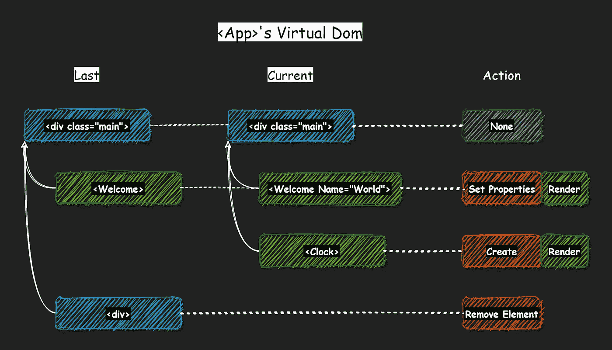

# 对虚拟 DOM 的误解

> 原文：<https://itnext.io/misconceptions-about-virtual-dom-35ec60b87086?source=collection_archive---------1----------------------->

如果你认为虚拟 DOM 是真实 DOM 的“轻量级拷贝”,通过将它们批处理在一起有助于加速更新，那么请继续阅读。尽管是正确的，但这是一个非常容易误导人的答案。令人惊讶的是，这也是最受欢迎的一个:谷歌搜索“react virtual DOM”会导致你看到非常相似的描述: [1](https://www.geeksforgeeks.org/reactjs-virtual-dom/) ， [2](https://programmingwithmosh.com/react/react-virtual-dom-explained/) ，即使你坚持使用 StackOverflow 上的顶级答案，你也会得到~相同的结果: [1](https://stackoverflow.com/questions/50395934/whats-different-between-virtual-dom-and-shadow-dom) ， [2](https://stackoverflow.com/questions/52513283/virtual-dom-and-real-dom-difference-in-react-js) ，[3](https://stackoverflow.com/questions/45887841/what-is-the-advantage-of-virtual-dom-in-todo-like-app)；

> 下面的内容同样适用于 React 和 Blazor。

## 为什么这是一个误导性的答案？

**#1。它没有突出虚拟 DOM 解决的关键问题——即*消除不必要的重新渲染*。**当我说“重新呈现”时，并不是指在浏览器 UI 更新周期中重新呈现某些 DOM 元素。这是关于*而不是*调用已知产生相同输出的 React 组件的`render()`方法，这有效地消除了组件的整个子树的重新呈现。

如果你知道 JS 和 React，可以看看[这个例子](https://codepen.io/alexyakunin/pen/JjWGZaG)。它每秒记录
`"TimeString.render(): ..."`消息，即使`Clock`组件每秒重新渲染自己 10 次(见第 16 行的`setInterval`调用),并在每次渲染时用`TimeString`组件产生一个输出。那么为什么`TimeString`每秒只记录一次渲染而不是 10 次呢？这是因为`TimeString`扩展了`[PureComponent](https://stackoverflow.com/questions/41340697/react-component-vs-react-purecomponent)`，它覆盖了`[shouldComponentUpdate](https://reactjs.org/docs/react-component.html#shouldcomponentupdate)`以确保重新渲染只在`props`或`state`改变时发生，而`time`属性是一个每秒只改变一次的字符串。如果您将`TimeString`的基础类型更改为`Component`，它将开始报告每秒 10 次渲染。

现在，请注意，为了让它工作，*的某个东西*应该在现有组件上调用`shouldComponentUpdate`。换句话说，虚拟 DOM diffing 算法必须推断出 prev 中使用的`TimeString`组件。渲染实际上是我们刚才渲染的同一个组件。这正是在[对账](https://reactjs.org/docs/reconciliation.html)期间发生的情况:

*   对 DOM 元素所做的更改会应用到真实的 DOM 上——几乎所有对虚拟 DOM 的描述都强调了这一部分。
*   *由于* `*props*`中可能发生的变化，所有安装的 React 组件决定它们是否必须重新渲染——这一关键部分不知何故经常被忽略，尽管它是负责最大节省的部分。

下面是 Blazor 中 diffing 如何工作的图示(它几乎完全复制了 React 组件模型):



*   `<div class="main">` —描述 DOM 元素的节点—不需要任何动作
*   组件的属性发生了变化，因此它将被重新渲染
*   `<Clock>`组件之前不存在，因此将被渲染和挂载
*   `<div>`元素现在没有匹配的，所以将从 DOM 中删除。

**#2。你的应用中有多少虚拟 DOM 实例？是每个应用一个组件树，还是每个根组件一个虚拟 DOM？大多数开发人员坚持后一点。**

有趣的是，虚拟 DOM 只是组件的`render()`方法的输出。看看上面例子中`App`类的代码:

```
class App extends React.Component {
  render = () => 
    <div class="main">
      <Welcome name="World" />
      <Clock />
    </div>
}
```

JSX transpiler 将其转换为以下代码:

```
class App extends React.Component {
    constructor(...args) {
        super(...args);
        _defineProperty(this, "render",
            () => /*#__PURE__*/
            React.createElement("div", {
                    class: "main"
                }, /*#__PURE__*/
                React.createElement(Welcome, {
                    name: "World"
                }), /*#__PURE__*/
                React.createElement(Clock, null)));
    }
}
```

看到那里的`react.createElement(...)`通话了吗？他们从字面上*定义*一棵树的节点。在[协调](https://reactjs.org/docs/reconciliation.html)期间，将该树与前一个树(相同组件)进行比较，其中“前一个”是相同的树，但由前一次调用`render()`方法*和引用*实际(已安装)*反应组件的*产生。

正如您可能猜到的，这个“本地虚拟 DOM”并没有明确地“嵌入”到一个“大虚拟 DOM”中，也就是说，虚拟 DOM 对于每个组件都是本地的。尽管从技术上讲，这些树仍然为任何根 React 组件形成了一个“大虚拟 DOM”树，因为:

*   每个 React 组件都记得它最后的`render()`输出，这是它的本地虚拟 DOM
*   描述 React 组件的每个虚拟 DOM 节点都引用*实际(已安装)*组件——后者反过来跟踪自己的本地虚拟 DOM，等等。

就是这样:)

我写这篇文章是作为其他几篇文章的前传，解释了为什么不可变模型如此适合 React 和 Blazor，为什么所有流行的 UI 架构(MVC、MVVM / MobX、反冲、Flux/Redux 等等)。)其实挺像的，最后，为什么用 [Fusion](https://github.com/servicetitan/Stl.Fusion) 都不需要。敬请期待！