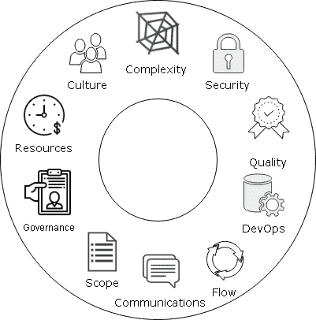
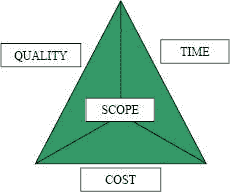
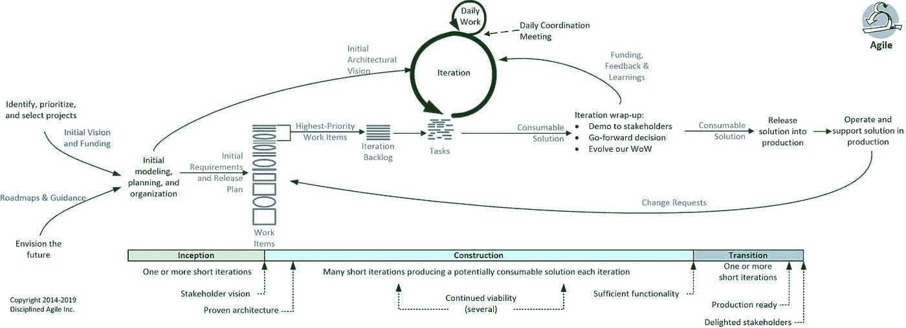

# 不可能完成的任务范围:为什么计算机系统和项目会失败

> 原文：<https://itnext.io/mission-impossible-scope-why-computer-systems-and-projects-fail-1dfdbe0ca631?source=collection_archive---------3----------------------->

盯着众所周知的蓝屏，在系统崩溃后重启机器，解释难以理解的计算机错误信息，在又一次数据泄露后冻结您的信用报告，在棘手、紧张、延迟和超出预算的信息技术(it)项目中幸存下来，以及给 IT 技术支持发电子邮件，这些都已经变得如此平庸和例行公事，以至于我们接受它们作为数字时代的生活事实。除了这些日常经历之外，还有导致人类生命损失的严重计算机系统错误和缺陷，如 2018-2019 年期间在印度尼西亚和埃塞俄比亚的波音 737 Max 8 航班上死亡的 346 人，1988 年伊朗航空公司 655 号航班被文森号航空母舰错误地击落为敌方战斗人员时死亡的 290 人， 1991 年，28 名美国士兵被穿透了错误的爱国者导弹防御系统的伊拉克飞毛腿导弹杀死，6 名患者在 1985 年至 1987 年期间被 Therac-25 辐射机器过量使用。 也有影响成千上万人的计算机系统故障，如 1980 年的 Arpanet 崩溃，1991 年的美国电话电报公司网络故障，1987 年的黑色星期一华尔街市场崩溃，2003 年的北美电网停电，2013 年的 healthcare.gov 发射失败，2014 年的美国 9-1-1 紧急电话服务中断，以及过去二十年许多大公司的数字数据泄露的圣经洪水。由于硅集成电路中布尔逻辑和二进制算术的通用性质，可以组成计算、存储和通信，计算机系统已经成为生活的一部分；它们有助于管理商业、教育、娱乐、政府、医疗保健、基础设施、军事、科学和交通等众多领域的人类活动和资产。然而，随着计算机范围的扩大和人类对它们的依赖的增长，我们的现代经济和社会为这些计算机系统缺陷和 IT 项目问题承担了巨大的成本和严重的风险。Gartner 和 IDC 估计，2018 年全球 IT 支出约为每年 3.65-4.8 万亿美元，特里森蒂斯和 CISQ 估计，2018 年系统故障的成本超过 1.7 万亿美元。彼得·诺伊曼写道“*后见之明在带来新的远见*时可能是有价值的”，马克·吐温据说曾说过“*历史可能不会重演，但它确实押韵*。带着这些灵感和计算的影响，我一直在收集计算机系统故障的故事，研究不同领域的见解，并建立一个全面的模型来了解、预防和减轻计算机系统故障。这个失败模型的战略领域对于已经在其中的人来说是熟悉的:**技术**、**组织**和**流程**。**技术**领域由**复杂性、质量、安全性**和**开发操作**组成。**流程**区域由**范围**、**流程**和**通信**组成。****组织**领域由**文化**、**治理**和**资源**组成。其中一些部分会影响其所在区域内的其他部分，并跨越更广泛的区域边界。我们将探索模型的每个元素，用有代表性的故事来说明它们，并描述防止计算机系统和 IT 项目失败并从中恢复的解决方案。这本书的主要读者是当前和下一代计算机系统专业人员，我希望这本书能帮助他们避免过去遇到的问题，并重申他们在伦理和道德上的责任，以在未来提供更好、更安全、更可靠的系统，因为我们的生活依赖于此。本书的第二读者是普通读者，他们可能对计算机系统以及它们如何影响他们的生活和他们周围的世界感兴趣。**

****

**计算机系统故障模型(来源:比什尔·塔布巴 2019)**

**计算机系统故障模型的一个主要元素是**范围**、**和**，我们必须从一开始就强调的悲喜剧点是，范围通常在交付技术解决方案的组织和团队的直接控制和影响之内。然而，几十年来的一项又一项研究表明，scope 仍然是计算机系统产品或项目中最具破坏性、最不稳定、最棘手的领域之一。自从 Standish Group 在 20 世纪 90 年代开始测量 IT 项目的成功率和失败率以来，失败率一直稳定在 15%左右，成功率在 35%左右波动，而苦苦挣扎的项目率一直保持在 50%左右。此外，Standish group 估计，几乎 50%的受挑战项目都存在范围问题，包括缺乏用户输入、不完整的需求、不断变化的需求、不明确的目标或不切实际的期望。IDC 在 2009 年发布了一份由维克伦德和普夏雷利撰写的报告，该报告估计 IT 项目的失败率约为 25%,并且有 50%的 IT 项目需要返工。2010 年的麦肯锡-牛津 IT 项目研究估计了类似的成功率和失败率，并指出所有项目中约有 10%受到范围问题的影响。项目管理学会(PMI)发布了一份名为《行业脉搏》的年度旗舰报告；在 2017 年和 2018 年，这些 PMI 报告将范围确定为表现不佳的产品和项目无法按时、按预算交付并让利益相关方满意的最常见原因(67%)。在深入理解范围并改进其管理之前，我们应该介绍一些定义。Scope 来自希腊语词根 *skopos* ，意思是目标、目的或指标。Scope 也指被看到和观察的东西，用在像显微镜或望远镜这样的词中。在我们的计算环境中，系统范围指的是组织及其利益相关者的战略目标，以及系统用户(人和机器)将依赖的功能性和非功能性系统需求。在项目管理中，范围也是“铁三角”约束的中心，每个协作努力都必须平衡。**

****

**项目管理的铁三角(来源:PMI)**

**Scope 导致了几个高知名度的计算机系统和无数其他大大小小的系统的失败。healthcare 未能在 2013 年 10 月正确启动的一个关键原因是，美国联邦政府的行政部门坚持一次性发布整个系统，其中涉及一个国家健康计划电子商务网站，以及与各州医疗保健交易所和十几个参与的联邦机构的集成。不仅因为领导问题，重要的决策在一开始就被搁置，而且在公布保险费、保险范围、灾难保险和风险池的相关法规方面也存在延迟和不确定性。此外，项目治理团队在发布之前没有要求实际的端到端测试，并且在上线前一个月要求站点用户注册以浏览和浏览健康计划时，在最后增加了范围，犯了一个大罪。尽管奥巴马竞选团队在 2008 年和 2012 年总统选举中率先使用社交媒体和数据挖掘来激励新选民，但这种在简单努力上的成功滋生了过度自信，并对复杂项目等最初可能实现的目标设定了不切实际的期望。我们将在整篇文章中多次重温 healthcare.gov 的故事，因为它触及了我们系统故障模型的大部分要素。另一个与 scope 相关的计算机系统崩溃是华盛顿州提前释放了被定罪的囚犯，原因是在解释法律时出现了一个要求错误，该法律被翻译成其 OMNI 计算机系统。2002 年 7 月，华盛顿的刑法改变了囚犯在县监狱的“美好时光”和判决前拘留如何计入监狱基本刑期的计算方法。该州最高法院建议使用一个简单的两阶段规则，其中强制性最低刑期首先开始，并在没有学分和其他因素干扰的情况下完成；在第二阶段，囚犯将服满刑期的基本部分，并根据获得的良好时间学分和判决前拘留时间进行调整。相反，州惩教署错误地解释了法院的裁决，并策划了自己的复杂计算，将基本和强制性最低刑期都计入“良好时间”，并将任何县监狱获得的良好时间计入州监狱部分的良好时间。当一名受害者的父母在 2012 年敲响警钟时，政府花了 3 年多的时间来解决这个问题。OMNI 系统的缺陷在很少人注意的情况下持续了 9 年，它导致了近 3200 名被定罪的重罪犯被过早释放。另一个失败的例子是，1999 年 9 月，由于两个组件之间的软件系统集成缺陷，火星气候轨道飞行器撞上了这颗红色星球；洛克希德·马丁公司开发的推进器控制软件使用英制单位(磅*秒)产生数字输出，而美国航天局建造的轨道飞行器导航软件预计并解释国际公制单位(牛顿*秒)的输入，这是一个长期遵守的标准。虽然公制单位要求被记录在系统规范中，但它既没有被有效地沟通也没有被有效地测试，它不知何故被 NASA 忽略了，NASA 管理着分布在不同地理位置的不同组织中的多个团队，并且可能没有对项目范围的足够指挥、整体的观点来验证工程要求和端到端地测试系统。**

****

**严格的敏捷范围管理(来源:斯科特·安布勒)**

**Recognizing that scope plays an important role in system success and failure is one thing, but the question remains what can be done about it. Let us consider the philosophical frameworks by Edward Deming, Taichi Ohno, and Nassim Taleb regarding quality, lean workflow, and anti-fragility, and apply them to scope. *First*, scope must ***adapt*** to change and not remain fixed. Deming, Ohno, and Taleb encouraged adaptation and continuous improvement as a key capability of individuals, organizations, and societies. The best system life cycle process that satisfies this principle is the Agile methodology that uses iterations. VUCA (volatility, uncertainty, complexity, and ambiguity) are major aspects of computer system development as the team learns the scope because it is rare to be handed a binder, book, or backlog of well-groomed requirements. Understanding requirements involves interviews with stakeholders, observing actual users, researching the organization and external environment, sharing early prototypes, capturing both functional and non-functional requirements, resolving conflicts between requirements, breaking down milestones and epics into concrete tasks, flagging what is volatile vs. stable as well as direct vs. derived vs. emergent, and demonstrating the real system to stakeholders as it progresses. Instead of blindly trusting an old, dusty map for system scope, the Agile process helps us navigate system terrain with our eyes and ears open to new information and hands and feet moving to make adjustments. Note this recommendation to embrace change should not be misconstrued so requirements are constantly changing within sprints because that will lead to excessive multi-tasking and thrashing. There should be a change control process in which team discussions scheduled around sprint planning and system milestones can incorporate priorities, customer feedback, and other information from the environment into the decision making process on what to work on next. Although Agile has largely overtaken the Waterfall methodology in the last decade, the healthcare.gov example shows that this fundamental lesson has not been learned by all. *Second*, scope must be ***aligned*** to the system stakeholders. There should be regular engagement with real end-users, customers, and executive sponsors throughout the system life cycle. Serious mistakes are a lack of user input, disengaged stakeholders, and not listening to customers. Perhaps the Washington state Department of Corrections should have engaged more closely with the state courts and the attorney general to better understand the law, define a set of test cases which the requirements *and* system itself would have to satisfy, and then work with the engineering team to automate those tests to validate the OMNI system as it unfolded over time. *Third*, scope and design decisions must be ***documented*** for traceability. All too often, when informal discussions about scope and design during meetings are not captured in the system backlog or document repository, it seeds the likelihood of disagreement, gaps, and misunderstandings later on. At a minimum, there should be an executive statement of work, a high-level system architecture document, and a dynamic backlog of ongoing work to make sure the business and engineering teams are on the same page. An individual requirement or use case should be clear, correct, understandable, feasible, independent, atomic, unambiguous, implementation-free, and testable. The set of requirements, taken as a whole, should be consistent and not redundant. *Fourth*, scope must be ***communicated*** to stakeholders so that there is a negotiated agreement on what is to be done based on priority, risk, and need. On the other hand, unclear objectives, fuzzy goals, and undocumented requirements lead to conflict, confusion, unending debates, and delayed timelines. *Fifth*, scope should be ***balanced*** with organizational reality. Too often, organizations engage in wishful thinking, set unrealistic expectations, allow scope to creep, and then deliver disappointment. The psychological bias of many in business and technology is one of confidence, optimism, and thinking Big. While that sunny perspective has its merits and helps drive progress, it needs to be steadied by more humility, realism, and vigilance about what can be iteratively accomplished with the finite resources available to organizations existing within the context of VUCA. Again, in the case of healthcare.gov, the US federal government forgot the proverb that small is beautiful, especially when it comes to computer systems and projects. All these principles and practices related to Scope are common sense and once followed can greatly improve the chances of success, however as Voltaire once wrote, *common sense is not so common*.**

***喜欢这篇文章？关注我* [*中*](https://medium.com/@bishr_tabbaa) *和* [*推特*](https://twitter.com/bishr_tabbaa) *了解更多更新。***

****参考文献****

*   **[https://www . PMI . org/-/media/PMI/documents/public/pdf/learning/think-leadership/pulse/pulse-of-the-profession-2018 . pdf](https://www.pmi.org/-/media/pmi/documents/public/pdf/learning/thought-leadership/pulse/pulse-of-the-profession-2018.pdf)**
*   **[https://it next . io/complex-system-failure-the-total-than-the-sum of-its-parts-ac1e 9 BC 4 e 6 c](/complex-system-failure-the-whole-is-more-than-the-sum-of-its-parts-ac1ee9bc4e6c)**
*   **[https://medium . com/data series/small-is-beautiful-the-launch-failure-of-health care-gov-5e 60 f 20 EB 967](https://medium.com/dataseries/small-is-beautiful-the-launch-failure-of-healthcare-gov-5e60f20eb967)**
*   **[https://medium . com/data series/the-rise-and-fall-of-knight-capital-buy-high-sell-low-rinse-and-repeat-AE 17 FAE 780 f 6](https://medium.com/dataseries/the-rise-and-fall-of-knight-capital-buy-high-sell-low-rinse-and-repeat-ae17fae780f6)**
*   **[https://medium . com/data series/small-is-beautiful-the-launch-failure-of-health care-gov-5e 60 f 20 EB 967](https://medium.com/dataseries/small-is-beautiful-the-launch-failure-of-healthcare-gov-5e60f20eb967)**
*   **[https://spectrum . IEEE . org/aerospace/robotic-exploration/why-the-mars-probe-go-off-course](https://spectrum.ieee.org/aerospace/robotic-exploration/why-the-mars-probe-went-off-course)**
*   **[https://www . think reliability . com/case _ studies/root-cause-analysis-the-loss-of-the-mars-climate-orbiter/](https://www.thinkreliability.com/case_studies/root-cause-analysis-the-loss-of-the-mars-climate-orbiter/)**
*   **[https://blog.bugsnag.com/bug-day-mars-climate-orbiter/](https://blog.bugsnag.com/bug-day-mars-climate-orbiter/)**
*   **[https://llis.nasa.gov/llis_lib/pdf/1009464main1_0641-mr.pdf](https://llis.nasa.gov/llis_lib/pdf/1009464main1_0641-mr.pdf)**
*   **[https://degiuli . com/en/6-项目管理-从火星-气候-轨道飞行器-失败中吸取的教训/](https://degiuli.com/en/6-project-management-lessons-from-the-mars-climate-orbiter-failure/)**