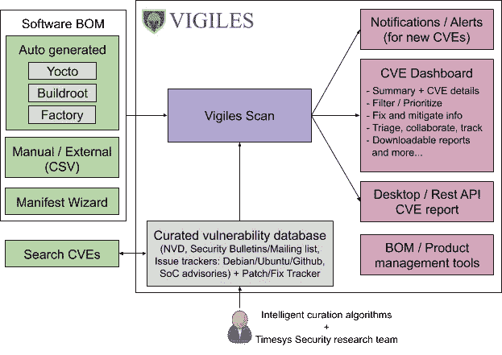
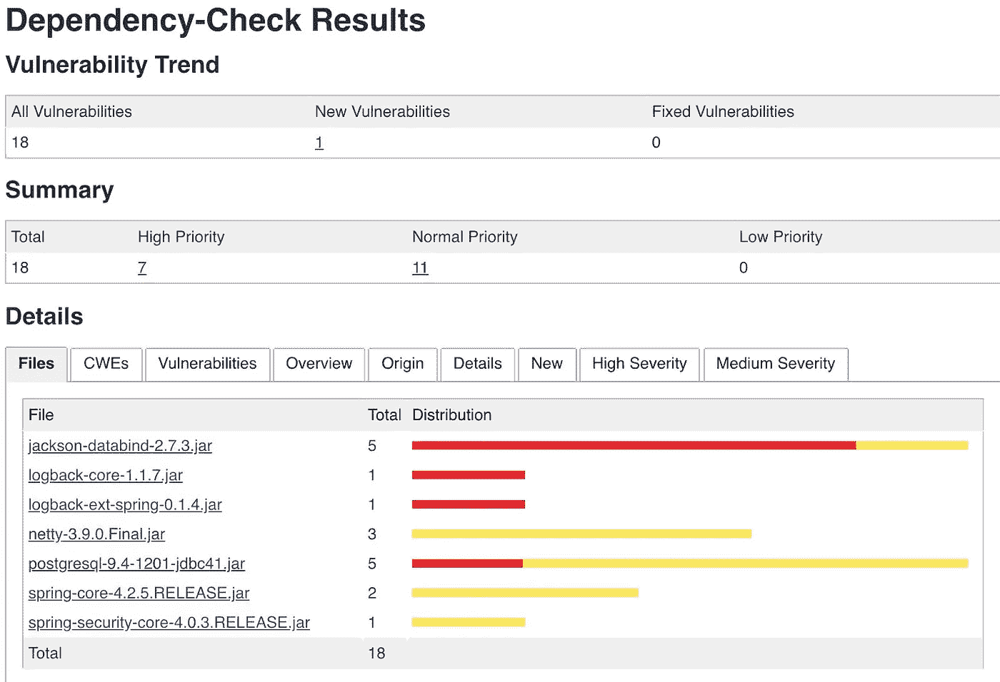

# 减少开源依赖中的漏洞

> 原文：<https://itnext.io/mitigate-vulnerabilities-in-your-open-source-dependencies-3a31c1fce9b9?source=collection_archive---------3----------------------->

马库斯·温克勒的照片

开源 web 应用框架 Apache Struts 2 中的一个[漏洞](https://nvd.nist.gov/vuln/detail/CVE-2017-5638)允许黑客窃取 Equifax 的 1.47 亿美国人的私人记录。一项调查发现，Equifax 已被告知该漏洞，但内部流程的故障延迟了该漏洞的修补。

大多数组织没有他们使用的所有第三方组件的最新目录。Tripwire VERT 首席安全研究员克雷格·杨(Craig Young)表示:“供应商通常将开源作为降低成本和更快上市的一种方式，而没有意识到需要密切跟踪这些组件的安全或许可问题。这种“快速行动”的方法在初创公司和小型团队中很常见，在这些团队中，快速周转非常重要。

公司需要有软件清单和明确定义的流程来及时应用安全补丁。在这篇文章中，我们将看看可以用来减少开源依赖中的漏洞的策略和工具。

# 创建软件物料清单(SBOM)

SBOM 是包含在软件产品最终版本中的所有软件组件/包(带有版本号)的列表。它将帮助您跟踪您的自定义软件包和第三方依赖。SBOM 还可以帮助你遵守开源许可，这样你就不会成为 [SFLC 的下一个目标。](https://www.computerworld.com/article/2468324/sflc-hammers-gpl-violators.html)

我如何知道我的最终版本中的所有组件？询问您的构建系统。

Java : mvn 依赖关系:树，gradle 应用程序:依赖关系

**Node.js** : npm 列表

**Python** : pip 冻结

**C/C++** : Makefile

**嵌入式 Linux 系统** : Yocto 构建历史，Buildroot

有时你可能需要访问默认的 OS 包管理器或文件系统来获得所有包的列表。一旦你有了你的列表，你可能想把它连接到一个漏洞数据库，比如 NVD。有许多选择，但我将着眼于两个解决方案。

## 泰晤士报

这是一个软件组成分析(SCA)工具，它将帮助您分析和连接您的 SBOM 到一个漏洞数据库。它针对嵌入式系统进行了优化，但您仍然可以将其用于桌面、移动和 web 应用程序。有一个[免费版本](https://www.timesys.com/security/vigiles-vulnerability-management-patch-monitoring/)可用，带有[有限的功能](https://www.timesys.com/security/vigiles-vulnerability-management-patch-monitoring/compare-versions/)，但仍然可用。对于嵌入式，它可以使用 Yocto、Buildroot 或 Timesys Factory 自动生成 SBOM。对于其他平台，你只需上传一个自定义的[。CSV 文件](https://www.youtube.com/watch?v=d7ZnRfOHRI8)或使用他们的 [web 向导工具](https://www.youtube.com/watch?v=Fy3NV2E8K-w)创建一个 SBOM。

## CycloneDX +依赖关系-跟踪

我们已经讨论过将您的软件包列表存储在。CSV 文件，但有标准的 SBOM 规格，你可以使用。目前可用的三种主要 SBOM 规格包括 [CycloneDX](https://cyclonedx.org/) 、 [SPDX](https://spdx.org/) 和 [SWID](https://nvd.nist.gov/products/swid) 。我推荐 CycloneDX，它更轻量级，更适合应用程序安全环境。一旦你使用 CycloneDX 生成了你的 SBOM 文件，你可以将它导入到 [Dependency-Track](https://dependencytrack.org/) 来管理和跟踪你的组件。您的技术堆栈将决定您的 CycloneDX SBOM 规格将如何生成。但是你可以参考这个[教程](https://blog.voltone.net/post/24)来了解一个具有 NPM 依赖的 Mix/Elixir 项目是如何完成的。

# 创建修补和更新组件的指南

Equifax 内部流程的失败告诉我们，我们需要定义良好的程序来按时应用安全补丁。当您收到 20 个组件需要更新的安全通知时，谁来协调修补工作？应用补丁时，安全研究人员/工程师和开发人员的角色是什么？哪些更新将被优先考虑？

您应该建立一个区分低优先级和紧急安全警报的优先级系统。Synk [最近在他们所有的计划中增加了](https://snyk.io/blog/snyks-developer-first-prioritization-capabilities/)这个功能。依赖性跟踪和依赖性检查也可以区分漏洞的优先级。

聘请一家声誉良好的安全公司来帮助你进行员工培训、安全指导建议、审计和测试，以了解你的暴露程度和最坏的情况。

# 使用免费/商业安全解决方案保护您的第三方依赖关系

免费解决方案

## [**-**-](https://owasp.org/www-project-dependency-check/)

它与依赖跟踪密切相关，但是它不需要 SBOM 来分析你的开源依赖。[设置](https://www.growthaccelerationpartners.com/tech/dependency-check-and-track-blog/)扫描你的项目目录，它会生成一个关于你的漏洞的 XML 报告。XML 报告可以导入到 Dependency-Track 进行进一步的分析。

## [**OSS 指数**](https://ossindex.sonatype.org/)

Sonatype 提供的免费服务，用于扫描项目中的漏洞。很多像 Dependency-Track 这样的免费工具使用 OSS Index API 进行扫描，因为它有更多 NVD 没有的漏洞。DepShield 是一款由 OSS Index 支持的免费扫描仪，用于扫描公共和私有 GitHub 库。如果您需要商业支持和更多功能，您可以升级到他们的 [Nexus 平台](https://www.sonatype.com/product-pricing)。

## [**白源螺栓**](https://bolt.whitesourcesoftware.com/)

GitHub repos(公共或私有)和 [Azure DevOps](https://whitesource.atlassian.net/wiki/spaces/WD/pages/33751265/WhiteSource+Bolt+for+Azure+DevOps) 有免费的漏洞扫描器吗？它支持 200 多种语言，但扫描仅限于每天 5 次回购。你可以[比较](https://bolt.whitesourcesoftware.com/whitesource-bolt-for-github-vs-full-solution/)它的功能和完整的解决方案，看看你是否需要升级。看看他们的另一个免费工具，[white source renewal](https://renovate.whitesourcesoftware.com/)，你可以用它来解决过时的依赖。

商业解决方案

## [**Synk**](https://snyk.io/)

一家以色列和伦敦的初创公司，为企业提供完整的端到端安全套件。他们在今年早些时候获得了 1 . 5 亿美元的资金，并且 [Greenkeeper](https://github.com/greenkeeperio/greenkeeper) (最近关闭了店铺)已经建议其所有用户迁移到 Synk。他们的商业计划针对大中型企业，但他们有一个免费计划。免费计划仅限于对私人项目进行 200 次开源漏洞测试，但对开源项目没有限制。

## [**Tidelift**](https://tidelift.com/)

在应用程序中使用第三方组件之前对其进行检查和评审可能会花费大量的金钱，并且会减慢开发周期。Tidelift 通过为您提供一个已经过审查的开源组件的[目录](https://dev.to/tidelift/if-your-open-source-dependencies-are-a-mess-we-ve-got-you-introducing-catalogs-2jg5)来解决这个问题，这些组件会定期进行漏洞扫描。您也可以创建自己的定制目录。Tidelift 向开源开发者付费，以确保软件包得到良好的维护，并应用了安全补丁。定价只针对大企业。

## [**窝**](https://fossa.com/)

一家美国初创公司，提供一套许可证合规性和漏洞管理工具。它利用静态和动态代码分析来获得更准确的依赖关系视图。他们的 [CLI 工具](https://github.com/fossas/fossa-cli)在 MPL-2.0 许可下是免费的，但是它只生成依赖报告和许可通知。商业计划中提供了全面的漏洞报告。

## 开源更安全

开源库通常比闭源二进制更安全，因为代码是可访问的，并且可以根据开源许可协议进行修改。WinRAR ACE 漏洞就是一个很好的例子。温拉尔利用 unacev2.dll 图书馆(已经废弃)来解开 ACE 档案。dll 中的一个[漏洞](https://research.checkpoint.com/2019/extracting-code-execution-from-winrar/)将 5 亿用户置于危险之中。“UNACEV2。DLL 自 2005 年以来就没有更新过，我们也无法获得它的源代码。所以我们决定放弃 ACE 存档格式支持，以保护 WinRAR 用户的安全，”RARLab 在一份声明中说。

有了最新的软件清单和深思熟虑的安全协议，公司可以安全地依靠开源来支持他们的运营和产品。