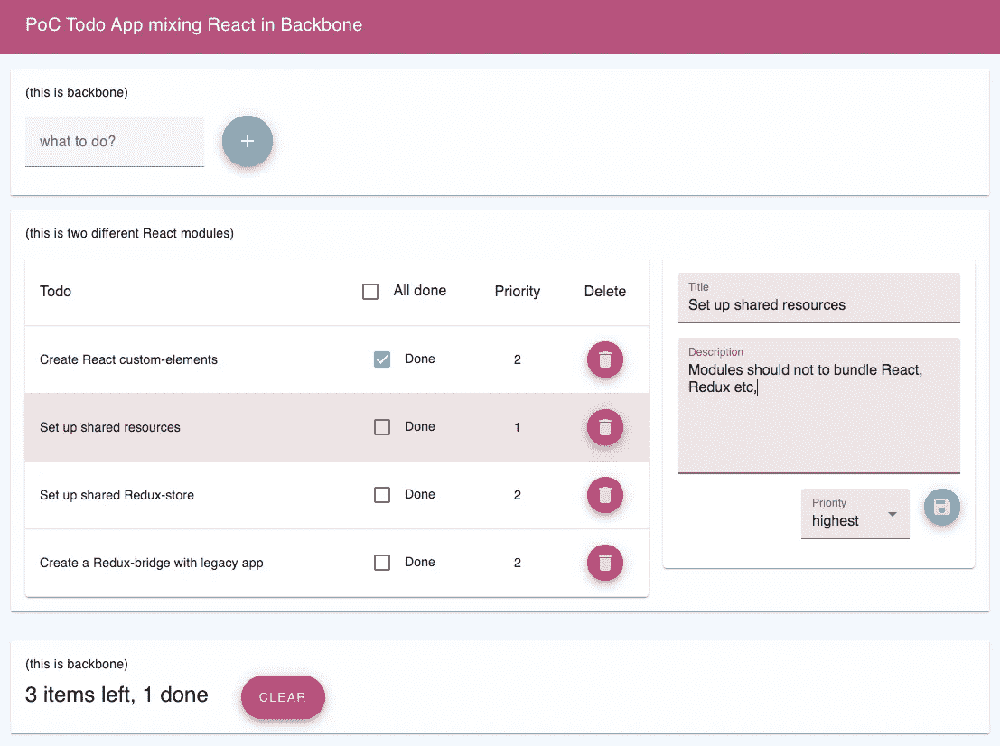

# 将 React 模块混合到遗留应用程序中

> 原文：<https://itnext.io/mixing-react-modules-into-a-legacy-application-ddc0c5660ecd?source=collection_archive---------2----------------------->



使用 React-modules 概念验证的主干屏幕截图

随着一个巨大的单片前端应用程序的使用，您将会发现维护和增量更改的成本是相当大的，彻底的更改似乎是不可能的，并且为一个过时的技术招聘人员是一个大麻烦。是时候重写了！

开始这个令人生畏的过程有不同的策略。但是在某些情况下，更好的选择可能是混合新旧的模块化重写。这种策略永远不会是最佳的，因为使用两个框架会增加大量的开销。但是，让我们说，总的权衡仍然可以有利于这一战略，并转移到技术的实用性。在这里，我将描述如何做到这一点的概念证明。它混合了 Backbone 中的 React，因为那是我们的用例，但是这些原则也应该适用于其他框架。

# 概念验证

概念验证是基于主干 ToDo 应用程序([https://backbonejs.org/docs/todos.html](https://backbonejs.org/docs/todos.html))，加入了一些材料设计。

为此，我添加了两个 React 模块。一个是主干列表视图的替代(它仍然在那里，被一个复选框隐藏，以显示它们是同步的)，另一个是向待办事项的编辑添加特性。他们都使用 Material UI(【https://material-ui.com/】T2)，这样风格就可以和主干应用保持一致。这两个模块相互独立地编译和部署，但是它们仍然共享 mui-theme 和 Redux-store。

演示:【https://custom-react-elements.now.sh/ 

GitHub:[https://github.com/kjartanm/custom-react-elements](https://github.com/kjartanm/custom-react-elements)

以下是 PoC 解决的一些问题:

*   它不应该给遗留应用程序增加不必要的复杂性。
*   它不应该给遗留应用程序增加不必要的开销。
*   应该可以在不同 React 模块之间共享状态。
*   React 模块和遗留应用程序之间应该可以轻松地传递状态。

这些问题通过以下步骤解决:

## 步骤 1:将 React 模块作为定制元素进行部署和集成

将 React 混合到遗留框架中有不同的方式。PoC 使用一种技术，其中 React 模块被编译成一个定制元素。这种技术的“hello world”示例如下所示:

```
const HelloWorldComponent = () => {
    return (
        <h1>Hello world!</h1>
    )
}class HelloWorldElement extends HTMLElement {
    connectedCallback() {
        ReactDOM.render(HelloWorldComponent(), this);
    }
}
customElements.define('hello-world', HelloWorldElement);//Then you can just use the custom element to render and add the React component to the DOM<div class="legacyapp-container">
    <hello-world></hello-world>
</div>
```

这种技术的好处是，您可以添加 React 模块，而对遗留应用程序的代码库影响最小。相反，您可以通过遗留框架模板处理来间接实现。然后，您可以专注于从遗留应用程序中删除代码，用哑组件替换完整的逻辑组件，只是为了用自定义元素呈现模板。

## 步骤 2:在 React 模块之间共享资源

你不喜欢捆绑 React 和 Redux 等。对于每个组件。幸运的是，在编译模块时，很容易将这些依赖项设置为共享的外部依赖项。PoC 从 CDN 加载 React & Co，而汇总配置(但这可能与使用 webpack 一样容易)告诉脚本在哪里可以找到它们:

```
//from rollup.config.js

const globals = {
    react: 'React',
    redux: 'Redux',
    'react-dom': 'ReactDOM',
    'react-theme': 'reactTheme',
    'react-store': 'reactStore',
}const externals = ['react', 'redux', 'react-dom', 'react-theme', 'react-store']export default [
    {
        input: 'src/Module1Wrapper.js',
        output: {
            file: 'public/module1.js',
            format: 'iife',
            globals,
            name: 'Module1'
        },
        externals,
        plugins
    },
    ...
]
```

本地依赖关系可以用同样的方式处理。共享主题导出为 iife(立即调用的函数表达式),它将导出设置为可用作共享依赖项的命名全局:

```
//from rollup.config.js{
    input: 'src/theme.js',
    output: {
        file: 'public/theme.js',
        format: 'iife',
        globals,
        name: 'reactTheme'
     },
     external,
     plugins
 }
```

资源是否应该共享，并不总是一目了然的。在 PoC 中，我可以通过 CDN 加载材质 UI 库，并像对待 React、Redux 一样对待它。但是加载整个库的开销超过了好处。相反，如果我真的需要优化，我可以创建一个只包含所需组件的本地包，并以与主题相同的方式提供这些组件。

## 步骤 3:在 React 模块之间共享状态

您可以像主题一样在模块之间共享 redux 存储:

```
//from rollup.config.js{
    input: 'src/store.js',
    output: {
        file: 'public/store.js',
        format: 'iife',
        globals,
        name: 'reactStore'
    },
    external,
    plugins
},
```

然后，React 模块将“导入”全局存储，使其与主题一起可用于模块:

```
const App = () => {
    return (
        <Provider store={reactStore}>
            <ThemeProvider theme={reactTheme}>
                <SimpleEdit></SimpleEdit>
            </ThemeProvider>
        </Provider>
    )
}
```

因为共享资源是一个已创建的现成存储，所以状态将在模块之间共享。

## 步骤 4:在 React 模块和遗留应用程序之间交流状态

共享 Redux store 的好处是，它还可以用于在遗留应用程序和 React 模块之间传递状态。在这里，我们需要给遗留应用程序添加一些东西，但是要注意集中完成，而不是分散在整个应用程序中。例如，在 PoC 中，我在主脚本中的 Todos-collection 上设置了一个监听器，用于将 Todos 分派给模块:

```
Todos.on("change destroy", ()=>{
    window.reactStore.dispatch({ type: 'SET_TODOS', payload: Todos.toJSON() })
})
```

另一方面也是如此:

```
window.reactStore.subscribe(() => {
    const state = window.reactStore.getState();
    const items = (state.items?state.items:[]);
    Todos.set(items);
    Todos.each(todo=>todo.save())
})
```

这最后一个相当愚蠢。你很快就会需要一些抽象，让集合和模型只听状态的一部分，而不是整个状态，因为那会产生很多噪音。

还存在无限循环的危险，因为模型和状态正在相互监听，但是只要传入状态可以被检查为与现有状态等价，它就会停止。如果没有，你将需要一些簿记来确定。但是所有这些都不在 PoC 的范围内，所以改天再说。

# 结论

PoC 可以工作，但是当然，创建 PoC 和在成熟的遗留应用程序中使用这种策略是有区别的。将会有 hick ups，synhcing 的问题，以及开销的显著增加——即使它是可以控制的。这是否是一个值得花的时间，是一个开放的问题，唯一的答案是，它取决于。