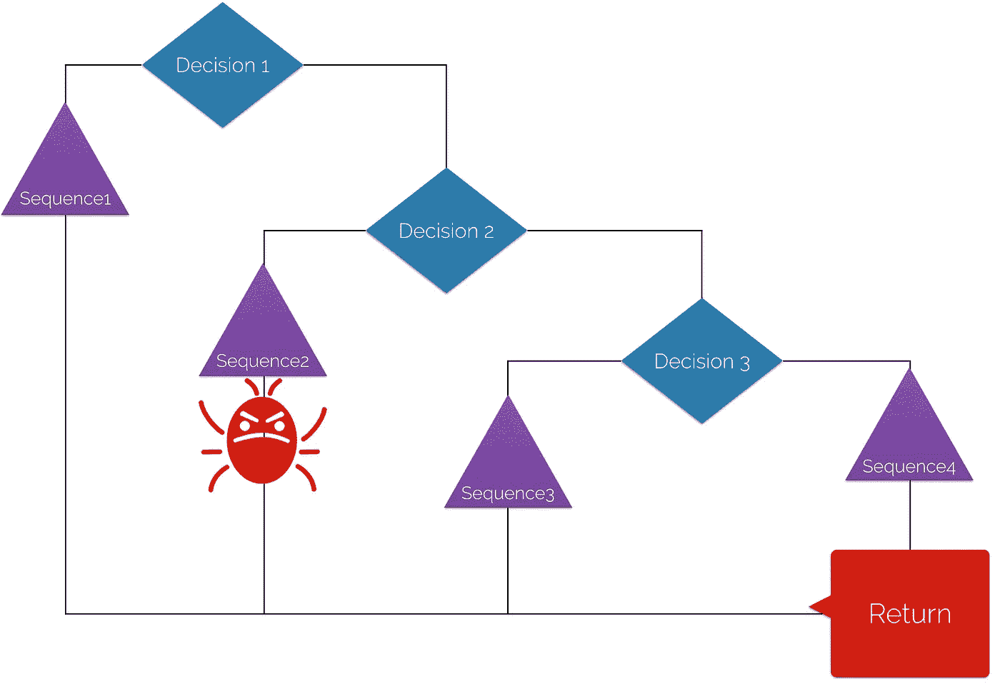
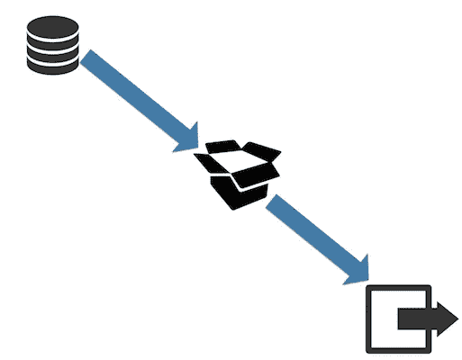

# ML 算法和人工智能系统

> 原文：<https://itnext.io/ml-algorithms-and-ai-systems-ac28da4e8900?source=collection_archive---------4----------------------->

## 我们需要一个新的软件开发周期吗？

人工智能系统工作得非常好，解决了很多问题。但是我们准备好调试它了吗？还是会留下一片焦土？

# 大肆宣传

人工智能就是现在的**炒作**。你到处都能听到:聊天机器人、NLP、tensorflow、深度学习、翻译、智能物联网、AlphaGo 和自动驾驶汽车(*耶！*)。一直困扰我的一件事是:你如何接近 AI 中围绕软件开发的周期？有什么变化吗？我们的概念，围绕持续集成、自动化、持续交付的最新技术以及所有其他 D **evOps** 理念。对于一个人工智能系统来说，它们够用吗？我们需要改变方法吗？

当一个客户要求我实现一个 Jenkins 管道时，我意识到 ML 算法在他的数据科学家拥有的 Jupiter 笔记本上…

我在这里的目标是展开一场讨论，一场**“寻求帮助”**，这样我们就可以从**软件开发周期**的角度开始审视我们如何构建人工智能系统。人们谈了很多狭义和广义的 AI，奇点等等。如果这是你的目标，对不起，这不是那种文字。

不，不要在这里谈论奇点。抱歉让你失望了，就像 RDJ 让期待钢铁侠的孩子失望一样。

# 人工智能系统

首先，我们必须达成共识。你如何看待一个**人工智能系统**？根据我所做的实现，我所看到的演讲，文章和帖子，我有一个概念，它有:
**(i)感知** —它如何感知它生活的世界。收集数据的部分，做一个数据管道等等。
**(二)学习**——很多人认为 AI 只是这部分，机器学习本身。这里有几个著名的算法:支持向量机，人工神经网络，集成，一般线性模型和许多其他算法。不要忘记；有几种类型的学习(空间、关系、刺激反应和许多其他)，但所有这些都可以用数学问题来表示。
**(三)推理** —这是你定义和推理系统试图学习什么的部分。ML 中的算法需要衡量它们做得有多好，它们可以预测、分类或聚类事物有多好。你如何定义背后的推理？
**(四)规划**——基于输出，你推理出结果。你有一个行动并对它做出反应，但是你需要计划如何执行它。
**(v)执行** —与机器人技术有很多关联，它是由于一个推理阶段而提出的行动的实际实现。然而，在一个推荐系统中，例如，没有机器人——只有一个 API 调用将产品展示给用户。

# 调试 ML

实现机器学习算法最棘手的事情之一就是**调试**。为什么？我在大学里学到，我应该思考一个算法，并首先应用下面这些二进制图中的逻辑。它们与 If/Loops、子句、try/catch 等相关联。

哦，我发现这些算法课很无聊！现在我只能感谢它，因为我不得不学习它，现在调试它是如此简单！

当你的应用程序有错误时，你会查看*日志*，*追踪*错误，你通常可以找到你可以修复的特定代码序列。你**修补**它，问题就解决了！

当我修补东西时——老虎的眼睛！

# 超参数和人工智能调整

现在让我们换个角度思考。你构建了一个给图像加标题的 ML 算法——就像你在这篇[谷歌研究文章](https://research.googleblog.com/2016/09/show-and-tell-image-captioning-open.html)上看到的一样。
如果一个用户正在为你的服务付费，他在一张图片上看到了一个错误，他可能会有兴趣为你开一张罚单，让你修复这个问题。现在是百万美元问题:**你能做到吗？**能解决这个特定用户的问题吗？如果有一个 LSTM 深度学习的 tensorflow 实现，你不能只针对一种情况调整 ML 算法。这里没有 if/else 子句或循环来指出哪个序列犯了*错误*。你使用一个 API 在 tensorflow 中编程，定义层，激活函数，损失函数和所有需要的东西。您可以灵活地**更改 tensorflow 实现的超参数**；你可以修改告诉机器应该如何学习的基本算法，这样它就可以优化梯度并构建其权重矩阵。你没有明确地定义算法、循环和序列，就像我们在上面看到的常规软件系统一样。

构建数据管道，为您的 ML 实现定义超参数，您就有了结果！*免责声明:这并不像听起来那么简单！

你给这个算法提供数据，它可以衡量它的学习，并会对它进行改进。因此，机器将有其算法来实现和预测，分类和推理它所学到的东西。因此，在一个 ML 算法中，你建立一个数据管道，定义这个“黑箱”的超参数，它会给你一个结果。重要的是，如果 ML 算法的结果有一个 bug，**你能改变一个案例而不影响其他的吗？**

# 人工智能期望

这是一个不同的调试概念，它与**期望**有很大关系。你永远不会有一个永远正确的 ML 算法，就像人类一样。*所以，当那个不错的营销人员来问你是否能建立一个推荐系统，前提是你能 100%保证某样东西，你只要去喝杯咖啡，然后反驳他就行了。此外，开发一直在建立微服务和模块化的概念，因此人工智能系统可能看起来违反直觉。对于解决需要外部数据输入的问题，ML 是我们现在拥有的最好的解决方案，由于无限的可能性，这个问题用算法是不可能解决的。因此，现在，我们的最佳解决方案不是模块化的。它本身可以是一个微服务，但你不能触及算法的一个点，除非你确定你不会改变所有。它将演变为强化学习，删除未使用的神经元，[深度做梦概念](https://github.com/google/deepdream)，但它需要确保: **ML 算法有模块化问题。***

改变一个改变所有。ML 在其常规算法中有一个预先构建的多米诺效应。这将会改变！

# 构建/测试/发布&在线人工智能

另外很重要的一点是**在线学习** *VS* **构建/测试/发布**概念。在我工作过的公司中，当你发布一个故事时，你会遵循以下步骤:提交一个拉式请求，得到评估，合并到 master 中，构建并打包应用程序，进行部署测试，功能测试，最后，发布到产品中。我希望你知道这个自动化过程，结对编程，合并的必要验证，并使用 Jenkins/Travis 来完成所有这些— *在你做 PR 之前，请不要忘记所有的单元测试！*

合并到生产部门，让运营团队来处理，对吗？=O

如果你有一个在线机器学习模型，一个随着新的数据流“在飞行中”学习的模型，那就太棒了！然而，每次你的**模型重新计算它自己时，它会改变它的算法**(因为它改变了权重)。因此，是否有必要进行新的构建，以便您可以再次运行所有的测试和 CI/CD 管道？还是这是反应过度？在这种情况下，我们还需要做其他检查吗？我们今天对于打包/构建/发布的概念已经为 ML 算法做好准备了吗？这是“求救”的部分…我不知道，我有一些想法如何处理它。但我想听听你们对此的看法！

# 艾会留在这里

我确定一件事: **AI 系统在这里，它们可以解决其他算法解决不了的问题**。图像识别、自然语言处理和翻译的发展(*代表* [*谷歌国际语*](https://research.googleblog.com/2016/11/zero-shot-translation-with-googles.html) )只是揭示使用深度学习的所有好处的几个例子。**因此，我们必须开始更加关注它的开发周期、部署、测试、如何投入生产、如何打包和构建。**当我们对此有了更清晰的愿景时，我们将能够更好地整合开发团队中的数据科学家，将 Jupiter 笔记本电脑留在后面，迁移到一个更具可扩展性/集成性的平台。这种系统的成熟度将会给所有的开发团队带来好处。要做到这一点，我们需要更多的讨论，尝试更多的新事物。

你有什么经验可以分享，有什么想法可以尝试，或者你就是不同意？留下你的评论，用心这篇文章，分享，让我们来搅拌这个讨论。

*这是基于*[*devo PS Amsterdam Meetup*](https://www.meetup.com/DevOpsAmsterdam/events/237724692/)*由*[*LINKIT*](https://www.linkit.nl/)*主办的演讲“焦土中的机器人——不确定系统中的人工智能遗产”。*

*原载于*[*www . linkit . nl*](https://www.linkit.nl/knowledge-base/274/ML_algorithms_and_AI_systems)*。*