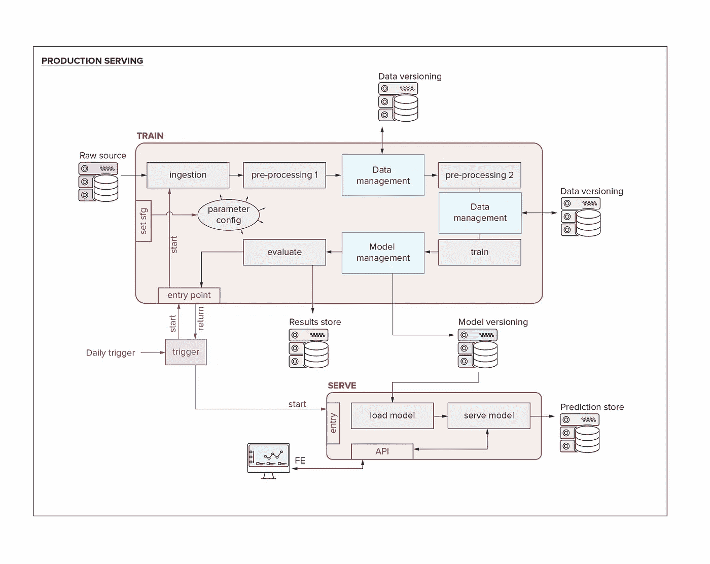
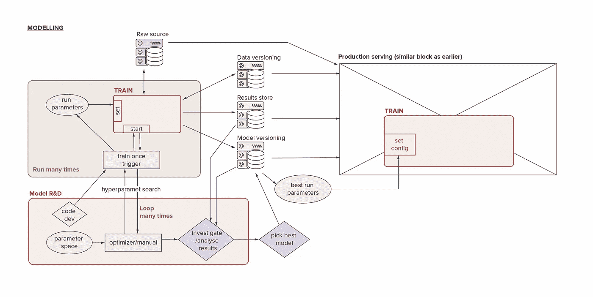
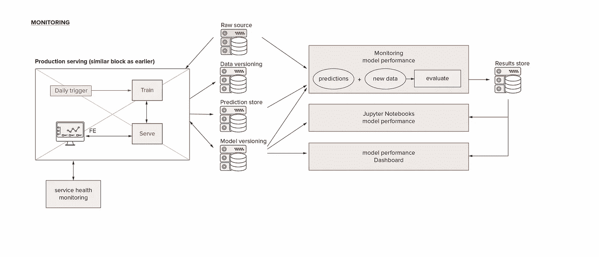

# 没听起来那么无聊

> 原文：<https://itnext.io/mlops-not-as-boring-as-it-sounds-eaebe73e3533?source=collection_archive---------4----------------------->

你听说过 MLOps 吗？当我第一次听到这个术语时，我承认我的第一反应是:无聊！”，我翻了翻白眼，就像你说这种话时应该做的那样。一旦他们的模型投入生产，没有人愿意照看、维护和排除故障。每个数据科学家都私下希望他们可以把这项工作交给工程团队，或者实习生，对吗？事实上，MLOps 将使您的数据科学生活变得更加美好。我们中的大多数人不会处于轻松的位置，在那里你只需要编写 ML 代码，然后把它扔到围栏外面；我们将越来越多地被要求生产化。为了让这份不轻松的工作变得最能忍受，我建议尽快进入 MLOps！

从长远来看，所有这些本质上都是为了节省时间；减少开发中的手动和重复工作，并减少故障排除。所以实际上这是关于节省时间和我们的理智。

在本文中，我将采用我在头脑中处理 MLOps 的相同方式，以及我如何向我的团队提出它；我将从开发 ML 模型的日常工作开始，然后一路实现与它相关的所有开销，并希望有什么东西可以安装它。

因此，我们很高兴地在我们的数据清理、特征工程和模型训练管道上编码(从现在起，我就称它为*管道*)。我们在某人创建的数据转储中获得了一些原始数据，管道停止了崩溃，我们得到了一些结果，阳光灿烂。好吧，也许模型充满了信心，但大多是错误的，所以我们在改进功能、用不同的参数进行训练和更好地清理数据之间来回徘徊。其中一些涉及到更改代码，一些涉及到更改处理的数据，所有这些都会对您的性能产生影响。过一会儿我们就会失去联系。这个模特以前表现出这种奇怪的行为吗？我是否使用了另一个版本的清理数据集，不同的参数，或者我只是引入了一个 bug？

在这一点上，我们已经想要所有东西的版本化。为了我们自己的安心，也为了加速我们的迭代，实现更好更快的诊断和调试。我们的版本是什么？当然，我们已经对代码进行了版本控制。但是现在，我们为数据和模型添加了版本控制，我们将它们彼此关联起来，并将创建的工件(数据集、模型二进制文件、结果)与运行(时间戳、提交散列、入口点、参数、性能)关联起来。

*我们正在描述的工作流视图的第 1 部分。给出了需要支持的功能的良好印象，但是将所有复杂的架构/基础设施/工程部分留给读者练习。*

非常好。我们继续开发，并且我们在代码开发和模型运行之间不断来回。显然，我们需要做一些超参数搜索，我们以一种或另一种形式实现它，确保我们将所有运行都附加到我们的跟踪器和版本号上。这是一个开销，现在使用一个好的包就可以轻松解决。从概念上和功能上，我们现在已经准备好开始挑选我们的最佳模型(对于“最佳”的一些值)。

因此，在选择了最佳模型之后，也许很容易将它包装在 API 中(也许用 Flask ),放入 docker 映像中，然后发送到云中。这将工作(大部分/某种程度上/也许)，在某种意义上，我们将获得一些输出，并且我们可能会继续获得一些输出，只要您的连接没有中断并且数据格式没有改变。但是，即使我们假设这是一个“一发而不可收拾”的模型(机会渺茫)，它也不会起作用，因为我们根本不知道我们的模型在做什么，它在现实中表现如何，或者为什么。

事实上，有三件主要的事情是我们想要做的，并且会给我们带来很多开销(痛苦)。首先，在许多情况下，您会希望用新数据自动更新您的模型。第二，您的项目实际上永远不会完成，我们将希望通过向数据和代码添加功能以及摆弄设置(这将意味着手动开始运行和训练模型)来继续开发模型。最后，我们将记住在我们将得到的唯一真正有代表性的坚持数据集上监视我们的模型的性能:实时数据。

*我们正在描述的工作流程视图的第 2 部分。名为“生产服务”的模块正是上图中的模块。请注意，名为“Train”的红框是相同的代码，但它们可能是不同的版本或分支。与上图相同的注意事项也适用(给出了需要支持的功能的良好印象，但省略了所有复杂的架构/基础设施/工程部分)。*

因为没有所谓的“最佳”或“最终”模型，而且生产中的模型会不断变化，所以我们尽早设置这种版本控制诡计是一件好事。为了在 R&D 加速和故障排除方面充分利用我们的版本控制，我们希望能够遵循以下协议。

**任何时候我们训练一个模型，无论是研发&，实验，超参数搜索，再培训，还是生产服务:**

*   我们应该为管道使用相同的 git repo，根据我们所处的阶段，最多使用不同的版本。这些版本旨在以通常的方式融合，尽管在实验中这些可能是分支。
*   我们应该通过相同的配置和触发系统进入管道。
*   我们应该通过数据版本控制系统访问我们的数据，或者:1)显式声明和存储哪个代码正在使用哪个参数加载和转换哪个数据，或者 2)显式声明和存储我们正在加载哪个先前清理过的数据集
*   我们应该在模型版本化系统中保存我们所有的结果
*   无论是 R&D、调试、部署和服务，还是监控，我们都应该以同样的方式与经过训练的模型进行交互(加载、推理)。

这样我们就可以**始终**一致、可靠地检查、比较、排除故障和回滚**任何**型号(并知道哪里有变化)。最后，我们谈到了监控，这不仅仅是关于产生一个漂亮的仪表板，也许是一些警报阈值，而且是关于以这样一种方式设计环境和代码，它很容易进入任何(一组)模型的内部和其他讨厌的细节进行诊断。

*我们正在描述的工作流视图的第 3 部分。监控在概念上和技术上可能是最简单的部分。但我不想我们忘记这件事！名为“生产服务”的模块正是上图中的模块。请注意，名为“Train”的红框与之前所有图中的代码相同，但它们可能是不同的版本或分支。与上图相同的注意事项也适用(给出了需要支持的功能的良好印象，但省略了所有复杂的架构/基础设施/工程部分)。*

从概念上来说，我们可能会认为，一旦我们准备好了管道，所有这些其他的东西都只是在我们已经建立的核心上的一个小小的努力。事实将证明，我们严重低估了这些任务的人为复杂性。我的意思是，这三项任务中每一项的“本质”复杂性都很低，因为作为一个孤立的案例，问题很容易理解，解决方案也很容易想象。但是由于我们想要如何工作，我们成倍地增加了复杂性(因此我称之为‘人工的’，因为这种复杂性是人为的，而不是 ML 的基本属性)；我们希望能够同时做所有这些事情*并且使用*相同的代码库*。因为我们越是将做实验的管道与做超参数搜索的管道、做再训练的管道以及做部署和监控的管道分离，出现错误的风险就越高(事实上，我准备好保证会出现错误)。*

*这是所有事情中最具挑战性的部分；我们希望我们的工具和代码架构都支持我们同时做很多事情。这里的“同时”意味着我们可以做两件不同的*功能*的事情，而不必做太多的手动工作来来回回地改变，**和**出于安全原因保持尽可能多的代码相同。*

*例如，一方面，我有一个管道，它的接口可以很容易地被 Katib(我在 kubernetes 上的超参数搜索算法)获取，但另一方面，我也希望能够在 Jupyter 笔记本中对模型代码进行一些开发，在那里我可以很容易地与我的数据、管道和模型进行交互。如果我不得不在笔记本中编写大量代码来访问管道或模型的不同部分/功能，这些代码在我以自动化方式启动管道时并不使用，或者如果我临时修改我的管道以跳过/重用以前运行的一些部分来节省时间，那么当我尝试实现这个新功能时，我很可能会在正确运行管道时获得不一致的结果。然而，如果我试图避免这种情况，每次在开发过程中做一个小的改变时，都以适当的方式重新运行我的完整管道，这将花费很多时间！*

*这是主要的复杂性问题。如果你想将其归结为:灵活性和节省时间，相对于环境之间的可重复性和健壮性。由于痛苦守恒定律，我不确定我们能完全避免它，但我认为应该有可能达到一个非常体面的标准。*

*也许你现在正期待我告诉你，你可以 pip 安装哪个神奇的软件包来完成这一切。但我不会，很不幸。肯定有一大堆软件包、框架和工具可以帮助解决我提到的一个或多个问题，但我自己仍然在四处寻找和尝试。据我所知，这个问题还没有解决。我将在最后给出一些参考资料，但我不会深入任何操作方法，也请不要将其视为任何形式的确定答案。*

*但是，在此之前，我想指出一些我们还没有提到但在寻找我们的 MLOps 解决方案时也应该考虑的事情:*

*   *我们可能会遇到这样的情况，我们希望同一模型的许多变体(管道的变体)同时用于稍微不同的应用程序。在这种情况下，我们再次希望为所有变化的管道使用相同的代码库，但我们需要在配置和基础架构中允许额外的灵活性(对于所有并行的超参数搜索、再培训、部署和监控)。*
*   *我们可能需要为不同的模型考虑不同的服务和再培训策略。你的花园品种推理模型需要不同的基础设施比静态预测，分析师在回路中，或在线学习。*
*   *例如，如果我们的模型是业务关键的(canary deploy ),或者如果我们对模型的 A/B 测试感兴趣，我们可能想要改变我们的部署策略。*
*   *我们可能需要考虑 DTAP 的发展实践。我不想深入探讨这个问题，但我想请大家思考一下，因为我认为这远不像复制我们刚才讨论过 4 次的所有基础架构那么简单。*
*   *最后但同样重要的是，我们需要能够与整个团队一起开发我们的模型，因此我们需要能够共享所有的结果和资源，同时确保我们可以在不干扰其他人正在进行的工作的情况下进行实验和开发。*

*所以，是时候做些参考了。*

*框架我或者我的直接同事都玩过:
模型版本化: [MLFlow](https://mlflow.org/)
数据版本化: [Pachyderm](https://www.pachyderm.com/)
超参数调优: [Katib](https://github.com/kubeflow/katib)
部署和服务:[Seldon](https://www.seldon.io/)
Orchestrator:[kube flow](https://www.kubeflow.org/)*

*我喜欢我从这个组合中看到的，但它还没有完成。我现在特别喜欢 MLFlow。*

*一些其他(开源)框架可能会对构建该解决方案的一部分感兴趣，如 Airflow、Luigi、Polyaxon、DVC、任何功能商店实现，以及 AirBnB 宣布的 BigHead。*

*大型平台(Azure、AWS、Google、Cloudera)和专门的参与者( [Cubonacci](https://www.cubonacci.com/) 、[datataiku](https://www.dataiku.com/)、 [H2O](https://www.h2o.ai/) 、 [Algorithmia](https://algorithmia.com/) )也(开始)提供 ML 生命周期管理服务。我不可能希望准确地描述所有这些的当前开发状态，所以我不应该尝试，但我已经从 Cubonacci 看到了第一手的好东西，从 Azure 和 Dataiku 听到了第二手的好东西，并听到了关于 Dataiku 的下一个版本和 Cloudera 的有希望的事情。*

*我一直很想知道你对此的看法，或者你自己对 MLOps 的体验。*

*非常感谢我的同事 Jesse Beem，没有他，这些图表看起来就不会如此专业。*