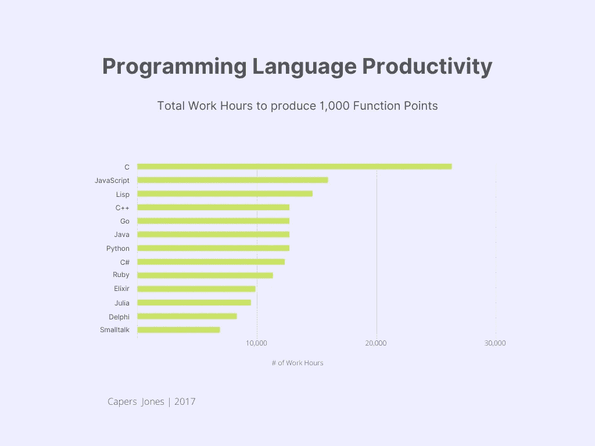
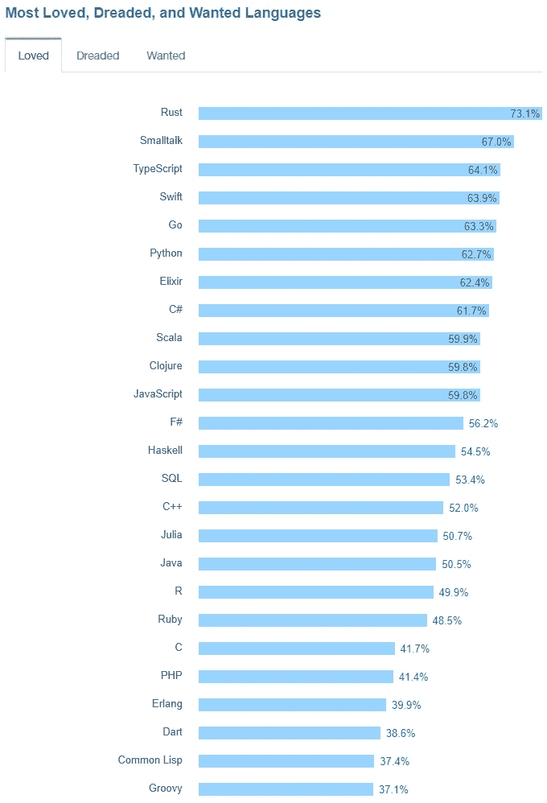

# mm XXII—small talk 的全年庆典

> 原文：<https://itnext.io/mmxxii-year-long-celebrations-for-smalltalk-e56bf8d6733b?source=collection_archive---------3----------------------->

2022 年是 Smalltalk 编程语言诞生 50 周年。为此，Smalltalk 社区全年举办了几次庆祝活动…

2 月，我们举办了 [JRMPC 2022，50 周年纪念版](https://jrmpc2022.wordpress.com/)。

6 月，我们在加拿大多伦多举办了[夏令营 Smalltalk Supreme](https://campsmalltalksupreme.wordpress.com/) 。

九月，我们在加州山景城的计算机历史博物馆举办了 [Making Smalltalk](https://computerhistory.org/events/making-smalltalk/) 活动。(滚动到页面顶部。)

11 月，我们在阿根廷布宜诺斯艾利斯举行了由 FAST 主办的 [Smalltalks 2022](https://smalltalks2022.fast.org.ar/) 。

以下视频总结了这些事件:

*   [JRMPC 2022 颁奖典礼](https://youtu.be/fE1jMtDOcJQ)
*   [Smalltalk 复兴——small talk 50 年](https://www.youtube.com/@50yearsofsmalltalk)
*   [闲聊](https://computerhistory.org/blog/smalltalk-at-50/)
*   [Smalltalks 2022](https://www.youtube.com/hashtag/smalltalks2022) — [丹·英戈尔的主题演讲](https://youtu.be/LXSnPYN__-E)，[吉拉德·布拉查的主题演讲](https://youtu.be/Ih6CU8wJqJk)

这些都是精彩的庆祝活动。还有哪种编程语言因其悠久的历史和对 IT 行业的贡献而得到如此广泛的认可？

# 为什么闲聊？

Smalltalk 经久不衰有三个主要原因:

1.  语法的非凡和独特的简单和优雅。 Smalltalk 拥有全部六个保留字。它的完整语法可以总结在一张明信片上。一个人可以在 15 分钟内学会 Smalltalk 语言的全部，这是你用 Python 和 Go 等其他类似的受称赞的语言所做不到的。
2.  Smalltalk 的面向对象模型的纯度、一致性和可伸缩性。这些令人钦佩的品质就是为什么 Smalltalk 激发了许多其他面向对象语言的产生，例如 Objective-C、Ruby、Python、CLOS (Common Lisp Object System)和 Java。
3.  Smalltalk 的“实时编程”功能带来了巨大的生产力。在高度简化的图形环境中进行实时编程，鼓励游戏性，这是 Smalltalkers 编写应用程序的原因，其时间只需当今最流行的语言(Python、Java、C++、C#、JavaScript)的一小部分。

最后一点非常重要，因为当今 IT 行业面临的主要挑战之一是生产软件的时间和金钱成本。劳动力成本中的时间和金钱，以及“上市时间”(尽快将产品推向市场)中的时间。

企业多长时间会为满足关键期限而苦苦挣扎？初创公司的资金有多少是在劳动力成本上消耗掉的？我在为 ATI Technologies(现在的 AMD)以及多伦多地区的各种初创公司工作时遇到过这两个问题。

2017 年，Capers Jones 在[发表了一项研究](http://www.ifpug.org/wp-content/uploads/2017/04/IYSM.-Thirty-years-of-IFPUG.-Software-Economics-and-Function-Point-Metrics-Capers-Jones.pdf)，该研究比较了各种编程语言的生产率。这里有一个展示一些语言的图表:

Smalltalk 比任何最流行的语言都要高效得多。

Smalltalk 的面向对象模型是我想引起您注意的另一件事。它非常纯粹和简单，它基于对象作为“软件服务器”的概念，通过在“软件互联网”上传递“消息”来相互通信。正是由于这个原因，Smalltalk 非常容易扩展。艾伦·凯是这样想的:

> *“互联网做得如此之好，以至于大多数人认为它是像太平洋一样的自然资源，而不是人造的东西。上一次如此大规模的技术如此准确无误是什么时候？”* ***艾伦·凯在接受《多布博士杂志》艾伦·宾斯托克的采访时***

Smalltalk 中的面向对象编程不同于 C++或 Java，它们将对象视为静态数据抽象。Smalltalk 编程是干净的，没有无关的概念，如友元函数、访问修饰符、接口、重载等。直播节目也增加了一个全新的层面。

实时编程意味着对象是无限反射的(它们的所有运行时属性都可以被查询)，代码和数据可以在运行中变化，并且编辑-编译-测试-调试循环实际上被消除了，从而提高了您的生产力。物体本质上是活的、会呼吸的实体。

# 信任投票

当 Stack Overflow 在 2017 年的投票中提供 Smalltalk 作为选择时，它被选为仅次于 Rust 的第二受欢迎的编程语言。

不知什么原因，Stack Overflow 随后不再提供 Smalltalk 作为选择，这是一个奇怪的省略。

# 领域多样性

Smalltalk 和任何主流编程语言一样通用。它可以用于 web 开发、数据科学、机器学习、机器人、物联网、移动开发、企业计算、工业控制、虚拟现实等等。它的生态系统提供了各种工具，如 Seaside web 框架、PolyMath 计算库、TensorFlow 绑定、PharoThings 平台和 Open Croquet VR 平台(其商业化版本是 [3DICC](https://www.3dicc.com/) 的基础)。

法国国防承包商 Thales 已经将 Pharo(一种开源 Smalltalk)广泛用于 VR 开发:

# 商业 vs 开源

Smalltalk 有商业版和开源版。如果你需要强大的商业支持，有三个主要的商业 small talk:Instantiations ' VAST，GemTalk Systems' GemStone/S，和 Cincom's VisualWorks。如果你喜欢开源，Pharo 是最好的选择，但你也可以利用其他更专业的 Smalltalk，如 Amber Smalltalk(用于 web 浏览器)、Squeak(主要用于教育)、Cuis Smalltalk(用于 Smalltalk-80 爱好者)、Dolphin Smalltalk(专用于 Windows)和 GNU Smalltalk(用于命令行爱好者)。

我个人推荐:[实例化‘浩瀚](https://www.instantiations.com/vast-platform/)和 [Pharo](https://pharo.org/) 。在我看来，这些是最积极创新的小型会谈。

Pharo 也有一个名为 [PharoJS](https://pharojs.org/) 的网页浏览器特殊版本，我相信它是前端网页开发的最佳选择，包括使用 [Apache Cordova](https://cordova.apache.org/) 框架的移动开发。

# 一般性建议

欣赏 Smalltalk 编程能力的唯一方法是使用 Smalltalk。再多的文献和视频也无法代替亲身体验。所以我强烈建议使用 Smalltalk 进行一个试点项目。尝试一下，并将结果与用 Python 或 Java 完成的其他类似项目进行比较。

只是为了好玩，我用 Smalltalk 在一个树莓 Pi 上玩，创建了一个物联网应用程序。我还使用 Seaside 和茶壶 web 框架为我的朋友创建了几个 web 服务器。我建议，至少，您可以将 Smalltalk 用于一两个业余项目。谁知道呢，这可能会让你看到一个充满机遇的全新世界。

重要的是要记住，二十年前，Python 是一种相对来说无足轻重的语言。但是在 2010 年前后，人们开始出于数据科学的目的使用这种语言，他们欣赏它的用户友好的品质。随着越来越多的人开始尝试，这个生态系统不断成长，Python 的受欢迎程度也随之迅速上升。

试试 Smalltalk。闪电*可以*击两次！你将获得极大的易用性、低认知负荷和*巨大的编程生产力*。