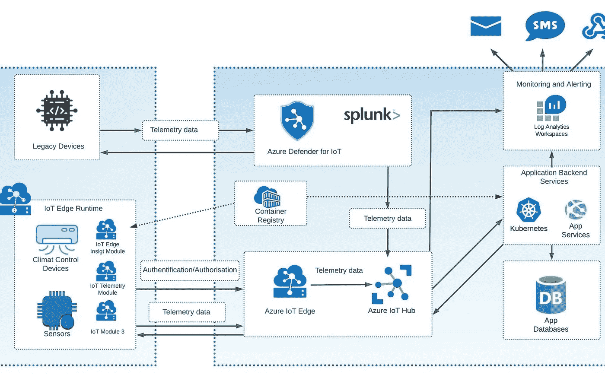
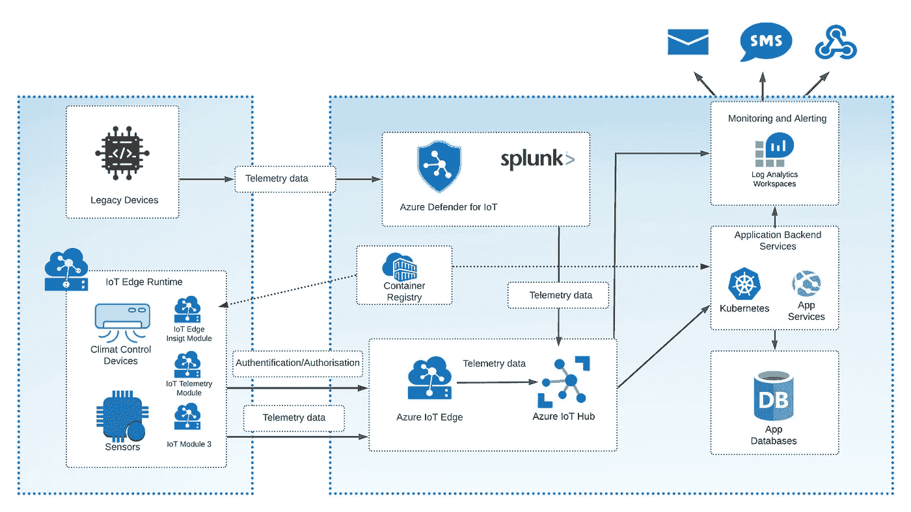
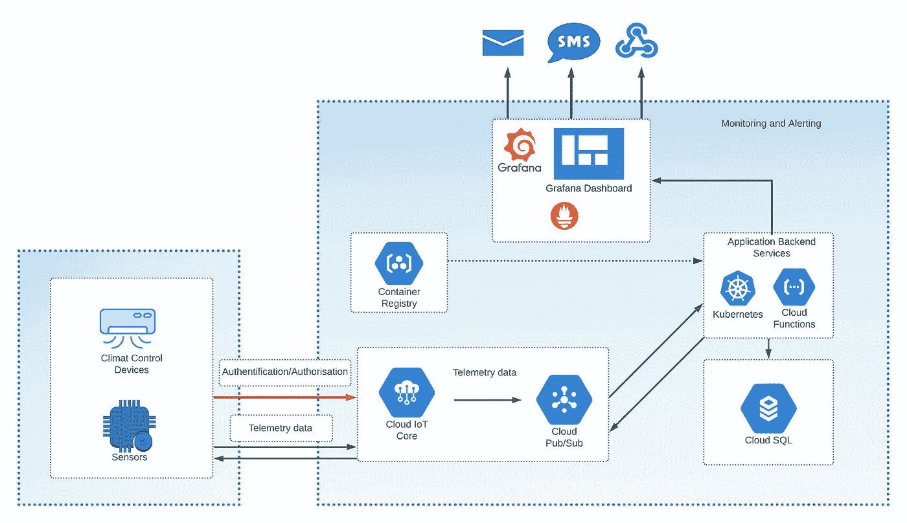
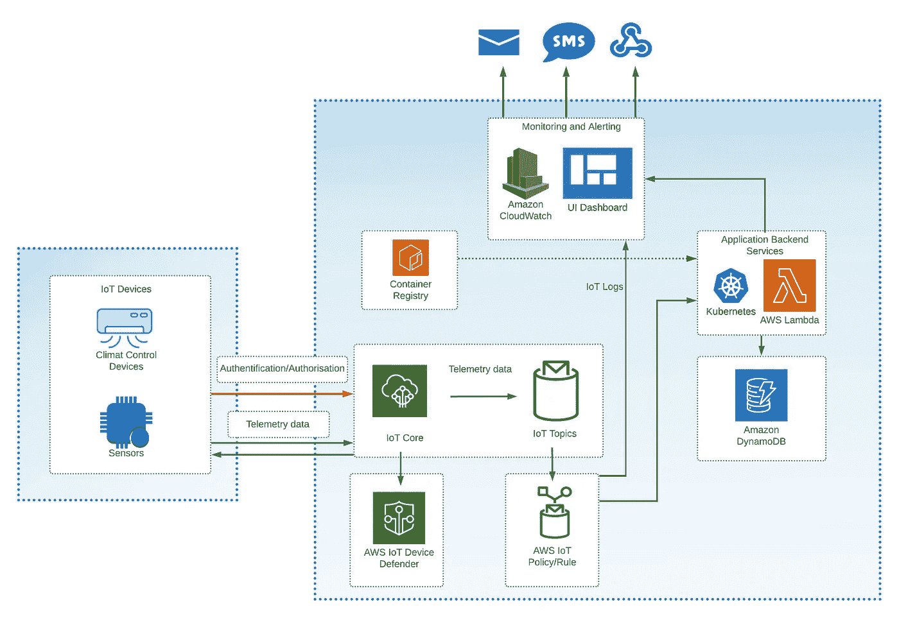

# 云中的移动和物联网安全策略

> 原文：<https://itnext.io/mobile-and-iot-security-strategies-in-the-cloud-58780145fcbb?source=collection_archive---------2----------------------->

## Azure、Google Cloud 和 AWS 中的安全措施和原则

*编者按:以下为 DZone 2021 年* [*应用安全趋势报告*](https://dzone.com/trendreports/application-security-1) *撰写并发表的文章。*

随着物联网(IoT)空间的不断扩大，“智能”产品越来越受欢迎。现在，您可以轻松购买和连接设备，如真空吸尘器机器人、门铃摄像头和智能锁。此外，您可以将所有这些设备组合在一个智能家居环境中。然而，一些产品团队没有考虑到安全风险。并且他们推迟将安全特性引入到产品中，直到发生安全攻击或数据泄露。

本文分为以下几个部分:

*   最突出的物联网攻击的四个例子
*   保护物联网应用和设备的关键原则和最佳实践
*   Azure、亚马逊网络服务(AWS)和谷歌云(GC)的物联网组件和安全解决方案示例

# 对您的物联网环境最常见的攻击

1.  **Trendnet 网络摄像头安全漏洞** —该公司[发布了没有安全保护的网络摄像头](https://www.technewsworld.com/story/webcam-maker-takes-ftcs-heat-for-internet-of-things-security-failure-78891.html)，任何人只要知道设备的 IP 地址就可以轻松访问摄像头。此外，该公司以清晰可读的文本存储用户登录凭证。
2.  **Jeep hack** —想象一下你开着车，突然失去控制，看到有人在远程驾驶你的车。一些工程师试图通过手机网络连接到一辆吉普，并利用这一漏洞更新汽车的固件。结果是完全控制了这辆车:黑客们设法减慢车速，把车开出了马路。
3.  **智能电视** —许多智能电视没有任何认证选项。例如，我错误地点击了出现在我智能手机设备列表中的另一台电视，开始将 YouTube 发送到我邻居的设备上。另一个例子是，黑客可以使用电视的麦克风和摄像头来观察设备所有者正在做什么。
4.  **智能手机** —黑客可以通过在手机上运行漏洞来窃取敏感数据。在一个这样的案例中，用户在智能手机上输入了一些东西，这产生了声波，恶意软件记录下来，转换成符号，并通过互联网发送。

# 物联网安全原则和最佳实践

现在我们已经了解了物联网中普遍存在的几个安全问题，让我们深入探讨四个关键的安全原则和解决方案。

# 观看您的物联网设备

您应该持续监控您的物联网设备和基础设施。设备监控可能是一个问题，尤其是对于企业公司或工厂。例如，如果员工携带被恶意软件感染的 USB 驱动器，您可以使用以下安全措施来缓解这种情况:

*   使用防火墙和其他安全合规性配置网络。
*   使用覆盖组织中所有物联网设备的中央安全监控。
*   为用户提供的外部设备添加特定的工作站。
*   监控传统设备-例如，连接到中央网络的旧会议智能电视设备可能是整个组织的不安全后门。

# 使用 JSON Web 令牌认证

使用 JSON Web 令牌(JWT)和最新的基于签名的标准——例如， [JWT ES256](https://datatracker.ietf.org/doc/html/rfc7518#section-3.4) 和 [JWT RS256](https://tools.ietf.org/html/rfc7518#section-3.4) 。jwt 提供了一种基于 OAuth 和 OpenID 协议的最安全的身份验证方式。以下是 jwt 为物联网工作的方式:

*   设备应该为验证数据并生成 JWT 的验证服务提供验证数据(用户、密码、SSL 证书、唯一设备 ID)。
*   设备使用这个 JWT 来访问云服务和 API。每次设备尝试访问云 API 或服务之前，云身份服务都会检查令牌。

# 集成安全方法

生产物联网设备的公司应该专注于在生产阶段将安全集成到设备控制器中，因为在生产后将安全功能集成到物联网设备固件中极具挑战性，或者在某些情况下几乎不可能。保护完整的设备也可能导致额外的费用。通常，您需要设置额外的安全基础设施，或者您必须将所有设备送回以更新固件，这总是意味着额外的时间和金钱。因此，消费者选择已经安装了安全软件的设备。

# 到处使用 TLS 或 LWC

物联网设备制造商应该考虑强化他们的设备，以使用传输层安全(TLS)或轻量级加密(LWC)。物联网设备应该在服务器端检查证书，如果证书被破坏，就将其撤销。接下来，我将重点介绍在组织在云中拥有物联网基础设施或希望将其迁移到云中的情况下使用这些原则。

> *这是摘自 DZone 的《2021 年应用安全趋势报告》。*
> 
> *更多:*
> 
> [*阅读报告*](https://dzone.com/trendreports/application-security-1)

# 在 Azure 中构建安全的物联网架构

在这一节中，我描述了构建安全物联网架构的最突出的 Azure 资源，并附有一个物联网架构示例。

# Azure 物联网中心

[Azure IoT Hub](https://azure.microsoft.com/en-us/services/iot-hub/#overview) 是一种资源服务，允许您的解决方案与物联网设备进行通信，它是一种具有物联网功能的服务总线，就像设备和应用程序后端服务之间的中间件。Azure 物联网中心具有以下功能:

*   注册和存储设备数据
*   支持设备遥测、数据洞察和监控
*   支持设备到云通信、请求-回复和从服务通信选项上传文件
*   基于 [X.509 证书](https://docs.microsoft.com/en-us/azure/iot-hub/tutorial-x509-certificates)和 [SAS 令牌](https://docs.microsoft.com/en-us/azure/storage/common/storage-sas-overview)保护连接

# 物联网边缘

[Azure IoT Edge](https://docs.microsoft.com/en-us/azure/iot-edge) 是一个基于边缘计算原理的平台。物联网边缘允许物联网设备以离线模式运行，与 Azure 物联网中心集成，并具有在物联网设备中运行的模块。每个模块都是一个 Docker 容器，可以是自定义代码，也可以是基于 Azure 服务的代码。例如，代码收集日志和遥测数据或管理设备与 Azure 云(Azure IoT Hub)之间的连接。物联网边缘包含也安装在设备上并协调模块的运行时。

Azure 物联网边缘安全功能包括:

*   **支持机密计算** —应用程序或模块在传输中和静态时都经过加密。
*   **基于 TLS 的加密证书** —物联网边缘设备在模块、运行时和云之间使用这些证书。
*   **额外的安全层** —安全管理器这一层不仅保护模块和运行时软件，还保护设备的硬件层。

# 面向物联网的 Azure Defender

[Azure Defender for IoT](https://docs.microsoft.com/en-us/azure/defender-for-iot/organizations/overview) 是一个安全选项，允许您识别物联网设备和物联网后端基础设施中的安全漏洞和威胁。它的一个显著优势是支持无代理设置，这适用于不支持代理设置的传统设备。让我们看一个使用所有这些组件的物联网架构的示例。

# 使用 Azure 物联网解决方案的架构示例

下图 1 所示的架构解决方案是一个用于仓库的智能气候控制系统。气候控制应该根据季节保持不同的温度、湿度和空气质量——该架构基于真实的客户使用案例。

**图 1**

本例中仓库气候控制系统的物联网设备基础设施包含:空气温度、湿度和空气质量传感器；气候控制设备；和不支持代理设置的旧设备。黑客可以利用遗留设备作为整个系统的后门。因此，我们将这些设备的所有数据发送到 Azure Defender for IoT，以检查潜在的漏洞。此外，Azure Defender 允许您通过使用 Splunk 等工具来加强设备基础架构的安全性。Splunk 集成是 Azure Defender for IoT 服务的一部分。其他设备通过 Azure IoT Edge 运行时直接在设备中和云中运行。

发生的其他过程:

*   Azure IoT Hub 存储设备数据，应用后端服务处理数据并根据传感器遥测数据管理气候控制系统。
*   后端服务部署到 Azure Kubernetes 服务和 App 服务。
*   Azure Log Analytics 构建了一个监控和警报子系统，当一些安全事件发生时，运营商可以对其做出反应。因此，当设备出现安全问题或没有响应时，日志分析会在仪表板中显示此类事件，并发送电子邮件、SMS 和 webhook 等警报通知。

让我们看看如何在 Google Cloud 中构建同样的安全架构。

# 在谷歌云中构建安全的物联网架构

为了构建物联网架构，谷歌云(GC)为我们提供了物联网核心，这是一种完全托管的物联网服务，提供以下功能:

*   设备注册
*   设备遥测汇总和分析
*   集成发布/订阅
*   设备连接管理
*   简化与其他数据监控和处理服务的集成，实现更精细的数据分析

物联网核心还提供强大的安全功能:

*   具有有限过期时间的 JSON 公共和私有 web 令牌
*   TLS 1.2 证书
*   [RSA 加密](https://simple.wikipedia.org/wiki/RSA_algorithm)
*   支持 [GC 身份和访问管理](https://cloud.google.com/iam) (IAM)来管理 API 访问

让我们看看同样的架构在 Google Cloud 中是怎样的。

# 使用 GC 物联网核心的架构示例

在这个例子中，我将保留相同的用例——仓库的智能气候控制系统。

**图 2**

图 2 中的安全工作流包含一个身份验证步骤。初始身份验证过程包括生成公钥和私钥。在物联网核心服务中注册设备是主要要求。该过程涉及两个组件:供应器和设备管理器。

使用 IAM，被分配了带有`cloudiot.provisioner`的置备者角色的用户有权管理设备，但不能修改或删除注册表。设备管理器是物联网核心的一个组件，允许您注册设备并验证设备身份。设备管理器存储公钥，而设备本身存储私钥。认证的第二阶段是 JWT 生成。该设备生成令牌并使用私钥对其进行签名，然后将令牌发送到 [MQTT 桥](https://cloud.google.com/iot/docs/concepts/protocols)，该桥是物联网核心的一个组件，用于验证 JWT 并建立连接。

该解决方案还包含使用[普罗米修斯日志提供商](https://cloud.google.com/community/tutorials/cloud-iot-prometheus-monitoring)和 Grafana 仪表板的监控。但如果设备可以使用证书和 JWT 令牌，物联网核心可以接受它。

# 在 AWS 中构建安全的物联网架构

[AWS 物联网核心](https://docs.aws.amazon.com/iot/latest/developerguide/what-is-aws-iot.html)和我上面描述的 Google Cloud 里的服务差不多。它包括以下安全功能:

*   TLS 加密连接(在 GC 物联网核心中相同)
*   基于[事物策略变量](https://docs.aws.amazon.com/iot/latest/developerguide/thing-policy-variables.html)的细粒度设备权限

除了 IoT Core 提供的所有安全选项，您还可以使用 [AWS IoT Device Defender](https://docs.aws.amazon.com/iot/latest/developerguide/device-defender.html) —一种分析设备日志和数据以发现潜在安全问题的服务。这类似于 Azure Defender for IoT，在 Azure 部分有介绍。

# 使用 AWS 物联网核心的架构示例

下面，你可以看到一个类似于上面提到的 GC 架构的 AWS 架构的例子。除了物联网政策，一切看起来都一样。物联网政策按不同主题过滤数据。因为它可以是类别或设备 ID，所以您的后端服务可以监听特定的主题来收集数据。AWS IoT defender 在这里是可选的，用作额外的安全加固。

**图 3**

# 结论

在本文中，我提供了安全物联网解决方案的案例、安全物联网架构的一般原则，以及基于 Azure services、Google Cloud 和 AWS 的安全物联网架构的示例工作流。

**Boris Zaikin，Nordcloud GmbH 的高级软件和云架构师**
[@borisza](https://dzone.com/users/3123245/borisza.html) 在 DZone 上| [@boris-zaikin](https://www.linkedin.com/in/boris-zaikin/) 在 LinkedIn 上| [@boriszn](https://github.com/Boriszn) 在 GitHub 上

*最初发表于*[*https://dzone.com*](https://dzone.com/articles/mobile-and-iot-security-strategies-in-the-cloud)*。*