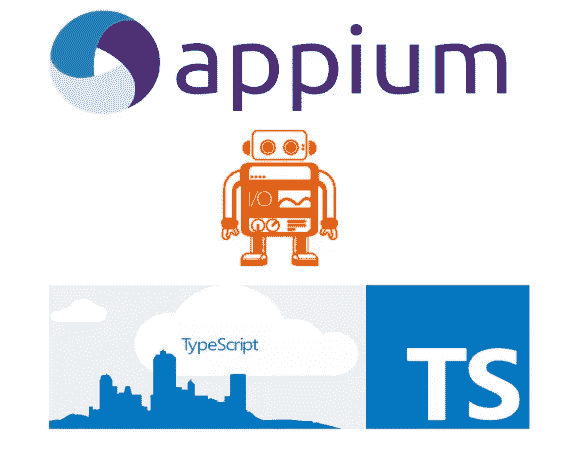
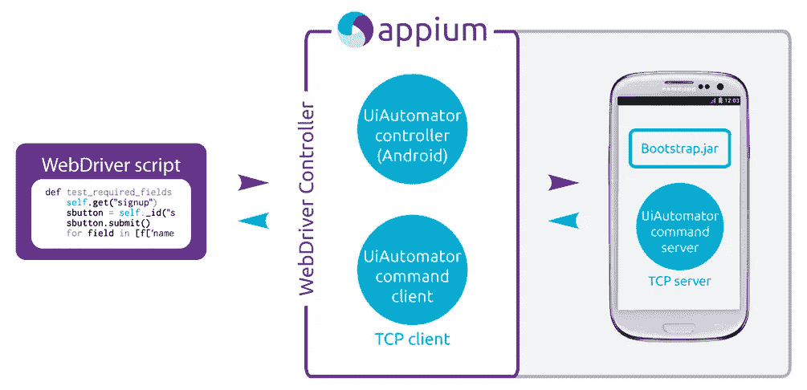
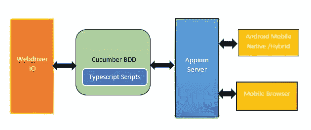
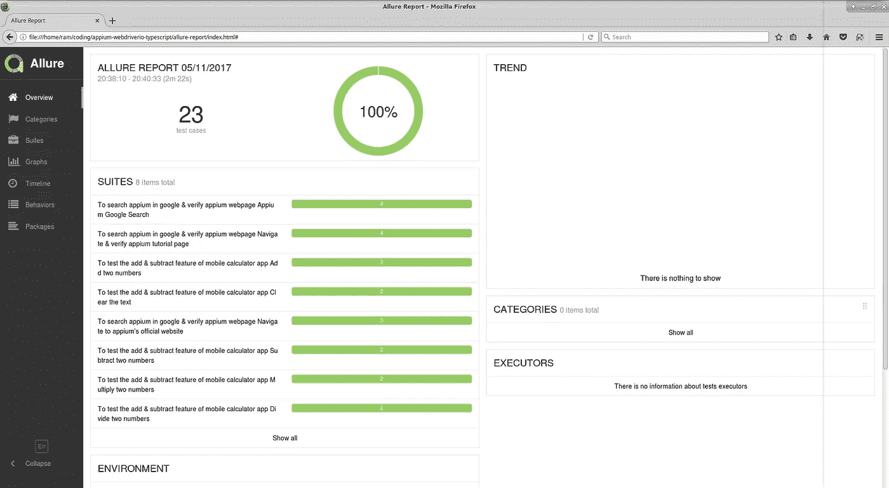
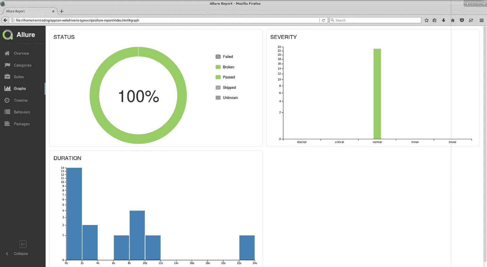

# 使用 Typescript 实现移动自动化！

> 原文：<https://itnext.io/mobile-automation-with-appium-webdriverio-using-typescript-bbb7e982b6ea?source=collection_archive---------1----------------------->



最近，随着新的自动化框架、工具和实用程序的出现，移动测试自动化变得如此有趣，这使得我们的生活更加容易自动化我们最喜爱的移动应用程序和浏览器。

本文的重点和目的是讨论并分析集成了多种移动自动化技术的框架设置，这将有助于我们以一种干净快捷的方式自动化移动应用和浏览器。

但首先让我们坐下来，试着理解驱动我们的[**app ium-web driver io-typescript**](https://github.com/igniteram/appium-webdriverio-typescript)框架的关键技术…

# Appium

当谈到移动测试时，这个开源节点服务器是最流行的，也是目前最难超越的。它驱动跨各种平台的测试脚本，并具有多种语言 API 绑定。

> Appium 只不过是一个建立在节点上的 HTTP 服务器，它创建并处理 webdriver 会话。它使用 WebDriver 协议驱动 iOS、Android 和 Windows 应用程序

**那么它是如何工作的呢？**



Appium 的官方设计实现

WebDriver 脚本将创建一个 HTTP JSON 请求发送到 Appium 服务器，然后该命令会发送到 TCP 服务器并等待来自引导程序的结果，此时它知道您的脚本属于哪个平台(Android、IOS 或 Windows ),然后处理该请求并将其发送回来。

谷歌的 [**UiAutomator**](https://developer.android.com/topic/libraries/testing-support-library/index.html#UIAutomator) 控制器帮助转换 webdriver 命令来驱动原生 Android 设备应用。同样适用于苹果的 [**XCUITest**](https://developer.apple.com/documentation/xctest) 和 Window 的 [**WinAppDriver**](https://github.com/microsoft/winappdriver) 。

请通过官方**A**[**ppium**](https://appium.io/)网站深入了解它的设计和理念。

# WebdriverIO

它是 W3C WebDriver 协议的 Node.js 绑定实现。


Selenium Webdriver 有许多 API 绑定实现，WebdriverIO 充分利用了 node.js，使我们能够用简单的 Javascript 编写自动化测试。它封装了 webdriver 命令，这些命令基本上按照 [**webdriver 协议**](https://www.w3.org/TR/webdriver/) **发送/接收来自 selenium 服务器的请求/响应。**

> **为什么要用 web drivero 而不是传统的 Selenium Webdriver(Java 实现)？**

坦白地说，我觉得这是在构建你的自动化框架时要做的决定，这应该是你的**可行性分析**的一部分。我个人认为，凭借 node.js 在后端的强大功能，我们的自动化测试也应该使用与 AUT 相同的语言，AUT 也是建立在(即前端)Javascript 技术之上的。

原因简单明了，从同步编程切换到异步编程的能力深受 javascript 世界的鼓励，这对编写稳定的自动化测试非常有益。

自动化场景时(点击链接，在文本框中输入文本等。)我们基本上是向 webdriver 服务器发送 HTTP 命令，这些命令本质上是异步的，现在想象一下必须上传和下载数据/文件的场景。在 node.js 中编写代码有助于我们以更快、更节省内存的方式实现上述目标。

人们可能会争论使用各种面向对象编程语言提供的**线程**，因为它们对多线程有很好的支持。我会把它留在那里(我觉得我还没有达到比较多种编程语言的阶段)，说我们的目标应该是编写高效的&非片状自动化测试，随着 Javascript & Node.js 的日益流行，为什么不试一试，相信我，它完全值得每一分钱。

# Typescript:可伸缩的 JavaScript！


我在以前的文章中讨论过这个 Javascript trans piler——[**用量角器测试 E2E，用 TypeScript 测试黄瓜！**](https://medium.com/@igniteram/e2e-testing-with-protractor-cucumber-using-typescript-564575814e4a)

使用 typescript，您可以同时获得面向对象和函数式编程范例的好处。它给你的 JavaScript 代码增加了可选的静态类型，也就是说，现在变量和方法可以在编译/转换时被识别，就像 oops 语言的任何编译器一样。你认为 JavaScript 只是一种解释性语言。

看看这篇很酷的文章 [**你为什么不使用 TypeScript？**](http://jonathancreamer.com/why-would-you-not-use-typescript/) 作者乔纳森·克里默。

随着越来越多的 JavaScript 开发人员和框架作者利用 TypeScript 提供的优秀工具和生产力提升来创建可扩展的应用程序，TypeScript 继续其发展之旅。

# Appium-WebdriverIO-Typescript 框架



我已经用 Android 原生应用和浏览器的配置设置实现了这个框架(我还没有 mac😉).iOS 配置设置略有不同，出于本文的目的，我们将详细讨论 android 平台测试。

# GitHub 回购:

[](https://github.com/igniteram/appium-webdriverio-typescript) [## igniteram/appium-web driver io-typescript

### 使用 webdriverio & typescript，使用 appium 自动化移动应用程序的测试框架！…

github.com](https://github.com/igniteram/appium-webdriverio-typescript) 

## 先决条件

*   系统中全局安装的节点。[https://nodejs.org/en/download/](https://nodejs.org/en/download/)
*   JAVA(jdk)安装在系统中。
*   Andriod(sdk)安装在系统中。
*   在系统中正确设置 JAVA_HOME 和 ANDROID_HOME 路径。
*   安装了 Chrome 浏览器
*   安装了文本编辑器/IDE(可选)→Sublime/Visual Studio 代码/括号。

## 装置

*   将存储库[**appium-web driver io-typescript**](https://github.com/igniteram/appium-webdriverio-typescript)克隆到一个文件夹中
*   进入文件夹，从终端/命令提示符运行以下命令

```
npm install
```

*   来自 package.json 和 typescript typings 的所有依赖项都将安装在 node_modules 文件夹中。

提示:使用 [Yarn](https://yarnpkg.com/en/docs/installing-dependencies) 来安装你的模块`npm install -g yarn`，因为它会缓存&锁定它们，这将帮助我们跨各种平台安装正确版本的模块，而不会出现任何问题。该项目配置有`yarn.lock`文件。所以你可以利用它。

# 运行测试

*   第一步是启动`appium`服务器，这个项目包括 appium 节点模块，所以你不必从外部下载。您可以通过以下 npm 命令运行 appium 服务器。

```
npm run appium
```

*   接下来，您必须将您的类型脚本文件转换/编译为 javascript 文件，您可以通过运行以下命令来完成此操作

```
npm run build
```

下一步是执行配置文件。这个项目有 2 个配置文件-

*   [wdio.app.config.js](https://github.com/igniteram/appium-webdriverio-typescript/blob/master/config/wdio.app.config.js) —该配置文件用于在真实的移动原生应用中运行测试。您必须更改`appium settings`才能在您的设备上运行测试。

```
capabilities: [
{
    appiumVersion: '1.7.1',                             // Appium module version
    browserName: '',                                   // browser name is empty for native apps
    platformName: 'Android',
    app: './app/LGCalculator.apk',                     // Path to the native app
    appPackage: 'com.android.calculator2',             // Package name of the app
    appActivity: 'com.android.calculator2.Calculator', // App activity of the app
    platformVersion: '5.1.1',                         // Android platform version of the device
    deviceName: 'THF755e0384',                       // device name of the mobile device
    waitforTimeout: waitforTimeout,
    commandTimeout: commandTimeout,
    newCommandTimeout: 30 * 60000,
}
],
```

要知道你的设备名称，你可以运行 Android SDK 自带的`adb devices`命令。

运行该项目的本机应用程序测试的节点命令是-

```
npm run app-test
```

在`package.json`中设置的上述命令在内部调用 WebdriverIO 的二进制文件`wdio ./config/wdio.app.config.js`并运行 app 配置文件。

*   [wdio.browser.config.js](https://github.com/igniteram/appium-webdriverio-typescript/blob/master/config/wdio.browser.config.js) —该配置文件用于在已配置的移动设备的 chrome 浏览器中运行测试。appium 设置看起来像这样-

```
capabilities: [
{
    appiumVersion: '1.7.1',
    browserName: 'chrome',  // browser name should be specified
    platformName: 'Android',
    platformVersion: '5.1.1',
    deviceName: 'THF755e0384', // device name is mandatory
    waitforTimeout: waitforTimeout,
    commandTimeout: commandTimeout,
    newCommandTimeout: 30 * 60000,
}
],
```

运行该项目的浏览器测试的节点命令是-

```
npm run browser-test
```

上面的命令在内部调用 WebdriverIO 的二进制文件`wdio ./config/wdio.browser.config.js`，并运行浏览器配置文件。

# 运行测试套件

您可以通过运行以下命令来运行本机应用程序和浏览器测试-

```
npm test
```

上述命令内部调用`npm run app-test`和`npm run browser-test`。

# 写作测试

Cucumber 框架已经与 thi 项目集成，WebdriverIO 的`wdio-cucumber-framework`适配器帮助编写具有特性&步骤定义的 BDD 风格测试。

```
const {Given, When, Then} = require('cucumber');
import {expect} from 'chai';
import {CalculatorPageObject} from '../pages/calcPage';const calc: CalculatorPageObject = new CalculatorPageObject();Given(/^I am on my mobile calculator app$/, () => {
    const title = browser.getText('android.widget.TextView');
    expect(title).to.equal('Calculator');
});
```

# 页面对象

该框架严格使用页面对象设计模式编写。

```
class GooglePageObject {
    public get searchTextBox(): any { return browser.element('#lst-ib'); }
    public get searchButton(): any { return browser.element('button[name="btnG"]'); }
    public get results(): any { return browser.waitForVisible('#rso', 5000); }
    public get firstLink(): any { return browser.element('#rso div._H1m._ees'); }
}
/*
Public Interface - export instances of classes
**/
export const GooglePage = new GooglePageObject()
```

# 寻找元素

在移动应用和浏览器中寻找元素有时会很棘手。

*   在原生移动应用中查找元素的最佳方式是使用 [UIAutomatorViewer](https://developer.android.com/training/testing/ui-automator.html) 。这仅支持 Android 4.3 及以上版本，如果您使用的是低于该版本的 Android，您可以使用 [Selendriod](http://selendroid.io/)
*   在移动浏览器中查找元素的最佳方式是使用 Chrome DevTools 进行*远程调试。我个人觉得这容易多了。你可以在这个博客中找到详细的步骤*

# 报告

目前该项目已经与 [Allure-Reports](http://allure.qatools.ru/) 整合。WebdriverIO 的`wdio-allure-reporter`帮助我们生成移动自动化测试的详细报告。一旦测试执行完成，您会发现自动生成的 allure-results 文件夹。然后，您必须运行以下命令来生成 HTML 报告

```
npm run report
```

**警告:** Chrome 浏览器在呈现 allure 生成的本地文件中的 AJAX 请求时存在问题，您可以使用 Firefox 查看 html 报告。你可以在这里找到更多关于这个问题的细节



# 结论:

得益于 appium、webdriver 等各种技术，移动自动化从未如此有趣和令人兴奋。它正在发展并鼓励测试人员开始自动化。他们的开源社区非常有用和可靠，你不需要参加任何课程或辅导。就在你面前！

BTW Appium 今年正在组织它的第一次 **Appium 会议**，看到这个项目成长和发展到如此程度，它已经成为移动自动化的基础，这是非常令人惊讶的。向 Appium 核心团队成员致敬。

[](https://appiumconf.com/) [## 2018 年应用会议

### 官方的 Appium 会议

appiumconf.com](https://appiumconf.com/) 

喜欢读这篇文章吗？请点击下面的 ***按钮*** *，这样就可以传到媒体上的人了。*

*想更多地了解我和我的工作吗？查看我的*[*about . me*](https://about.me/ram.pasala)*页面。*