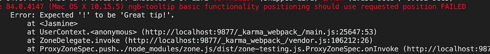

# 帮助您开发和练习单元测试相关技能的成熟实践

> 原文：<https://itnext.io/mobiquitys-proven-practices-to-help-you-develop-and-exercise-unit-test-related-skills-c9134fac35e1?source=collection_archive---------3----------------------->

在 Mobiquity，我们非常欣赏我们的工程文化。我们一起快乐，一起成长。我们的文化组成部分之一是通过自动化测试实现的质量。实践自动化测试帮助我们发展技能并获得知识，我们现在想与地球上的所有居民分享这些知识。

# TimeDivisionDuplex 时分双工

在我们上次的公司会议上，我们很荣幸请到了鲍勃叔叔作为嘉宾。我们的一位同事问他:“为了能够应对我们不确定的未来，你认为应该采取什么做法或改变什么心态？”答案是 TDD。

在移动城市，我们热爱 TDD。在所有其他好处中，TDD 突出了代码复制。有时，人们很想走捷径，复制粘贴代码。当您意识到您还需要复制粘贴测试时，您会有一种非常讨厌的感觉。这促使您消除重复，并从质量代码中感受到满足感。

许多有经验的开发人员已经尝试了几次 TDD，但他们仍然不经常这样做。这可能有很多原因:旧习惯、缺乏知识甚至时间限制。即使时间限制取消了，你仍然会对更快地完成任务感到焦虑。这只是一个驱使你远离 TDD 的旧习惯。

虽然缺乏知识是一种简单的解决办法，但旧习惯可能是一头野兽。Mobiquity 帮助开发者打败了这个怪物！在你的周围，你听到人们实践和赞美 TDD。这种类型的环境建立了对 TDD 的积极态度。如果你需要的话，项目管理可以确保你有时间处理学习曲线。当你们两人一组工作时，你可能会和一个 TDD 大师坐在一起，这将帮助你赢得这个战场。如果你为 Mobiquity 工作，你会做 TDD，这一点毋庸置疑。

所以，如果你最终准备好再给 TDD 一次机会，我们有一个内置的算法来帮助你练习。

# 移动性 TDD 算法

## 了解如何达到期望的结果

为如何实现功能制定一个清晰的路线图。有时我们并不完全了解我们所使用的环境。当你没有足够的项目、框架或库的知识时，实践 TDD 是非常具有挑战性的。这是一个研究适合你的任务的已被证明的实践、众所周知的方法和框架能力的绝佳时机。来自 TDD 的最大失望之一发生在当你意识到你写的代码不适合项目，你需要把它和你为它做的测试一起删除。花时间建立一个合适的路线图很可能会让你免于失望。你可以考虑写评论，伪代码或者只是在脑子里想象一个解决方案。

## 编写失败的测试

只有在你有路线图的情况下才这么做。在您掌握 TDD 的学习过程中，最好只编写一个小测试。我知道这感觉很慢，但是它会帮助你改变你的思维模式，习惯测试优先的方法。

一旦你对 TDD 感到满意，在编写代码之前写一些小的失败测试是可以接受的。

## 编写代码使测试工作

只有当支持此代码的测试失败时，才允许您编写代码。这里有一个隐藏的挑战。当您回到编写代码的熟悉方法时，您可能会尝试编写比现有测试覆盖的更多的代码。将自己停在那里(或者如果您是结对编程会话中的导航者，则停止驱动程序)。别说了。只编写代码来支持失败的测试并停止。停下来。

## 写下一个测试或者做一个研究

当你准备好写下一个测试的时候，就该进行下一步了。现在，是时候动手了！有时，库的行为可能与您期望的或文档提供给您的有所不同。或者你可以想出一个如何优化代码的主意。在这种情况下，只要回到第一步，做研究，以便你继续下去。

## 当我们不做 TDD 的时候

除了致力于社交的周五晚上，我们有一个理由分散我们对 TDD 的注意力。TDD 是高质量的关键。任何生产软件都需要它。另一方面，有时候你需要做 PoC 或者 MVP。这类项目并不总是进入生产阶段，所需的质量标准也很低。虽然时间是关键，但是跳过 TDD，只为这类项目做一个快速而不可靠的原型是非常有意义的。

# AAA —安排-行动-断言

Arrange-Act-Assert 或 3a 约定几乎成了整个行业的标准。你可能也听说过“给定时间”惯例。本质上是一样的，只是用词不同。这种约定有助于您使测试更容易阅读，维护成本更低。AAA 惯例建议将测试分为三个部分。每个部门都有一个职责。该部分的名称清楚地描述了它的目标。

**排列**部分仅包含测试的设置。在本节中，创建了对象，模拟和间谍(如果你使用了的话)。然后是**动作**，这是正在测试的方法的调用，可能等待它完成所有触发的异步操作。**断言**是简单地检查期望是否被满足。

让**安排**和/或**断言几个测试之间共享的**部分是完全正常的。

# 原子测试

我想每个人都有这样的经历——在艰苦的测试准备和调用测试下的方法之后，你终于有了一个工作测试。现在是时候用同样的准备做下一个测试，检查应该发生的第二件事。使用捷径并在现有测试中增加一个断言是如此诱人。

我们来考虑一下这个测试方法。

您在这里可以清楚地看到 3 个断言 jasmine 的“expect”方法的 3 次调用。假设测试失败，并显示消息“Expected '！”成为“伟大的提示！”".

我的第一个问题是“文本比较和工具提示位置有什么关系？”不研究测试和组件代码就不可能理解问题。这是将几个断言放入一个测试中的一个大问题——很难想出一个合适的测试描述，以便测试标题可以帮助你马上发现问题。我们使用经验法则——每个测试一个断言。通过对测试进行分组，并在 beforeEach 中使用常见的 Arrange 和 Act 部分，可以很容易地重构上面的代码。

# 测试最终结果

关于测试什么和不测试什么的决定有一定程度的艺术在里面。有时界线并不清楚。可重用库比宠物项目需要更多的覆盖面。

我们发现，只测试被测试对象的最终结果的实践，是一种被证明的容易支持测试的方法。

假设我们有一个显示警告的方法。该方法接受参数，操作它并在警报中显示一些文本。

测试警报呼叫是显而易见的。您可能想测试一下“Utils.getAlertText”方法是否被执行了。稍后，下一个开发人员可能会意识到“Utils.getAlertText”的逻辑永远无法重用，因为它非常简单。明智的做法是将其内联，而不是放入实用程序中。内联意味着中断测试并检查“Utils.getAlertText”调用。虽然应用程序完全一样，但测试失败了。只测试最终结果的实践可以帮助您避免这样的问题。

# 结论

我希望这些经过验证的实践能够激励您投入时间来开发和练习单元测试相关的技能。它会以一种良好的声誉的方式回报你，给你带来满意的客户，以及更多的时间去创造而不是维护

不要害怕写测试。从今天开始！并开始改变你对 TDD 的心态。享受编码吧！

***
*原载于*[*https://www . mobiquity . com/insights/mobiquitys-proven-practices-to-help-you-develop-and-exercise-unit-test-related-skills*](https://www.mobiquity.com/insights/mobiquitys-proven-practices-to-help-you-develop-and-exercise-unit-test-related-skills)