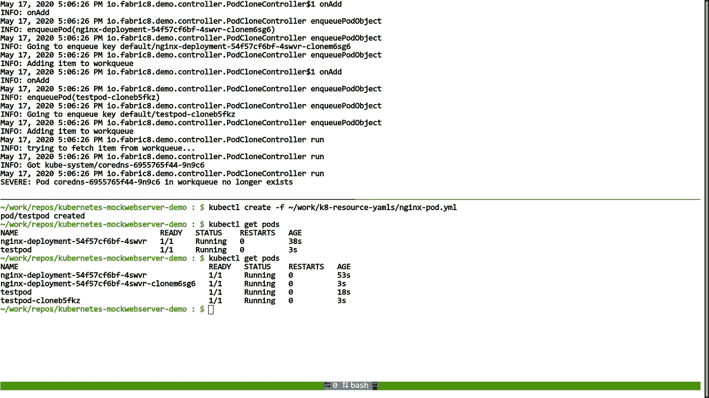

# 使用 Fabric8 Kubernetes 模拟服务器在 Java 中模拟 Kubernetes API 服务器

> 原文：<https://itnext.io/mock-kubernetes-api-server-in-java-using-fabric8-kubernetes-mock-server-81a75cf6c47c?source=collection_archive---------1----------------------->

在处理编写 Kubernetes 操作符时，我们经常需要为操纵 Kubernetes APIs 并希望验证 Kubernetes 控制器的行为的场景编写测试。每次在 Kubernetes 集群上运行您的测试都是非常乏味和耗费资源的。 [Fabric8 Kubernetes Client](https://github.com/fabric8io/kubernetes-client) 为我们提供了一个扩展，您可以用它来模仿 Kubernetes API 服务器并完成您的工作。在这篇博客中，我将向你概述使用 [Fabric8 Kubernetes 模拟服务器](https://github.com/fabric8io/kubernetes-client/tree/master/kubernetes-server-mock)为你的 Kubernetes 控制器模拟和编写测试。这是一个基于[fabric 8 Kubernetes Client](https://github.com/fabric8io/kubernetes-client)和[fabric 8 mock web server](https://github.com/fabric8io/mockwebserver)(ok http 的 mockwebserver 的扩展)的库，为我们提供了平滑的模拟操作 dsl。


Fabric8 Kubenetes Java 库

[](https://github.com/fabric8io/kubernetes-client) [## fabric 8 io/kubernetes-客户端

### 这个客户端通过一个流畅的 DSL 提供对完整的 Kubernetes 和 OpenShift REST APIs 的访问。

github.com](https://github.com/fabric8io/kubernetes-client) 

## 在项目中安装 Fabric8 Kubernetes 模拟服务器:

您可以将 Fabric8 Kubernetes 模拟服务器作为依赖项添加到您的项目中:

```
<**dependency**>
    <**groupId**>io.fabric8</**groupId**>
    <**artifactId**>kubernetes-server-mock</**artifactId**>
    <**version**>${kubernetes-server-mock.version}</**version**>
</**dependency**>
```

一旦作为依赖项添加，您就可以开始在测试中使用 Kubernetes mockwebserver 了。下面是如何初始化 Kubernetes mockserver:

正在初始化 Kubernetes 模拟 web 服务器

它有两个选项:第一个是检查`Https`是否应该启用，第二个是`CRUD`模式是否应该启用。默认情况下，它用`https=true`和`crudMode=false`初始化，就像上面的场景一样。

现在我们已经初始化了`KubernetesServer`，让我们开始模拟一个简单的场景，列出所有名称空间中的所有`Pod`对象。这就是使用 Fabric8 Kubernetes Mockserver 实现这一目标的方法:

嘲讽列表窗格中的所有名称空间，**参见** [**Github**](https://github.com/r0haaaan/kubernetes-mockserver-demo/blob/master/src/test/java/io/fabric8/demo/kubernetes/mockserver/PodMockTest.java#L24-L44) 中的代码

如果您想稍微改变一下，模拟 Kubernetes API 服务器调用来列出某个名称空间中的所有 pod(比如`default`)。你可以这样做:

在默认名称空间中列出窗格，**参见** [**Github**](https://github.com/r0haaaan/kubernetes-mockserver-demo/blob/master/src/test/java/io/fabric8/demo/kubernetes/mockserver/PodMockTest.java#L47-L61) 中的代码

使用 Kubernetes mockserver，您可以模拟所有涉及`GET`、`POST`、`UPDATE`、`DELETE`调用的操作。下面是一个创建更新然后删除`Deployment`对象的简单例子:

**嘲讽创建、更新和删除操作，参见** [**Github**](https://github.com/r0haaaan/kubernetes-mockserver-demo/blob/master/src/test/java/io/fabric8/demo/kubernetes/mockserver/DeploymentMockTest.java) 中的代码

## 模拟自定义资源的 API 响应:

模仿定制资源的 API 响应与模仿常规 API 对象没有什么不同。下面是一个 Kubernetes 官方文档中提到的对定制资源的嘲讽响应的例子:

**模拟自定义资源的基本列表操作，参见** [**Github**](https://github.com/r0haaaan/kubernetes-mockserver-demo/blob/master/src/test/java/io/fabric8/demo/kubernetes/mockserver/CustomResourceMockTest.java#L38-L57) 中的代码

您还可以通过模拟协议何时应该升级到 websocket 以及应该在何时发出什么事件来模拟稍微复杂的操作，如 watch。您需要向 KubernetesDeserializer 注册您的 CustomResource，以便能够在类型化 API 中进行监视。这里有一个监视`CronTab`定制资源的小例子:

**自定义资源的嘲讽观察操作，参见** [**Github**](https://github.com/r0haaaan/kubernetes-mockserver-demo/blob/master/src/test/java/io/fabric8/demo/kubernetes/mockserver/CustomResourceMockTest.java#L59-L100) 中的代码

Mockserver 还提供了一种`CRUD`模式，在这种模式下，您不必提供任何期望；它的行为就像一个普通的 Kubernetes API 服务器，并将对象保存在它的临时存储器中。以下是在启用`CRUD`模式的情况下，如何执行上述列表操作:

使用 CRUD 模式模仿 Kubernetes API 服务器，**参见** [**Github**](https://github.com/r0haaaan/kubernetes-mockserver-demo/blob/master/src/test/java/io/fabric8/demo/kubernetes/mockserver/CustomResourceCrudMockTest.java) 中的代码

## 为一个非常基本的 Kubernetes 操作符编写测试:

最后，让我们为一个非常基本的 Kubernetes 操作符编写一个测试，它将利用 Mockserver 来模拟真实的 Kubernetes API 服务器的响应。

我们将为一个简单的操作符编写测试，该操作符克隆了名称空间中的每个新的`Pod`-[PodCloneController](https://github.com/r0haaaan/kubernetes-mockserver-demo/blob/master/src/main/java/io/fabric8/demo/controller/PodCloneController.java)。它的代码在这个博客的演示库中。请参见下图，以便更好地理解该操作员会怎么做:



PodClone 控制器将为每个 pod 创建一个克隆 pod

因此，为了编写这个操作符的测试，我们可以编写某种测试来断言`reconcile()`方法的逻辑。在我们的例子中，它只是检查操作员是否能够根据传递的参数创建克隆 pod。下面是它的样子:

测试协调()。**参见** [**Github**](https://github.com/r0haaaan/kubernetes-mockserver-demo/blob/master/src/test/java/io/fabric8/demo/controller/PodCloneControllerTest.java) 中的代码

注意，我们只测试了控制器的一部分(最关键的一部分)。我们也可以为操作符的其他组件做类似的事情。如果所有的功能组件都被适当地分离，我们也可以为它们创建测试。

今天关于 Kubernetes MockServer 的博客到此结束。与今天的博客相关的所有代码都可以在这个资源库中找到:

[](https://github.com/r0haaaan/kubernetes-mockserver-demo) [## r0haaaan/kubernetes-mock server-demo

### Fabric8 Kubernetes MockServer 的演示项目。通过…为 r0haaaan/kubernetes-mock server-demo 开发做出贡献

github.com](https://github.com/r0haaaan/kubernetes-mockserver-demo) 

请试用 Fabric8 Kubernetes 客户端，如果您喜欢我们的库，请通过传播消息和🌟美国在 [Github](https://github.com/fabric8io/kubernetes-client) 上。