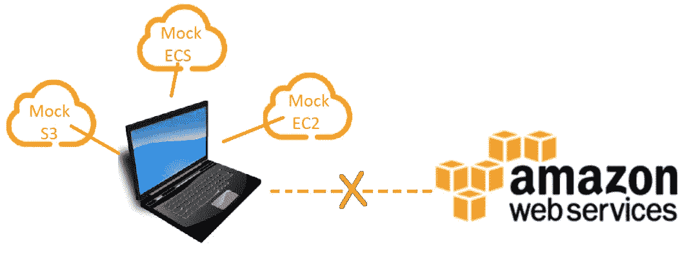
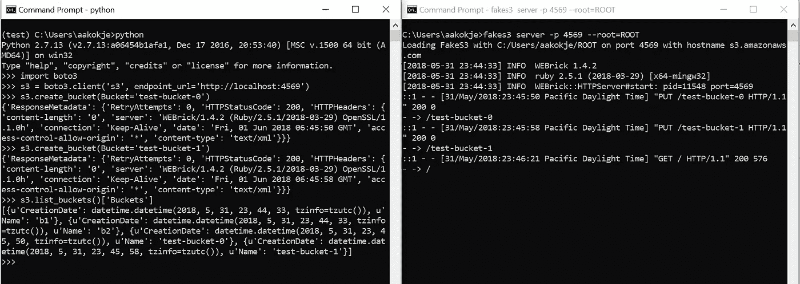
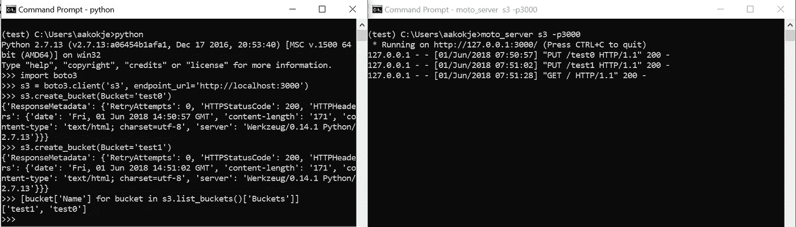

# 模仿 AWS 服务

> 原文：<https://itnext.io/mocking-aws-services-f80d1fd114c1?source=collection_archive---------2----------------------->



模仿 AWS 服务

[AWS](http://pluralsight.pxf.io/c/1202392/424552/7490?u=https%3A%2F%2Fwww.pluralsight.com%2Fcourses%2Faws-system-admin-fundamentals) 云非常棒，而且发展速度非常快。如果计划和执行正确，在云中开发和管理解决方案会有许多实实在在的好处。云中的各种可用服务可以让生活变得轻松，因为几乎所有您需要的东西都有可用的服务:存储、备份、版本控制、负载平衡、自动扩展等。

在开发阶段，根据 [AWS](http://pluralsight.pxf.io/c/1202392/424552/7490?u=https%3A%2F%2Fwww.pluralsight.com%2Fcourses%2Faws-system-admin-fundamentals) 服务测试你的解决方案会变得非常昂贵，很快就会耗尽你的预算！对于较大的企业来说，如果 [AWS](http://pluralsight.pxf.io/c/1202392/424552/7490?u=https%3A%2F%2Fwww.pluralsight.com%2Fcourses%2Faws-system-admin-fundamentals) 的用户数量很少，这就不是问题了。但这对于预算紧张的初创公司以及基于云或拥有许多 AWS 用户的企业来说可能是一个巨大的问题。

为了帮助开发和降低成本，有许多开源解决方案可供您使用。在本文中，我列出了所有主要的和广泛使用的模块，您可以在开发阶段使用它们来模拟 [AWS](http://pluralsight.pxf.io/c/1202392/424552/7490?u=https%3A%2F%2Fwww.pluralsight.com%2Fcourses%2Faws-system-admin-fundamentals) 服务。有了这些，你甚至不需要有一个 AWS 帐户来开始你的开发。

我亲自评估和使用了所有这些模拟模块，并强烈推荐它们用于您的开发。

# **假 S3**

[假 S3](https://github.com/jubos/fake-s3) 是一个轻量级服务器，它通过创建一个模拟服务器来测试你的代码中的 S3 调用，该模拟服务器响应与亚马逊 S3 相同的 API。

**安装:**宝石安装假 3

**依存:** [*红玉*](https://rubyinstaller.org/downloads/)

**用法:***fake S3 server-p<PORT>—ROOT = ROOT*

使用时，就好像您正在与一个普通的 S3 桶进行交互。默认情况下，当您创建一个 boto3 S3 客户端实例时，它会指向位于 s3.amazonaws.com 的 AWS S3 服务器。你需要做的就是把它改成指向你的 fakes3 服务器。

```
s3 = boto3.client(‘s3’, endpoint_url=’[http://localhost](http://localhost):<PORT>')
```

请注意，您甚至不需要提供任何令牌/凭证来进行身份验证(秘密访问密钥和访问密钥 ID)。这意味着，您可以使用任何虚拟凭证来测试您的代码，并且当您已经部署到您的真实环境中时，它仍然会工作。

例如，作为一个简单的(和不真实的！)示例中，有一个 lambda 函数打印所有可见的存储桶名称。正如您在下面的例子中看到的，lambda 代码从环境变量中提取服务器 URL。这将允许您在本地调用 lambda 处理程序，并在部署到您的 AWS 帐户之前进行测试。

在 AWS 帐户中，您可以使用 IAM 角色来允许 lambda 函数的权限，因此不需要提供凭证。

对于本例，lambda 处理程序如下所示:

```
import os
import boto3def lambda_handler(event, context):
    s3_endpoint_url = os.environ.get('s3_endpoint_url')

    if s3_endpoint_url:
        s3 = boto3.client('s3', endpoint_url=s3_endpoint_url)
    else:
        s3 = boto3.client('s3')

    print 'Bucket Names List = {0}'.format([bucket['Name'] for bucket in s3.list_buckets()])
```

将环境变量 s3_endpoint_url 的默认值留空。然后，在调用 lambda 函数之前，可以使用 API 来设置它。通过这种类型的开发，您可以使用 mock 轻松测试 lambda 函数。

为了演示模拟如何响应 API 请求，在下面的截图中，我已经启动了 fakes3 服务器，并从 python REPL 对其调用 API 请求。你可以看到它模拟了 S3 行为。



模仿 AWS 服务:FakeS3

# 摩托

[Moto](https://github.com/spulec/moto) 可以用来嘲讽所有的 [AWS](http://pluralsight.pxf.io/c/1202392/424552/7490?u=https%3A%2F%2Fwww.pluralsight.com%2Fcourses%2Faws-system-admin-fundamentals) 服务，不仅仅是 S3。所有可用的服务都可以用作装饰器、上下文管理器，或者以原始的形式使用，从而允许更大的灵活性来与许多不同的测试架构一起使用。大多数服务只需安装 python 包就可以测试，唯一的特例是 Lambda，它需要安装 Docker。

## Python 中的 Moto:

在这里，我只是演示装饰器的使用。有关使用其他表单的详细信息，可以访问项目文档。

**安装:** *pip 安装 moto*

**用法:**比方说，你有一个 lambda 函数(lambda_example.py ),就像上一个例子一样:

```
import os
import boto3def lambda_handler(event, context):
    s3_endpoint_url = os.environ.get(‘s3_endpoint_url’)

    if s3_endpoint_url:
        s3 = boto3.client(‘s3’, endpoint_url=s3_endpoint_url)
    else:
        s3 = boto3.client(‘s3’)

    print ‘Bucket Names List = {0}’.format([bucket[‘Name’] for bucket in s3.list_buckets()])
```

对于这个例子，您可以使用 moto 进行如下测试:

```
from moto import mock_s3
from lambda_example import lambda_handler@mock_s3
def test_lambda_handler():
    lambda_handler() 
```

就像前面的情况一样，您不需要提供任何令牌/凭证来进行身份验证(秘密访问密钥和访问密钥 ID)。默认端点 URL 总是设置为 AWS 服务器，您可以通过在测试代码中设置环境变量来覆盖它。

## Moto 独立服务器模式:

这允许你利用 moto 的后端结构，即使你不使用 Python，也可以通过 AWS CLI 使用 Moto 服务器。它使用 flask，这不是默认的依赖项。

**安装:**pip 安装 moto【服务器】

**用法:** *moto_server s3 -p <端口>*

就像 fakes3 一样，我在下面的截图中为 s3 启动了一个模拟的 moto 服务器来演示它的行为。注意，这个例子只是展示了 S3，但是 moto 也可以用来模仿很多其他的 AWS 服务。



嘲讽 AWS 服务:Moto

# 动力石

Dynalite 是 Amazon 的 DynamoDB 的一个实现，在本地执行。当亚马逊的 DynamoDB Local 不可用时，这实际上更有用。你可以在你的开发机器上安装 Amazon 的 DynamoDB local 来满足你的开发需求，我建议你用它来代替。

# 亚马逊的 DynamoDB Local

[亚马逊的 DynamoDB Local](https://aws.amazon.com/blogs/aws/dynamodb-local-for-desktop-development/) 是一个可执行的 Java 存档(JAR)文件。它将在 Windows、Mac 和 Linux 系统上运行，并且与 Java Runtime Environment (JRE)的版本 7 兼容。它不能在旧版本的 Java 上工作。完全由亚马逊自己维护，非常稳定。

下载 DynamoDB 本地 JAR，将其放在您选择的目录中，并在该目录中打开一个命令提示符。像这样启动 DynamoDB Local:

```
$ java — Djava.library.path=. -jar DynamoDBLocal.jar
```

配置您的应用程序，使其使用本地端点。默认情况下，DynamoDB Local 监听端口 8000；您可以通过在启动时指定–port 选项来进行更改。如果使用默认端口，本地端点将是 localhost:8000。

# 活动硅酸盐

[Kinesalite](https://github.com/mhart/kinesalite) 是亚马逊 Kinesis 的一个实现，用于本地执行。

**安装:** *npm 安装-g kinesalite*

**用法:**

这是他们网站上的一个基本例子。有关更多详细信息，请参考项目文档。

使用 SDK:

```
var AWS = require('aws-sdk')
var kinesis = new AWS.Kinesis({endpoint: 'http://localhost:4567'})
kinesis.listStreams(console.log.bind(console))
```

以编程方式:

```
// Returns a standard Node.js HTTP server
var kinesalite = require('kinesalite'),
kinesaliteServer = kinesalite({path: './mydb', createStreamMs: 50})

// Listen on port 4567
kinesaliteServer.listen(4567, function(err) {
if (err) throw err
console.log('Kinesalite started on port 4567')
})
```

# 本地堆栈

Localstack 建立在其他现有的模仿工具之上，具有更多的功能，支持更多的服务和互操作性。以下是使用 localstack 的好处:

*   **错误注入:** LocalStack 允许注入真实云环境中经常出现的错误。
*   **实际 HTTP REST 服务:**local stack 中的所有服务都允许 TCP 端口上的实际 HTTP 连接。
*   **语言无关:**虽然 LocalStack 是用 Python 编写的，但是它可以很好地与任意编程语言和环境一起工作。
*   **隔离进程:**local stack 中的所有服务都运行在单独的进程中。

**安装:** *pip 安装本地堆栈*

**用法:**

安装后，使用以下命令运行基础架构:

```
localstack start
```

您也可以使用命令行在 docker 中运行:

```
localstack start --docker
```

因为 localstack 作为 REST API 运行，所以您可以通过指定— endpoint_url，使用 [AWS](http://pluralsight.pxf.io/c/1202392/424552/7490?u=https%3A%2F%2Fwww.pluralsight.com%2Fcourses%2Faws-system-admin-fundamentals) CLI 来使用它

```
aws --endpoint-url=http://localhost:4568 kinesis list-streams
```

为了避免在每个命令行中指定端点 URL，请尝试使用 localstack [awslocal](https://github.com/localstack/awscli-local)) ，这是一个瘦 CLI 包装器。

```
awslocal kinesis list-streams
```

要使用 boto3，您需要做的只是修改端点 URL，就像在其他模拟模块中一样。我不会在这里详细讲述，因为它与我在前面的例子中讲述的内容相似。
除此之外，localstack 可以很容易地与 python nosetests 和 Junit 框架集成。

根据我的经验，在没有这些模拟的情况下，成本在开始时很低，但随着您的开发接近完成，随着您不断添加对使用更多服务的更多功能的支持，成本会迅速上升。

当您有回归测试设置时，这是一个非常重要的考虑因素。我建议在项目开发阶段的早期建立模拟，并以这样一种方式开发解决方案，即它们可以很容易地配置为用模拟进行测试。

我希望这能给 post 你足够的信息来开始你的开发，也希望能省下一大笔钱！如果你有更多的问题或者想讨论什么，我很乐意知道。