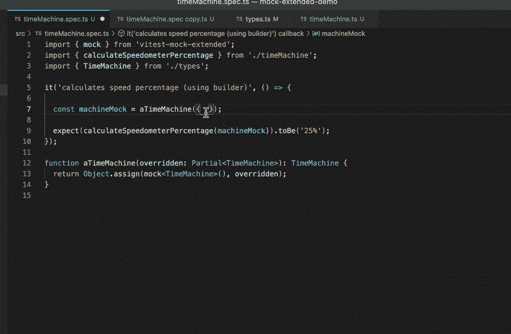

# 模仿旧项目中的 TypeScript 对象

> 原文：<https://itnext.io/mocking-typescript-objects-in-legacy-projects-773b38b9b4f7?source=collection_archive---------5----------------------->

使用 jest-mock-extended(或 vite-mock-extended) 🛠


约尔根·哈兰在 [Unsplash](https://unsplash.com?utm_source=medium&utm_medium=referral) 上的照片

模仿对象并不困难，但是在特定的环境中，比如遗留环境中，就很有挑战性。在这篇文章中，**我们将学习如何毫无痛苦地模仿复杂的打字稿对象**。

> Y 你可以查看[这个回购](https://github.com/agualis/mock-extended-demo)或者玩[这个交互示例](https://stackblitz.com/github/agualis/mock-extended-demo/tree/main?file=src%2Fpool.spec.ts)用真实代码了解示例。

# 语境

想象一下，你开始在一家新公司工作，并且**你加入了一个没有单元测试的打字稿项目**。团队给了你第一个小任务，你发现**你必须使用像这样的大类型/接口**:

```
export interface TimeMachine {
  id: string;
  name: string;
  address: string;
  modelId: number;
  timeTravelType: TimeTravelType;
  timeTravelVersion: number;
  fluxCapacitorFee: string;
  temporalDisplacementFeeCache: string;
  owner?: string;
  factory?: string;
  destinations: TimeMachineDestination[];
  destinationsList: string[];
  destinationAddresses?: string[];
  totalPower: string;
  totalBoost: string;
  totalFluxCapacitorFee?: string;
  totalTimeTravelVolume?: string;
  onchain?: OnchainTimeMachineData;
  createTime?: number;
  mainDestinations?: string[];
  alternateDestinations?: string[];
  nonExistentDestinations?: string[];
  isNew?: boolean;
  energySnapshot?: string;
  feesSnapshot?: string;
  thrust?: string;
  model?: string;
  timeTravelEnabled: boolean;
  temporalDisplacement?: string;
  alternateIndex?: number;
  mainIndex?: number;
  efficiency?: EfficiencyBreakdown;
  power?: string;
  maxSpeed: string;
  lowerTarget: string;
  upperTarget: string;
  temporalRateProviders?: TemporalRateProvider[];
  userSpeed: number;
}
```

但是，作为团队中的新开发人员，你不熟悉这个新的业务领域，所以你不知道什么是*时间机器*。你也不知道 *TimeMachine* 的相关类型，如 *OnchainTimeMachineData* 、 *EfficiencyBreakdown* 或*temporaltrateprovider*。

# 你的任务

你的任务真的很简单:你要用两个 *TimeMachine* 属性( *maxSpeed* 和 *userSpeed* )来计算 *maxSpeed* 是 *userSpeed* 的百分之几。简单易行:

```
import { TimeMachine } from './types';

export function calculateSpeedometerPercentage(machine: TimeMachine): string {
  const speedometerPercentage =
    (machine.userSpeed / Number(machine.maxSpeed)) * 100;
  return `${speedometerPercentage}%`;
}
```

但是，测试呢？

您需要创建一个有效的 *TimeMachine* 接口实例来编写您的测试，但是，**您不希望花费大量时间(现在)来创建一个看起来干净简单、满足所有域 TimeMachine 不变量并对给定测试有意义的真实对象**，因为您喜欢循序渐进。🛠 *模拟展开*营救🛠

# 介绍 jest-mock-extended

jest-mock-extended 是一个库，让你能够模仿任何类型脚本接口或对象。

> 我首选的 TS 测试工具是 [vitest](https://vitest.dev/) ，所以我将使用 [vitest-mock-extended](https://www.npmjs.com/package/vitest-mock-extended) ，它具有完全相同的 API。

安装了这个库之后，为我们的示例( *TimeMachine interface* )创建一个模拟实例就像下面这样简单:

```
import { TimeMachine } from './types';
import { mock } from 'jest-mock-extended';

const machineMock = mock<TimeMachine>();
```

为了测试我们的场景，我们只需要使用两个属性( *maxSpeed* 和 *userSpeed* )，所以我们可以像这样模拟它们:

```
 const machineMock = mock<TimeMachine>();
 machineMock.maxSpeed = '100';
 machineMock.userSpeed = 25;
```

因此，最终的测试将是:

```
import { mock } from 'vitest-mock-extended'; //jest-mock-extended for jest
import { TimeMachine } from './types';
import { calculateSpeedometerPercentage } from './timeMachine';

it('calculates speed percentage (using builder)', () => {
  const machineMock = mock<TimeMachine>();
  machineMock.maxSpeed = '100';
  machineMock.userSpeed = 25;

  expect(calculateSpeedometerPercentage(machineMock)).toBe('25%');
});
```

# 使用构建器

但是有些事情我们可以改进。在实例创建之后修改属性并不是最好的主意，因为这很危险(如果对象有一个构造函数，而我们必须在这个构造函数中检查业务不变量怎么办？)而且意图不像做什么都一脉相承那么明确。让我们使用一个简单的构建器函数，它接受任何 *TimeMachine* 属性(由于[部分](https://www.typescriptlang.org/docs/handbook/utility-types.html#partialtype)):

```
function aTimeMachine(overridden: Partial<TimeMachine>): TimeMachine {
  return Object.assign(mock<TimeMachine>(), overridden);
}
```

使用下面的构建器，我们的测试将如下所示:

```
it('calculates speed percentage (using builder)', () => {
  const machineMock = aTimeMachine({ maxSpeed: '100', userSpeed: 25 });
  expect(calculateSpeedometerPercentage(machineMock)).toBe('25%');
});
```

当然，我们在自动完成和类型检查方面有很好的 TypeScript 开发人员体验:



# 带有默认值的生成器

我们能进一步改进它吗？也许是的。我们当前测试的函数需要 *maxSpeed* 和 *userSpeed* 来执行它的计算，所以我们希望在构建实例时非常明确地传递这些值。但是在未来的测试中，当我们将重点放在其他属性上时，拥有 *maxSpeed* 和 *userSpeed* 的默认值而不需要在测试中明确引用**可能会很酷。**我们可以在构建器中包含默认值**:**

```
**function aTimeMachineWithDefaults(
  overridden: Partial<TimeMachine>
): TimeMachine {

  const defaults: Partial<TimeMachine> = {
    maxSpeed: '100',
    userSpeed: 0,
  };

  return Object.assign(mock<TimeMachine>(), defaults, overridden);
}**
```

# **其他上下文**

**我认为自己是一个固执己见的开发者，但是如果环境改变了，我可能会改变我的观点😊。**

**对于复杂类型的遗留项目，我喜欢使用 *jest-mock-extended* 方法，但是对于绿地项目，我可能会建议手动创建模拟。花时间理解你的领域并创建语义“子构建器”将帮助你更好地理解你的业务，你甚至会发现有趣的规则和代码，这些规则和代码可以从测试构建器转移到产品中，使你的项目更简单、更干净、更易于维护。**

**我还建议使用生成器工具，如 [Faker](https://fakerjs.dev/) 来创建更真实和随机的数据，以使您的测试更好。为什么不在原型中或在 [MSW 处理器](https://mswjs.io/)中重用这个构建器。但是像往常一样，一步一步来。**

**🚀**快乐测试**🚀**

**请记住，您在[这个回购](https://github.com/agualis/mock-extended-demo)中有以下示例，您也可以与[一起玩这个互动示例](https://stackblitz.com/github/agualis/mock-extended-demo/tree/main?file=src%2FtimeMachine.spec.ts)。**

**也请查看我的[下一篇文章](/driving-your-testing-efforts-with-code-coverage-tools-616eadc7c2ca)，在那里我使用了之前的技术来增加一个更复杂例子的覆盖范围。**