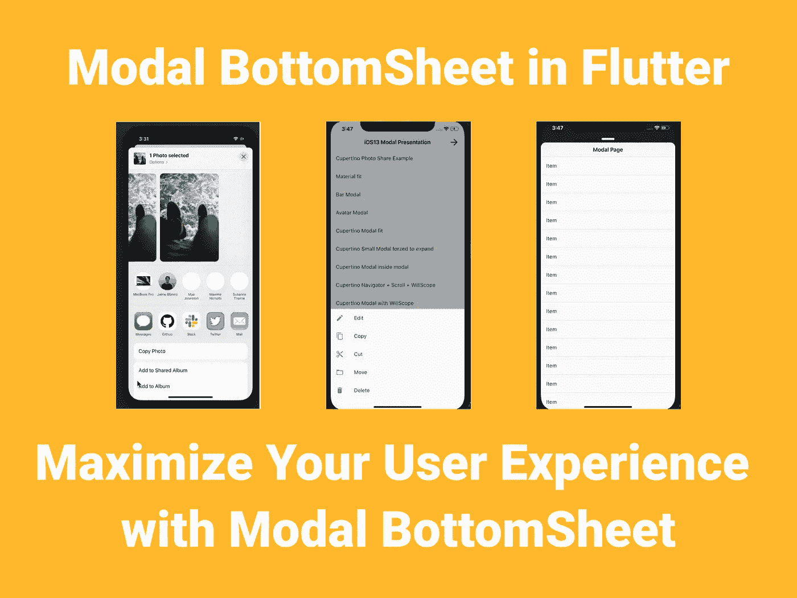
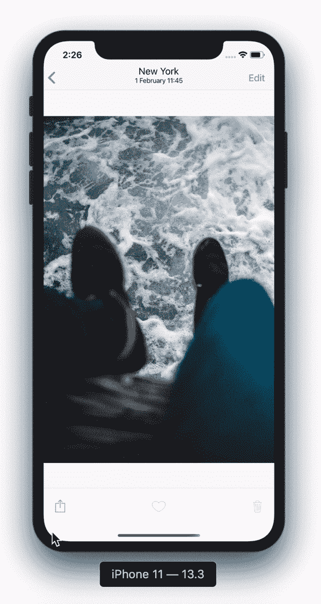
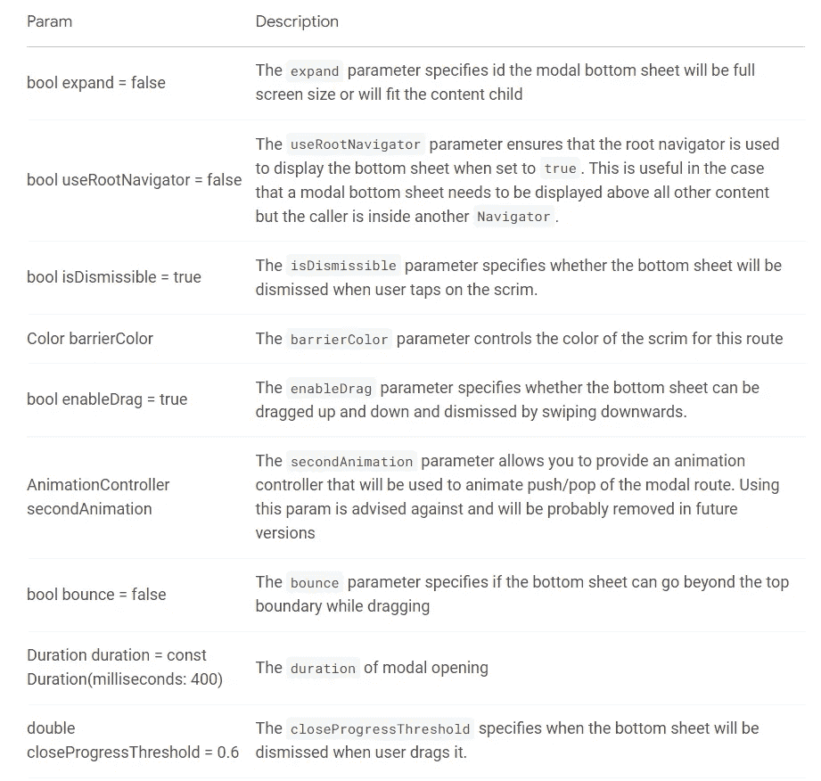

# 颤振中的模态底板

> 原文：<https://itnext.io/modal-bottomsheet-in-flutter-4e9b11d3bcb5?source=collection_archive---------5----------------------->

## 使用莫代尔底板最大限度地提升您的用户体验



默认情况下，Flutter 给了我们一个很好的底层，但是在 UX 这边感觉不舒服，而且还不支持嵌套滚动属性。使用 Modal BottomSheet 包，您可以为您的应用程序制作令人惊叹的 BottomSheet。

## 动机



## 为什么要用莫代尔底片？

*   支持内部滚动视图+向下拖动关闭(`showModalBottomSheet`不能正确使用滚动视图)
*   支持`WillPopScope`防止关闭对话框。
*   支持点击状态栏时滚动到顶部(仅限 IOS)
*   库比蒂诺莫代尔底板
*   创建自定义模态底板

## 入门指南

[](https://pub.dev/packages/modal_bottom_sheet) [## modal_bottom_sheet |颤振包

### 1.0.0 中的重大更改在生成器参数中移除 scrollController 并使用 modalscrollcontroller . of(context)代替…

公共开发](https://pub.dev/packages/modal_bottom_sheet) 

*   让我们从将包添加到我们的项目开始。

```
dependencies:
  modal_bottom_sheet: ^2.0.0
```

## 通用参数



## 材料莫代尔底板

*   这很容易使用，你需要做的就是像这样用`showMaterialModalBottomSheet`包装你的内容。

```
showMaterialModalBottomSheet(
  context: context,
  builder: (context) => Container(),
)
```

*   你也可以在 ScrollView 里面使用它。你所要做的就是像这样在 ScrollView 中使用`ModalScrollController`。

```
showMaterialModalBottomSheet(
  context: context,
  builder: (context) => SingleChildScrollView(
    controller: ModalScrollController.of(context),
    child: Container(),
  ),
);
```

## 库比蒂诺莫代尔底板

*   IOS13 附带了一个令人惊叹的新模式导航，现在它可以与 Flutter 一起使用。
*   这很容易使用，你需要做的就是像这样用`showCupertinoModalBottomSheet`包装你的内容。

```
showCupertinoModalBottomSheet(
  context: context,
  builder: (context) => Container(),
)
```

## 显示条形莫代尔底板

*   有了这个底单，你只需在底单的顶部显示一个条形。

```
showBarModalBottomSheet(
  expand: true,
  context: context,
  builder: (context) => Container(),
)
```

## 定制莫代尔底板

*   使用此底板，您可以创建自己的定制底板。

```
showCustomModalBottomSheet(
  context: context,
  builder: (context) => Container(),
  containerWidget: (BuildContext context,Animation<double>  
  animation,Widget child){
     return YourWidget();
  })
```

本文到此为止。🎉🎉

您可以在这里查看软件包创建者的现场演示👇 👇

[](https://jamesblasco.github.io/modal_bottom_sheet/#/) [## 颤振模态底板

### 构建高级模型。库比蒂诺，材料或创造你自己

jamesblasco.github.io](https://jamesblasco.github.io/modal_bottom_sheet/#/) 

感谢您的阅读！👏👏

如果你喜欢这篇文章，请点击👏按钮(你知道你可以升到 50 吗？)

另外，别忘了关注我，在你的社交网站上分享这篇文章！也让你的朋友知道吧！！