# 模型开发

> 原文：<https://itnext.io/model-development-37c01ae5ceb7?source=collection_archive---------2----------------------->

移动应用 [React Native](https://reactnative.dev/) 和网站 [React Native Web](https://necolas.github.io/react-native-web/) 的模型开发。

在我们进入“模型开发”阶段之前，让我们看看应用程序开发的传统方法——“功能开发”是一种通过功能描述和链接到 [Zepllin](https://zeplin.io/) 的任务设置方法，最多是链接到[漫威应用程序](https://marvelapp.com/)中的原型屏幕。当一个程序员接到开发一个特性的任务时，他会把它分成三个部分:

*   布局用户界面
*   创建带导航的屏幕
*   实现本地和云数据库存储之间的交互逻辑

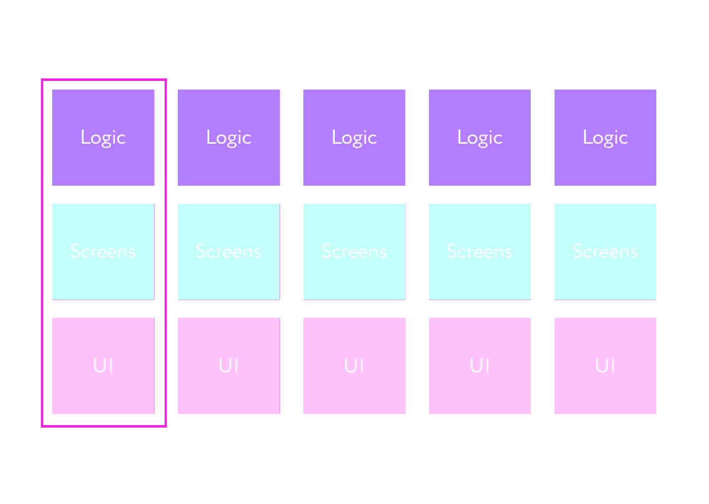

因此，从 desired 中，我们看到了一幅画面，其中 UI 组件就布置在屏幕上，布局层与导航和逻辑合并在一个屏幕上，这反过来超越了原子设计方法及其口号“创建系统，而不是页面”的界限

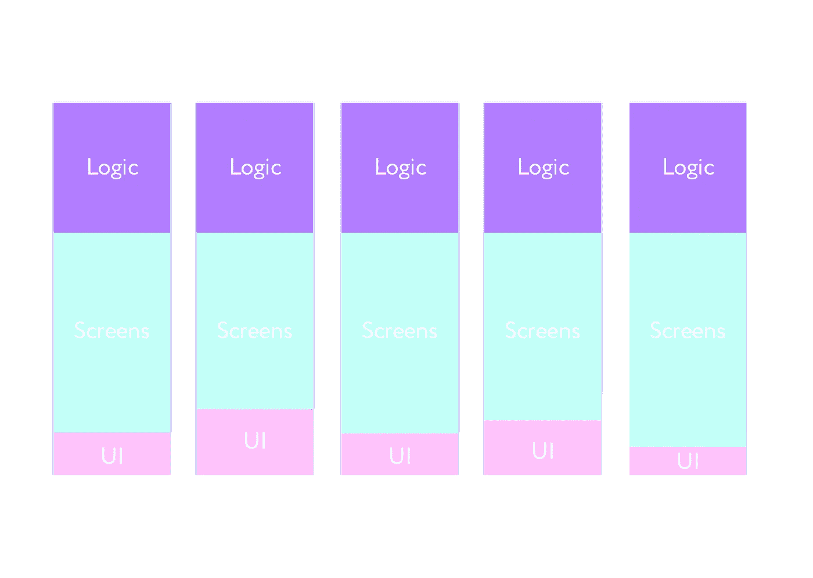

在第一阶段对需求的不充分阐述会导致这样一个事实，即实现的功能根本不会像分析师预期的那样工作，而只会像开发人员理解的那样工作。不幸的是，这在现代世界中经常发生，并导致任务返回给开发人员。

为了消除这个问题，我使用了一种替代开发方法，也称为模型开发方法。它与“特性开发”方法的主要区别在于，最初我们以类型化模型模式 [TypeScript](https://www.typescriptlang.org/) 和 GraphQL 的形式设置任务，这允许开发人员使用代码类型化，而不是像通常情况下那样，根据剩余原则，而是从根本上在创建技术规范的水平上。因此，我们最初将数据库实现的类型化模型放入任务中，这允许我们在任务从积压到完成的整个生命周期中控制任务的准确性。

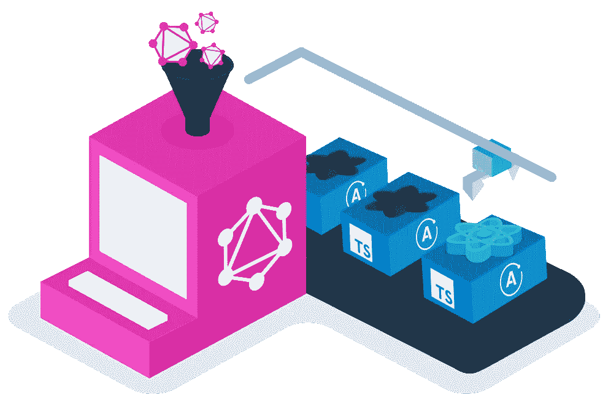

此外，还通过 [Storybook](https://storybook.js.org/) framework 将组件层与屏幕和业务逻辑隔离开来，Storybook framework 是一个用于独立构建 UI 组件和页面的开源工具。它简化了用户界面开发、测试和文档。

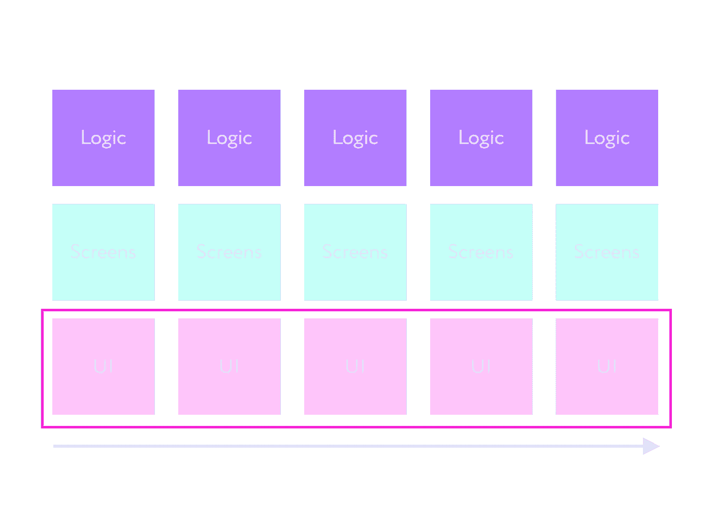

因此，我们将整个开发分为三个阶段，并将其分配给同一层的三个开发人员:

*   布局设计器(初级)—布局—用户界面组件
*   汇编程序(中间)——屏幕和导航逻辑的汇编——屏幕
*   设计师(高级)——以[打字稿](https://www.typescriptlang.org/)和[图表 QL](https://graphql.org/) 模型的形式制定职权范围——逻辑。

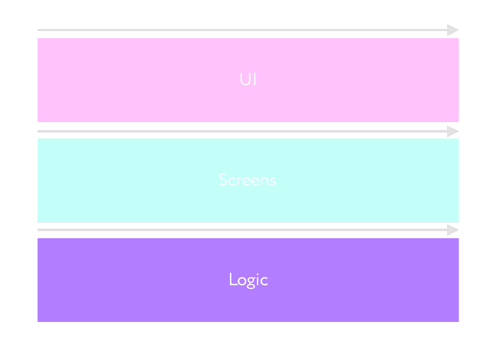

解释某事的最好方式是展示一个我自己的例子，所以我将向你展示我如何使用模型开发方法为我的移动应用程序[莉拉的游戏](https://onelink.to/be972z)设计故事。

现在我们将为 ProfileScreen 的分解创建一个历史。

使用这种方法，应用程序开发可以快很多倍，它被称为“模型开发”，因为任何故事都被分解为三个任务，其中一个任务实现 [TypeScript](https://www.typescriptlang.org/) 模型，第二个 [GraphQL](https://graphql.org/) 模型，第三个任务将其部署到服务器:

# шаг1—用户界面组件—布局—类型脚本组件模型

UI Components 是一个源代码 UI 工具包，它在一个跨平台的 UI 组件框架中隔离了与屏幕和导航以及逻辑层的通信。

构建 React 原生移动应用程序首先要在[故事书](https://storybook.js.org/)中创建 UI 组件，应用程序将从该故事书中构建。这些是我们的构建模块，原子、分子、有机体，它们构成了应用程序的整个视觉部分(屏幕)。

[故事书](https://storybook.js.org/) —这种健壮的用户界面的开发提供了一个沙箱，用于孤立地构建用户界面，因此您可以开发难以达到的状态和边缘情况。

由于我们根据[故事书](https://storybook.js.org/)规则制作应用程序，我们的组件很容易移植到 [React Native for Web](https://necolas.github.io/react-native-web) 。因此，我们不仅获得了一个用于移动开发的 UI-kit，而且我们还可以在网站上使用它，使开发过程的布局速度提高一倍，因为我们不需要在移动平台之外单独为网站布局组件。

> “Storybook 是一个强大的前端工具，允许团队设计、构建和组织 UI 组件(甚至全屏！)而不会从业务逻辑和管道中分心。”
> 
> 原子设计公司的布拉德·弗罗斯特

如今，无论你问谁关于原子设计，那么每个人都准备遵循它的口号“创建系统，而不是页面”，但不幸的是，在实践中，开发人员继续创建他们附加了业务逻辑的页面。

# 在[故事书](https://storybook.js.org/) : 中创建 UI 组件的主要好处

## 绝缘

组件的实现不需要修改数据、API 或业务逻辑，因为 UI 组件通过屏幕和应用程序客户端与导航层隔离开来。

## 模拟难以发现的用例

在难以在应用程序中重现的负载下呈现处于关键状态的组件。

## 使用案例文档作为故事

将用例保存为普通 JavaScript 中的故事，以便在开发、测试和 QC 期间重新访问。

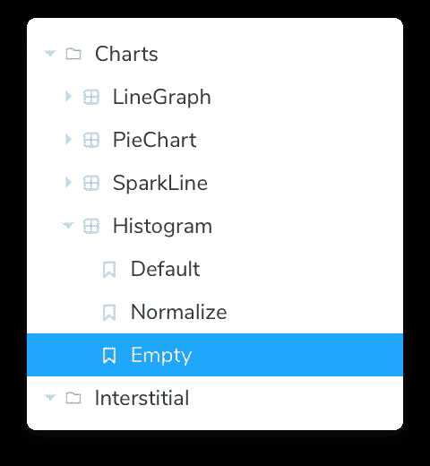

## 使用加载项加速您的工作流程

使用附加组件定制您的工作流程，测试自动化，并与您喜欢的工具集成。

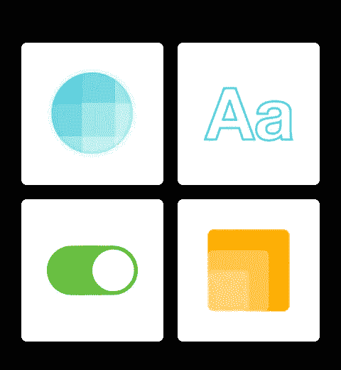

## 外观目测

通过比较故事图像的快照，Pinpoint 的用户界面随着像素精度而变化。

## 单元测试功能

故事是跟踪 UI 边缘案例的一种实用的、可重复的方式。编写一次故事，然后在自动化测试中重用它们。

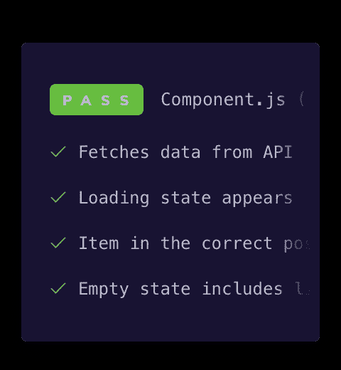

## 无障碍测试

使用插件 [A11y](https://storybook.js.org/addons/@storybook/addon-a11y) 查看关于 WCAG 和艾瑞亚问题的故事。

## 记录用户界面，与您的团队分享

这些故事展示了用户界面实际上是如何工作的，而不仅仅是它们应该如何工作。这使得收集证明和复制品变得更加容易。故事书是你的可搜索用户界面的一站式真实来源。

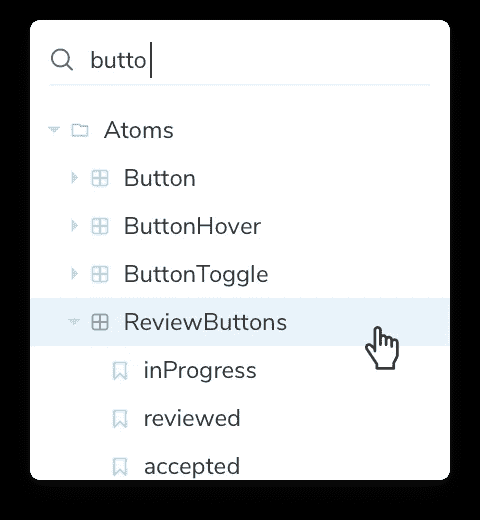

## 在开发过程中及时获得反馈

在线发布您的故事书，为您的团队提供一站式反馈参考。

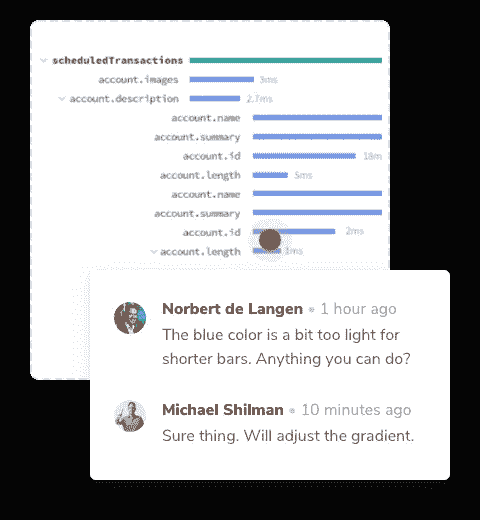

## 在屏幕和应用程序之间共享组件

每个故事都是您的团队可以找到并重用的用例。

## 自动生成用户界面文档

编写 Markdown / MDX 为组件库创建一个定制站点，并使用 [Docs](https://storybook.js.org/images/home/share-document.png) 附加组件设计系统。

因为我们从一开始就输入组件，所以这是我们为本地存储和后端创建数据库模型的基础。

除了将布局从屏幕中分离出来，这也是应用程序开发第一步中的优先边界。这一步在应用程序设计级别设置组件开发。程序员甚至不需要想出组件的名称，因为它们写在 [Sketch](https://www.sketch.com/) App 或 [Figma](https://www.figma.com/) 程序的画板上。平均来说，每天可以制作 3-6 个组件。由于这一点，我们可以计算开发人员创建 UI 工具包的工时，然后计算整个应用程序的工时。

当使用 React Native 开发时，您需要手动配置您的应用程序，以便在不同的屏幕尺寸上看起来很棒。这是一项繁琐的工作，因此[react-native-size-matters](https://github.com/nirsky/react-native-size-matters)提供了一些简单的工具，使缩放变得更加容易。想法是在大约 5 英寸屏幕的标准移动设备上设计一次，然后只应用提供的实用程序，因此设计的[草图](https://www.sketch.com/)中的画板大小为 320x568px。

让我们继续在[故事书](https://storybook.js.org/)中为 UI 组件的开发创建技术规范。

对于这个屏幕，我们将实现两个[类型脚本](https://www.typescriptlang.org/)模型:

# TypeScript Txt 组件模型

# 类型脚本化身组件模型

Скорость — 3–6 компонентов в день

# 第二步—原型—导航— GraphQL 屏幕模型

屏幕上的编译—屏幕模型是屏幕上组件的屏幕模型的总和。屏幕被创建，它们也是[草图](https://www.sketch.com/)中的画板，在这里我们组合组件并相对于彼此定位它们。在这个阶段，导航是连接的。因此，我们有一个现成的原型，可以与客户达成一致。由于组件是由 [TypeScript](https://www.typescriptlang.org/) 键入的，我们可以在屏幕上显示组件模型，并使用 [AWS Amplify](https://aws.amazon.com/ru/amplify/) 框架设置部署后端的任务。最初， [GraphQL](https://graphql.org/) 被设计成使前端工作更容易，同时成为 AWS 架构师的无服务器语言，其中类型化模型成为构建块。

即使你的计划没有机会或兴趣在项目中使用 [AWS Amplify](https://aws.amazon.com/ru/amplify/) 框架，那么这种方法的前两步也适用于你的项目，甚至不需要键入模型。

速度—每天 3-6 个屏幕

# 步骤 3 -逻辑-部署模型

由于 [AWS Amplify](https://aws.amazon.com/ru/amplify/) 中的客户端代码是自动生成的，就像客户端一样，在客户端接受了原型之后，客户端通过使用`amplify push`命令在服务器上发布模式来连接到服务器。

速度是 5-10 分钟，因为方案从第二步开始立即部署，同时不需要编写代码来创建对服务器的请求，因为代码生成是有效的。整个部署是步骤 2 中的 [GraphQL 模型](https://graphql.org/)用一个`amplify push`命令发送。

点击了解更多信息以及如何部署该方案

有时你会发现自己处于危险的境地，但你最好等待更长的时间，而不是明显失败的行动。 [Apollo](https://www.apollographql.com/) 有 [apollo-link-retry](https://www.apollographql.com/docs/react/api/link/apollo-link-retry/) ，默认情况下提供指数级回滚和重试之间对服务器的请求。是的，它(目前)不处理响应中的[graph QL]([https://graphql.org](https://graphql.org/))错误的重试，只处理网络错误。Redux、MobX 当然没有这个解决方案，因为它们不是客户端，你必须使用第三方中间件，因为 REST 就像一个退休的祖父，有心爱的孙子孙女支持。

详细解析 [GraphQL](https://graphql.org/) vs REST。

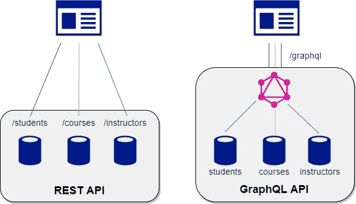

[AWS Amplify](https://aws.amazon.com/en/amplify/) 有一个 [DataStore](https://docs.amplify.aws/lib/datastore/getting-started/q/platform/js) 功能，它不仅类似于 [apollo-link-retry](https://www.apollographql.com/docs/react/api/link/apollo-link-retry/) ，而且还有一个内置的定制编程模型，在云中具有自动版本控制、冲突检测和解决。此外，在应用程序上线后，您不再需要编写额外的代码来向服务器发送请求，因为它是以代码生成的形式出现的。带有模型的文件夹`models`和文件夹`graphql`是自动生成的——这是所有可能的 CRUDs 的客户端层——创建读取删除。

在 [AWS Amplify](https://aws.amazon.com/en/amplify/) 中，创建和更新是一个方法 [DataStore.save](https://docs.amplify.aws/lib/datastore/data-access/q/platform/js/#create-and-update) 。

# 无服务器

在 [AWS Amplify](https://aws.amazon.com/ru/amplify/) 上创建后端是与无服务器技术一起工作的，所以在继续之前，我们将弄清楚什么是无服务器计算，以及它们相对于服务器端计算的优势是什么。

伯克利大学专家对后端技术将如何发展的预测:

> 通过提供一个简化的编程环境，无服务器计算使云更容易使用，从而吸引更多能够和愿意使用它的人。无服务器计算包括 FaaS 和 BaaS 产品，标志着云编程发展的一个重要里程碑。这消除了对手动资源管理和优化的需要，而这正是当今服务器端计算强加给应用程序开发人员的，就像四十多年前从汇编语言到高级语言的过渡一样。
> 
> 我们预测免费服务器的使用将会暴涨。我们还预测，内部混合云应用将随着时间的推移而缩减，尽管由于监管和数据治理的限制，一些部署可能会持续下去。
> 
> 无服务器计算将成为云时代的标准计算范式，在很大程度上取代服务器端计算，从而结束客户端-服务器时代。
> 
> [简化的云编程:关于无服务器计算的伯克利观点](https://www2.eecs.berkeley.edu/Pubs/TechRpts/2019/EECS-2019-3.pdf)

# [无服务器计算](https://www.jscamp.app/#serverless-computing)

云原生架构允许您将大部分运营责任外包给 AWS，以实现更大的灵活性和创新性。无服务器计算允许您构建和运行应用程序和服务，而无需担心服务器。它们消除了处理基础架构管理问题的需要，例如配置服务器或集群、资源需求以及操作系统修补和维护。它们可以用于几乎任何类型的后端应用程序或服务，运行和扩展高可用性应用程序所需的一切都无需客户端干预。

> *在我们的定义中，一项服务要被认为是无服务器的，它必须能够自动扩展，而不需要明确的供应，并根据使用情况计费。*
> 
> [简化的云编程:关于无服务器计算的伯克利观点](https://www2.eecs.berkeley.edu/Pubs/TechRpts/2019/EECS-2019-3.pdf)

简而言之，无服务器并不意味着物理上没有服务器，而是没有令人头疼的基础设施管理、维护和创建。

# 无服务器架构的优势:

如今，创建应用程序有很多方法。在早期阶段做出的决策不仅会影响应用程序的生命周期，还会影响开发团队，并最终影响一个公司或组织。在本文中，我提倡并概述了使用无服务器技术和模型开发方法来构建应用程序的方法。以这种方式构建应用程序有什么好处，为什么无服务器变得如此流行？

# 一种编程语言

借助现代工具和方法，如 [AWS Amplify](https://aws.amazon.com/en/amplify/) ，一个开发人员可以利用他们现有的一套统一平台和生态系统的技能和知识来构建可扩展的应用程序，完成过去需要高技能后端程序员和 DevOps 工程师团队来构建和维护的所有功能。

# 少码

唯一有价值的是代码提供的功能，而不是代码本身。当您找到提供这些功能的方法，同时限制您支持的代码量，甚至完全抛弃代码时，您就降低了应用程序的整体复杂性。更少的复杂性意味着更少的错误，对新工程师来说更容易，对那些支持和添加新功能的人来说总体上更少的认知负荷。开发人员可以连接到这些服务并实现功能，而不需要了解实际的内部实现，并且只需很少或不需要内部代码。

# 无需管理服务器

无需配置或维护服务器。无需安装、维护或管理软件或运行时。

# 可扩展性

没有服务器的主要优势之一是开箱即用的可扩展性。在构建应用程序时，您不必担心如果您的应用程序变得非常受欢迎，并且您连接了更多新用户，云提供商可以为您处理它，会发生什么。云提供商通过执行代码来响应每次交互，从而自动扩展您的应用。在无服务器函数中，您的代码并行运行并单独处理每个触发器(反过来，根据工作负载的大小进行扩展)。无需担心扩展您的服务器和数据库。

# 发展速度

功能越少，开发速度越快。快速部署大多数应用程序的典型功能类型(数据库、身份验证、存储、API)的能力，以及更少的前期时间，使您能够快速开始编写核心功能以及您希望最终交付的功能的业务逻辑。给客户。

# 实验

如果你没有花很多时间来创建重复的特性，你可以更容易地进行实验，风险也更小。当提交一个新特性时，您通常会评估风险(创建该特性所涉及的时间和金钱)以及可能的投资回报(ROI)。随着尝试新事物的风险降低，你可能会体验到过去从未出现过的想法。我们也可以更容易地测试不同的想法。

# 安全稳定

因为你订阅的服务是服务提供商的核心竞争力，所以你得到的东西比你自己可能创造的更好，通常也更安全。想象一下，一家公司的核心业务模式专注于提供主要身份认证服务，并已使用多年，为数千家公司和客户解决和修复问题。现在，假设您正试图在自己的团队或组织中复制这样的服务。虽然这是完全可能和可行的，但是选择一个由专门创建和维护这个东西的人来创建和维护的服务可能是一个更安全、更可靠的选择。这些服务提供商关心的另一个主要问题是尽量减少停机时间。这意味着他们不仅要承担构建、部署和维护这些服务的负担，还要尽最大努力确保它们的稳定性和弹性。

# 自动可用性控制

无服务器计算提供了内置的高可用性和容错能力。这些功能不需要特别设计，因为运行应用程序的服务默认提供了这些功能。

# 价格

使用传统方法，无论计算资源是否被使用，您通常都要为其付费。这意味着，如果您希望确保您的应用程序能够伸缩，您需要为您所能看到的最大工作负载做好准备，不管它是否达到那个级别。毕竟，这种传统方法意味着在应用程序的大部分生命周期中，您要为未使用的资源付费。使用无服务器技术，您只需为您使用的内容付费。使用 FaaS(功能即服务)，您将根据对您的功能的请求数量以及执行您的功能代码所花费的时间来计费。有了像 Amazon Rekognition 这样的托管服务，您只需为渲染的图像、视频处理的分钟数付费，此外，只需为您使用的内容付费。云提供商的账单只占云基础设施总成本和工资的一小部分。如果您的运营资源较少，这一成本会降低。还有开发成本。以这种方式构建应用程序加快了上市时间，减少了总体开发时间，从而降低了开发成本。一般来说，你为稳定的带宽或运行时间付费，而不是为你使用的服务器数量付费。

更多关于定价的信息[点击这里](https://aws.amazon.com/ru/appsync/pricing/)

# 输出

前端/后端分离模型本身以及无服务器技术时代的功能开发人员已经成为过去，在无服务器技术时代，全栈开发人员实现应用程序的模型组装比功能开发人员快许多倍。