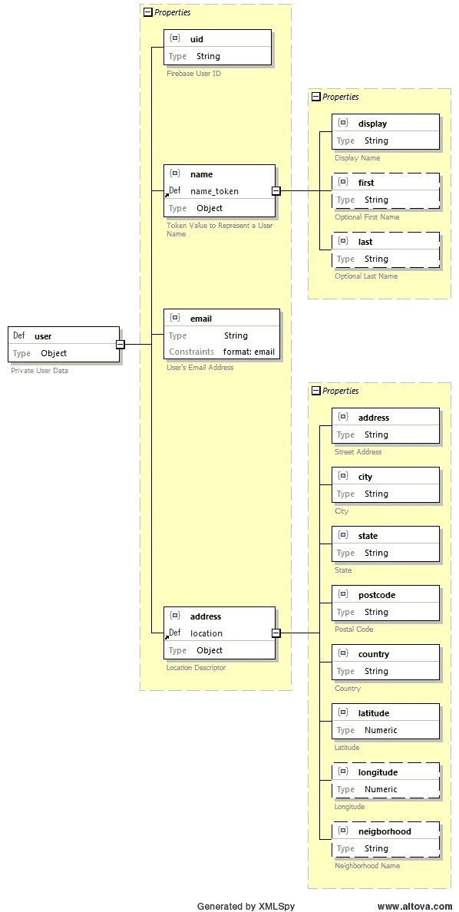

# 用通用 JavaScript 建模领域实体

> 原文：<https://itnext.io/modeling-domain-entities-with-universal-javascript-f37da6fbe1ab?source=collection_archive---------2----------------------->


实体是任何应用程序皇冠上的宝石。所有这些成千上万行的客户机和服务器代码只有一个目的:持久化、呈现并允许用户操作域模型实体的实例。

给你的实体应有的尊重。一旦你弄清楚了它们对你的领域有什么用，构建并彻底测试它们应该是你的下一个目标。

**剧透警告:**没有一种*真正的方式*来实现你的实体。

关于如何用 JavaScript 表示应用程序的域模型，有很多观点。大多数来自其他语言，如 Java，因为 JavaScript 虽然每年都在成熟，但对于企业级应用程序架构来说仍然相对较晚。

JavaScript 的大部分历史都是严格的客户端历史。在那个时代，很少有比用 **{** 和 **}** 创建一个对象并在其上设置一些属性更复杂的事情了。但是客户端架构变得越来越复杂，现代的方法倾向于类似于 [EJB 实体](https://www.tutorialspoint.com/ejb/ejb_persistence.htm)，或者[值对象](https://en.wikipedia.org/wiki/Value_object)模式。如果你感兴趣，[这里有一篇关于两者区别的好文章](http://enterprisecraftsmanship.com/2016/01/11/entity-vs-value-object-the-ultimate-list-of-differences/)。

如果您已经看到了所有其他方法，并且只想深入研究一个简单的实现，它将在 Node 或浏览器上工作，与框架无关并且不依赖于框架，那么无论如何，看看[js-entity-modeling](https://github.com/cliffhall/js-entity-modeling)GitHub repo。否则，请继续阅读，看看我的驾驶顾虑是什么。

## 避免重复劳动

应用程序的域实体的最精细的建模和验证通常发生在服务器上，以确保数据库的完整性。但是验证也应该总是在客户端进行，以避免与服务器进行不必要的对话。在过去，浏览器内验证是服务器端工作不可避免的重复，这只是一个假设，通常用其他语言实现。

然后 Node 出现了，为服务器端 JavaScript 提供了机会。这是一个很棒的堆栈，因为如果您不必切换语言和工具，在代码库的不同方面工作时，精神摩擦会减少。也不应该处理同一个领域的不同表示。对于任何使用这种甜蜜设置的人来说，这样的重复工作应该是令人震惊的。

本文概述了一种方法，这种方法的目的是通过将实体打包成一个独立的库，用与框架无关的[通用 JavaScript](https://medium.com/@mjackson/universal-javascript-4761051b7ae9) 编写，来确保这样一个系统中的所有代码在构造、验证和编组方面以相同的方式处理实体。对于您的系统架构来说，这可能是也可能不是最优雅的方法，这取决于您使用的框架以及它们的规范性。

## 领域建模

那些使用 XML 作为数据交换手段的人经常使用 XML 模式定义来描述他们的 XML 将要表示的实体。它的美妙之处在于中间件可以生成表示这些实体的代码，并且 XML 可以很容易地根据模式进行验证。此外，您可以生成图表，这比单独的模式定义更容易推断域。

如果你使用 JSON，[模式也可以使用](https://tools.ietf.org/html/draft-zyp-json-schema-04)，但并不普遍，可能是因为(目前)唯一好的编辑器是 Altova 的 [XMLSpy 2017](https://www.altova.com/xmlspy/json-schema-editor.html) ，它价值一千美元，只能在 Windows 上运行。但是有了它，您可以图形化地定义您的域，而不用担心底层的语法。这里有一个例子:



这肯定比相应的 JSON 模式更容易理解:

```
{
  "$schema": "http://json-schema.org/draft-04/schema#",
  "description": "Schema for js-entity-modeling example",
  "definitions": {
    "user": {
      "description": "Private User Data",
      "type": "object",
      "properties": {
        "uid": {
          "description": "User ID",
          "type": "string"
        },
        "name": {
          "$ref": "#/definitions/name_token"
        },
        "email": {
          "description": "User's Email Address",
          "type": "string",
          "format": "email"
        },
        "address": {
          "$ref": "#/definitions/location"
        }
      },
      "required": [
        "uid",
        "name",
        "email",
        "address"
      ],
      "additionalProperties": false
    },
    "location": {
      "description": "Location Descriptor",
      "type": "object",
      "properties": {
        "address": {
          "description": "Street Address",
          "type": "string"
        },
        "city": {
          "description": "City",
          "type": "string"
        },
        "state": {
          "description": "State",
          "type": "string"
        },
        "postcode": {
          "description": "Postal Code",
          "type": "string"
        },
        "country": {
          "description": "Country",
          "type": "string"
        },
        "latitude": {
          "description": "Latitude",
          "type": "number"
        },
        "longitude": {
          "description": "Longitude",
          "type": "number"
        },
        "neigborhood": {
          "description": "Neighborhood Name",
          "type": "string"
        }
      },
      "required": [
        "address",
        "city",
        "state",
        "postcode",
        "country",
        "latitude"
      ],
      "additionalProperties": false
    },
    "user_token": {
      "description": "Token Value to Represent a User",
      "type": "object",
      "properties": {
        "uid": {
          "description": "User's ID",
          "type": "string"
        },
        "name": {
          "$ref": "#/definitions/name_token"
        },
        "photo": {
          "description": "User Photo",
          "type": "string",
          "format": "uri"
        }
      },
      "required": [
        "uid",
        "name"
      ],
      "additionalProperties": false
    },
    "name_token": {
      "description": "Token Value to Represent a User Name",
      "type": "object",
      "properties": {
        "display": {
          "description": "Display Name",
          "type": "string"
        },
        "first": {
          "description": "Optional First Name",
          "type": "string"
        },
        "last": {
          "description": "Optional Last Name",
          "type": "string"
        }
      },
      "required": [
        "display"
      ],
      "additionalProperties": false
    }
  }
}
```

模式图对于理解和推理复杂的领域模型非常有用。模式本身可以用来生成实体表示。但是如果您没有一个好的模式编辑器和/或中间件来生成实体代码和/或一个系统来支持对模式的验证，那么您可以在白板或索引卡上画出草图，直到您对模型相当满意为止。在开始编写代码来表示实体之前，最好先弄清楚它们。

## 用代码表示实体

我们需要能够使用 **new** 关键字或通过从一个普通对象编组来构造一个具有确定属性的对象。实例应该从原型继承一些方法，这些方法可以告诉你对象是否有效，并把它整理成一个普通的 JavaScript 对象。

有一个学派认为你不应该暴露属性，而应该通过行为方法来改变它们。这与我在整个堆栈中共享验证代码的目标有些不同，相反，它关注于确保实体不会进入无效状态，因为编码在行为方法中的域逻辑将总是对它做正确的事情。这是一个很好的方法。它并不完全与这个不兼容，但是它更加以客户为中心。

```
/**
 * js-entity-modeling - user.js
 * Schema Entity: user
 */
(function() {

    // Support Node and browser with selective export to modules or window
    var User = (function() {

        /**
         * Constructor
         * @param uid
         * @param email
         * @param display
         * @param first
         * @param last
         * @param photo_url
         * @param address
         * @constructor
         */
        function User(uid, email, display, first, last, photo_url, address) {
            this.uid = uid;
            this.email = email;
            this.name = new NameToken(display, first, last);
            this.photo_url = photo_url;
            this.address = address; /* Location instance */
        };

        /**
         * Get a new User instance from a database representation
         * @param o
         * @returns {User}
         */
        User.fromObject = function(o) {
            var address = (o.address) ? new Location.fromObject(o.address) : null;
            return new User(o.uid, o.email, o.name.display, o.name.first, o.name.last, o.photo_url, address);
        };

        /**
         * Get a database representation of this User instance
         * @returns {object}
         */
        User.prototype.toObject = function(){
            return JSON.parse(JSON.stringify(this));
        };

        /**
         * Get a string representation of this User instance
         * @returns {boolean}
         */
        User.prototype.toString = function() {
            return [
                this.uid,
                this.email,
                this.name.toString(),
                this.address ? this.address.toString() : "",
                this.photo_url ? this.photo_url : ""
            ].join(', ');
        };

        /**
         * Get a UserToken instance referring to this User
         * @returns {UserToken}
         */
        User.prototype.getToken = function() {
            return new UserToken( this.uid, this.name, this.photo_url );
        };

        /**
         * Is this User instance's uid field valid?
         * @returns {boolean}
         */
        User.prototype.uidIsValid = function() {
            var valid = false;
            try {
                valid = (
                    typeof this.uid !== 'undefined' &&
                    this.uid !== null
                );
            } catch (e) {}
            return valid;
        };

        /**
         * Is this User instance's email field valid?
         * @returns {boolean}
         */
        User.prototype.emailIsValid = function() {
            var valid = false;
            try {
                valid = (
                    typeof this.email !== 'undefined' && this.email !== null &&
                    /^\w+([\.-]?\w+)*@\w+([\.-]?\w+)*(\.\w{2,3})+$/.test(this.email)
                );
            } catch (e) {}
            return valid;
        };

        /**
         * Is this User instance's name field valid?
         * @returns {boolean}
         */
        User.prototype.nameIsValid = function() {
            var valid = false;
            try {
                valid = (
                    typeof this.name !== 'undefined' && this.name !== null &&
                    Object.getPrototypeOf( this.name ) === NameToken.prototype &&
                    this.name.isValid()
                );
            } catch (e) {}
            return valid;
        };

        /**
         * Is this User instance valid?
         * @returns {boolean}
         */
        User.prototype.isValid = function() {
            return (
                this.uidIsValid() &&
                this.emailIsValid() &&
                this.nameIsValid()
            );
        };

        return User;

    })();

    // Export
    if (typeof module !== 'undefined' && typeof module.exports !== 'undefined') {
        module.exports = User;
    } else {
        window.User = User;
    }

})();
```

实体的定义被包装在[一个生命](https://en.wikipedia.org/wiki/Immediately-invoked_function_expression)中，并被设置在一个变量上，该变量随后被设置在**模块的**或**窗口中。用户**，这取决于我们运行的环境；节点或浏览器。然后，整个业务被包装在另一个生命中，因此，这段代码运行后的唯一痕迹是我们特别放置在全局名称空间中的内容。*提示 o '老螺旋桨豆豆以* [*马泰奥*](http://www.matteoagosti.com/blog/2013/02/24/writing-javascript-modules-for-both-browser-and-node/) *为这部分的解决方案。*

注意:为了避免与浏览器中的其他代码冲突，你可能想进一步命名你的实体(如*窗口)。MyApp.User* )而不是将它们直接粘贴到全局名称空间中。任何创建用户实例的代码都必须使用 **new MyApp。用户()**而不是**新用户()**。对于这个例子，我做的是在两种环境下都能工作的最简单的事情。

另外，请注意，在字段和实例级别都有验证方法。每个字段可能有不同的验证规则，比如 **email** 字段，除了确保它被填充之外，还有一个正则表达式测试。并且**名称**字段必须是**名称令牌**的有效实例。这允许表单上的单个字段在填写或修改表单时使用该验证逻辑。实例级验证方法只是通过调用字段级方法来确保所有必需的字段都有效。表单可以使用实例的 **isValid** 方法来控制是否启用提交按钮，同时服务器使用相同的方法来确保提交的对象在写入数据库之前是有效的。

## 加载实体原型

既然我们已经构建了实体，我们需要一种简单的方法将它们一次性加载到浏览器中，或者作为 Node 中的一个模块。

```
/**
 * js-entity-modeling - domain.js
 * Domain Entities
 *
 * Supports usage in both Node.js and browser contexts.
 *
 * @author Cliff Hall <cliff@futurescale.com>
 */
(function() {

    const NODE = (typeof module !== 'undefined' && typeof global !== 'undefined');
    const path = './entity/';
    const entities = [
        {name: 'Location', file:'location'},
        {name: 'NameToken', file:'name-token'},
        {name: 'User', file:'user'},
        {name: 'UserToken', file:'user-token'}
    ];

    if (NODE) { // In Node, add the constructors to global

        entities.forEach( (entity) => global[entity.name] = require(path + entity.file) );

    } else if (document) {  // In browser, load files with script tags in document.head

        entities.forEach( (entity) => {
            var script = document.createElement('script');
            script.type = 'text/javascript';
            script.src = path + entity.file + ".js";
            document.getElementsByTagName('head')[0].appendChild(script);
        });

    }

})();
```

## 测试

下面是一个快速演示，展示了在浏览器中使用我们的新实体是多么容易:

```
<html>
<head>
    <script src="domain.js"></script>
</head>
<body onload="testUser()">
<script>

    /**
     * Show that a User entity can be created.
     */
    function testUser() {
        let user = new User(
                '1234',
                'test@example.com',
                'Testy',
                'Tester',
                'TestMan'
        );

        alert(user.toString());
    }
</script>

</body>
</html>
```

在节点端，这里有一个更彻底的 Jasmine 测试:

```
/**
 * js-entity-modeling
 * Jasmine Test for Schema Entity: user
 */
require('../domain');

describe( "A valid User entity", () => {

    it( "can be created with minimal constructor inputs", () => {

        const UID = '1234';
        const EMAIL = 'test@example.com';
        const DISPLAY = 'TestMan';

        let user = new User(UID, EMAIL, DISPLAY);

        expect( user ).not.toBeUndefined();
        expect( user.uid ).toBe( UID );
        expect( user.email ).toBe( EMAIL );
        expect( Object.getPrototypeOf( user.name ) ).toBe( NameToken.prototype );
        expect( user.name.isValid() ).toBe( true );
        expect( user.name ).not.toBeUndefined();
        expect( user.name.display ).toBe( DISPLAY );
        expect( user.isValid() ).toBe( true );

    });

    it( "can be created with complete constructor inputs", () => {

        const UID = '1234';
        const EMAIL = 'test@example.com';
        const DISPLAY = 'TestMan';
        const FIRST = 'Testy';
        const LAST = 'Tester';
        const PHOTO_URL = 'https://example.com/images/image.jpg';
        const BUDGET = 25.00;
        const ADDRESS = new Location(
            "214 Royal St",
            "New Orleans",
            "LA",
            "70130",
            "United States",
            29.954163,
            -90.0702177,
            "French Quarter"
        );

        let user = new User( UID, EMAIL, DISPLAY, FIRST, LAST, PHOTO_URL, ADDRESS, BUDGET );

        expect( user ).not.toBeUndefined();
        expect( user.uid ).toBe( UID );
        expect( user.email ).toBe( EMAIL );
        expect( user.name ).not.toBeUndefined();
        expect( Object.getPrototypeOf( user.name ) ).toBe( NameToken.prototype );
        expect( user.name.isValid() ).toBe( true );
        expect( user.name.first ).toBe( FIRST );
        expect( user.name.last ).toBe( LAST );
        expect( user.name.display ).toBe( DISPLAY );
        expect( user.photo_url ).toBe( PHOTO_URL );
        expect( user.address ).not.toBeUndefined();
        expect( user.address.address ).toBe( ADDRESS.address );
        expect( user.address.city ).toBe( ADDRESS.city );
        expect( user.address.state ).toBe( ADDRESS.state );
        expect( user.address.postcode ).toBe( ADDRESS.postcode );
        expect( user.address.country ).toBe( ADDRESS.country );
        expect( user.address.latitude ).toBe( ADDRESS.latitude );
        expect( user.address.longitude ).toBe( ADDRESS.longitude );
        expect( user.address.neighborhood ).toBe( ADDRESS.neighborhood );
        expect( Object.getPrototypeOf( user.address ) ).toBe( Location.prototype );
        expect( user.address.isValid() ).toBe( true );
        expect( user.isValid() ).toBe( true );

    });

    it( "can be created with a plain object using fromObject()", () => {

        const UID = '1234';
        const EMAIL = 'test@example.com';
        const DISPLAY = 'TestMan';
        const FIRST = 'Testy';
        const LAST = 'Tester';
        const PHOTO_URL = 'https://example.com/images/image.jpg';
        const BUDGET = 25.00;
        const ADDRESS = {
            address: "214 Royal St",
            city: "New Orleans",
            state: "LA",
            postcode: "70130",
            country: "United States",
            latitude: 29.954163,
            longitude: -90.0702177,
            neighborhood: "French Quarter"
        };

        const INPUT = {
            uid: UID,
            email: EMAIL,
            name: {
                display: DISPLAY,
                first: FIRST,
                last: LAST
            },
            photo_url: PHOTO_URL,
            address: ADDRESS
        };

        let user = User.fromObject( INPUT );

        expect( user ).not.toBeUndefined();
        expect( user.uid ).toBe( UID );
        expect( user.email ).toBe( EMAIL );
        expect( user.name ).not.toBeUndefined();
        expect( Object.getPrototypeOf( user.name ) ).toBe( NameToken.prototype );
        expect( user.name.isValid() ).toBe( true );
        expect( user.name.first ).toBe( FIRST );
        expect( user.name.last ).toBe( LAST );
        expect( user.photo_url ).toBe( PHOTO_URL );
        expect( user.address ).not.toBeUndefined();
        expect( Object.getPrototypeOf( user.address ) ).toBe( Location.prototype );
        expect( user.address.isValid() ).toBe( true );
        expect( user.address.address ).toBe( ADDRESS.address );
        expect( user.address.city ).toBe( ADDRESS.city );
        expect( user.address.state ).toBe( ADDRESS.state );
        expect( user.address.postcode ).toBe( ADDRESS.postcode );
        expect( user.address.country ).toBe( ADDRESS.country );
        expect( user.address.latitude ).toBe( ADDRESS.latitude );
        expect( user.address.longitude ).toBe( ADDRESS.longitude );
        expect( user.address.neighborhood ).toBe( ADDRESS.neighborhood );
        expect( user.isValid() ).toBe( true );

    });

    it( "can be created with a plain object that was created using toObject()", () => {

        const UID = '1234';
        const EMAIL = 'test@example.com';
        const DISPLAY = 'TestMan';
        const FIRST = 'Testy';
        const LAST = 'Tester';
        const PHOTO_URL = 'https://example.com/images/image.jpg';
        const BUDGET = 25.00;
        const ADDRESS = new Location(
            "214 Royal St",
            "New Orleans",
            "LA",
            "70130",
            "United States",
            29.954163,
            -90.0702177,
            "French Quarter"
        );

        let obj = new User(  UID, EMAIL, DISPLAY, FIRST, LAST, PHOTO_URL, ADDRESS, BUDGET ).toObject();
        let user = User.fromObject( obj );

        expect( user ).not.toBeUndefined();
        expect( user.uid ).toBe( UID );
        expect( user.email ).toBe( EMAIL );
        expect( user.name ).not.toBeUndefined();
        expect( Object.getPrototypeOf( user.name ) ).toBe( NameToken.prototype );
        expect( user.name.isValid() ).toBe( true );
        expect( user.name.first ).toBe( FIRST );
        expect( user.name.last ).toBe( LAST );
        expect( user.name.display ).toBe( DISPLAY );
        expect( user.photo_url ).toBe( PHOTO_URL );
        expect( user.address ).not.toBeUndefined();
        expect( user.address.address ).toBe( ADDRESS.address );
        expect( user.address.city ).toBe( ADDRESS.city );
        expect( user.address.state ).toBe( ADDRESS.state );
        expect( user.address.postcode ).toBe( ADDRESS.postcode );
        expect( user.address.country ).toBe( ADDRESS.country );
        expect( user.address.latitude ).toBe( ADDRESS.latitude );
        expect( user.address.longitude ).toBe( ADDRESS.longitude );
        expect( user.address.neighborhood ).toBe( ADDRESS.neighborhood );
        expect( Object.getPrototypeOf( user.address ) ).toBe( Location.prototype );
        expect( user.address.isValid() ).toBe( true );
        expect( user.isValid() ).toBe( true );

    });

    it( "isn't valid unless it has a uid, email, and a display name", () => {

        const UID = '1234';
        const EMAIL = 'test@example.com';
        const DISPLAY = 'TestMan';

        let user = new User();

        expect( user ).not.toBeUndefined();
        expect( user.uid ).toBeUndefined();
        expect( user.email ).toBeUndefined();
        expect( Object.getPrototypeOf( user.name ) ).toBe( NameToken.prototype );
        expect( user.name ).not.toBeUndefined();
        expect( user.name.display ).toBeUndefined();
        expect( user.name.isValid() ).toBe( false );
        expect( user.isValid() ).toBe( false );

        user.uid = UID;
        expect( user.isValid() ).toBe( false );

        user.email = EMAIL;
        expect( user.isValid() ).toBe( false );

        user.name.display = DISPLAY;
        expect( user.isValid() ).toBe( true );

    });

    it( "can generate a valid UserToken to represent the user in other contexts", () => {

        const UID = '1234';
        const EMAIL = 'test@example.com';
        const DISPLAY = 'TestMan';
        const FIRST = 'Testy';
        const LAST = 'Tester';
        const PHOTO_URL = 'https://example.com/images/image.jpg';

        let user = new User( UID, EMAIL, DISPLAY, FIRST, LAST, PHOTO_URL );
        let token = user.getToken();

        expect( token ).not.toBeUndefined();
        expect( Object.getPrototypeOf( token ) ).toBe( UserToken.prototype );
        expect( token.isValid() ).toBe( true );
        expect( token.uid ).toBe( UID );
        expect( token.photo_url ).toBe( PHOTO_URL );
        expect( Object.getPrototypeOf( token.name ) ).toBe( NameToken.prototype );
        expect( token.name.isValid() ).toBe( true );
        expect( token.name.first ).toBe( FIRST );
        expect( token.name.last ).toBe( LAST );
        expect( token.name.display ).toBe( DISPLAY );

    });

    it( "is not valid with an invalid email address", () => {

        const UID = '1234';
        const BAD_EMAIL = 'test';
        const GOOD_EMAIL = 'test@example.com';
        const DISPLAY = 'TestMan';

        let user1 = new User(UID, BAD_EMAIL, DISPLAY);
        expect( user1 ).not.toBeUndefined();
        expect( user1.email ).toBe( BAD_EMAIL );
        expect( user1.isValid() ).toBe( false )

        let user2 = new User(UID, GOOD_EMAIL, DISPLAY);
        expect( user2 ).not.toBeUndefined();
        expect( user2.email ).toBe( GOOD_EMAIL );
        expect( user2.isValid() ).toBe( true );

    });
});
```

## 结论

上述解决方案旨在通过将代码放在实体表示本身上来解决 JavaScript 在客户机和服务器上运行的环境中的重复验证和编组代码问题。这是一个与框架无关的例子，没有依赖性。

在选择您自己的实现之前，考虑您的域模型实体将如何被使用，而不是接受任何人的建议。他们的方法可能是由不是你自己的压力驱动的。

例如，对于客户端上的 Angular，您可能希望在表单上的数据绑定表达式中使用实体实例的属性，然后导出一个原始对象(如果实体有效)发送到服务器。当服务器向您发送一个原始对象时，您可以轻松地将它整理成一个实体实例。如果是这样，上面的解决方案可能是你开始的好地方。

然而，react 爱好者可能会对表示实体的对象上的直接可变属性感到厌恶，可能会对特定于框架的解决方案更感兴趣，比如 [react-entity](https://www.npmjs.com/package/react-entity) ，特别是如果他们也在服务器上使用 React 的话。

不管这个解决方案对您的情况有多合适，我希望这篇文章能帮助您考虑清楚，这样您的领域模型实体就会像它们皇冠上的宝石一样闪闪发光。

克隆[js-实体-建模](https://github.com/cliffhall/js-entity-modeling) GitHub repo，现在就开始吧！

*原载于* [*崖堂*](http://cliffordhall.com/2017/05/modeling-domain-entities/) *。*