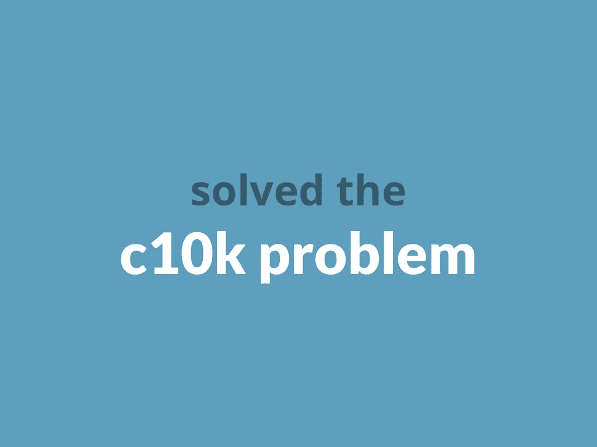
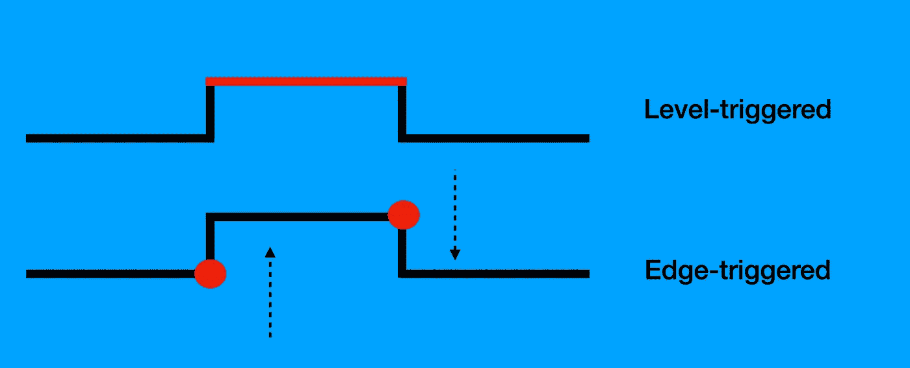
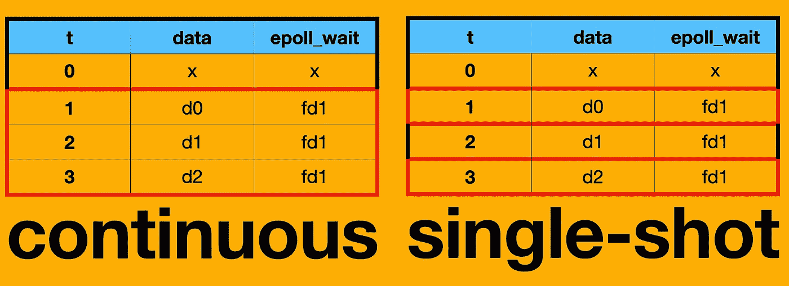
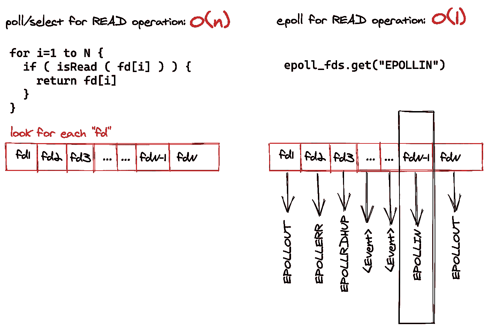

# 现代应用服务器基础

> 原文：<https://itnext.io/modern-application-server-basics-58a9aa8e9600?source=collection_archive---------2----------------------->

## 一个重要的知识是，在基于 Unix 的操作系统中，一切都是文件。许多操作系统对象表示为文件。

奥马尔·弗洛雷斯在 [Unsplash](https://unsplash.com?utm_source=medium&utm_medium=referral) 上拍摄的照片

网络调用是 I/O 交互的子类型。网络调用的第一步是创建套接字。所有的应用服务器启动一个套接字，并准备好为它们提供 IP 地址和端口号。初始化后，服务器准备接受新的连接。

可伸缩性是应用服务器的首要问题。我们让很多客户都可以使用，而不会阻止他们中的每一个。我们有一个生活区的程序。制造可伸缩服务器的“野蛮”方法是对每个请求创建另一个进程。但是现代应用服务器如何处理数百万个请求。

我们说过，在开始时，基于 Unix 的操作系统上的每个对象都是一个文件。但是每个网络请求、每个磁盘操作和每个 I/O 设备交互都有数百万次。我们如何以可用且灵活的方式在这些文件上进行交互。第一种方法是线程。进程将每个线程上的一个任务委托给交互内核来处理应用服务器上的每个请求。根据工艺，这些都是轻量级零件。然而，不管我们的应用服务器上的线程大小如何，多个线程可能一次访问同一个文件描述符。另一个问题是线程创建受到操作系统的限制。

# 如果我们使用同一个线程来处理多个请求会怎么样？

Linux 发行版有许多基于系统调用的 IO 复用机制，允许以非阻塞方式与相关资源进行“物理交互”。大多数现代应用服务器、平台都是在这些系统调用的基础上构建的。[丹·凯格尔将这些非阻断机制分为三类。](http://www.kegel.com/c10k.html)前两类名称依赖电路理论。

I/O 多路复用机制

# 级别触发的通知

级别触发是一种基于事件的文件处理方式，意味着当状态完全改变时，可以处理任何动作。在这种情况下，内核告诉线程文件是否准备好被处理。两个主要的系统调用用于执行这种“传统的”通知。它只是根据条件生成输出。然而，基于边缘的系统使用“活动”。

## 选择/投票

读取系统调用是一种遗留方式，它只观察一个描述符并等待它被处理。选择是同步多路复用 IO。但是它可以监视文件描述符的读写。请求是否会在定义的时间内过期，可能需要一个超时值。它返回要处理的文件描述符的数量。我们可以在与 ioctl 系统调用结合时使用异步应用服务器。

> ioctl，使用文件描述符进行设备交互的系统调用

轮询与选择系统调用具有相同的目标。我们可以给成千上万的文件描述符观看，虽然选择。

# 边缘触发通知

边缘触发意味着我们的系统将在状态转换发生时得到通知，包括从活动到非活动以及从非活动到活动。根据级别触发的通知，边缘是更复杂的系统，因为我们需要定义上升和下降阈值。当条件仍然有效时，级别触发的系统可以连续共享事件，但是边缘系统只能在边缘发生时立即共享事件。

## epoll / kqueue

epoll 不是系统调用。它是一个位于内核端的 API。它与轮询/选择系统调用进行相同的操作。它不是一个单独的命令，[它有三个系统调用，用于在操作系统](https://devarea.com/linux-io-multiplexing-select-vs-poll-vs-epoll/#.XyXXJxMzZ6I)上进行边缘触发通知。

[epoll 也工作在电平触发模式](https://copyconstruct.medium.com/the-method-to-epolls-madness-d9d2d6378642)。在级别触发模式下，当文件描述符可供处理时，它会连续发送一个 I/O 事件。与级别触发相反，无论文件描述符是否发生变化，都可以发布新的事件。手册页暗示级别触发的 epoll 是轮询系统调用的更快版本。

轮询调用使搜索变得容易一个重要的好处是，当找到可用的文件描述符时，epoll 调用具有 O(1)复杂度。当数据可用于处理时，poll 会尝试在所有已注册的文件描述符中检查合适的文件描述符。然而，无论每个文件描述符上是否发生新的 I/O 处理，基于边缘的 epoll 总是可以发送事件。因此很容易找到可用的文件描述符来进行 I/O 处理。kqueue 具有类似 epoll 的特性，但是只能在基于 BSD 的系统下工作。kqueue 和 epoll 都解决了这个瓶颈问题，解决了 c10k 问题，同时将复杂度降低到 O(1)。

另一个好处是 epoll 调用动态地允许新的套接字连接。当使用轮询调用建立新的套接字连接时，您需要初始化 step 以从内核获取可用的文件描述符。使用 epoll API，您只需发送一个事件来接受新的套接字连接。

基于轮询的系统调用使用用户空间来评估文件描述符。它应该将用户空间的大量数据复制到内核空间。然而，kqueue 和 epoll 也在内核空间中进行事件处理。它解决了代码空间之间的大量复制过程。

# **结论**

当我们检查 Linux 中的 I / O 机制时，可以看到 Kegel 的问题实际上是用基于事件的体系结构解决的。Golang 的 goroutine 结构，node js 的事件循环机制，netty 框架的通道结构，其实都是解决 c10k 问题的一些面向事件的解决方案。