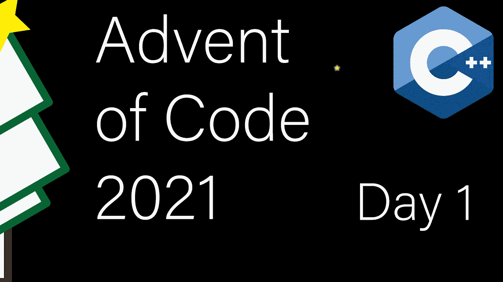

# 现代 C++代码的出现:第一天

> 原文：<https://itnext.io/modern-c-in-advent-of-code-day1-18f7697d4f6b?source=collection_archive---------0----------------------->

在这个新系列中，我将使用现代 C++一步一步地指导您解决《2021 年代码降临》的问题。由于这是本系列的第一部分，我还将描述 Bazel 构建系统的设置。

如果你不熟悉[代码](https://adventofcode.com/2021)的出现，我强烈建议你在查看这些解决方案之前自己解决它。

## 第一天:第一部分

给我们一个数列(正整数)。我们的目标是当系列中的一个数字高于前一个数字时，计算案例的数量。因此，举例来说，`0 0 0 0 0`的正确答案应该是`0`，而`1 2 3 4 5`的正确答案应该是`4`。

让我们从准备这个问题的测试用例开始，然后我们将跳入解决方案。但首先，我们需要决定我们到底想如何提供解决方案。因为这只是简单的计数，一个自由函数就足够了，而且因为我们将从文件中读取数据，所以输入参数为`std::istream`是有意义的。因此，我决定选择`uint32_t count_increasing(std::istream& s);`。

我使用 Google Test 作为测试运行时环境，只是因为它是 Bazel 的一个简单的默认环境。测试采用表驱动测试，我们将所有的输入和预期的输出格式化成一个数组，然后遍历子用例。如果您决定使用这种类型的测试，确保您使用`EXPECT`风格的测试宏而不是`ASSERT`，`EXPECT`宏将继续测试执行，即使在失败之后，这就是我们在这里想要的。我们希望看到表中所有失败的子案例，而不是停留在第一个案例上。

有了这个，我们就可以继续前进，实施解决方案。答案已经在问题提法里了。我们需要“统计案例”，C++提供了一个`std::count`算法。我们可以使用旧的 C++版本，也可以使用 C++20 中引入的`std::ranges`版本。下面是 C++20 版本:

让我们一行一行地检查解决方案。

*   在第 8 行中，我们使用了`std::count_if`，这是一个变量，它计算所提供的可调用函数返回`true`的情况。
*   第 9 行，我们使用`std::ranges::istream_view<uint32_t>`从一个期望正整数序列的`istream` 构造一个视图。
*   第 10 行是我们的有状态 lambda，它记住了最后看到的元素，并返回它是否小于当前元素。`std::exchange`会将`prev`设置为`curr`，并返回`prev`的先前值。

我们现在可以使用`bazel test //...`来对照测试检查解决方案(详见最后一节)。然后，我们需要一个简单的 main 来打开一个带有适当输入的文件，并将其传递给`count_increasing`函数。

## 第一天:第二部分

在第二部分，我们有一个额外的任务。我们首先需要计算三个元素的滑动窗口和，而不是比较每个测量值。例如，在`1 2 3 4 5`的情况下，我们将比较`1+2+3 < 2+3+4`和`2+3+4 < 3+4+5`。

这种变化不需要对界面进行任何调整。因此，我们可以坚持使用相同的功能原型，像以前一样，我们可以准备一组简单的测试。

用 C++20 范围实现这个有点棘手。视图是延迟计算的，它们不适合有状态的 lambdas。

我们仍然可以使用视图来构建一个表示三个元素总和的视图(第 3–6 行)。从逻辑上讲，我们现在想要使用`std::ranges::views::drop(2)`来删除前两个部分和(在`1 2 3 4 5`示例中，它们是`0+0+1`和`0+1+2`)。不幸的是，由于有状态 lambda，这并不可行。

我们可以将 drop 逻辑移动到我们的`count_if`(第 11-14 行)中，使得阅读起来更加困难。希望有了 C++23 中的扩展和修正，这段代码会干净很多(例如使用`zip_with`)。

目前，一个更干净的解决方案是范围循环:

由于`std::ranges::istream_view`，这个解决方案仍然是 C++20。

最后一步是像第 1 部分一样将解决方案包装在主函数中。

# 巴泽尔

最后，我想简单讨论一下 Bazel 构建系统。在我的项目中，Bazel 是我的个人偏好，原因如下:

*   构建文件非常清晰易读
*   轻松地与其他构建系统互操作，并且可以从 git 存储库或 tarballs 中引入外部库
*   扩展性非常好
*   在一个沙箱中运行所有的东西，这强制执行密封测试

例如，下面是两种解决方案及其测试的`BUILD`文件:

像 GoogleTest 这样的外部依赖项是在`WORKSPACE` 文件中配置的。

如果外部项目没有使用 Bazel，您将需要做更多的配置，但大多数情况下就是这么简单。

编译器标志和其他配置存在于`.bazelrc`中，或者可以在命令行上传递。

通过至少创建一个工作区和一个构建文件来配置您的构建之后，您就可以开始运行 Bazel 了。

*   构建一切:`bazel build //...`
*   测试一切:`bazel test //...`
*   构建具体文件:`bazel build //day1:sonar-trivial`
*   运行具体文件:`bazel run //day1:sonar-sliding`
*   带标志运行:`bazel run //day1:sonar-sliding -- $(pwd)/day1/input.txt`

# 链接和技术说明

每日解决方案存储库位于:[https://github.com/HappyCerberus/moderncpp-aoc-2021](https://github.com/HappyCerberus/moderncpp-aoc-2021)。

关于《代码降临》中其他日子的文章，[看看这个列表](https://medium.com/@happy.cerberus/list/advent-of-code-2021-using-modern-c-c5814cb6666e)。

请不要忘记亲自尝试[降临码](https://adventofcode.com/2021)。

# 感谢您的阅读

感谢您阅读这篇文章。你喜欢吗？

我也在 YouTube 上发布视频。你有问题吗？在 Twitter 或 LinkedIn 上联系我。