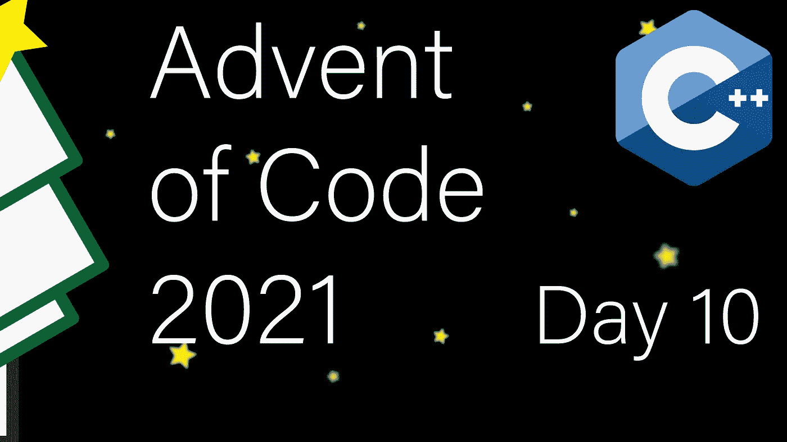

# 现代 C++代码的出现:第 10 天

> 原文：<https://itnext.io/modern-c-in-advent-of-code-day10-82fbe672b47?source=collection_archive---------2----------------------->

这是代码问世的第十天。今天，我们将检查和固定支架。

一如既往，请先尝试解决问题，然后再看解决方案。对于这个系列的所有文章，[看看这个列表](https://medium.com/@happy.cerberus/list/advent-of-code-2021-using-modern-c-c5814cb6666e)。

# 第 10 天:第一部分和第二部分

我们将收到多个括号公式，我们的第一个目标是通过识别放错位置的括号来检测损坏的公式:

当我们没有发现放错位置的括号时，我们将返回零:

处理括号公式时，在任何特定位置总是只有一个右括号有效。为了跟踪它是哪一个，我们将记录开始括号，然后当我们遇到对的结束边时删除它们。允许我们这样做的数据结构是`std::stack`。

最后，在 main 函数中，我们逐行读取输入并计算总分:

今天的第二项任务是完成未损坏的线路。我们需要提供一个函数来返回完成每一行的括号序列。

幸运的是，我们已经有了解决方案。当我们读完一行并且在堆栈中还有开括号的时候，这些括号就是需要关闭的括号，按照这个顺序。因此，我们迭代堆栈的内容，并将相应的右括号放入一个字符串中:

在我们编写主函数之前，我们还需要一个计分函数，因为这次的计分有点不同寻常:

最后，我们可以将所有这些放在一起，按照要求确定中值分数:

# 链接和技术说明

每日解决方案存储库位于:[https://github.com/HappyCerberus/moderncpp-aoc-2021](https://github.com/HappyCerberus/moderncpp-aoc-2021)。

[看看这个列表，里面有关于《代号](https://medium.com/@happy.cerberus/list/advent-of-code-2021-using-modern-c-c5814cb6666e)出现的其他日子的文章。

请不要忘记亲自尝试[降临码](https://adventofcode.com/2021)。

# 感谢您的阅读

感谢您阅读这篇文章。你喜欢吗？

我也在 YouTube 上发布视频。你有问题吗？在 Twitter 或 LinkedIn 上联系我。