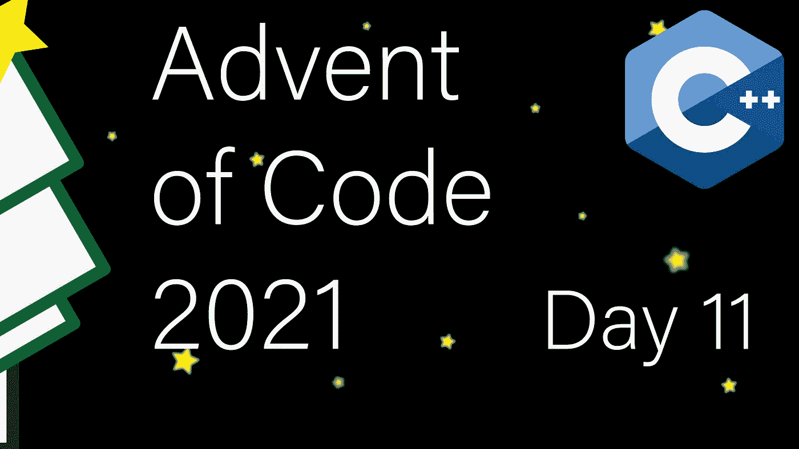

# 现代 C++代码的出现:第 11 天

> 原文：<https://itnext.io/modern-c-in-advent-of-code-day11-fe5a9eb6f3ad?source=collection_archive---------1----------------------->

今天是代码问世[的第十一天。今天，我们将模拟闪光的章鱼。](https://adventofcode.com/2021)

一如既往，请先尝试解决问题，然后再看解决方案。对于本系列的所有文章，[请查看这个列表](https://medium.com/@happy.cerberus/list/advent-of-code-2021-using-modern-c-c5814cb6666e)。

# 第 11 天:第一部分和第二部分

我们正在模拟实体(章鱼)的正方形网格。我们按照以下规则逐步模拟系统:

*   每走一步，每只章鱼的能量等级增加 1
*   当章鱼的能量达到 10 或更高时，它会闪烁
*   闪烁章鱼增加周围(所有八个方向)章鱼的能量等级 1
*   章鱼每走一步只能闪一次
*   所有闪现的章鱼都以 0 级能量结束本轮

由于每只章鱼有八个邻居，即使是低能量的章鱼也会闪光。此外，我们需要小心编码，以确保每只章鱼只闪烁一次。

让我们从声明和基本测试开始:

我们的 tick 函数将系统向前移动一个 tick，并返回在那个 tick 中闪烁的章鱼的数量。

解决这个问题的一个简单方法是，只要前一个循环中有章鱼闪烁，就进行循环(可能会产生更多会闪烁的章鱼)。然而，虽然简单，这也相当慢，我们可以做得更好。

我们知道每只章鱼只能闪现一次。我们还知道，只有当一些邻居闪烁时，状态为 8 或更低的章鱼才会闪烁。所以我们可以保留一份章鱼的“现成”清单。我们一直循环，直到这个列表为空，如果一只章鱼由于闪光而超过了阈值，就添加到这个列表中。

输入解析与[第 9 天](/modern-c-in-advent-of-code-day9-1ad4e7890032)相同。我们逐个字符地读取输入，将 ASCII 数字转换成它们的整数值。

在 tick 函数中，我们首先增加所有实体的能量级别，并记住那些准备闪烁的实体(第 24–30 行)。除了将 2D 坐标压缩成一个数字(第 28 行)，我们还可以使用一个结构来存储 2D 坐标，就像我们在 [Day 5](/modern-c-in-advent-of-code-day5-4777e4037869) 中使用 struct Point 所做的那样。

然后，当我们有任何准备闪光的章鱼时，我们循环。我们首先从集合中删除一个元素，解码坐标并记录这只章鱼已经闪现的内容(第 33–38 行)。之后，我们迭代所有的邻居。注意使用`ssize_t`(有符号大小类型)，以及边界条件来处理网格边界上的章鱼。最后，我们不接触已经闪现的章鱼(第 43 行)，如果邻居超过了阈值，我们会将其添加到列表中(第 46 行)。

然后，我们在主函数中需要做的就是对 100 个分笔成交点上的闪烁次数求和:

通过这种方法，我们也立即有了问题的第二部分的解决方案。我们必须在所有章鱼闪烁时检测第一次迭代。然而，我们已经知道有多少章鱼闪过。是`tick`返回的数字。所以我们将其与章鱼的总数进行比较:

# 链接和技术说明

每日解决方案存储库位于:【https://github.com/HappyCerberus/moderncpp-aoc-2021】T2。

[看看这个列表，里面有关于《代码降临》中其他日子的文章](https://medium.com/@happy.cerberus/list/advent-of-code-2021-using-modern-c-c5814cb6666e)。

请不要忘记亲自尝试[降临码](https://adventofcode.com/2021)。

# 感谢您的阅读

感谢您阅读这篇文章。你喜欢吗？

我也在 YouTube 上发布视频。你有问题吗？在 Twitter 或 LinkedIn 上联系我。