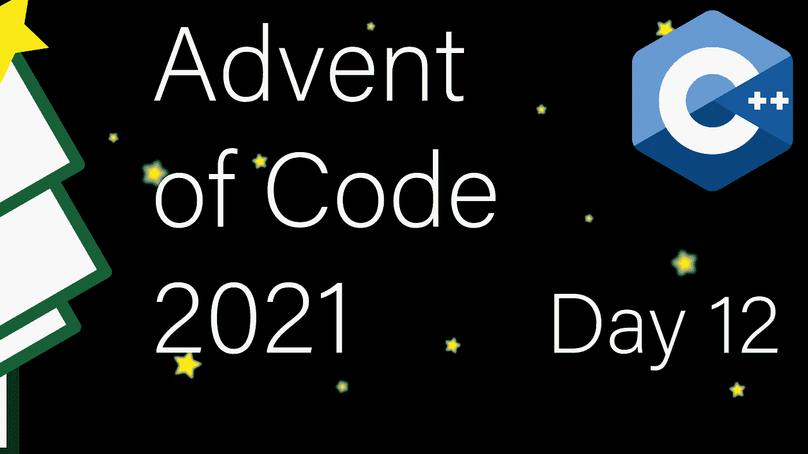

# 现代 C++代码的出现:第 12 天

> 原文：<https://itnext.io/modern-c-in-advent-of-code-day12-1de190deb2e4?source=collection_archive---------4----------------------->

今天是代码问世[的第十二天。今天，我们将遵循一些简单的限制来寻找穿过洞穴的路径。](https://adventofcode.com/2021)



一如既往，请先尝试解决问题，然后再看解决方案。对于本系列中的所有文章，[查看此列表](https://medium.com/@happy.cerberus/list/advent-of-code-2021-using-modern-c-c5814cb6666e)。

# 第 12 天:第一部分

我们今天的输入是一个洞穴图，用相邻对表示。任务是计算从节点“start”开始，到节点“end”结束的洞穴中唯一路径的数量。

没有任何限制，答案通常是无限的，因为在一个简单的图`S->A<->B->E`中，我们可以在 A 和 B 之间不断循环，并创建更多独特的路径。所以，为了使这个可行，我们有一个限制。我们只能参观一次小洞穴(用小写名称表示)。

我们需要在内存中很好地表示我们的图形。通常一个方便的方法是邻接表，对于每个节点，我们记住它的邻居。

我们还需要记住我们已经参观过的小洞穴:

这一次，我们从 AoC 获得了三个独特的输入进行测试，这简化了我们的测试:

在我们的输入解析中，我们翻译单向输入并存储两个节点的邻接信息:

请注意，插入(第 10 行和第 13 行)仅在映射中不存在键的情况下才会插入。除此之外，我们确保不创建返回“开始”和从“结束”的连接。

对于解决方案，这里要实现的核心思想是简单地通过求和来建立可能路径的数量。让我们以 AoC 的示例图为例:

```
 start
    /   \
c--A-----b--d
    \   /
     end
```

从`start`开始的路径数是从`start->A`开始的路径数加上`start->b`。我们可以继续应用这个想法。以`start->A`开头的路径数是以`start->A->c`、`start->A->end`、`start->A->b`开头的路径数。至此，我们已经到达了一个终极状态。只有一条路以`start->A->end`开始，因为我们永远无法离开`end`。

路径的数量是从该节点的邻居开始的路径的总和。除了以下例外:如果邻居是一个小洞穴，并且我们已经访问过它(第 4 行)，则路径数为零(即我们跳过邻居)，如果邻居是`end`(第 6 行)，则路径数为 1。否则，我们记得我们访问了这个邻居，如果它是一个小洞穴，以及从这个邻居开始到总数的路径数(第 12 行)。

这使得我们的主函数只有很少的代码:

但是，我们创建的界面有点笨拙。首先，我们总是从`start`开始，最重要的是，`Memory`对打电话的人没有帮助。我们泄露的只是一个实现细节。所以，让我们来解决这个问题:

# 第 12 天:第二部分

对于第 2 部分，我们有一个稍微不同的限制。我们被允许重访一个小洞穴。然而，我们只有时间重访其中一个洞穴。

我们可以重用第 1 部分中的相同逻辑。然而，当我们偶然发现一个我们已经去过的小洞穴时，如果我们还没有去过其他的洞穴，我们就有可能再去一次。

如果我们已经访问了这个洞穴(第 9 行)，如果我们没有访问任何其他洞穴(第 10 行)，我们允许重访。我们还需要小心回滚，我们首先撤销重新访问(第 19–20 行)。

遵循隐藏细节的相同逻辑，我们创建一个包装函数:

并扩展我们的 main 来打印两个结果:

# 链接和技术说明

每日解决方案存储库位于:[https://github.com/HappyCerberus/moderncpp-aoc-2021](https://github.com/HappyCerberus/moderncpp-aoc-2021)。

[看看这个列表，里面有关于《代号](https://medium.com/@happy.cerberus/list/advent-of-code-2021-using-modern-c-c5814cb6666e)出现的其他日子的文章。

请不要忘记亲自尝试[降临码](https://adventofcode.com/2021)。

# 感谢您的阅读

感谢您阅读这篇文章。你喜欢吗？

我也在 YouTube 上发布视频。你有问题吗？在 Twitter 或 LinkedIn 上联系我。