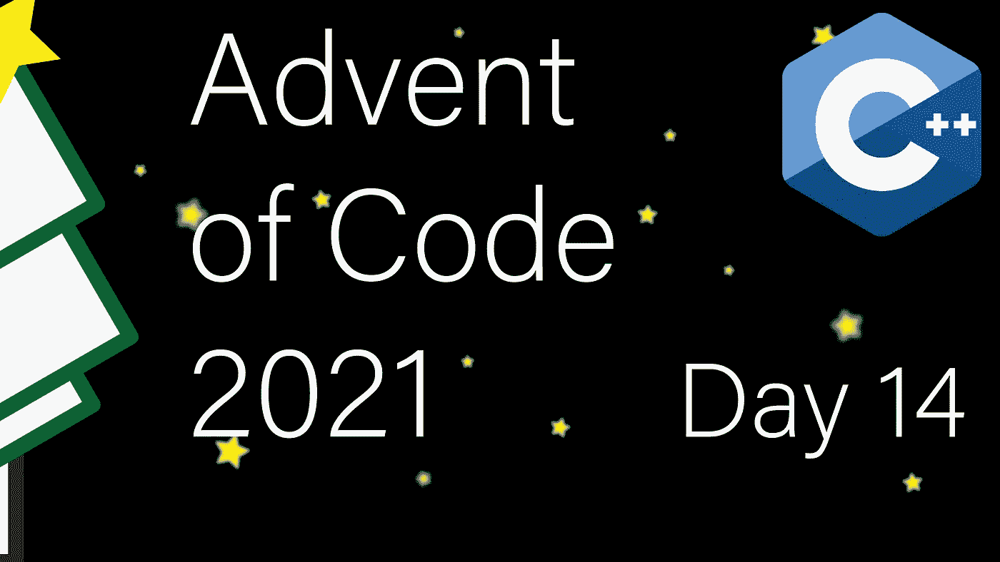

# 现代 C++代码的出现:第 14 天

> 原文：<https://itnext.io/modern-c-in-advent-of-code-day14-6f8347ec68d5?source=collection_archive---------0----------------------->

这是代码问世的第十四天[。今天，我们将使用 C++20 协同程序来扩展聚合物(然后使用频率计数的正确方法)。](https://adventofcode.com/2021)

一如既往，请先尝试解决问题，然后再看解决方案。对于本系列的所有文章，[请查看此列表](https://medium.com/@happy.cerberus/list/advent-of-code-2021-using-modern-c-c5814cb6666e)。

# 第 14 天:第一部分

我们的目标是重复扩展由大写字母表示的聚合物，使用扩展规则，通过在两个现有的两个字母之间插入一个新字母来扩展两个字母的序列。例如:`NNCB`使用规则`NN->C, NC->B, CB->H`扩展到`NCNBCHB`。

如果每对字母对应一条规则，我们最终会在每一步中使聚合物长度加倍，所以你可能会得到一个提示，简单地扩展聚合物可能不是正确的解决方案。然而，对于应用 C++20 协程来说，这是一个非常好的用例，以至于我不得不使用一种懒惰的强力方法来解决第 1 部分，我们将在第 2 部分讨论正确的解决方案。

那么什么是懒惰的强力方法呢？每一代将解决方案扩展 2 倍会带来两个问题。第一个是计算性的(每一步比前一步多运行 2 倍)。第二个问题是存储。对于具有 32GB 内存的典型机器，我们只能存储前 34 代的结果。

但是如果我们懒散地对待这个问题呢？我们只会在需要的时候展现一个角色。当然，这并不能解决计算问题，但我们将所需内存限制为代数的小倍数。

我们需要一个生成器协程。这个协程将产生字符，这些字符将被下一代或主进程使用，后者将计算字符的频率。然而，首先，我们还需要一个基线协程:

第一个协程将作为基础，从我们的初始输入生成字符。第二个协程是实际的扩展器，它将从上一代读取字符，然后在每两次读取之间产生一个额外的字符。

在我们的 main 函数中，我们解析输入，然后根据需要将这些协程堆叠到所需的深度(代数):

这样每一代消耗上一代生成的字符，最后 main 消耗结果，一个字符一个字符。

有了这个，我们需要实现我们的协程:

在我们的基本协程中，我们从输入中读取并逐个生成字符(第 2–3 行)。在实际的扩展器中，我们从上一代中读取字符，并将其作为参数接收。然后我们检查是否有匹配的扩展规则(第 12 行),如果有，我们产生额外的字符(除了产生字符 read——第 11 行和第 15 行)。

这样，我们就有了一个懒惰的强力解决方案，虽然速度很慢，但使用的内存很少。如果你觉得这很有趣，可以看看我的协程文章:[完整指南](/c-20-coroutines-complete-guide-7c3fc08db89d)，[实用示例](/c-20-practical-coroutines-79202872ebba)。

# 第 14 天:第二部分

好了，现在是时候妥善解决这个问题了。这里的核心观察是扩张是独立的。当我们扩展时，例如使用规则`AB->C`将`AB`扩展到`ACB`，扩展完全是局部的。它不影响字符`A`和`B`或字符串的任何其他部分。

用明确的术语来说:当我们应用扩展规则时，`AB->C`我们正在减少`AB`序列的数量，添加新的`AC`和`CB`序列，并添加字母`C`。

因此，最优解不需要展开聚合物。相反，它可以计算序列和字符的变化频率。

所以让我们回到我们的典型结构，从声明开始:

我们引入了一个自定义对，将其用作 unordered_map 中的一个键。它遵循与前几天的观点相同的想法。最后，我们将间歇频率包装在一个结构中，用一个来自起始聚合物的构造器初始化器和一个 tick 方法，该方法采用转换规则并将生成向前推进一步。

为了测试，我们使用来自 AoC 的输入:

对于输入解析，我们依赖于读取空格分隔的字符串，检查我们是否遇到了意外情况:

初始化时，我们记录每个字符和每对字符:

Tick 方法实现了前面提到的公式:

*   我们减少了输入对的实例数量(第 19 行)
*   我们增加插入字符的频率(第 20 行)
*   然后增加两个新对的频率(第 22–25 行)

请注意，没有临时变量我们无法做到这一点，因为第 22–25 行生成的新对可能是循环中尚未处理的对之一。

在我们的 main 中，我们解析输入，创建计数器的实例，并勾选所需的次数。最后，我们挑选最大和最小(非零)频率，并计算差异。

# 链接和技术说明

每日解决方案存储库位于:[https://github.com/HappyCerberus/moderncpp-aoc-2021](https://github.com/HappyCerberus/moderncpp-aoc-2021)。

[看看这个列表，里面有关于《代码降临》其他日子的文章](https://medium.com/@happy.cerberus/list/advent-of-code-2021-using-modern-c-c5814cb6666e)。

并且请不要忘记亲自尝试一下[降临码](https://adventofcode.com/2021)。

# 感谢您的阅读

感谢您阅读这篇文章。你喜欢吗？

我也在 YouTube 上发布视频。你有问题吗？在推特[或 LinkedIn](https://twitter.com/SimonToth83) 上联系我。