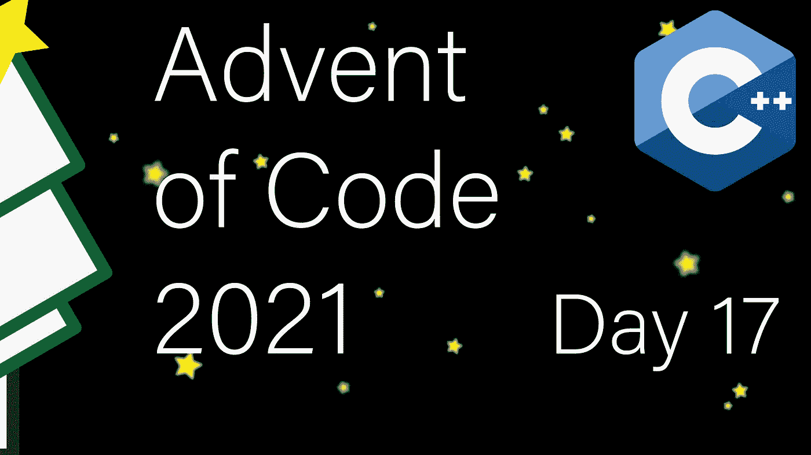

# 现代 C++代码的出现:第 17 天

> 原文：<https://itnext.io/modern-c-in-advent-of-code-day17-16333c720226?source=collection_archive---------2----------------------->

今天是代码问世[的第十七天。今天，我们将模拟一个抛射体在水中的轨迹。](https://adventofcode.com/2021)

一如既往，请先尝试解决问题，然后再看解决方案。对于本系列中的所有文章，[查看此列表](https://medium.com/@happy.cerberus/list/advent-of-code-2021-using-modern-c-c5814cb6666e)。

# 第 17 天

作为输入，我们接收目标的 x 和 y 位置，对于第一部分，我们的任务是确定一个奇特的轨迹，在这个轨迹上，我们希望尽可能高地发射炮弹，但仍然击中目标。

`target area: x=277..318, y=-92..-53`

模拟是初步的。每次滴答，抛射体基于其 x 和 y 速度移动，然后我们减小/增大这些速度:

*   x 速度趋于零；也就是说，负的 x 速度每增加一个节拍，正的 x 速度每减少一个节拍(零速度保持为零)
*   y 速度每一次跳动都减少(模拟重力)

如果我们将一个抛射体垂直向下发射，它会一直加速，如果我们将它垂直向上发射，它会减速，在某一点达到零速度，然后开始下落并加速。

从编程的角度来看，解决一般情况下的这个问题变得相当麻烦，也不是特别有趣。因此，我将做一些简化:

*   目标的 x 坐标总是正的
*   目标的 y 坐标总是负的
*   目标足够“宽”(我们将在后面讨论这个问题)

## 对称

让我们考虑一下，当我们向上发射时，抛射体的 y 位置会发生什么。在某个点，它将再次落在轴上(位置`y==0`，这是因为该过程是对称的(考虑零速度中点，周围的速度将是`...4 3 2 1 0 1 2 3 4...`)。这也意味着抛射体将有相同的速度穿过轴。

然后，我们可以乐观地假设，我们将能够找到相应的 x 速度，并考虑目标`y_min`的底线。可能的最高速度是抛射体在到达`y==0`后马上到达`y_min`。因此，起始速度就是`vy_max=-y_min-1`(比允许我们到达`y_min`的速度小一)。

一旦我们有了速度，我们就知道我们到达了中点`vy_max+1`，在这里速度将为零。最后，我们需要计算出实际的距离。

对于 y-position，我们知道位置是`vy + vy-1 + vy-2...`的和，可以改写为`vy*steps — (0+1+2...)`并简化和:`vy*ticks-ticks*(ticks-1)/2`。x 的公式非常相似，除了我们需要在速度为零的点停下来，所以`new_ticks=min(ticks,vx+1)`然后我们可以重用公式:`vx*new_ticks-new_ticks*(new_ticks-1)/2`。

因为我们知道速度，我们可以计算公式:

我确实提到了简化。我们有可能找不到一个 x 速度，也能以相同的节拍数落在目标上。为了解决一般情况下的这个问题，我们必须从`y_min`开始向上扫描，如果我们仍然没有找到匹配，考虑在`y==0`和到达目标之间有一个(或多个)中点的情况。

## 找到所有落在目标上的速度

正确的方法是从目标开始，使用 y 位置来确定可能的速度。我们知道`y==0`下面的距离必须表示为`vy+vy-1+vy-2...`，从那里，我们将产生所有相应的 x 速度，这些速度落在目标上。

然而，对于这么简单的事情来说，这太费力了。这是一种蛮力:

我们知道，我们的 y 速度必须至少为`y_min`，一步到达底部边界，最多为`vy_max`，这是我们在第一部分中确定的。类似地，对于 x 速度，最大值是`x_max`，它在一步中到达右边界(我们可以将最小值限制得更紧，但是没有理由)。

我为可能是一个令人失望的解决方案道歉，但是适当-适当的方法是如此远离蛮力解决方案的简单性，并且问题域是如此之小以至于我真的找不到能量。我希望它对你有所帮助。

# 链接和技术说明

每日解决方案存储库位于:[https://github.com/HappyCerberus/moderncpp-aoc-2021](https://github.com/HappyCerberus/moderncpp-aoc-2021)。

[查看此列表，了解《代号](https://medium.com/@happy.cerberus/list/advent-of-code-2021-using-modern-c-c5814cb6666e)问世前几天的文章。

请不要忘记亲自尝试[降临码](https://adventofcode.com/2021)。

# 感谢您的阅读

感谢您阅读这篇文章。你喜欢吗？

我也在 YouTube 上发布视频。你有问题吗？在[推特](https://twitter.com/SimonToth83)或 [LinkedIn](https://www.linkedin.com/in/simontoth) 上联系我。