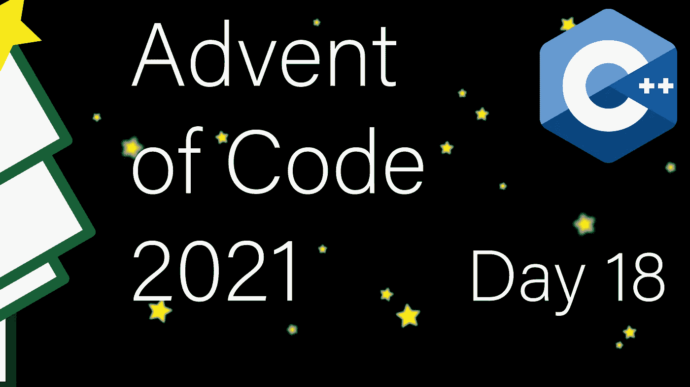

# 现代 C++代码的出现:第 18 天

> 原文：<https://itnext.io/modern-c-in-advent-of-code-day18-54942485460b?source=collection_archive---------0----------------------->

今天是[代码](https://adventofcode.com/2021)问世的第十八天。今天，我们将在数对树的顶部实现时髦的算法。



一如既往，请先尝试解决问题，然后再看解决方案。对于本系列中的所有文章，[请看这个列表](https://medium.com/@happy.cerberus/list/advent-of-code-2021-using-modern-c-c5814cb6666e)。

# 第 18 天

我们第 18 天的任务是实现一个表示嵌套整数对的数值类型，例如`[[1,2],3]`。然后我们需要实现一个加法运算，其中`[a]+[b] = [[a],[b]]`。当然，这太简单了，所以我们有一个复杂的问题，那就是数字规范化:

*   如果任何一对嵌套在四对中，最左边的一对就会爆炸
*   如果任何一个正则数是 10 或更大，最左边的这样的正则数分裂

我们按照列出的优先级应用这两个操作，但是一个接一个地重复它们。因此，我们只在没有要爆炸的配对时才拆分数字，即等价于:

```
do {
  while (explode());
} while (split());
```

分解一对时:

1.  该对被零替换
2.  左值被加到左边的第一个常规数字(如果有的话)
3.  右值被添加到右边的第一个常规数字(如果有的话)

拆分常规数字时:

1.  数字被一对代替
2.  该对的左值是除以 2 的数，向下舍入
3.  该对的正确值是该数除以 2 并向上取整

最后，我们感兴趣的是幅度，我们递归地计算为 3 *左+2 *右，其中正则数的幅度就是数本身。

## 那棵树

递归结构很好地映射到二叉树。每对都有两个元素，要么是正则数，要么是其他对。在 C++中有几种方法可以实现这一点。我决定采用一种简单的方法，其中每个节点都包含指向其他节点的指针和一个值:

当两个指针都为空时(第 17 行)，节点作为一个数字。否则，两个指针都必须有效并指向其他节点。默认构造函数、移动构造函数和移动赋值可以是默认的(第 2-4 行)。然而，我们需要为我们的复制构造函数和赋值实现一个深度复制(第 7、8 行)。到`uint64_t`的显式转换将实现幅度功能(第 10 行)。最后，我们需要实现输入、输出(第 19、20 行)和加号运算符(第 21 行)。

## 试验

这样，我们可以使用来自 AoC 的数据来构建我们的测试:

注意`one_explode`函数(第 31 行)，然后我们可以将它标记为我们类中的朋友，以允许白盒测试。通常不推荐白盒测试，但是我决定偷懒，因为 AoC 提供了只应用一次 explode 操作的例子。

## 深层拷贝

让我们从实现深度拷贝复制构造函数和赋值开始:

我们需要关注终端节点。除此之外，我们可以通过构造一个唯一的指针递归调用复制构造函数(第 4–5 行和第 18–19 行)。

## 解析和序列化

幸运的是，格式很简单，所以我们只检查意外的特殊字符，否则解析整数:

## 重要

## 加

最后，我们必须实现任务的复杂部分，即加号操作符。或者，准确地说，加法运算本身很简单:

但这仍然给我们留下了分解和分割功能。

我们保持递归(先左)并在第一次成功分割后终止。终止是由返回`true`(第 13 行)引起的，然后它被捕获(第 3 行)并阻止搜索从该点继续向右。

分解操作更加复杂:

除了用零值替换该对(第 28–30 行)之外，我们还必须跟踪看到的最后一个常规数字(第 15 行)，一旦我们应用了拆分，就将左边的值加到这个数字上(第 24–26 行)。一旦我们应用了 split，我们仍然需要继续搜索以找到下面的正则数字，然后我们将它增加(第 9-11 行)该对的右元素的值(第 27 行)。

如果我们找到了下面的常规数字，调用者将收到一个真返回值(来自第 12 行),或者如果我们没有找到，可选的将仍然保存一个值(第 4 行)。

## 解决方法

最后，我们需要做的就是读取所有的数字(第 2 行)并将它们相加(第 3 行)。然后，我们尝试所有的组合来计算所有二元和的最大值(第 6-13 行)。

# 链接和技术说明

每日解决方案存储库位于:[https://github.com/HappyCerberus/moderncpp-aoc-2021](https://github.com/HappyCerberus/moderncpp-aoc-2021)。

[看看这个列表，里面有关于《代码降临》](https://medium.com/@happy.cerberus/list/advent-of-code-2021-using-modern-c-c5814cb6666e)其他日子的文章。

请不要忘记亲自尝试[降临码](https://adventofcode.com/2021)。

# 感谢您的阅读

感谢您阅读这篇文章。你喜欢吗？

我也在 YouTube 上发布视频。你有问题吗？在推特或 LinkedIn 上联系我。