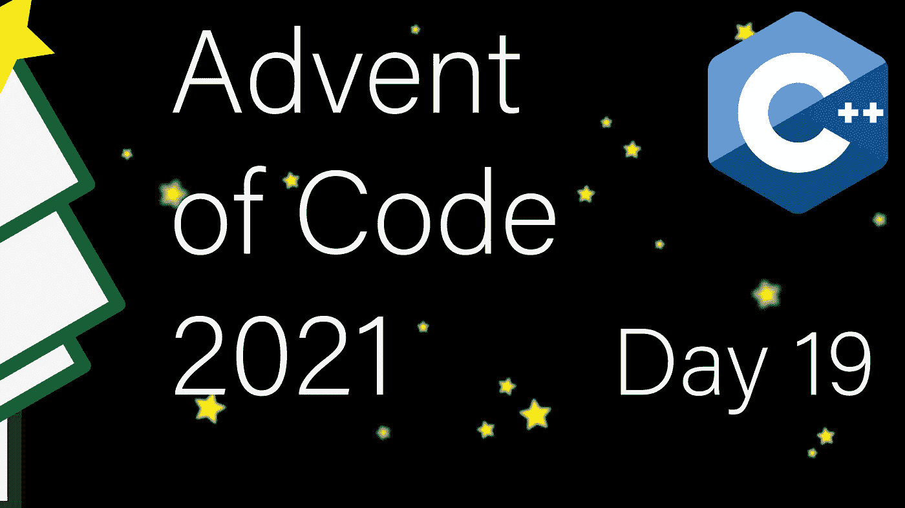

# 现代 C++在《代码的来临:第 19 天》

> 原文：<https://itnext.io/modern-c-in-advent-of-code-day19-ff9525afb2ee?source=collection_archive---------3----------------------->

今天是代码问世的第十九天[。今天，我们将根据传感器报告的数据来检测它们的方向和位置。](https://adventofcode.com/2021)

一如既往，请先尝试解决问题，然后再看解决方案。对于本系列中的所有文章，[请看这个列表](https://medium.com/@happy.cerberus/list/advent-of-code-2021-using-modern-c-c5814cb6666e)。

# 第 19 天

对于第 19 天，我们需要确定观察信标的传感器的位置。每个传感器处于未知方位的未知位置。然而，我们知道传感器在十二个或更多信标上与至少一个其他传感器重叠。

让我们暂时忽略方向，看看如何在一维情况下检测两个传感器是否重叠:

`-------A-i-j--B-k-------`

如果传感器 A 和 B 的方向相同(从左到右)，并且情况与图表相符，它们将报告以下值:

*   答:我:2，j:4，k:9
*   b:我:-5，j:-3，k:2

然后，我们可以很容易地验证这些传感器是否重叠，因为`2-(-5) == 4-(-3) == 9 — 2 == 7`也是传感器 B 与传感器 a 的相对位置。

我们的任务是 3D 的，这并不能改变问题。我们只是同时使用三个轴，它们都需要匹配。然而，棘手的是，传感器可以在 24 个有效方向中的任何一个方向上，例如，报告的[x，y，z]可以是[-z，x，-y](例如)。

我们知道一些传感器重叠了至少 12 个值。因此，我们可以尝试所有的方向。如果产生重叠，我们知道这是这两个传感器之间的正确方向和相对位置。

## 要点

我们需要一个 3D 点的表示:

我们还需要代表 24 种可能的方向:

您可以使用矩阵乘法生成这个表。然而，今天的问题足够复杂，所以我使用骰子旋转方法手动创建了这个表。

rotate 方法创建了一个三元素数组(第 24 行)，所以我们可以使用旋转索引(0，1，2)来选取 X，Y 或 Z 坐标，用`.second`表示符号。

## 扫描仪

每个扫描仪都有一个信标(3D 点)列表和两种方法:

`overlaps()`检查两台扫描仪是否至少在`threshold`个信标数量上重叠，然后`normalize()`将所有坐标修改为上一步计算的相对位置和方向。

今天的输入解析对于 C++来说尤其成问题。该格式使用带有减号的标题。试图在一个传感器的输入端读取一个数字将会从下一个传感器的头部读取负号。因此，我们必须逐行读取输入:

为了检测两个传感器是否重叠，我们迭代所有可能的方向。对于每个方向，如果至少有`threshold`对信标具有相同的相对 3D 位置增量，我们知道我们已经找到了我们期望的方向以及两个传感器之间的位置增量。

为了标准化，我们旋转并移动每个信标到期望的位置。

## 信标数量

为了计算信标总数，我们需要对所有扫描器应用重叠和归一化操作。为了避免重复工作，我们可以做一个简单的呼吸优先搜索:

我们尝试将每个传感器相互匹配(仍然是未标准化的传感器)。如果我们发现重叠，我们就正常化。

一旦所有传感器都标准化为传感器 0，我们必须根据它们的位置计算唯一信标。

## 曼哈顿距离

由于我们所有的传感器都计算了它们的相对位置(根据上一步)，我们可以循环扫描扫描仪以获得最长距离:

# 链接和技术说明

每日解决方案存储库位于:[https://github.com/HappyCerberus/moderncpp-aoc-2021](https://github.com/HappyCerberus/moderncpp-aoc-2021)。

[看看这个列表，里面有关于《代码降临》](https://medium.com/@happy.cerberus/list/advent-of-code-2021-using-modern-c-c5814cb6666e)其他日子的文章。

请不要忘记亲自尝试[降临码](https://adventofcode.com/2021)。

# 感谢您的阅读

感谢您阅读这篇文章。你喜欢吗？

我也在 YouTube 上发布视频。你有问题吗？在推特或 LinkedIn 上联系我。