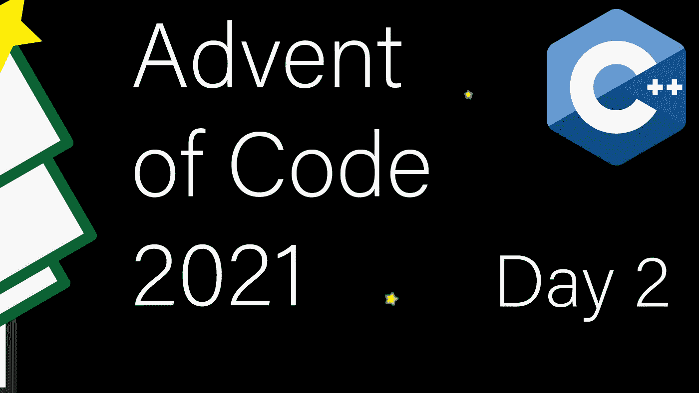

# 现代 C++代码的出现:第二天

> 原文：<https://itnext.io/modern-c-in-advent-of-code-day2-ca0af5bf0182?source=collection_archive---------1----------------------->

这是代码问世的第二天。今天我们将学习一个结构，看看宇宙飞船操作符。



一如既往，请先尝试解决问题，然后再看解决方案。对于本系列中的所有文章，[查看这个列表](https://medium.com/@happy.cerberus/list/advent-of-code-2021-using-modern-c-c5814cb6666e)。

# 第二天:第一部分

我们收到了文本形式的指令。该格式基于行，每行有一个命令，每个命令由一个方向和一个数值组成。

```
forward 10
down 2
up 1
```

解析文本是 C++标准库不擅长的领域之一。高级设施效率不是很高，低级设施也不是特别好用。我将坚持使用高级工具，但会指出代码中效率特别低的地方。

当我们解析输入时，我们需要一种方法来跟踪位置。最简单的方法是创建一个包含两个字段的简单结构:`depth`使用`up`和`down`命令进行调整，而`distance`使用`forward`命令进行调整。

可以为我们简化问题，孤立处理每一行。因为每个命令都转换成一个位置增量，所以我们可以解析一行并返回一个`Position`。然后，外部代码可以将增量添加到运行位置。

和第一天一样，我们将从编写这个行解析函数的测试开始:

注意，这段代码现在要求`Position`是可比较的，因为`EXEPECT_EQ`。我们可以通过在结构中添加一个默认的飞船操作符来快速解决这个问题。默认实现提供了一个字典式比较器，但是我们只需要`==`和`!=`。

现在是实现行解析的时候了:

我们首先从数字中找到分隔命令的空格(第 2 行)，然后将数字转换为整数(第 3 行)，并基于命令返回不同的位置增量。

如果我们真的关心性能，我们会使用`std::string_view`。不幸的是，标准库目前不提供将`std::string_view`转换成数字(直接)的功能，我们必须写一个关于`std::from_chars`的包装器。

也就是说，当我们强制复制`std::string`时，我们正在解析的所有命令都应该很好地适应小字符串优化。因此，即使有副本，我们也不应该造成内存分配，成本应该相当于使用`std::string_view`。

为了解析整个输入，我们现在逐行调用我们的行解析代码。但是首先，测试代码:

我们仍然缺少的一件事是将位置增量加在一起的方法。我们可以将`operator+=`添加到我们的`Position`结构中，这样我们就不必手动处理添加的内容。

有了行解析器和支持`operator +=`的`Position`，完整的解析代码变得非常简单:

我们逐行进行，直到到达文件的末尾，在每一行应用我们的行解析器，并将结果添加到运行总数中。

# 第二天:第二部分

问题的第二部分引入了一个有趣的转折。代替代表直接移动的`up`和`down`，它们改变方向，然后`forward`应用这个方向。

到目前为止，我们的代码是无状态的，每一行都被孤立地解释。方向的引入改变了`forward`的含义。因此，我们必须通过将我们的行解析代码改为有状态来跟踪方向。但是让我们从调整我们的`Position`结构开始。

将原始操作转移到成员函数中会使我们的解析代码更容易阅读。

这个测试还决定了我们如何向行解析器提供状态的接口。我们有其他选择，例如，这个解析代码也可以是我们的位置结构的成员函数:`pos.parse(line)`。

有了这些准备，我们的行解析器与第 1 部分的版本非常相似:

以非常相似的方式把所有这些放在一起:

我们仍然像以前一样在每一行上调用行解析器。然而，这一次，我们传递了保存在所有调用中的状态。

最后，由于我没有在第 1 部分展示它，让我们看看我们的主函数，它与 Day1 非常相似。

# 链接和技术说明

每日解决方案存储库位于:[https://github.com/HappyCerberus/moderncpp-aoc-2021](https://github.com/HappyCerberus/moderncpp-aoc-2021)。

关于《代码降临》中其他日子的文章，[请看这个列表](https://medium.com/@happy.cerberus/list/advent-of-code-2021-using-modern-c-c5814cb6666e)。

请不要忘记亲自尝试[降临码](https://adventofcode.com/2021)。

# 感谢您的阅读

感谢您阅读这篇文章。你喜欢吗？

我还在 T2 的 YouTube 上发布视频。你有问题吗？在[推特](https://twitter.com/SimonToth83)或 [LinkedIn](https://www.linkedin.com/in/simontoth) 上联系我。