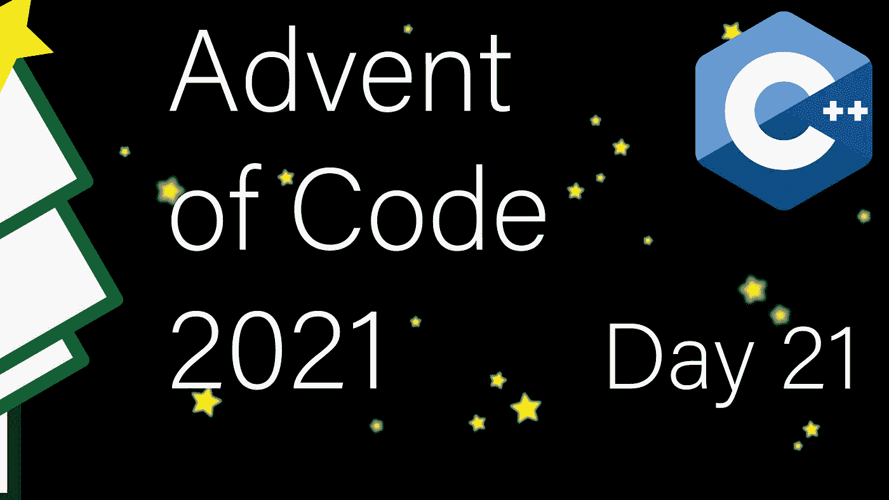

# 现代 C++代码的出现:第 21 天

> 原文：<https://itnext.io/modern-c-in-advent-of-code-day21-237edcc5034e?source=collection_archive---------2----------------------->

这是代码问世的第二十一天。今天，我们将模拟一个骰子游戏。

一如既往，请先尝试解决问题，然后再看解决方案。对于这个系列的所有文章，[看看这个列表](https://medium.com/@happy.cerberus/list/advent-of-code-2021-using-modern-c-c5814cb6666e)。

# 第 21 天

对于第一部分，我们得到一个非常简单的任务。我们正在模拟一个骰子游戏:

*   棋盘上有十个空格和圆圈
*   每个玩家掷出三个骰子(或者，在我们的例子中，一个骰子掷三次)，然后移动掷出的空格总数
*   移动后，玩家分数增加空间的值(1..10)
*   第一个达到 1000 分的玩家获胜

我们得到一个确定性的 100 面骰子，它将滚动单调递增的数字(从 1 开始)。我们的任务是确定赢家，并报告输家的分数和游戏掷骰子的次数。

让我们正确地模拟这个游戏，为此，我们需要一个骰子:

实现骰子有很多种方法。例如，一个生成器协程或`std::ranges::views::iota`。然而，因为我们只有一个骰子，所以一个简单的静态函数将在这里工作。

为了模拟游戏，我们进行迭代，直到达到获胜条件:

## 多元宇宙

对于问题的第二部分，我们得到了一个三面骰子，它在每一卷上将宇宙分成三个多元宇宙。给定他们的开始状态，我们必须计算两个玩家赢的宇宙的数量。

首先，让我们想一想，当我们掷出三次这个特殊的骰子时，会发生什么。掷骰子有 27 种可能的组合。但是，总和只会在 3 到 9 之间。因此，我们达到相同总和的宇宙将无法区分。

那么我们如何计算宇宙的数量呢？我们可以通过对所有可达到的状态求和来递归计算任何特定状态的宇宙数量，直到我们达到一个终止条件(其中一个玩家的分数为 21 或更多)。

这种解决方案是可行的，但是非常慢。这是因为当我们在递归展开中通过不同的路径到达相同的状态时，我们不断地重新计算相同的状态很多次。但是，我们可以通过添加缓存来避免这种情况。

我们利用对称性稍微简化了缓存，这允许我们不在缓存中存储“当前玩家”标志(并使计算更快)。但是，在使用 player2(第 45 行和第 69 行)时，我们需要小心反转数据。

# 链接和技术说明

每日解决方案存储库位于:[https://github.com/HappyCerberus/moderncpp-aoc-2021](https://github.com/HappyCerberus/moderncpp-aoc-2021)。

查看此列表，了解《代码降临日》的其他相关文章。

请不要忘记亲自尝试一下[代码](https://adventofcode.com/2021)的问世。

# 感谢您的阅读

感谢您阅读这篇文章。你喜欢吗？

我还在 T4 的 YouTube 上发布视频。你有问题吗？在 Twitter 或 LinkedIn 上联系我。