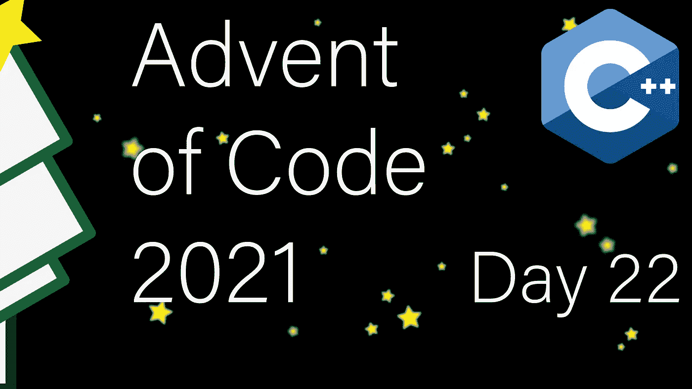

# 现代 C++代码的出现:第 22 天

> 原文：<https://itnext.io/modern-c-in-advent-of-code-day22-ff85b2540d9b?source=collection_archive---------3----------------------->

这是代码问世的第二十二天。今天，我们将交叉 3D 范围。



一如既往，请先尝试解决问题，然后再看解决方案。对于本系列的所有文章，[请查看这个列表](https://medium.com/@happy.cerberus/list/advent-of-code-2021-using-modern-c-c5814cb6666e)。

# 第 22 天

今天，我们的任务是处理在 3D 范围内激活和去激活体素的开和关指令。我们的最终输出是处理完所有指令后活动体素的数量。

```
on x=-7..47,y=-1..44,z=-40..13
off x=-47..-31,y=12..24,z=4..19
```

当应用指令时，我们可以将重叠的长方体分割成更小的不重叠的长方体。然而，由于我们只对活动体素的总和感兴趣，我们可以简化这个问题。

让我们先来看看 2D 版本。有两条指令:

```
on x=1..3,y=1..3
on x=3..5,y=3..5
```

这会导致以下情况:

```
XXX
XXX
XX@YY
  YYY
  YYY
```

如果我们计算像素的数量(9+9)，我们将会过度计算交集，这可以通过生成一个新的指令来补偿。

```
on x=1..3,y=1..3
on x=3..5,y=3..5
off x=3..3,y=3..3
```

我们可以对每个指令重复遵循这个逻辑。如果与列表中的现有指令有重叠，我们生成相应的补偿指令。

添加否定指令的工作方式有点不同。

```
on x=1..3,y=1..3
off x=2..4,y=2..4
```

结果是:

```
XXX
X..
X..
```

因此，我们不想将否定指令添加到列表中，相反，我们只想保留交集。在这种情况下:

```
on x=1..3,y=1..3
off x=2..3,y=2..3
```

让我们总结结果:9–4 = 5。

## 要点和说明

我们可以重用以前的 3D 点类型。

然后在此基础上构建表示指令类型:

为了解析规则，我们读取每一行，然后解析结果字符串:

交集(如果存在的话)仅仅是最小边界的最大值和最大边界的最小值。补偿规则总是与其适用的规则相反:

## 计算体素

为了确定体素的最终数量，我们需要处理所有的输入，在进行过程中生成补偿规则:

对于第一部分，我们需要将自己限制在一个更小的范围内(第 6-11 行)。之后，我们简单地将我们的规则与所有现有规则相交，生成补偿规则(第 19 行)。最后，我们简单地对所有生成的规则的所有体素进行计数，将负规则作为负值计数(第 25 行):

# 链接和技术说明

每日解决方案存储库位于:【https://github.com/HappyCerberus/moderncpp-aoc-2021】T4。

查看此列表，了解《代码降临》其他日子的相关文章。

请不要忘记亲自尝试[降临码](https://adventofcode.com/2021)。

# 感谢您的阅读

感谢您阅读这篇文章。你喜欢吗？

我也在 YouTube 上发布视频。你有问题吗？在[推特](https://twitter.com/SimonToth83)或 [LinkedIn](https://www.linkedin.com/in/simontoth) 上联系我。