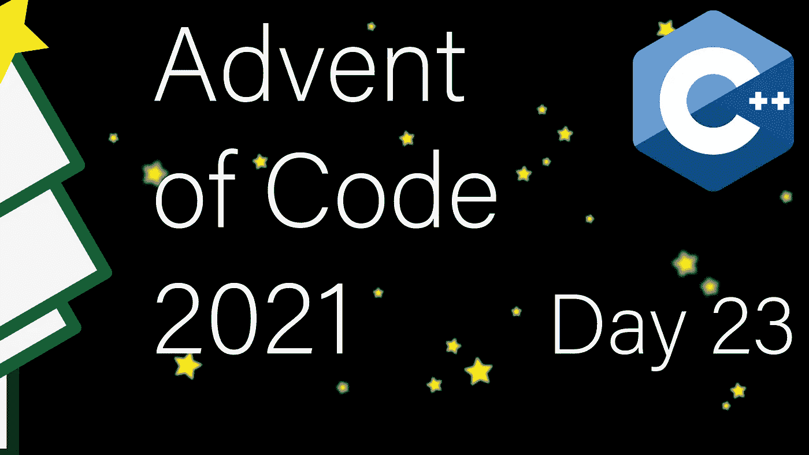

# 现代 C++代码的出现:第 23 天

> 原文：<https://itnext.io/modern-c-in-advent-of-code-day23-cb9a0cc30ee3?source=collection_archive---------0----------------------->

这是代码问世的第二十三天。今天，我们将寻找最便宜的方法来重组片脚类动物。



一如既往，请先尝试解决问题，然后再看解决方案。对于本系列的所有文章，[请查看此列表](https://medium.com/@happy.cerberus/list/advent-of-code-2021-using-modern-c-c5814cb6666e)。

# 第 23 天

今天我们的任务是找到一种最便宜的方法，使用一个连接的“走廊”来重新排列“房间”中元素的位置。移动成本因元素类型而异，我们有:

*   琥珀(A)片脚类，价格为 1 级
*   青铜(B)片脚类，价格为 10 级
*   铜(C)片脚，价格为 100 步
*   沙漠(D)片脚类动物，价格为 1000 英镑

对于第一部分，每个房间有两个，圆点代表最初空着的走廊:

```
#############
#...........#
###B#C#B#D###
  #A#D#C#A#
  #########
```

对于强力解决方案来说，这将是一个有问题的任务，因为找到最便宜的解决方案需要探索所有可能的解决方案(也就是说，减去一些早期回报)。

幸运的是，我们对可能的移动有一些限制:

*   如果我们把一只片脚动物移到走廊里，它会一直呆在那里，直到它可以移动到它的最终目的地(它适合的房间)
*   我们不能把片脚类动物移到“入口”空间，也就是房间正前方的空间
*   我们只能将一个片脚动物移入一个房间，如果那是它的目的地房间，并且没有“访客”在场(没有不同类型的片脚动物)

有了这些限制，进行彻底的搜索是可行的。

## 房间

让我们从一个房间的表示开始。至少，我们需要的操作是`push()`(向房间添加一个元素并报告成本)和`pop()`(从房间移除一个元素并报告成本)。而且要看最上面的元素，一个`top()`的方法。

其他方法将有助于寻找解决方案。我们稍后将使用所有者和初始内容初始化每个房间:

```
auto room = Room{'A', {'C', 'B'}};
```

主要的复杂性是小心地更新固定元素的大小和数量(我遇到了一个在测试中没有考虑到的错误)。

## 谜题

既然我们已经解决了房间管理的细节问题，我们可以专注于搜索本身了。我们可以贪婪地做两个操作，因为它们保证是最优的:

*   将片脚动物从走廊移至目的地房间
*   将片脚从一个房间的顶部移动到目标房间

当我们没有贪婪的举动可用时，剩下的唯一事情就是尝试将一个放置错误的片脚动物从房间移到走廊。这是我们将进行彻底搜索的地方，因为我们将尝试所有可移动的片脚动物的所有可能位置:

对于贪婪的操作，我们检查走廊/有访客的房间顶部的所有占用空间(第 9/26 行)，并检查我们是否可以将这种片脚动物移动到走廊的另一端——没有任何障碍物(第 16/32 行),然后计算移动成本。

我们的穷举搜索是递归的。我们首先应用所有贪婪操作(第 29–34 行)。然后继续尝试将片脚动物从一个房间移动到走廊的所有可能性(第 42-45 行)，检查是否有任何东西挡路(第 48 行)。最后，我们用这个变化创建一个状态的副本并递归(第 50，51，54 行)。

因为我们只需要报告成本，所以如果我们找到任何可行的解决方案，我们就更新最小值并报告它(第 60–63 行)。

## 主要的

随着解决疲劳的出现，我今天没有费心解析输入:

我为今天一个不是特别聪明或漂亮的解决方案道歉。然而，它仍然安全地运行在一秒钟之内。

# 链接和技术说明

每日解决方案存储库位于:[https://github.com/HappyCerberus/moderncpp-aoc-2021](https://github.com/HappyCerberus/moderncpp-aoc-2021)。

[看看这个列表，里面有关于《代码降临》其他日子的文章](https://medium.com/@happy.cerberus/list/advent-of-code-2021-using-modern-c-c5814cb6666e)。

并且请不要忘记亲自尝试一下[降临码](https://adventofcode.com/2021)。

# 感谢您的阅读

感谢您阅读这篇文章。你喜欢吗？

我也在 YouTube 上发布视频。你有问题吗？在推特[或 LinkedIn](https://twitter.com/SimonToth83) 上联系我。