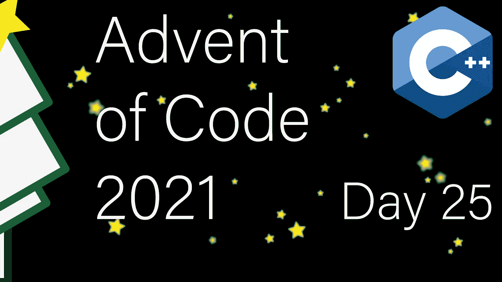

# 现代 C++代码的出现:第 25 天

> 原文：<https://itnext.io/modern-c-in-advent-of-code-day25-29630dd6b5d9?source=collection_archive---------0----------------------->

今天是代码问世[的第二十五天。今天我们将模拟海参的运动。](https://adventofcode.com/2021)

一如既往，请先尝试解决问题，然后再看解决方案。对于本系列中的所有文章，[请看这个列表](https://medium.com/@happy.cerberus/list/advent-of-code-2021-using-modern-c-c5814cb6666e)。

# 第 25 天

我们有一个简单的任务，在代码 2021 出现的最后一天。我们需要模拟一群从西向东(`>`)或从北向南(`v`)移动的海参。我们的目标是确定所有海参被卡住需要多少步(即状态不再改变的点)。

海参分两步走。第一，所有东移黄瓜都考虑能不能动(前面有个空位)。然后，在向东移动的黄瓜已经移动(或者没有移动)之后，我们对向南移动的黄瓜做同样的操作。

这个问题的主要复杂性来自于仔细处理输入的需要，因为我们很容易错误地移动黄瓜。考虑下面的输入:`>...>>`。这种情况下很容易犯移动两根黄瓜的错误，导致`>>..>.`，而正确的输出是:`.>..>>`。

## 输入－输出

在查看解决方案之前，让我们快速进入输入和输出。

输入是一个字符网格，我们可以逐行读取:

## 解决办法

我们自然地在运动的方向上处理输入，我们可以通过考虑空白空间并询问是否有东西会移动到这个空间来进一步简化逻辑:

我们在源索引的计算中隐藏了换行逻辑(第 5 行和第 15 行)。我们考虑输入中的空白空间，在西边有一根黄瓜，用于从西向东的传递(第 6 行)。这是因为这些是唯一会动的黄瓜。我们还需要考虑由西向东移动为南北通道创造的空间。然而，我们必须小心，因为这个空间可能是由于将黄瓜向南移动而产生的，所以我们仔细检查输入(第 16 行)。

我们跟踪移动了多少黄瓜(第 9 行和第 19 行)。这意味着我们只需要循环，直到这个数字达到零:

这就是我为《2021 年代码降临》撰写的系列文章。如果你觉得它们有帮助，我希望收到你的来信。你有更好的解决方法吗？让我知道！

还有，pst，一个秘密，我将把这个系列重写为一个简短的课程风格的书，这将是完全免费的，所以请留意公告。

# 链接和技术说明

每日解决方案存储库位于:[https://github.com/HappyCerberus/moderncpp-aoc-2021](https://github.com/HappyCerberus/moderncpp-aoc-2021)。

[看看这个列表，里面有关于《代码降临》其他日子的文章](https://medium.com/@happy.cerberus/list/advent-of-code-2021-using-modern-c-c5814cb6666e)。

并且请不要忘记亲自尝试一下[降临码](https://adventofcode.com/2021)。

# 感谢您的阅读

感谢您阅读这篇文章。你喜欢吗？

我也在 YouTube 上发布视频。你有问题吗？在推特[或 LinkedIn](https://twitter.com/SimonToth83) 上联系我。