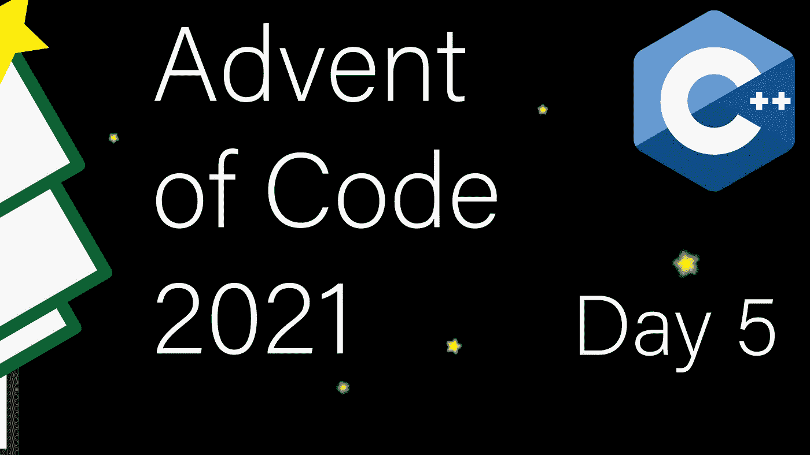

# 现代 C++代码的出现:第 5 天

> 原文：<https://itnext.io/modern-c-in-advent-of-code-day5-4777e4037869?source=collection_archive---------7----------------------->

这是代码问世的第五天。今天，我们将解一些方程来找出线的交点。

一如既往，请先尝试解决问题，然后再看解决方案。对于本系列中的所有文章，[查看这个列表](https://medium.com/@happy.cerberus/list/advent-of-code-2021-using-modern-c-c5814cb6666e)。

# 第五天:第一部分

我们得到一个格式为`x1,y1 -> x2,y2`的线条列表，任务是确定多条线条相交的所有点。对于第 1 部分，我们将忽略所有非轴向的线(水平或垂直)。

两条线什么时候相交？考虑作为交集一部分的点`[x,y]`。自然，肯定是:`line1.x1 <= x <= line1.x2`、`line2.x1 <= x <= line2.x2`、`line1.y1 <= y <= line1.y2`、`line2.y1 <= y <= line2.y2`。如果我们把这些公式放在一起，我们得到:

*   `max(line1.x1,line2.x1) <= x <= min(line1.x2,line2.x2)`
*   `max(line1.y1,line2.y1) <= y <= min(line1.y2,line2.y2)`

鉴于此，交点要么不存在，要么是直线`max(line1.x1,line2.x1),max(line1.y1,line2.y1) -> min(line1.x2,line2.x2),min(line1.y2,line2.y2)`。

请注意，这仅在`x1<x2`和`y1<y2`时有效，这是我们在读取输入时可以轻松实现的。

为了简单起见(我也找不到动机对这样一个小输入做更复杂的事情)，我们将对照所有先前读取的行测试我们读取的每一行，并将结果交叉点保存在一个`unordered_set`中。

我们将需要一个点的表示，并使该点可散列，因为我们想在`unordered_set`中存储点。

我们需要一条线的表示:

由于交叉点可以是空的，我们使用`std::optional`来避免使我们的线结构复杂化(来表示空的线段)。

声明完成后，我们可以编写测试了:

首先，我们需要 I/O 实现:

我们按照预期的格式阅读，如果遇到问题就提前返回。当我们遇到意外的分隔符时，我们还需要在输入流上设置`std::ios_base::badbit`(第 11 行和第 35 行)。正如已经提到的，我们修改输入，使`start.x <= end.x`和`start.y <= end.y`。请注意，这仅适用于零件 1，且仅适用于轴线。

最后，我们实现我们已经讨论过的公式。

在我们的 main 中，我们读取所有的线，跳过不在轴上的线，并存储相交部分的所有点。

# 第五天:第二部分

在第二部分中，对角线问题变得更加复杂。因此，我们需要一个更通用的解决方案来找出交叉点。

有两种类型的交点需要考虑:单点交点，即具有不同方向的两条线段在一点相交；或者叠加交点，即具有相同方向的线段在一个或多个点重叠。

我们可以像第 1 部分一样解决叠加交点，但我们需要一个单点交点的通用解决方案。

考虑这个交点`[x,y]`。它必须在两条线路上都可以到达。因此`x = line1.start.x + m*line1.xdir`和`x = line2.start.x + n*line2.xdir`，其中`m`和`n`分别是该点到`line1`和`line2`中直线起点的距离。y 也一样:`y = line1.start.y + m*line1.ydir`和`y = line2.start.y + n*line2.ydir`。

我们可以把这些等式放在一起:

*   `line1.start.x + m*line1.xdir = line2.start.x + n*line2.xdir`
*   `line1.start.y + m*line1.ydir = line2.start.y + n*line2.ydir`

有了两个方程，我们现在可以求解 m 和 n。我们最终得到一个有两个角点的分数。我们可以除以 2，但分子不是偶数。当对角线在视觉上交叉，但交叉点在我们的“像素”的角上时，就会发生这种情况(例如线`0,0 -> 5,5`和`0,5 -> 5,0`)。我们也可以除以零，这发生在平行线上。最后，位于线段外的点可以满足该方程(这些方程适用于直线)。

虽然我们的点结构保持不变，但我们需要扩展线结构。覆盖式相交由`does_overlay`、`does_intersect`和`intersect`处理，基于点的相交由`single_point_intersect`和`is_within`处理。

这部分的测试范围更广。我必须创建特殊的测试用例来追踪我的代码中的特定 bug(第 16–22 行)。

从`is_within`开始，检查一个点是否在线段内。我们需要确保在被`xdir()`和`ydir()`除的时候不会被零除。我们检查该点是否不在线段之外，并再次检查两个轴是否匹配。

另一个新功能是检查覆盖交叉点。只有具有相同方向性的线段和同一条对角线上的对角线(10 号线)才能重叠。

最后，我们的两个交集计算:

我们正在引入额外的`does_overlay`检查(第 2 行)并调整 y 轴上倾斜到零的对角线的结果(第 6–8 行)。

我们检查已经提到的拐角情况:平行线、网格拐角处的交点和外部线段。除此之外，我们只是 1:1 地实现数学公式。

我们将所有这些都集中在我们的主要:

我们再次一行一行地阅读这些行，并对照所有已经阅读过的行进行检查。如果这些线没有相互重叠(线 6)，它们仍然可能有一个单点相交(线 21)。

# 链接和技术说明

每日解决方案存储库位于:[https://github.com/HappyCerberus/moderncpp-aoc-2021](https://github.com/HappyCerberus/moderncpp-aoc-2021)。

[查看此列表，了解《代号](https://medium.com/@happy.cerberus/list/advent-of-code-2021-using-modern-c-c5814cb6666e)问世前几天的文章。

请不要忘记亲自尝试[降临码](https://adventofcode.com/2021)。

# 感谢您的阅读

感谢您阅读这篇文章。你喜欢吗？

我也在 YouTube 上发布视频。你有问题吗？在 Twitter 或 LinkedIn 上联系我。