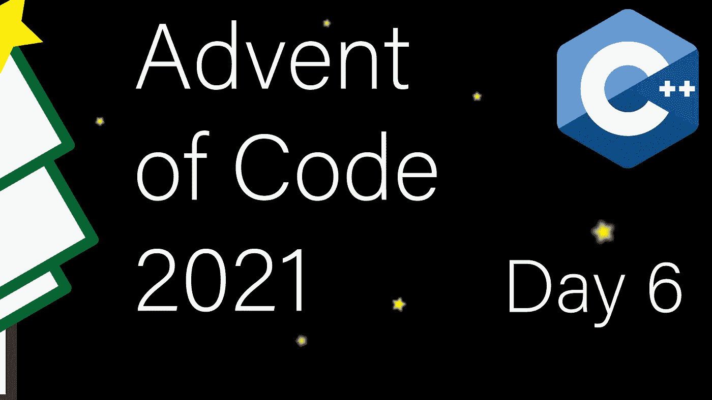

# 现代 C++代码的出现:第 6 天

> 原文：<https://itnext.io/modern-c-in-advent-of-code-day6-aca753568b8c?source=collection_archive---------2----------------------->

这是代码问世的第六天。今天，我们将把指数增长转化为常数空间解，并看看编译时编程。

一如既往，请先尝试解决问题，然后再看解决方案。对于本系列中的所有文章，[查看此列表](https://medium.com/@happy.cerberus/list/advent-of-code-2021-using-modern-c-c5814cb6666e)。

# 第六天:第一部分和第二部分

我们的任务是模拟每七天繁殖一次的灯笼鱼种群(新一代需要额外的两个周期来“成长”)。不幸的是，模拟这样一个系统迫使我们避免模拟每个个体，因为我们会很快耗尽内存。

那么，我们如何重新表述这个问题，这样我们就不需要跟踪每个人了？考虑到具有相同内部定时器的所有 lanternfish 行为相同，因此我们可以跟踪具有内部定时器的每个状态的 lanternfish 的数量，该状态将永远是`0..8`。在每一天，我们删除第一个元素，即繁殖镧系鱼的数量，将所有其他镧系鱼转移到更低的内部状态，并将繁殖镧系鱼添加到状态`6`(对于父母)和`8`(对于后代)。

我们使用`std::deque`来简化状态转换。

对于测试，我们有一个简单的测试来检查灯笼鱼是否正确繁殖，然后使用来自 AoC 的测试数据:

实现遵循概述的结构:

我们需要小心，因为我们很容易用`uint32_t`溢出，这就是为什么我们用`UINT64_C(0)`实例化`std::accumulate`，强制运行总和为`uint64_t`(第 19 行)。我们还在复制时检查溢出(第 26 行)。

最后，在我们的 main 中，我们读取一行输入并循环所需的代数:

# 第 6 天:编译时解决方案

因为今天问题的解决方案非常简单，所以我决定提供一个额外的好处，一个在编译时完全计算的解决方案。

有了现代的 C++，我们可以避免过去典型的模板代码。Constexpr 函数现在允许高表达性，并且许多标准库设施都可以作为`constexpr`使用。

# 链接和技术说明

每日解决方案存储库位于:[https://github.com/HappyCerberus/moderncpp-aoc-2021](https://github.com/HappyCerberus/moderncpp-aoc-2021)。

查看此列表，了解《代码降临日》的其他相关文章。

请不要忘记亲自尝试一下[代码](https://adventofcode.com/2021)的问世。

# 感谢您的阅读

感谢您阅读这篇文章。你喜欢吗？

我还在 T4 的 YouTube 上发布视频。你有问题吗？在 Twitter 或 LinkedIn 上联系我。