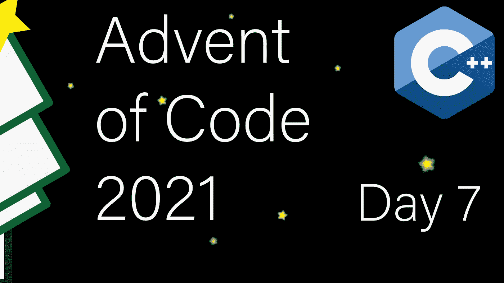

# 现代 C++代码的出现:第 7 天

> 原文：<https://itnext.io/modern-c-in-advent-of-code-day7-39b74e4375a5?source=collection_archive---------2----------------------->

这是代码问世的第七天。今天，我们将严重依赖算法。我们还将经历优化其中一个解决方案的过程。

一如既往，请先尝试解决问题，然后再看解决方案。对于本系列中的所有文章，[查看此列表](https://medium.com/@happy.cerberus/list/advent-of-code-2021-using-modern-c-c5814cb6666e)。

# 第七天:第一部分

我们的目标是确定螃蟹潜艇的最佳水平位置。输入是由逗号分隔的位置列表，例如`16,1,2,0,4,2,7,1,2,14`。

我们的目标是将潜艇移动到目标位置的总成本最小化，其中每艘潜艇的成本就是离目标的距离。因此，例如，对于输入`0,2,2,3`，最佳目标将是`2`，成本也是`3`(位置 0 的潜艇的两个成本和位置 3 的潜艇的一个成本)。

让我们像往常一样从声明和测试开始:

我们将从一个简单的实现开始。解决方案将接近平均值和中间值。所以我们可以对潜艇进行分类，然后从中点左右扫描，看看总成本是否在提高。

输入的解析遵循以前的模式。我们一直读到输入结束，并检查有效的分隔符。

排序后(第 16 行)，我们计算初始和(第 21 行)，然后尝试左右迭代，对每个元素，检查具有新中点的和是否更好。最后，我们返回两个搜索中最好的一个(第 47 行)。

# 第七天:第二部分

在第二部分中，我们调整计算成本的公式。成本不再是线性的。相反，每一步都越来越贵，也就是说，移动潜艇一步需要花费`1`，两步`1+2`，五步`1+2+3+4+5`，等等。

重要的是，这也意味着我们的目标不一定是现有的位置之一。幸运的是，我们可以修改第一部分的解决方案，以获得对任何单调成本函数的强力搜索。

我们现在在搜索过程中迭代所有的整数值，而不是迭代元素。然而，该代码是健壮的，并且将对 part1 和 part2 都有效:

# 第七天:优化

我们的两种解决方案都行得通。然而，你可能会有一个暗示，特别是第二部分的解决方案远非最佳。

让我们先回顾一下第一部分的解决方案。当我们向左或向右扫描时，我们知道总和变化了多少。想象一下`...4,5...`如果我们从 4 移动到 5，总和变化`(5–4)*len(left)-(5–4)*len(right)`。

让我们仔细看看我们用来计算变化的公式。因为我们从中点开始，所以公式的第二部分总是负的，我们也知道公式的第一部分总是正的(或零)。因此，我们可以一起跳过这两个循环。

这种解决方案更短，而且因为我们现在只需要计算出中间值，而不需要对整个数组进行排序，所以在`O(n)`而不是`O(n*logn)`中运行。

类似的方法也适用于第二部分，使用平均值。参见[Reddit 上的讨论](https://www.reddit.com/r/adventofcode/comments/rar7ty/2021_day_7_solutions/hnkd58g/?utm_source=share&utm_medium=web2x&context=3)。

# 链接和技术说明

每日解决方案存储库位于:【https://github.com/HappyCerberus/moderncpp-aoc-2021】T4。

查看此列表，了解《代码降临》其他日子的相关文章。

请不要忘记亲自尝试[降临码](https://adventofcode.com/2021)。

# 感谢您的阅读

感谢您阅读这篇文章。你喜欢吗？

我也在 YouTube 上发布视频。你有问题吗？在 Twitter 或 LinkedIn 上联系我。