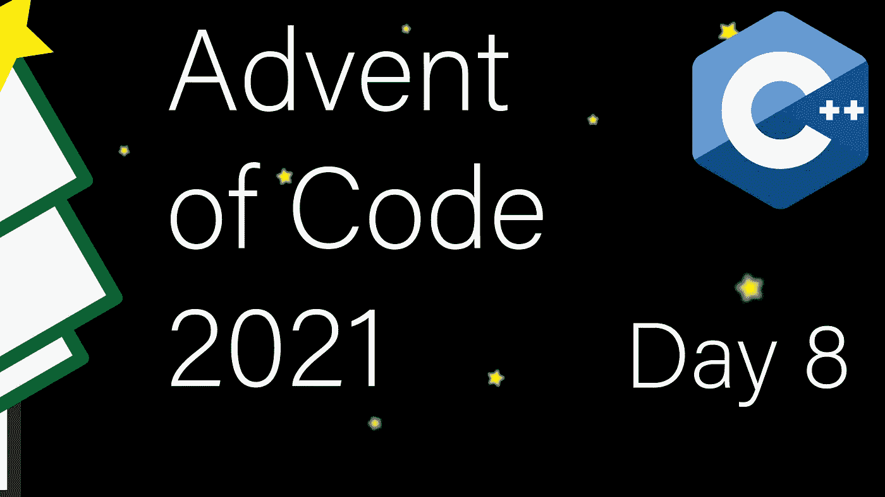

# 现代 C++代码的出现:第 8 天

> 原文：<https://itnext.io/modern-c-in-advent-of-code-day8-3b5d3e6c24b6?source=collection_archive---------3----------------------->

这是代码问世的第八天。今天，我们将使用位操作来解开混乱的电线。



一如既往，请先尝试解决问题，然后再看解决方案。对于本系列中的所有文章，[查看这个列表](https://medium.com/@happy.cerberus/list/advent-of-code-2021-using-modern-c-c5814cb6666e)。

# 第八天:第一部分

我们今天的目标是解读一个七段显示器。我们的输入是一系列字符串，描述显示器的哪些部分被点亮:

```
 aaa     aaa     aaa  
b   c       c   b
b   c       c   b
 ddd             ddd
e   f       f   e   f
e   f       f   e   f
 ggg             ggg 
```

`876`的显示将被编码为`abcdefg acf abdefg`。不幸的是，除了处理这种表示，我们的输入也是混乱的。幸运的是，每个输入行内的加扰是稳定的，单个输入的所有显示都以相同的方式加扰。整个输入是以下格式的一系列行:

定界符之前的显示作为信息，应该允许我们解码加扰，定界符之后的显示是我们要解码的。

对于第 1 部分，我们不会解决解读输入的整个问题。相反，我们只需要识别*唯一的*号。这些是 1、4、7 和 8，因为我们可以仅根据 lit 段的数量来识别这些数字(1 为 2 段，4 为 4 段，7 为 3 段，8 为 7 段)。

然而，即使有了这个更简单的任务，我们也可以为即将到来的解码输入任务做准备，并方便地表示七段显示:

位是一种表示由具有两种状态(开/关)的元素组成的项目的便捷方式。然而，我们需要小心，因为位操作很容易使代码难以阅读。准备更容易使用的命名常数是缓解这一问题的一种方法，也就是说，在这里，我们已经命名了每个段，并准备了一个数组来表示每个数字的亮段。

准备工作完成后，我们现在可以解析输入，首先是测试:

然后是解析代码:

这一次，我们不依赖于流，而是一个字符一个字符地解析字符串。我们读取小写字符，跳过空白并检测何时通过了`|`分隔符。表达式`*it-'a'`依赖于小写字符被编码为一个连续的范围，所以`'c'-'a'==2`和`'a'+3=='d'`。

输入解析完成后，我们现在可以读取整个输入，并使用`std::ranges::count_if`对 1、4、7 和 8 的实例进行计数。

为了计算 lit 段的数量，我们使用`std::popcount`，它返回设置为 1 的位数。

# 第八天:第二部分

是时候整理输入了。我们将使用约束求解的基本版本来确定哪个输入连接到哪个段。

解决布线将利用逻辑来缩小可能的连接。在我们解决了哪个输入连接到哪个段之后，我们就可以使用这个信息来解码数字(在输入的定界符之后)。

测试准备好了，是时候写求解器了。我们将需要域变量。您可以将这些视为具有一组可能值的变量。求解的要点是从这些集合中去除不可能的值，直到我们得到一个唯一的解。集合也可以很方便地用位来表示，所以我们使用`uint8_t`来表示七个可能的段连接的集合。

让我们看看我们能从杂乱的输入中挖掘出什么信息。

## 明显的事实

我们已经讨论过具有唯一表示的数字。一，四，七，八。第八段没有给出任何信息，因为它列出了所有段。

*   首先，点亮的线段必须是 C 或 F
*   对于四个，点亮的段必须是 B、C、D 或 F
*   对于 7，点亮的段必须是 A、C 或 F

## 消极的

我们也可以考虑负面因素。

*   首先，未点亮的线段不能是 C 或 F
*   对于四个，未点亮的段不能是 B、C、D 或 F
*   对于 7，不亮段不能是 A、C 或 F

还有一个略显隐晦的负面。

*   对于有五个发光段的数字，不发光段是 B、C、E 或 F
*   对于有六个发光段的数字，不发光段是 C、D 或 E

## 清理工作

最后，如果我们有一条只有一个连接点的线，那条线是固定的，我们知道没有其他线连接到这条线段。

我们初始化每条线(域变量)来连接所有的段。然后，我们检查我们的每一个输入，并根据点亮段的数量应用上述逻辑。我们遍历了所有的线路，排除了不可能的连接。最后，我们进行清理(第 50–59 行)。

之后，我们期望每条线连接到一个段，并在解码函数中执行翻译过程。

完成所有工作后，我们只需要迭代这些数字来计算总和:

# 链接和技术说明

每日解决方案存储库位于:【https://github.com/HappyCerberus/moderncpp-aoc-2021】T2。

[看看这个列表，里面有关于《代码降临》中其他日子的文章](https://medium.com/@happy.cerberus/list/advent-of-code-2021-using-modern-c-c5814cb6666e)。

请不要忘记亲自尝试[降临码](https://adventofcode.com/2021)。

# 感谢您的阅读

感谢您阅读这篇文章。你喜欢吗？

我也在 YouTube 上发布视频。你有问题吗？在[推特](https://twitter.com/SimonToth83)或 [LinkedIn](https://www.linkedin.com/in/simontoth) 上联系我。