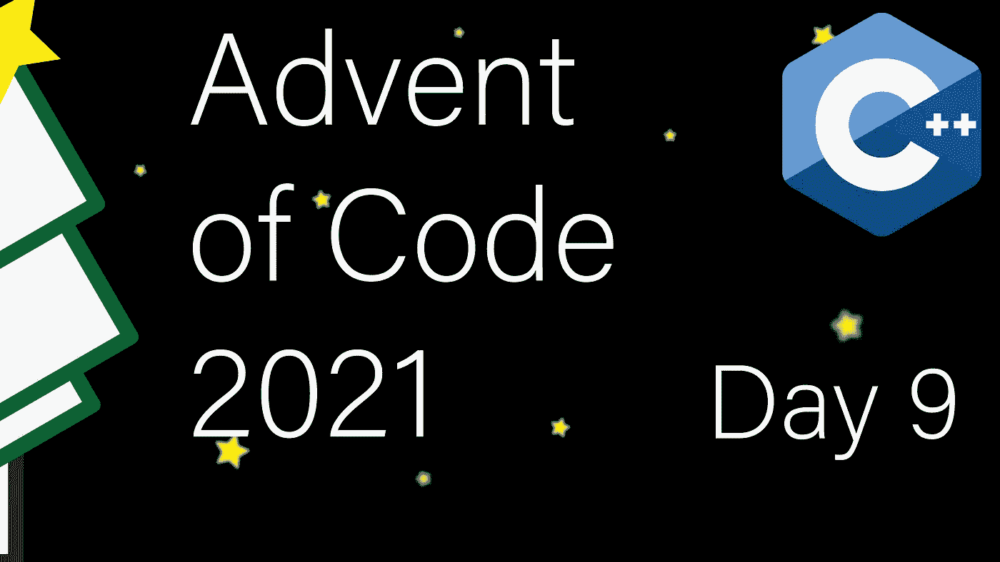

# 现代 C++代码的出现:第 9 天

> 原文：<https://itnext.io/modern-c-in-advent-of-code-day9-1ad4e7890032?source=collection_archive---------3----------------------->

这是代码问世的第九天。今天，我们将分析低点和连续区域的 2D 矩阵。

一如既往，请先尝试解决问题，然后再看解决方案。对于这个系列的所有文章，[看看这个列表](https://medium.com/@happy.cerberus/list/advent-of-code-2021-using-modern-c-c5814cb6666e)。

# 第九天:第一部分

我们的输入是一个高度图，值 0–9 代表高度。我们的首要任务是找到地图上的低点。低点是指四周都被较高值包围的点。我们也把地图外的点算作高度 9。

我们需要一个函数来读取输入，然后我选择提供一个测试函数，期望主函数将在地图上迭代:

为了快速测试，我们使用来自 AoC 的数据:

之后，我们可以实现我们的两个功能。由于每个元素都是一个数字，今天我们将逐个字符地解析输入:

注意，由于我们对检测新行字符感兴趣，我们必须取消设置`std::ios_base::skipws`。默认情况下，阅读字符会跳过空白。我决定在这里使用 launte _ back，那么我们来讨论一下与 push_back 的区别。这里:

*   我们读取行，行向量将根据需要重新分配
*   使用 launte _ back 和 move，向量会将其分配的缓冲区让给结果中新创建的向量
*   读取下面一行将强制进行另一次分配

如果我们改用 push_back:

*   当读取第一行时，向量将根据需要重新分配
*   使用 push_back，内部缓冲区将复制到结果中新创建的向量
*   我们将显式调用 clear()来删除前一行中的数据，这不会改变容量

最后，考虑到边界条件，为了检查高度图中的特定点是否是低点，我们需要检查四个邻居。

在 main 函数中，我们迭代地图上的所有点，并检查它们是否是低点:

# 第九天:第二部分

在第二部分中，我们必须找到三个最大的盆地，其中盆地是高度小于 9 的简单连通区域。因此，我们可以重新定义这个问题，把九楼当作一面墙，其他的都是“空”的区域。有了这个，我们需要做的就是一个洪水填充/广度优先搜索。此外，我们只关心盆地的大小，所以我们可以使用破坏性的方法，只需将地图上的每个访问点更改为一堵墙(九个)。

为了测试，我们依赖 AoC 的测试数据:

对于广度优先搜索的队列部分，我们使用`std::queue`，但是您也可以使用`std::deque`或者甚至`std::unordered_set`(这将稍微简化代码，但是会对性能产生影响)。

在方向检查之前，可以排除更新地图和增加大小的因素；然而，我们可能会访问每个坐标多达四次。

在我们的主函数中，我们再次迭代地图，当我们遇到潜在的盆地(非墙)时调用`flood_fill`:

为了存储大小，我们有几个选项，这取决于我们是考虑内存还是性能。使用向量和排序是最直接的方法，但是它也增加了存储所有流域大小的 O(n)内存开销和最后排序所有大小的 O(n*logn)内存开销。

或者，我们可以:

*   使用三个变量和一点更新逻辑
*   使用`std::priority_queue`并且只保留三个元素
*   按照与`priority_queue`相同的思路使用`std::set`

# 链接和技术说明

每日解决方案存储库位于:[https://github.com/HappyCerberus/moderncpp-aoc-2021](https://github.com/HappyCerberus/moderncpp-aoc-2021)。

查看此列表，了解关于《代码降临》其他日子的文章。

请不要忘记亲自尝试[降临码](https://adventofcode.com/2021)。

# 感谢您的阅读

感谢您阅读这篇文章。你喜欢吗？

我也在 YouTube 上发布视频。你有问题吗？在 Twitter 或 LinkedIn 上联系我。