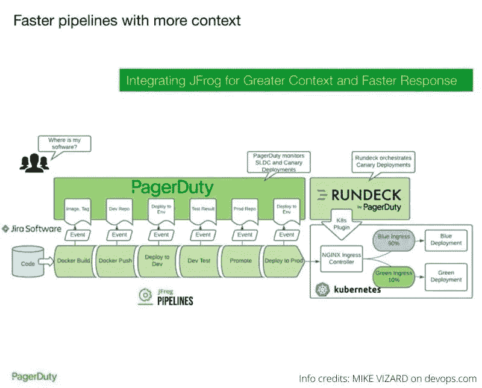
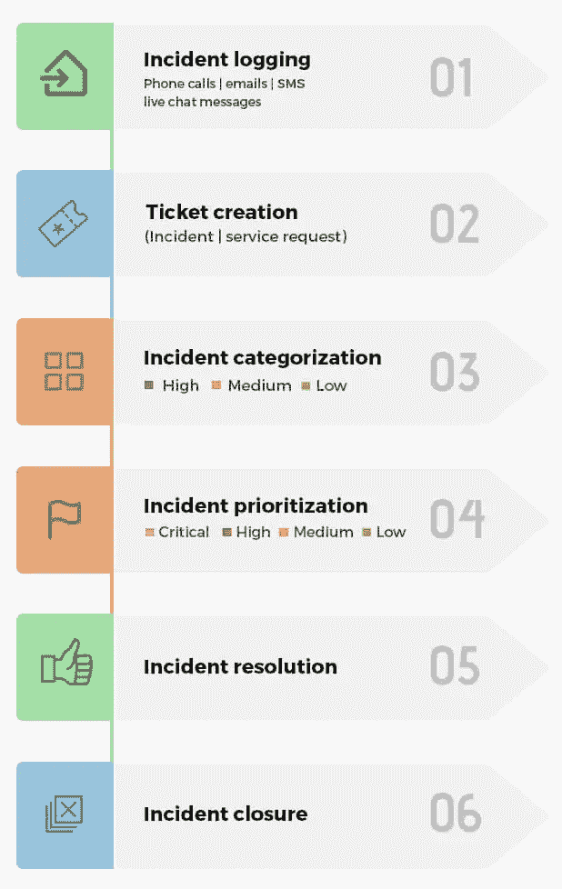
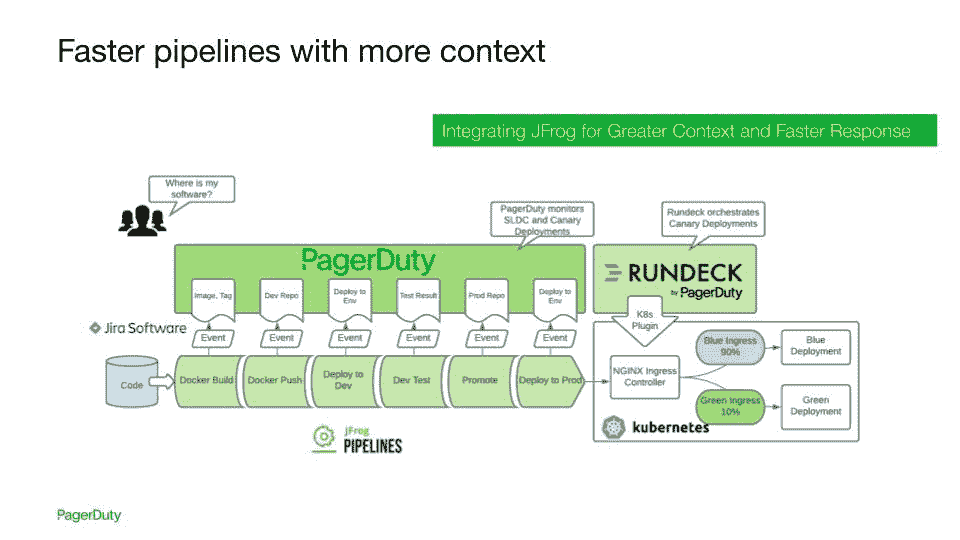

# 面向 IT 团队的现代事件管理

> 原文：<https://itnext.io/modern-incident-management-for-it-teams-5846b6e5084c?source=collection_archive---------3----------------------->

在过去的十年中，软件公司构建、运输和交付软件的方式发生了巨大的变化。像用于容器化的 Docker、用于编排的 Kubernetes、用于二进制库管理的 Artifactory 等平台。，彻底革新了现代 DevOps 公司的工作流程。DevOps 很棒，但是像任何其他方法一样，它也容易出错，因为它处理更快的部署和发布周期。此外，这种误差的影响会更大，因为所涉及的成本会更高。这导致了实时事件管理工具/平台的出现，该工具/平台专注于帮助开发人员/IT 团队在事件发生时发现并解决事件。

在本文中，我们将深入探讨事件管理，并了解它的工作原理、优势等。

# 什么是事件管理？

事故是指影响最终用户或客户、影响业务运营的意外和令人不快的事件或行为。使用一组特定的规则和程序来管理此类事件以减轻或防止影响，这就是所谓的事件管理。事件管理涉及—如何识别事件、谁导致了事件、如何传达事件、哪些系统受此影响、解决事件所采取的步骤等。

[ITIL](https://en.wikipedia.org/wiki/ITIL) (IT 基础设施库)早在 20 世纪 80 年代就由英国政府引入。它基本上是所有已批准的最佳实践的集合，解决了 It 运营团队面临的所有职责。ITIL 授予各种组织使用的结构或工作流，以有效地管理和处理 IT 服务交付，从而实现 IT 目标。最新版本是 2019 年发布的 ITIL 4。

# 事故管理流程

***图片来源演职员表:***[***manage engine***](https://www.manageengine.com/products/service-desk/itil-incident-management/what-is-itil-incident-management.html#workflow?toc)

1.  **识别**:识别是事件管理流程中首要的事情。这可以由团队中的任何人报告，并成为事件的初始点。
2.  **记录**:一旦确定了事件，必须记录某些重要的事情，例如:被报告人的姓名、被报告人的部门、事件描述、被报告事件的唯一票号、事件报告的时间和日期等
3.  **分类**:一旦事件被记录，就必须对其进行检查以寻找可能的解决方案，并根据事件的类型为其分配一个符合逻辑和直觉的类别或子类别。这有助于责任团队按类型对事件进行分类和分析，并尽早解决其影响。
4.  **优先级**:每个事故单都应该有一个基于优先级的编号。可以根据事件的业务价值、紧急程度和影响的严重性来分配优先级。事件可以分为低优先级、中优先级和高优先级。
5.  **响应**:接下来是事件管理流程中的响应阶段，在此阶段，准备一个适当的解决方案蓝图来处理事件。这可以细分为许多类别，但我们不会在这一部分深入探讨，因为这不是本文的目标。
6.  **结束**:最后一步通知最终用户对解决方案感到满意，无需进一步操作。

# 实现 IT 事件管理现代化

现代 IT 管理已经成为成功的 DevOps 计划的基本要素之一。由于许多组织现在每天都要在生产中频繁部署几次，因此事件管理和响应变得至关重要。

当涉及到事件响应时，公司的许多 it 部门都依赖于 PagerDuty。PagerDuty 提供即时可靠的通知、反馈、自动升级和许多其他高级功能，以帮助 IT 团队清楚地了解问题所在，并帮助他们快速识别和修复与基础架构相关的问题。

在这方面，看到两个最好的 DevOps 平台一起帮助 it 团队轻松工作并不奇怪。我们说的是 PagerDuty 和 JFrog。为了处理事件并在更短的时间内解决它们，【JFrog Xray 和 JFrog Pipelines 都为 PagerDuty IT 事件管理平台提供了集成。

JFrog 和 PagerDuty 通过帮助用户轻松识别错误的构建、代码漏洞以及它们对生产系统的影响来为用户服务。这样，通过使用 JFrog 工具(Artifactory、Xray、JFrog Pipelines)和 PagerDuty，IT 管理员、开发人员和 sre 可以立即检测到 bug、事件和错误的根本原因，回滚构建，并缩短恢复和解决问题的时间。

***图片来源:page duty***

如今，无论规模大小，任何组织的基本目标之一都是缩短恢复时间(平均恢复时间)并减轻 IC 事故的影响。在传统的事件管理方法中，IT 团队过去需要花费大量时间来识别事件的根本原因，但今天，通过上面提到的工具 PagerDuty 和 JFrog，这种情况发生了变化。

# 结论

在管理和保护基础架构环境时，必须有适当的规划和工具集来应对可能发生的任何事故。通过选择 PagerDuty 和 JFrog 等平台，组织可以立即减少恢复时间，并保持稳定的正常运行时间。事件管理变得至关重要，任何采用 DevOps 途径的组织都必须配备事件管理流程和工具。无法解决这个问题不仅会恶化您的 DevOps 工作流程，还会恶化客户体验。因此，让我们实施事件管理的现代实践，并以正确的方式保护我们的系统、it 团队和利益相关方。