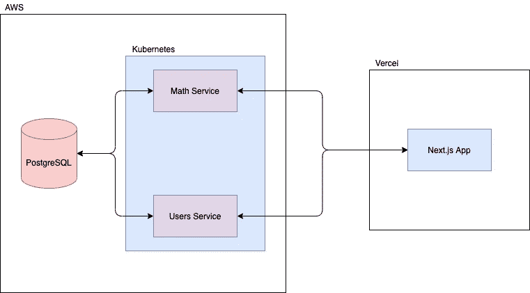
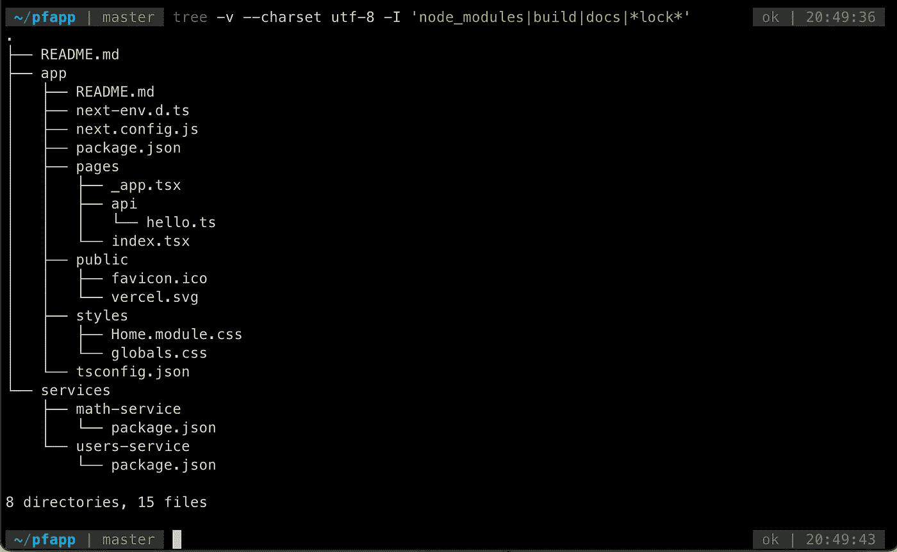

# 现代节点第 1 部分——架构和搭建 TypeScript & Express API

> 原文：<https://itnext.io/modern-node-part-1-architecting-and-scaffolding-a-typescript-express-api-22e87fee054c?source=collection_archive---------0----------------------->


纽约的船

# 介绍

在过去一年左右的时间里，我已经从主要从事应用程序代码和较低级别的业务逻辑转向从事架构、基础设施和所有有助于架构、创建、部署和保持生产级应用程序运行的不同部分。而且，作为一个自学成才的软件工程师，我完全知道从头到尾搜索一个真正完整的教程是什么样的，这个教程将在生产中实际工作，并且没有结果。

既然我自己也经历过这种情况，并且必须在短时间内吸收大量知识，那么在本系列中，我想举一个完整的例子，这是我在学习诀窍时所希望的。从开发我自己的应用程序，到一家中型公司改造他们的技术堆栈，到一家企业公司上市，再到现在一家从零定制基础设施起步的创业公司，我注意到了我所开发的每一个应用程序或平台的趋势和共同点。

我一直致力于改进构建生产就绪型应用程序的过程，同时在整个过程中从事辅助项目，并使用我将在本文中描述的过程来创建使用行业最佳实践部署在云中的全功能、多环境应用程序。

现在，我想把这些趣闻积累成一些有用的东西，并把它们传递给所有全新的，甚至是有经验的软件工程师，他们可能正在寻找自己应用程序的最佳实践，在工作中帮助一个项目，或者真的要如何处理任何全栈应用程序。

**TL；DR:这将是一个关于构建生产就绪、完全部署的应用程序的系列，该应用程序具有用于 API 层的 Next.js 前端和 Node.js 微服务。我们将从零代码一直到在 AWS 上部署到多个环境。**

## 我们将建造什么？

我们将为最近的一类应用开发一个新版本，用它们糟糕的 UX 或缺乏功能来挫败我:个人理财应用！对我来说，这是否是一个单用户应用程序并不重要，因为它将完全按照我的要求跟踪我自己的财务状况，并将很好地说明构建任何生产就绪应用程序的过程。

对于语言和框架，我们将使用一种我见过的模式，这种模式可以用于生产中的大多数应用程序，并且只需要较新的工程师学习一种语言:一个面向应用的 API 和作业运行服务的 [Node.js，一个用](https://nodejs.org/en/) [Chakra UI](https://chakra-ui.com/) 和 [React Query](https://react-query.tanstack.com/) 、面向用户的搜索的 [ElasticSearch](https://www.elastic.co/guide/en/elasticsearch/reference/current/index.html) 、会话管理的 [Redis](https://redis.io/) 和 Docker[构建的 Next.js React 应用](https://www.docker.com/)

然后，我们将把这个堆栈部署到两个独立的服务中，这既符合我作为开发人员的偏好，也为读者提供了一个部署到多个特定云提供商的示例。我们将在亚马逊网络服务[上托管除](https://aws.amazon.com/) [Next.js](https://nextjs.org/) 应用之外的所有应用，并在 Vercel 的[平台](https://vercel.com/)上托管 Next.js 应用，这在最近的过去被证明非常有用且易于使用(我最喜欢的他们的功能是 branch preview deploy，它使在紧密的反馈循环中与产品经理和设计师合作变得绝对容易)。总的来说，这就是我如何设计一个处于项目阶段的应用程序，但我们希望在没有重大模式转变的情况下，随时准备无限扩大规模。我们还将使用 [Terraform](https://www.terraform.io/docs/index.html) 完成所有这些 AWS 基础设施管理，我也强烈推荐这款产品。我工作过的所有公司要么已经有了它，要么因为它的有用性我已经把它纳入了技术堆栈。

**TL；DR:我们将构建一个个人金融应用程序，与用户的银行账户同步，通过 sessions 和 Redis 完全认证，从头开始使用 ElasticSearch，Docker 用于本地开发和不可知部署，Terraform 用于基础设施管理**

## 我们的应用程序会做什么？

在使用了各种不同的个人财务和预算应用程序后，我发现电子表格对我来说更简单了。然而，有很多事情你不能用应用程序中的电子表格来做，比如自动与你的银行账户同步，自动对费用进行分类，制作有用的可视化工具来检查你的预算或储蓄目标，当看着面前的用户界面时不会呕吐，等等。

本质上，我们将为核心功能构建这个:

*   一个仪表板，在这里你可以找到关于你的花费、预算使用、储蓄目标等你需要的大部分东西。
*   一个预算页面，实际上建立你自己的每个类别的预算
*   搜索费用
*   一个费用页面来记录你的支出
*   净值和储蓄目标/财务规划页面
*   添加或管理您的已连接帐户的页面
*   费用、预算类别等的详细页面。

## 我们的技术堆栈将使用什么？

最后，在这个项目中我们将主要使用什么工具和库？请记住，我们不会在本文中使用所有这些，而是在整个系列中使用一小部分。

*   Next.js
*   节点. js
*   表达
*   雷迪斯
*   弹性搜索
*   码头工人
*   docker-撰写
*   库伯内特斯
*   种类
*   格子图案
*   自动警报系统

*注意:在本系列中，我不打算深入研究这些工具。本内容将假设您至少对这些工具有初步的了解！如果没有，我将链接到他们的文档，这样您可以在我们开始使用它们之前获得一些上下文。*

事不宜迟，让我们开始构建任何生产应用程序的第一部分:

# 体系结构

## 架构设计的过程是什么，我们为什么需要它？

老实说，在个人项目上，我跳过了这个阶段，因为我只想开始建设。有时会成功，但有时会让我难堪。但是，如果你想走得快，还能走得远，你需要在考虑距离的情况下进行建设。

架构对于像这样的生产级应用程序非常重要，因为它将保护您在流量突然增加时不会突然崩溃，并将保持您的低成本，因为您没有悬空的基础架构，您要么在降速时忘记，要么让您向我们的托管平台所有者支付额外费用(不客气，Jeff)。

具体来说，我们这里要使用的是 Terraform，这是我最喜欢的，也是我见过的使用最广泛的基础设施即代码框架。

我们正在构建的非常简单，但这是我在各种规模的公司中见过的可扩展模式:在任何容器编排系统上的微服务，但在这种情况下，我们将使用 Docker Compose 和 Kubernetes。我们将能够轻松地在本地运行，并相对无限地扩大规模，如果需要的话，只需对基础架构进行微小的更改。

Vercel 本身在自动缩放方面做得非常好，但如果我们想坚持使用所有 AWS 并将 Next.js 应用程序放在另一个容器中，我们可能也不会有问题。

## 那么，这个 app 会是什么样子呢？

概括地说，它将如下图所示。



应用架构

我们将有两个 API 级别的服务:一个是用户服务(作为一个整体，只是为了简单起见，因为它可以在以后相对容易地分解成服务)，另一个是数学服务。在这种情况下，我们将需要一个单独的进程来处理更多的阻塞功能(CPU 密集型任务，如运行复杂的运行时计算或作业)，因为[节点是单线程的](https://medium.com/swlh/is-node-js-single-threaded-the-architecture-of-node-js-69f8c0d59b00)。

我们将使用 PostgreSQL 数据库和作为 ORM 的 [Objection.js](https://vincit.github.io/objection.js/) ,因为 Objection.js 在过去已经被证明非常适合使用。如果您需要优化或者不能使用 API 进行查询，那么允许原始 SQL 就足够了，但是我过去从未使用过原始 SQL。我们管理建模、迁移和 it 整体灵活性的方式非常适合我们的用例。

好了，我们开始吧。

# 脚手架

为了便于组织，我们将从一开始就启动所有目录，因为这是一个针对所有目录的以 CLI 为中心的过程。

让我们用`create-next-app`启动我们的`app`，也就是 Next.js 前端，用`yarn init`启动我们的后端服务

```
> yarn create next-app app --ts
> mkdir services && cd services
> mkdir users-service && mkdir math-service
> cd users-service
> yarn init -y
> cd ../math-service
> yarn init -y
```

您最终应该得到这样的文件结构:



我在用`[homebrew](https://brew.sh/) library's [tree](https://formulae.brew.sh/formula/tree)`

在设置基本 Express 服务器时，让我们为我们的两个服务执行相同的过程。我将只讨论其中一个(用户服务)，但是继续在两个中创建相同的结构。

```
yarn add -D typescript ts-node @types/node @types/express nodemon tslint dotenvyarn add expressmkdir srctouch .env .env.sample tslint.json tsconfig.json nodemon.json .gitignore .editorconfig src/server.ts src/index.ts
```

让我们把无聊的东西拿出来:就实际配置而言，配置文件确实取决于个人偏好。我将用一些我喜欢使用的常见配置来引导这些，但不会深入讨论任何特定的配置。如果你觉得合适，可以随意调整。

也就是说，我指的是`.gitignore`，

```
node_modules/
build/
lib/
docs/.DS_Store
coverage
*.log
.env
```

`tslint.json`，

```
{
 "extends": "tslint:recommended",
 "rules": {
   "max-line-length": {
     "options": [120]
   },
   "new-parens": true,
   "no-arg": true,
   "no-bitwise": true,
   "no-conditional-assignment": true,
   "no-consecutive-blank-lines": false,
   "no-console": {
     "severity": "warning",
     "options": ["debug", "info", "log", "time", "timeEnd", "trace"]
   }
 },
 "jsRules": {
   "max-line-length": {
     "options": [120]
   }
 }
}
```

`.editorconfig`(用于标准化自动套用格式，很像 Prettier 和`.prettierrc`，但更不可知)

```
root = true[*]
charset = utf-8
end_of_line = lf
indent_size = 2
indent_style = tab
insert_final_newline = true
trim_trailing_whitespace = true[*.md]
max_line_length = 0
trim_trailing_whitespace = true
```

并为`tsconfig.json`插入以下内容。这可能看起来有些过分，但是请记住，我们在这里要做的是一个生产级的应用。不要在小事上吝啬。

```
{
  "compilerOptions": {
    "target": "es6",
    "module": "commonjs",
    "moduleResolution": "node",
    "declaration": true,
    "strict": true,
    "noImplicitAny": true /* Raise error on expressions and declarations with an implied 'any' type. */,
    "strictNullChecks": true /* Enable strict null checks. */,
    "strictFunctionTypes": true /* Enable strict checking of function types. */,
    "noUnusedLocals": true /* Report errors on unused locals. */,
    "noUnusedParameters": true /* Report errors on unused parameters. */,
    "noImplicitReturns": true /* Report error when not all code paths in function return a value. */,
    "noFallthroughCasesInSwitch": true /* Report errors for fallthrough cases in switch statement. */,
    "importHelpers": true,
    "skipLibCheck": true,
    "esModuleInterop": true,
    "allowSyntheticDefaultImports": true,
    "experimentalDecorators": true,
    "sourceMap": true,
    "outDir": "./dist/tsc/",
    "types": [
      "node",
      "jest"
    ],
    "lib": [
      "ES6",
      "DOM"
    ]
  },
  "include": [
    "src/**/*.ts"
  ],
  "exclude": [
    "node_modules",
    "**/*.test.ts"
  ]
}
```

以及一个 [nodemon](https://nodemon.io/) 配置文件`nodemon.json`。我过去使用过这种配置，它被证明非常有用。

```
{
  "restartable": "rs",
  "ignore": [".git", "node_modules/", "build/", "coverage/"],
  "watch": ["src/"],
  "execMap": {
    "ts": "node -r ts-node/register"
  },
  "env": {
    "NODE_ENV": "development"
  },
  "ext": "js,json,ts"
}
```

让我们也给我们的`package.json`添加脚本。在添加了基本的依赖项和这些脚本之后，我们应该会看到:

```
{
  "name": "users-service",
  "version": "1.0.0",
  "main": "index.ts",
  "repository": "[<https://github.com/ryanoillataguerre/pfapp/tree/master/services/users-service>](https://github.com/ryanoillataguerre/pfapp/tree/master/services/users-service)",
  "author": "Ryan Oillataguerre",
  "license": "MIT",
  "scripts": {
    "start": "node build/src/index.ts",
    "build": "tsc",
    "dev": "nodemon --config nodemon.json src/index.ts"
  },
  "devDependencies": {
    "@types/express": "^4.17.13",
    "@types/node": "^16.0.0",
    "dotenv": "^10.0.0",
    "nodemon": "^2.0.7",
    "ts-node": "^10.0.0",
    "typescript": "^4.3.5",
    "tslint": "^6.1.3"
  },
  "dependencies": {
    "express": "^4.17.1"
  }
}
```

一旦我们想把我们的应用分发给云提供商，`build`和`start`将会很有帮助，而`dev`将允许我们有效地使用`nodemon`并在开发中保持我们的应用热重装。

现在，让我们进入实际的代码。在`src/server.ts`和`src/index.ts`创建我们的服务器

`index.ts`

```
import dotenv from 'dotenv';
import server from './server';dotenv.config();
const port = process.env.PORT || 8080;
server().listen(port);
```

我喜欢这种模式，因为它为阅读代码的人标记了一个清晰的入口点，并且不会立即用最终将进入这个`server.ts`的所有中间件和配置淹没他们。

`server.ts`

```
import express, { Request, Response } from 'express';
import http from 'http';const app = () => {
  const app = express(); app.use((_: Request, res: Response, next) => {
    res.header(
      'Access-Control-Allow-Headers',
      'Origin, X-Requested-With, Content-Type, Accept, Credentials, Set-Cookie',
    );
    res.header('Access-Control-Allow-Credentials', 'true');
    res.header(
      'Access-Control-Allow-Headers',
      'Content-Type, Accept, Access-Control-Allow-Credentials, Cross-Origin',
    );
    res.header('Access-Control-Allow-Methods', 'GET, POST, PUT, DELETE');
    next();
  }); app.use(express.json()); // Routes
  app.get('/health', (_, res) => res.status(200).send({ success: true }));
  // All non-specified routes return 404
  app.get('*', (_, res) => res.status(404).send('Not Found')); const server = http.createServer(app); server.on('listening', () => {
    console.info(`Users service listening on port ${process.env.PORT}...`);
  }); return server;
};export default app;
```

好了，在这里打开包装还真不容易。

上面的 headers 部分是我们在响应中设置它们的地方，它将帮助我们以后在服务器和客户端之间来回发送会话 cookies 时不必处理这么多问题。

我们使用`express.json()` API 来代替以前用于解析 JSON POST 请求的`bodyParser()`。然后，我们声明我们希望 Express 应用程序使用的路线。这将很快包括我们定制的基于模块的路由，我们将在本系列的下一篇文章中看到如何构建这些路由。

然后我们为我们的`http`服务器创建一个事件监听器并返回它，这样我们就可以在`index.js`中`listen`它。

现在，让我们创建一个`.env`文件，由上面的`dotenv.config()`命令读取。这将具体地反馈到我们的服务环境中。

```
PORT=8080
```

最后，让我们启动服务器:


启动并运行！🎉🎉🎉

如果有些东西不能正常工作，它可能是一个丢失的文件或一些不匹配的复制粘贴。前往本章分支的 [Github repo 查看源代码！](https://github.com/ryanoillataguerre/pfapp/tree/Chapter_1-Scaffolding)

在本文中，我们刚刚将一个应用从零代码升级到一个正常工作的节点服务，这将在本系列接下来的章节中构建。我们将在下一篇文章中添加路由、服务、一些实用程序等等。

***将所有代码修改打包成一章后，我需要一些时间来写下一篇文章，所以如果你想在我发布它时保持更新，请在媒体上关注我*** [***这里***](https://medium.com/@ryanoillataguerre) ， ***或者在 Twitter 上*** [***这里***](https://twitter.com/roillataguerre) ***！***

这是我的第一篇文章，所以如果你喜欢它，我真的很感谢鼓掌，如果你有这里提到的任何喜欢的工具，一般评论，烘烤，或建议，请在下面评论！