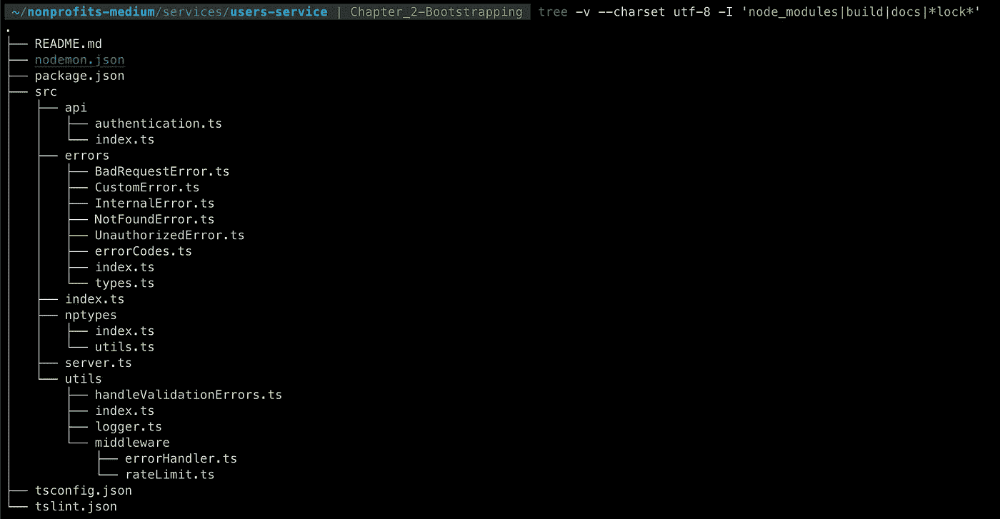
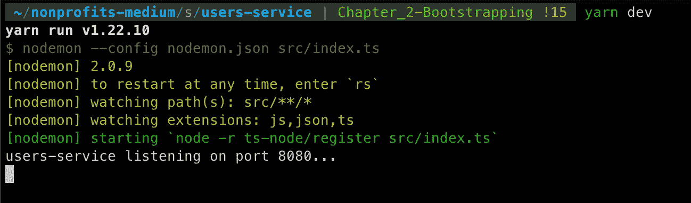
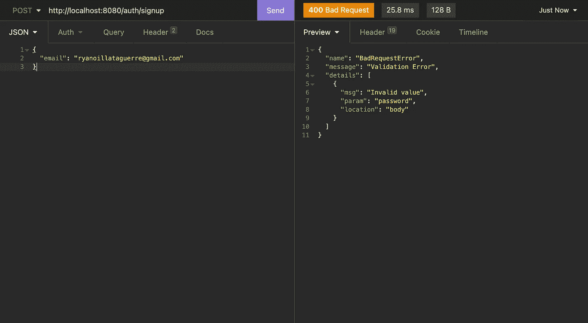
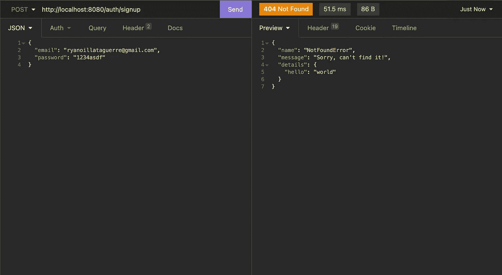
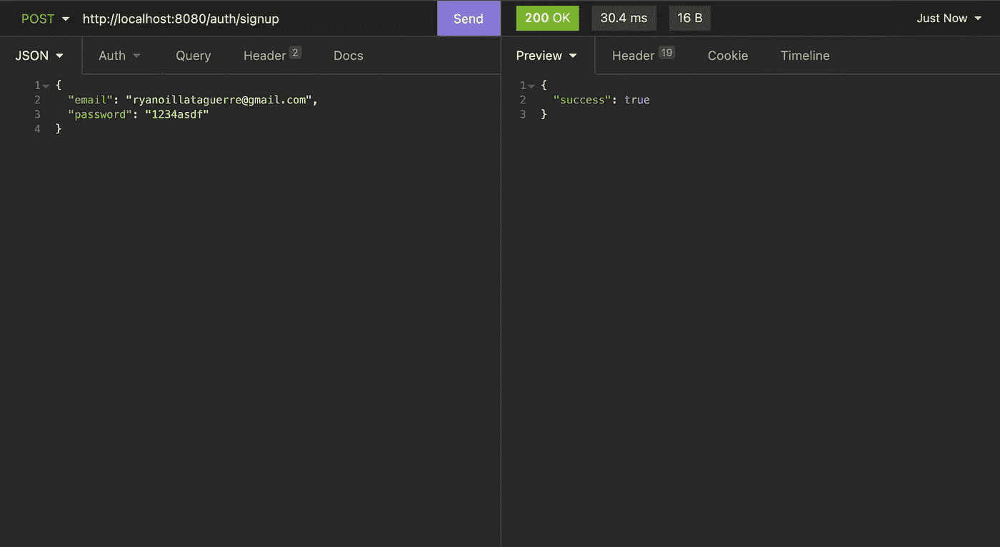

# 现代节点第 2 部分—引导 Node.js Typescript API:路由、中间件和自定义类型和错误模块

> 原文：<https://itnext.io/modern-node-part-2-bootstrapping-a-node-js-9be331c3d9ed?source=collection_archive---------1----------------------->


# 介绍

在我的上一篇文章[架构&搭建一个 Typescript & Express API](/modern-node-part-1-architecting-and-scaffolding-a-typescript-express-api-22e87fee054c) 中，我们讨论了在构建生产级的、基于微服务的 API 时如何从头开始。我们引导了我们的`users-service`和一个`math-service`。

在本文中，我们将为 TypeScript 项目构建一个可扩展的路由系统、自定义错误、实用程序和类型模块(当某些 npm 库没有附加 ts 声明时，这很有帮助)，以及构建一个不使用外部依赖的自定义错误处理模块和结构。

注意:如果你在上一篇文章中克隆了我的回购协议，你现在必须重新克隆它，因为它是一个新的回购协议。抱歉，调换了！

如果您还没有阅读上面的文章，我建议您浏览一下，了解一下我们正在构建的内容以及我们为此做了些什么。

**我也强烈建议您在第二章** [**这里**](https://github.com/ryanoillataguerre/nonprofits-medium/tree/Chapter_2-Bootstrapping) **找到回购，并在当地查看。**在分支`Chapter_2-Bootstrapping`检查它将帮助你跟上这篇文章的运行示例，以及我将做的所有小的改变，但不在这里详述。

```
git clone [git@github.com](mailto:git@github.com):ryanoillataguerre/nonprofits-medium.git
git checkout Chapter_2-Bootstrapping
```

## 在这篇文章中，我们将使用哪些技术？

*   快递. js
*   地方国家预防机制模块
*   [温斯顿](https://github.com/winstonjs/winston)为我们伐木

*注意:在本系列中，我不打算对这些工具进行深入探讨。本内容将假设您至少对这些工具有初步的了解！如果没有，我将链接到他们的文档，这样您可以在我们开始使用它们之前获得一些上下文。*

在这篇文章中，和上一篇文章一样，我将只为`users-service`完成这个过程，但是在这个阶段的早期，我们将为两者做同样的事情。

这种模式可以应用于任何定制的本地 npm 模块，我过去曾将这些模块用于不同的目的。

说完了，我们开始吧！

## 中间件

在我们的`users-service/`目录中，我们将创建一个`/utils/`文件夹。

让我们引导我们的实用程序，我会解释一下每一个。

`utils/handleValidationErrors.ts`

```
import { Request } from "express";
import { Result, ValidationError, validationResult } from "express-validator";
import { BadRequestError } from "../errors";export default (req: Request) => {
  const validationErrors: Result<ValidationError> = validationResult(req);
  if (!validationErrors.isEmpty()) {
    throw new BadRequestError(
      "Validation Error",
      400,
      validationErrors.array()
    );
  }
};
```

这里我们有一个使用`express-validator`来处理验证错误的函数。从技术上来说，可以被称为中间件，但它是作为一种功能来使用的。这是我们的快速调用堆栈的一个停止，如果请求中有任何验证错误，我们将在这里抛出它们，以通知前端/API 调用者有效负载有问题！

`utils/logger.ts`

```
import winston from "winston";const logger = winston.createLogger({
 level: process.env.WINSTON_LOGGER_LEVEL || "info",
 format: winston.format.simple(),
 transports: [new winston.transports.Console()],
});export default logger;
```

不言而喻，我们有一个 winston logger，它为我们提供了一个单一的函数/模块来传递我们的中间件、服务器函数等。

`errorHandler.ts`

```
import { BadRequestError, UnauthorizedError, NotFoundError } from "[@errors](http://twitter.com/errors)";
import { NextFunction, Request, Response } from "express";
import PrettyError from "pretty-error";
import { logger } from "[@utils](http://twitter.com/utils)";const pe = new PrettyError();
const errorHandler = (
 error: any,
 req: Request,
 res: Response,
 _: NextFunction
) => {
 logger.error(`${req.method} - ${req.path}`);
 logger.error(
  process.env.NODE_ENV === "production" ? error : pe.render(error)
 );const { name, message, details } = error;if (error instanceof NotFoundError) {
  return res.status(404).send({
   name,
   message,
   details,
  });
 }if (error instanceof BadRequestError) {
  return res.status(400).send({
   name,
   message,
   details,
  });
 }if (error instanceof UnauthorizedError) {
  return res.status(403).send({
   name,
   message,
   details,
  });
 }return res.status(500).send({
  name,
  message,
  details,
 });
};export default errorHandler;
```

这是对我们最有用的一个！这是我们快速调用堆栈的最后一站。所有的请求都将传递到这个中间件，如果上游出现错误，我们将返回正确的错误代码和对客户端的响应。

然后，当然，一个`index.ts`文件将所有这些导出为`@utils`:

```
import handleValidationErrors from "./handleValidationErrors";
import logger from "./logger";
import errorHandler from "./middleware/errorHandler";
import rateLimiter from "./middleware/rateLimit";export {
  handleValidationErrors, logger, errorHandler, rateLimiter
};
```

这里是我们的`utils`模块。我在应用程序的几个地方添加了这些函数的调用，但不会解释每个函数的位置。如果你克隆回购，你可以看到我如何使用这些模块。

## 按指定路线发送

这个路由系统是我见过很多次的一个非常基本的模式，并且一直困扰着我。这是干净的，让你可以分割你的路线，无论你想要多浅/多深。

对我来说，我喜欢保持一个非常标准化的 REST 结构，所以我在这里使用模块化的方法，将子路由分割成它们的业务逻辑单元。例如，现在我将创建一条`/auth/login`路线:

首先，让我们制作我们的授权路由器:

`src/api/authentication.ts`

```
import { Request, Response, NextFunction, Router } from "express";
import { body } from "express-validator";
import { handleValidationErrors } from "@utils";const router: Router = Router();// API
router.post(
 "/signup",
 [body("email").exists().isEmail(), body("password").exists()],
 async (req: Request, res: Response, next: NextFunction) => {
  try {
    handleValidationErrors(req);
    res.status(200).send({
      success: true,
    });
  } catch (err) {
   next(err);
  }
 }
);router.post("/login", async (_: Request, res: Response, next: NextFunction) => {
 try {
  res.status(200).send({
   success: true,
  });
 } catch (err) {
  next(err);
 }
});export default router;
```

这里我们有一个基本的 express `Router`，它本质上只是一个模块，如果你愿意，你可以与其他路由器一起使用。它也可以作为您唯一的路由器，并且是您服务器中的`app.use()`所必需的。

您还可以看到我们如何通过传递请求对象来使用中间件`handleValidationErrors`。我们用作路由中间件数组的`express-validator`函数将触发`handleValidationErrors`响应。这将有助于我们保持一个干净的 API，并很好地传达后数据形状需求。

然而，我们试图在这里构建一个可扩展的模式，所以我们将把它导入到`src/api/index.ts`中的`index.ts`文件中:

```
import { Router } from "express";
import AuthRoutes from "./authentication";const router: Router = Router();router.use("/auth", AuthRoutes);
```

这里是我们的根快速路由器模块，我们将在`server.ts`中用到它

```
import routes from './api... // Other server code
app.use("/", routes);
...
```

呜！我们有自己的路线，很容易导入到我们的服务器中，并作为“中间件”添加到 express 应用程序中。

你可以把 express 应用程序想象成一个带有停靠点的单一调用，我们在`use()`中传递给它的所有东西都按照给定的顺序运行请求。这里，我们将真实路由放在通用路由处理程序之前，使它们优先于通用路由。这也是为什么我们将`app.use(errorHandler)`放在服务器函数顺序的较低位置，因为它将返回任何给它的抛出错误的响应。我们不希望这种情况过早发生，所以我们把它放在我们的应用程序“中间件”的最后。

## 自定义类型模块

我经常遇到没有最新类型定义的模块，或者对我的使用来说定义太严格的模块。如果您想为自定义类型创建一个简洁的类型模块，这非常简单。

在`src/types/utils.ts`,我们将导出一个单独的自定义类型，用于我们的 app util 函数:

```
export interface Logger {
  error: Function;
  info: Function;
}
```

然后用一个`src/types/index.ts`文件导出我们的类型:

```
export * from "./utils";
```

## 自定义错误处理模块

这是我个人喜欢的处理应用程序错误的方式，因为它是可扩展的，非常容易解释，我们可以添加/删除我们需要的任何类型的错误。同样，对于个人项目来说，这可能没有必要，您可以使用 GitHub 上的许多错误处理文章中的任何一篇。但是在一个生产应用程序中，我遇到了外部库的灵活性问题，我更喜欢这种方法，因为对于我们获得的灵活性来说，这是相对较低的工作量。

让我们建立一个如下的结构(在本章的分支[这里](https://github.com/ryanoillataguerre/pfapp/tree/Chapter_2-Bootstrapping)克隆存储库要容易得多):



在`src/errors`中，我们已经为我们的自定义错误模块创建了所有这些文件。

我会把不同错误的所有代码放在下面，然后讨论。

`CustomError.ts`

```
class CustomError extends Error {
 constructor(message: String, code: Number, details: Object) {
  super(message || String(code));
  this.code = code;
  this.name = "CustomError"; if (details) {
   this.details = details;
  }
 } code: Number;
 details?: Object;
}export default CustomError;
```

`InternalError.ts`

```
import CustomError from "./CustomError";class InternalError extends CustomError {
 constructor(message: String, code: Number = 500, details: Object) {
  super(message, code, details);
  this.name = "InternalError";
 }
}export default InternalError;
```

`BadRequestError.ts`

```
import CustomError from "./CustomError";class BadRequestError extends CustomError {
 constructor(message: String, code: Number = 400, details: Object) {
  super(message, code, details);
  this.name = "BadRequestError";
 }
}export default BadRequestError;
```

`NotFoundError.ts`

```
import CustomError from "./CustomError";class NotFoundError extends CustomError {
 constructor(message: String, code: Number = 404, details: Object) {
  super(message, code, details);
  this.name = "NotFoundError";
 }
}export default NotFoundError;
```

`UnauthorizedError.ts`

```
import CustomError from "./CustomError";class UnauthorizedError extends CustomError {
 constructor(message: String, code: Number = 401, details: Object) {
  super(message, code, details);
  this.name = "UnauthorizedError";
 }
}export default UnauthorizedError;
```

这些是我们的错误类型！

*   CustomError:主要用作基本错误类型，就像 JavaScript 错误一样，但是有一些额外的字段供我们在我们将创建的所有其他错误中一致使用。
*   内部错误:当它是真的 500 时，我们抛出这个。要么是我们代码中的一个进程失败了，要么是外部 API 请求失败了。
*   BadRequestError:这是我们常见的 400 错误，将告诉用户他们的有效负载格式不正确。
*   NotFoundError:这是我们的标准 404，表示没有找到路由或资源。因为如果用户点击了我们没有的路由(在`server.ts`中),我们可以回退到 404，所以我们将只对未找到的资源使用这个。
*   UnauthorizedError:这将是我们的 401 错误，当我们的授权中间件(我们将在下一篇文章中构建)发现用户的认证丢失或无效时

最后，让我们将`index.ts`添加到我们的错误处理库中:

```
import BadRequestError from "./BadRequestError";
import CustomError from "./CustomError";
import InternalError from "./InternalError";
import NotFoundError from "./NotFoundError";
import UnauthorizedError from "./UnauthorizedError";export {
 BadRequestError,
 CustomError,
 InternalError,
 NotFoundError,
 UnauthorizedError,
};
```

## 实施我们的定制模块

要使用 TypeScript 定制模块，使其在开发中和部署到云中时都能工作，我们需要进行一点设置，使它们按照我们的预期工作。

首先，我们将安装两个库:`module-alias`和`tsc-alias`，分别用于运行和构建:

```
yarn add -D tsc-alias
yarn add module-alias
```

现在，我们将向我们的`tsconfig.json`添加一些配置:

```
"compilerOptions": {
    ...
    "baseUrl": ".",
    "rootDir": ".",
    "paths": {
      "[@utils](http://twitter.com/utils)": ["src/utils/index.ts"],
      "[@errors](http://twitter.com/errors)": ["src/errors/index.ts"],
      "[@nptypes](http://twitter.com/nptypes)": ["src/nptypes/index.ts"],
    },
    ...
},
```

还有我们的`package.json`:

```
"_moduleAliases": {
  "@utils": "src/utils/index.ts",
  "@errors": "src/errors/index.ts",
  "@nptypes": "src/nptypes/index.ts"
}
```

将`import "module-alias/register";`放在我们`src/index.ts`文件的顶部。

最后，确保我们已经将`errorHandler`作为中间件添加到我们的服务器中:

```
// routes here
app.use(errorHandler);
```

现在，我们可以使用这个错误处理程序从调用堆栈中的任何一点捕获我们的任何错误，从路由函数或我们的服务，我们通过在下面的路由函数中捕获错误并将其传递给 express 的`next`函数来传递到这一步。为了测试，让我们在下面的`api/authentication.ts`文件中添加一个无意义的`NotFoundError`:

```
import { Request, Response, NextFunction, Router } from "express";
import { body } from "express-validator";
import { handleValidationErrors } from "[@](http://twitter.com/nonprofits/shared)utils";
import { NotFoundError } from "[@](http://twitter.com/nonprofits/shared)errors";const router: Router = Router();// API
router.post(
 "/signup",
 [body("email").exists().isEmail(), body("password").exists()],
 async (req: Request, res: Response, next: NextFunction) => {
  try {
   handleValidationErrors(req);
   throw new NotFoundError("Sorry, can't find it!", undefined, { hello: "world"});
   res.status(200).send({
    success: true,
   });
  } catch (err) {
   next(err);
  }
 }
);router.post("/login", async (_: Request, res: Response, next: NextFunction) => {
 try {
  res.status(200).send({
   success: true,
  });
 } catch (err) {
  next(err);
 }
});export default router;
```

让我们启动服务器，尝试一些东西吧！



现在，让我们点击我们的 API，看看我们的处理程序是否在做它们的工作:



对于那些感兴趣的人，我正在使用[失眠](https://insomnia.rest/)休息客户端

由于我们在这个请求中没有包含密码，并且我们已经将密码标记为必填字段，我们的`express-validator`助手将此作为一个错误抛出，然后在我们添加到上面的服务器调用顺序中的`errorHandler.ts`实用程序中捕捉到这个错误！

现在，让我们看看我们的手动错误是否被抛出:



呜！我们在做生意。让我们也删除被抛出的手动错误，看看我们是否能在快乐路径中获得一个成功的响应，一个格式正确的有效负载，没有假错误:



这就是我们的流程。我们已经设置好了路由系统、处理自定义类型的方法、验证系统、从头开始的自定义错误模块，以及正确的中间件，所有这些都设置好了，可以运行稳定的 API。

虽然我们在本文中没有关注一个大的特性或成就，但这些都是你可以在自己的应用程序或工作中选择使用或不使用的东西。在我的职业生涯中，我已经看到了这些类型的实用程序的大杂烩，希望我能够挑选出一些最好的用于本文。

# 结论

本文只是简单介绍了构建生产就绪的 API 需要做的几件事情，但是下一篇文章将更深入地探讨一个主题:身份验证！我们将为我们的应用程序添加一个 auth 层，使用 Redis 进行令牌存储和快速会话。

如果有些地方不适合你，我不会感到惊讶，因为在构建这个结构时，我跳过了一些不值得解决的小变化。前往本章分支的 [Github repo 查看源代码。](https://github.com/ryanoillataguerre/nonprofits-medium/tree/Chapter_2-Bootstrapping)

感谢阅读，希望你喜欢这篇文章！如果你有任何具体的需求、建议或批评，欢迎在下面留下评论。

***另外，我将所有代码修改打包成一章后，需要一些时间来写下一篇文章，所以如果你想在我发布它时保持更新，请在媒体上关注我*** [***这里***](https://medium.com/@ryanoillataguerre) ， ***或者在 Twitter 上*** [***这里***](https://twitter.com/roillataguerre) ***！***