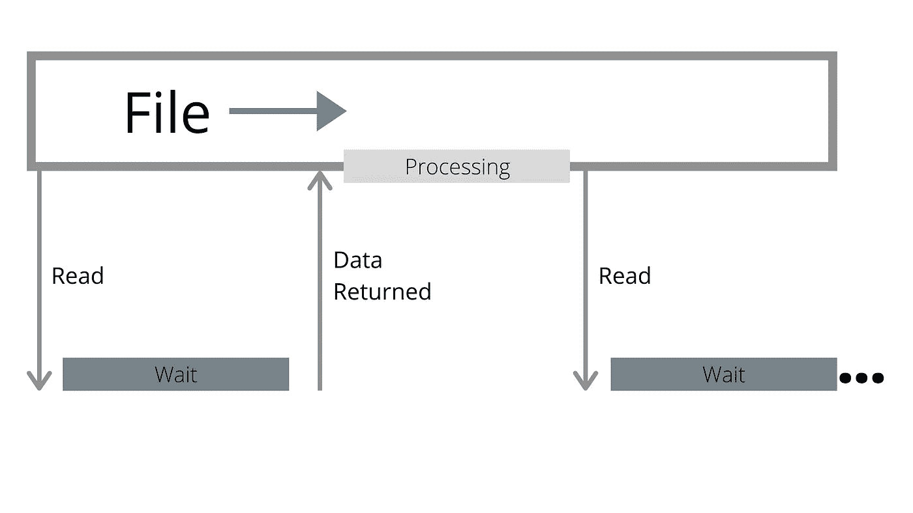
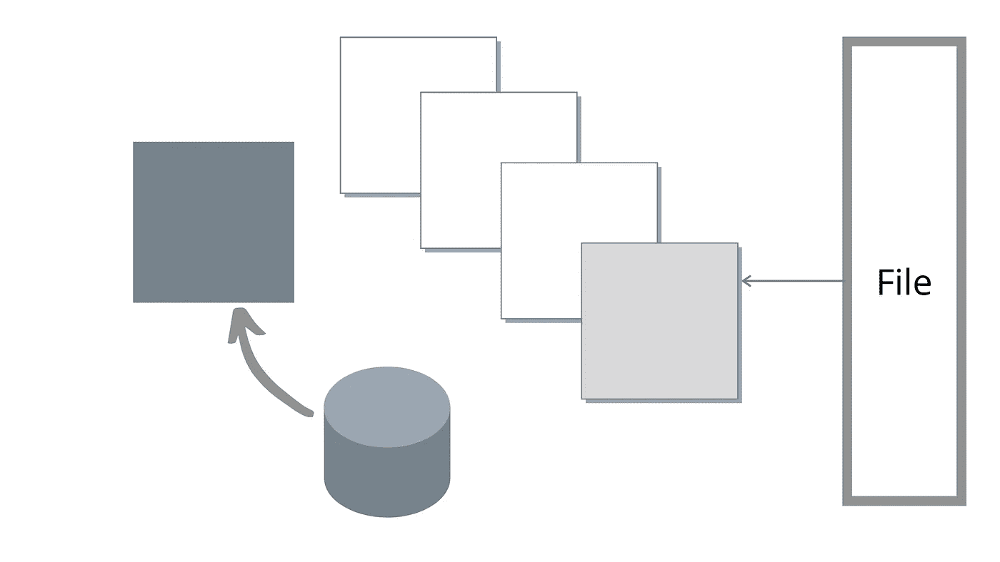

# 现代存储速度非常快。坏的是 API。

> 原文：<https://itnext.io/modern-storage-is-plenty-fast-it-is-the-apis-that-are-bad-6a68319fbc1a?source=collection_archive---------0----------------------->


在过去的十年里，我几乎一直在一家相当专业的产品公司工作，构建高性能的 I/O 系统。我有机会见证了存储技术的快速发展。谈论存储及其发展感觉像是在向唱诗班布道。

今年，我已经跳槽了。在一家拥有来自多种背景的工程师的大公司，我惊讶地发现，虽然我的每个同事都非常聪明，但他们中的大多数人对如何最好地利用现代存储技术的性能有误解，导致了次优的设计，即使他们意识到存储技术的不断进步。

当我思考这种脱节的原因时，我意识到这种误解持续存在的很大一部分原因是，如果他们花时间用基准来验证他们的假设，数据将显示他们的假设是正确的，或者至少看起来是正确的。

这种误解的常见例子包括:

*   嗯，在这里复制内存并执行这种昂贵的计算是没问题的，因为它为我们节省了一次 I/O 操作，而 I/O 操作的成本更高。
*   “我正在设计一个需要快速运行的系统。因此它需要在内存中”。
*   “如果我们将它分成多个文件，速度会很慢，因为它会生成随机的 I/O 模式。我们需要对此进行优化，以便从单个文件中进行顺序访问和读取”
*   “直接 I/O 非常慢。它只适用于非常特殊的应用。如果你没有自己的缓存，你就完了”。

[然而，如果你浏览一下现代 NVMe 设备的规格](https://www.samsung.com/semiconductor/global.semi.static/Ultra-Low_Latency_with_Samsung_Z-NAND_SSD-0.pdf),你会看到商用设备的延迟在微秒范围内，吞吐量为几 GB/s，支持几十万个随机 IOPS。那么，脱节在哪里呢？

在这篇文章中，我将证明虽然硬件在过去十年中发生了巨大的变化，但是软件 API 却没有，或者至少还不够。受内存拷贝、内存分配、过于乐观的预读缓存和各种昂贵操作的困扰，传统 API 阻止我们充分利用现代设备。

在写这篇文章的过程中，我非常高兴能够提前接触到英特尔的下一代 Optane 设备。虽然它们在市场上还不常见，但它们无疑代表了越来越快的设备趋势的顶峰。您将在本文中看到的数字都是使用该设备获得的。

由于时间关系，我将把这篇文章的重点放在阅读上。写作有其独特的问题，也有改进的机会，这将在另一篇文章中讨论。

# 索赔

传统的基于文件的 API 有三个主要问题:

*   **他们执行许多昂贵的操作，因为“I/O 是昂贵的”。**

当遗留 API 需要读取没有缓存在内存中的数据时，它们会产生一个页面错误。然后在数据准备好之后，一个中断。最后，对于传统的基于系统调用的读取，您有一个到用户缓冲区的额外副本，对于基于 mmap 的操作，您必须更新虚拟内存映射。

这些操作中没有一个是廉价的:页面错误、中断、复制或虚拟内存映射更新。但是几年前，它们仍然比 I/O 本身的成本便宜 100 倍，这使得这种方法可以接受。随着设备延迟接近个位数微秒，情况不再如此。这些操作现在与 I/O 操作本身处于相同的数量级。

一个简单的计算表明，在最坏的情况下，不到一半的总繁忙成本是与设备本身的通信成本。这还不算所有的浪费，这就给我们带来了第二个问题:

*   **读放大。**

尽管有一些细节我将会一笔带过(比如文件描述符使用的内存，Linux 中的各种元数据缓存)，如果现代 NVMe 支持许多并发操作，那么没有理由认为从许多文件中读取比从一个文件中读取更昂贵。然而*读取的数据总量*确实很重要。

操作系统以*页面粒度*读取数据，这意味着它一次至少只能读取 4kB。这意味着，如果您需要读取分成两个文件读取的 1kB，每个文件 512 字节，那么您实际上是读取 8kB 来服务 1kB，浪费了 87%的读取数据。实际上，操作系统还会执行预读，默认设置为 128kB，以便在以后需要剩余数据时节省时间。但是如果您从来不这样做，就像随机 I/O 经常发生的情况一样，那么您只是读取 256kB 来服务 1kB，浪费了 99%的空间。

如果您想验证我的说法，即从多个文件读取不应该比从单个文件读取慢，您可能最终会证明自己是对的，但这只是因为读取放大大大增加了有效读取的数据量。

既然问题在于操作系统页面缓存，那么在其他条件都相同的情况下，如果您只是用直接 I/O 打开一个文件，会发生什么呢？不幸的是，这也不会变得更快。但那是因为我们的第三个也是最后一个问题:

*   **传统 API 没有利用并行性**。

文件被视为一个连续的字节流，数据是否在内存中对读者来说是透明的。传统的 API 会等到你接触到不常驻的数据时才发出 I/O 操作。由于预读，I/O 操作可能比用户请求的要大，但仍然只有一个。

然而，尽管现代设备速度很快，但它们仍然比 CPU 慢。当设备等待 I/O 操作返回时，CPU 不做任何事情。



传统 API 缺乏并行性，导致 CPU 在等待 I/O 返回时处于空闲状态。

使用多个文件是朝着正确方向迈出的一步，因为它允许更有效的并行:当一个读者在等待时，另一个读者有希望继续。但是如果你不小心，你最终只会放大前面的一个问题:

*   多个文件意味着多个预读缓冲区，增加了随机 I/O 的浪费因素。
*   在基于线程轮询的 API 中，多个文件意味着多个线程，放大了每个 I/O 操作所完成的工作量。

更不用说在很多情况下这不是你想要的:你可能没有那么多的文件。

# 迈向更好的 API

我在过去写过大量关于[摄影是多么的革命性的文章。但是作为一个相当低级的接口，它实际上只是 API 难题的一部分。原因如下:](https://www.scylladb.com/2020/05/05/how-io_uring-and-ebpf-will-revolutionize-programming-in-linux/)

*   如果 I/O 使用缓冲文件，通过 I/O 调度的 I/O 仍然会遇到前面列出的大多数问题。
*   直接 I/O 充满了警告，作为一个原始接口，I/O 甚至没有试图(也不应该)隐藏这些问题:例如，内存必须正确对齐，以及读取的位置。
*   也是很低级很原始。为了使它有用，你需要累积 I/O 并分批发送。这需要一个何时做这件事的策略，以及某种形式的事件循环，这意味着它与已经为此提供了机制的框架一起工作会更好。

为了解决 API 问题，我设计了 G [lommio](https://www.datadoghq.com/blog/engineering/introducing-glommio/) (以前被称为 Scipio)，一个直接面向 I/O 的每核线程 Rust 库。Glommio 建立在 io ouring 的基础上，支持许多高级特性，如注册缓冲区和基于轮询(无中断)的完成，使直接 I/O 大放异彩。为了熟悉起见，Glommio 确实支持由 Linux 页面缓存支持的缓冲文件，其方式类似于标准的 Rust APIs(我们将在这次比较中使用它)，但是它面向的是将直接 I/O 引入聚光灯下。

Glommio 中有两类文件:[随机存取文件](https://docs.rs/glommio/0.2.0-alpha/glommio/io/struct.DmaFile.html)，和[流](https://docs.rs/glommio/0.2.0-alpha/glommio/io/struct.DmaStreamReader.html)。

随机存取文件将位置作为参数，这意味着不需要保持搜索光标。但更重要的是:它们不把缓冲区作为参数。相反，它们使用 io_uring 预先注册的缓冲区来分配一个缓冲区并返回给用户。这意味着没有内存映射，没有拷贝到用户缓冲区——只有一个从器件到 glommio 缓冲区的拷贝，用户得到一个指向该缓冲区的引用计数指针。因为我们知道这是随机 I/O，所以不需要读取比所请求的更多的数据。

另一方面，流假设您最终将遍历整个文件，因此它们可以使用更大的块大小和预读因子。

流被设计成 Rust 的默认 [AsyncRead](https://docs.rs/futures-lite/1.11.2/futures_lite/io/trait.AsyncReadExt.html) 最熟悉的，所以它实现了 AsyncRead 特性，并且仍然将数据读取到用户缓冲区。基于 I/O 的直接扫描的所有好处仍然存在，但是在我们的内部预读缓冲区和用户缓冲区之间有一个副本。这是对使用标准 API 的便利性的征税。

如果您需要额外的性能，glommio 在流中提供了一个 [API，它也公开了原始缓冲区，节省了额外的副本。](https://docs.rs/glommio/0.2.0-alpha/glommio/io/struct.DmaStreamReader.html#method.get_buffer_aligned)

# 测试扫描

为了演示这些 API，glommio 有一个[示例程序](https://github.com/DataDog/glommio/blob/master/examples/storage.rs)，它使用所有这些 API(缓冲、直接 I/O、随机、顺序)发出具有各种设置的 I/O，并评估它们的性能。

我们从一个大小约为内存 2.5 倍的文件开始，简单的做法是将其作为普通缓冲文件顺序读取:

```
Buffered I/O: Scanned 53GB in 56s, 945.14 MB/s
```

考虑到这个文件不适合内存，这当然不坏，但这里的优点都是英特尔 Optane 的完美性能和 io_uring 后端。每当调度 I/O 时，它的有效并行度仍然为 1，尽管操作系统页面大小为 4kB，但预读允许我们有效地增加 I/O 大小。

事实上，如果我们试图使用直接 I/O API (4kB 缓冲区，并行度为 1)来模拟类似的参数，结果将会令人失望，“证实”我们的怀疑，即直接 I/O 确实要慢得多。

```
Direct I/O: Scanned 53GB in 115s, 463.23 MB/s
```

但是正如我们所讨论的，glommio 的直接 I/O 文件流可以接受一个显式的预读参数。如果活动 glommio 将在当前读取的位置之前发出 I/O 请求，以利用设备的并行性。

Glommio 的预读工作方式与操作系统级预读不同:我们的目标是利用并行性，而不仅仅是增加 I/O 大小。glommio 不是先消耗整个预读缓冲区，然后再发送一个新批次的请求，而是在缓冲区的内容完全消耗后立即发送一个新的请求，并总是试图保持固定数量的缓冲区在运行中，如下图所示。



当我们用完一个缓冲区时，另一个已经被获取。这有助于提高并行度并保持较高的并行度。

正如最初预期的那样，一旦我们通过设置预读因子正确地利用了并行性，直接 I/O 不仅与缓冲 I/O 成对，而且实际上要快得多。

```
Direct I/O, read ahead: Scanned 53GB in 22s, 2.35 GB/s
```

这个版本仍然使用 Rust 的[asynchreadext](https://docs.rs/futures-lite/1.11.2/futures_lite/io/trait.AsyncReadExt.html)接口，该接口强制从 glommio 缓冲区向用户缓冲区进行额外的复制。

使用 [get_buffer_aligned](https://docs.rs/glommio/0.2.0-alpha/glommio/io/struct.DmaStreamReader.html#method.get_buffer_aligned) API 可以让您对缓冲区进行原始访问，从而避免最后一次内存复制。如果我们现在在我们的读取测试中使用它，我们将获得可观的 4%的性能提升

```
Direct I/O, glommio API: Scanned 53GB in 21s, 2.45 GB/s
```

最后一步是增加缓冲区的大小。由于这是一个顺序扫描，我们没有必要受到 4kB 缓冲区大小的限制，除非是为了与操作系统页面缓存版本进行比较。

现在，让我们在下一次测试中总结 glommio 和 io uring 在幕后发生的所有事情:

*   每个 I/O 请求的大小为 512kB，
*   它们中的许多(5 个)为了平行性而保持飞行，
*   内存是预先分配和预先注册的
*   不会对用户缓冲区执行额外的复制
*   io_uring 设置为轮询模式，这意味着没有内存拷贝、没有中断、没有上下文切换。

结果呢？

```
Direct I/O, glommio API, large buffer: Scanned 53GB in 7s, 7.29 GB/s
```

这比标准缓冲方法好 7 倍以上。更好的是，内存利用率从未高于我们设置的预读因子乘以缓冲区大小。在本例中，2.5MB。

# 随机读取

众所周知，扫描对操作系统页面缓存有害。我们如何处理随机 I/O？为了测试这一点，我们将在 20 秒内尽可能多地读取，首先将我们自己限制在可用内存的前 10%(1.65 GB)

```
Buffered I/O: size span of 1.65 GB, for 20s, 693870 IOPS
```

对于直接输入/输出:

```
Direct I/O: size span of 1.65 GB, for 20s, 551547 IOPS
```

直接 I/O 比缓冲读取慢 20%。虽然完全凭记忆阅读仍然更快——这不应该让任何人感到惊讶，但这与人们预期的灾难相去甚远。事实上，如果我们记住缓冲版本保留 1.65GB 的常驻内存来实现这一点，而直接 I/O 仅使用 80kB (20 个 4kB 缓冲区)，这甚至可能对特定类别的应用程序更为*有利*，在其他地方使用该内存可能会更好。

正如任何性能工程师都会告诉你的那样，一个好的读取基准需要读取足够的数据来命中介质。毕竟“存储慢”。因此，如果我们现在读取整个文件，我们的缓冲性能会显著下降 65%

```
Buffered I/O: size span of 53.69 GB, for 20s, 237858 IOPS
```

而直接 I/O，正如预期的那样，具有相同的性能和相同的内存利用率，与读取的数据量无关。

```
Direct I/O: size span of 53.69 GB, for 20s, 547479 IOPS
```

如果较大的扫描是我们的比较点，那么直接 I/O 比缓冲文件快 2.3 倍，而不是更慢。

# 结论

现代 NVMe 设备改变了如何在有状态应用程序中最佳执行 I/O 的本质。这种趋势已经持续了一段时间，但迄今为止被这样一个事实掩盖了，即 API，尤其是更高级别的 API，还没有发展到与设备中发生的事情相匹配——以及最近的 Linux 内核层。有了正确的 API 集，直接 I/O 将成为新的亮点。

像最新一代的英特尔 Optane 这样的新设备就已经达成了协议。不存在标准缓冲 I/O 无可争议地优于直接 I/O 的情况

对于扫描，定制良好的基于直接 I/O 的 API 的性能要优越得多。虽然缓冲 I/O 标准 API 对于完全适合内存的随机读取的性能提高了 20%,但这是以 200 倍的内存利用率为代价的，这使得权衡取舍并不明确。

确实需要额外性能的应用程序仍然希望缓存其中的一些结果，并且提供一种简单的方法来集成专用缓存以用于直接 I/O，这是 glommio 正在进行的工作。