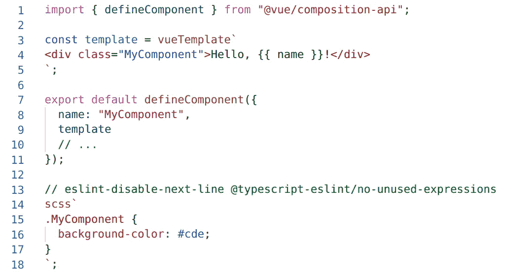

# 不带 Vetur 的现代 Vue 组件

> 原文：<https://itnext.io/modern-vue-components-without-vetur-2b815220f41f?source=collection_archive---------3----------------------->


感谢[好的免费照片](https://www.goodfreephotos.com/germany/other-germany/mountains-and-forest-and-field-in-the-rhine-gorge.jpg.php)。

Vetur 毁了我对编程的兴趣。它在 IDE 中提供的体验太降级了。TypeScript 代码的大部分重构特性都不起作用，monorepos 也有 bug，等等。在我的 TypeScript 开发团队中，我们可能花了 95%的时间在 TypeScript 代码上，4%的时间在 SCSS 代码上(是的，我们有一个为我们编写大部分 CSS 的设计师)，我们可以慷慨地把 1%的时间花在 HTML 代码上。这就是为什么 HTML 容器不是编写 web 应用程序的好格式。

所以，一年前，我们改用老方法，抛弃了 SFC 及其怪异的`.vue`格式。但是从那以后，我们逐渐创建了一些工具，将`.vue`格式的大部分好处导入 JavaScript 和 TypeScript 源文件。

这就是我们现在编写 Vue 组件的方式:



在 Visual Studio 代码中。

它是一种新型的**单文件组件**，但是在一个 JavaScript(或 TypeScript)容器中。我们设法用 Webpack 加载器预编译了模板。

IDE 还提供 HTML 和 SCSS 模板字符串的语法支持。现在问题反过来了:对 SCSS 和 HTML 代码编辑的支持还不完善。但是开发人员将大部分时间花在编写 JavaScript(或 TypeScript)代码上，因此优先支持 JavaScript 和 TypeScript 更有意义。

# 如何在 JavaScript 和 TypeScript 源文件中添加 SFC 功能

## 在项目中添加 Webpack 加载器

假设您已经有一个现有的 Vue 项目。首先，添加两个 Webpack 加载器，一个用于预编译 Vue 模板，一个用于提取 SASS 代码:

```
npm install --save-dev \
  @enhancedjs/vue-template-in-string-loader \
  @enhancedjs/css-in-template-string-loader
```

创建或编辑`vue.config.js`文件，然后添加一个`configureWebpack`部分:

```
const MiniCssExtractPlugin = require("mini-css-extract-plugin"); *// Notice: installed by Vue CLI*module.exports = {
  runtimeCompiler: false,
  configureWebpack: config => ({
    module: {
      rules: [
        {
          test: /\.(js|ts)$/,
          exclude: /node_modules/,
          use: [
            {
              loader: "@enhancedjs/vue-template-in-string-loader"
            },
            {
              loader: "@enhancedjs/css-in-template-string-loader",
              options: {
                cssLoaders: [
                  config.mode === "development" ? "vue-style-loader" : MiniCssExtractPlugin.loader,
                  "css-loader",
                  "sass-loader"
                ]
              }
            }
          ]
        }
      ]
    }
  })
};
```

注意:如果你使用 Vue CLI 初始化你的项目，那么`mini-css-extract-plugin`和`vue-style-loader`包已经安装好了。

## 对于 TypeScript 项目:添加全局定义文件

这些 Webpack 加载器将在编译时替换或删除标记的模板字符串，因此没有必要为模板标记提供实现。但是，在 TypeScript 项目中，必须提供声明。在源目录中为全局声明创建一个文件:

```
*// global.d.ts*
declare function vueTemplate(text: TemplateStringsArray): string;
declare function scss(text: TemplateStringsArray): void;
```

## 在 Visual Studio 代码中添加扩展

在 Visual Studio 代码中，打开“扩展”面板，然后搜索:“enhancedjs”。安装以下扩展:

*   [**html-in-template-string**](https://marketplace.visualstudio.com/items?itemName=enhancedjs.html-in-template-string)，来自 EnhancedJS
*   [**sass-in-template-string**](https://marketplace.visualstudio.com/items?itemName=enhancedjs.sass-in-template-string)，来自 EnhancedJS。

这两个扩展将在标记有`vueTemplate`和`scss`的模板字符串中带来自动完成和语法高亮。

# 限制

我们的工具可以在专业环境中使用。然而，他们是我们的开源项目，我们的时间有限。以下是当前的一些限制:

1.  欺骗我们的 Webpack 加载器是可能的。它们是用简单的正则表达式实现的，而不是用笨重的解析器。例如，不要使用`/* multi-line comments */`来禁用 Vue 模板。而是使用多个`// single line comments`。
2.  Visual Studio 代码扩展尚未完成。我们只是改编了微软的一些演示工作，没有对它们进行改进。Vue 模板特有的语法(`v-if`、`v-for`等)。)没有实现，当然我们可以写但是不需要 IDE 的帮助。SASS edition 缺少一些好的东西，比如颜色预览，或者单行注释的快捷方式和高亮显示。
3.  有必要在组件的 JavaScript 代码之前声明 Vue 模板。
4.  我们还没有为限定范围的 SCSS 实施解决方案。我们目前使用 [Pleasant BEM](https://paleo.casa/pleasant-bem.html) 约定来代替:它们帮助我们将组件的 CSS 规则分开。

# 想做贡献吗？

我最近将 Webpack 加载器和 Visual Studio 代码扩展重新组合成一个全新的 [Github 组织，命名为“enhanced js”](https://github.com/enhancedjs)，这将使为这些项目添加团队成员变得更加容易。我正在等待关于 Vue.js 的真正和持久的 sfc 的帮助。请随意贡献。；-)