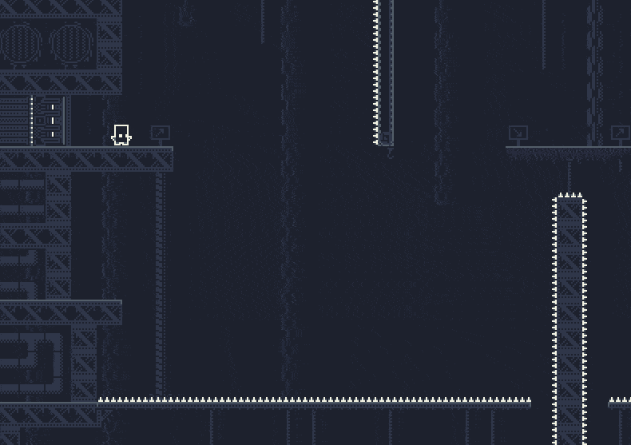
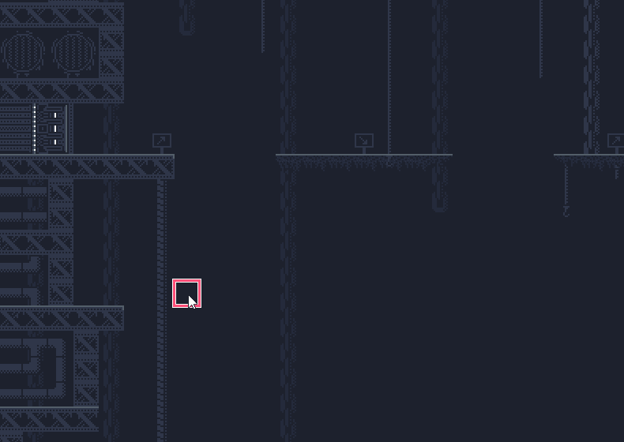
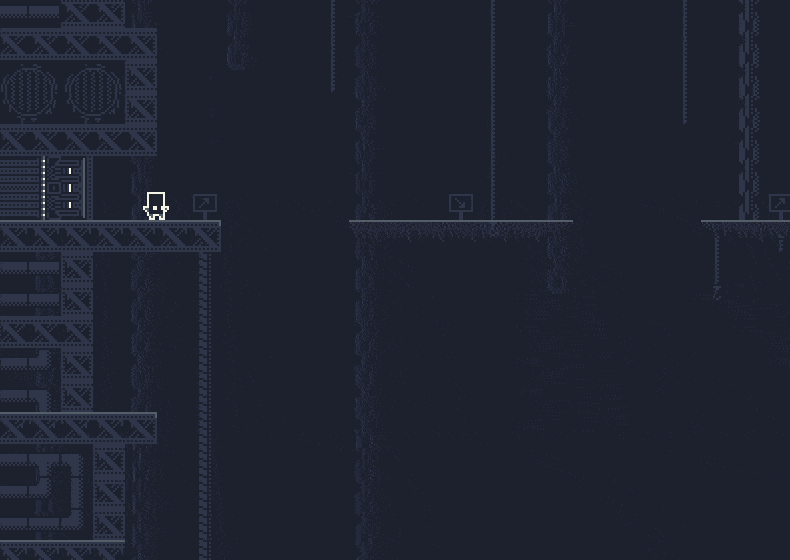
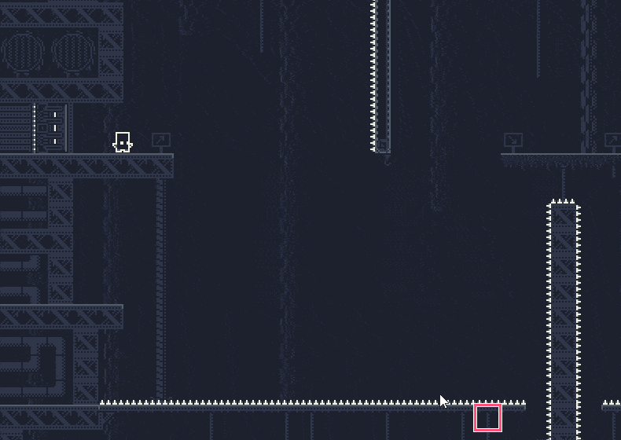
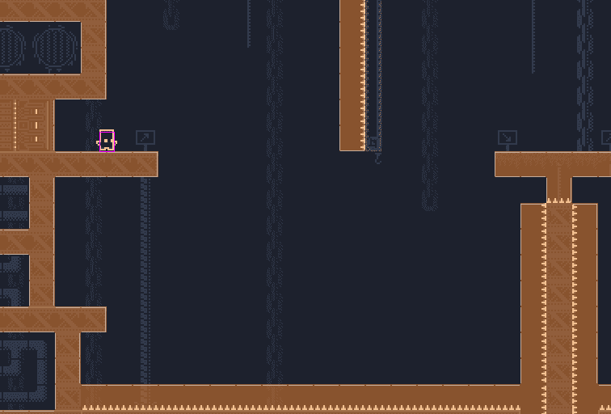
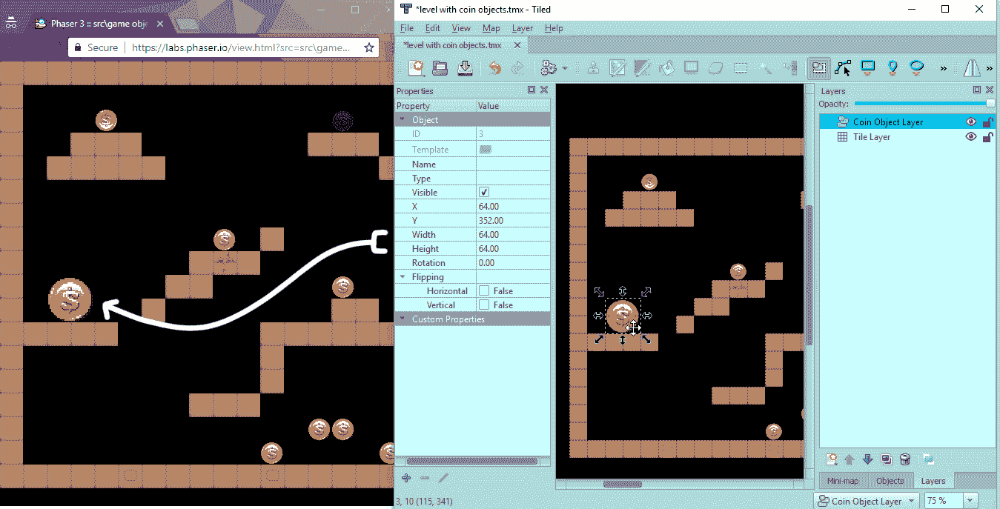
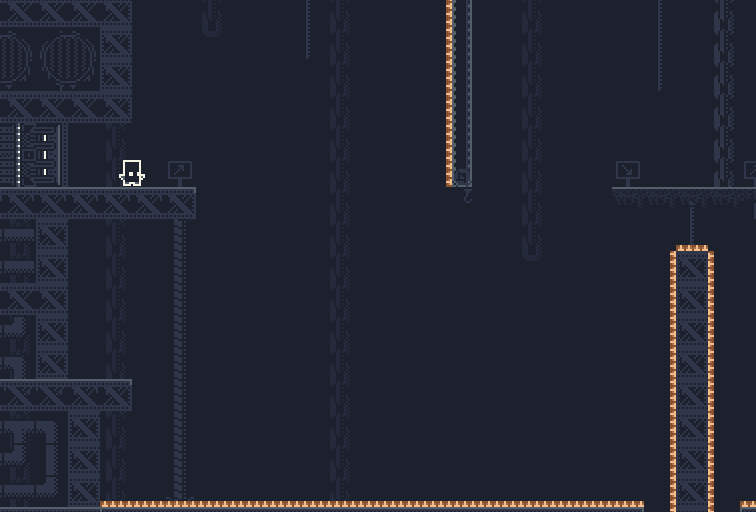
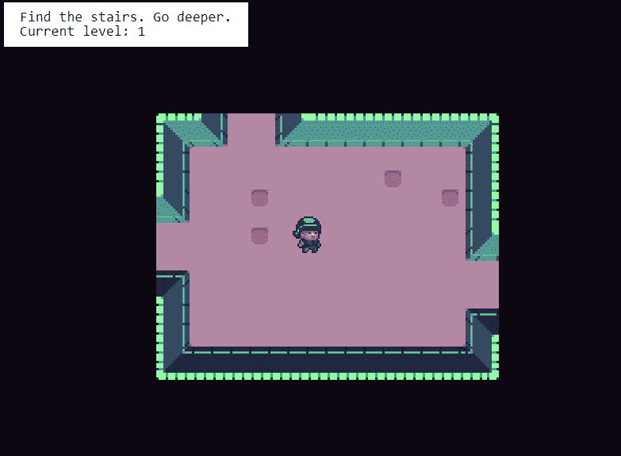

# Phaser 3 中的模块化游戏世界(tile maps # 2)——动态平台玩家

> 原文：<https://itnext.io/modular-game-worlds-in-phaser-3-tilemaps-2-dynamic-platformer-3d68e73d494a?source=collection_archive---------2----------------------->

这是一系列关于在 [Phaser 3](http://phaser.io/) 游戏引擎中使用 tilemaps 创建模块化世界的博文。如果你还没有，看看第一个[帖子](https://medium.com/@michaelwesthadley/modular-game-worlds-in-phaser-3-tilemaps-1-958fc7e6bbd6)，在那里我们了解了 tilemaps 并使用它们创建了一个自上而下的、神奇宝贝风格的游戏世界。在本帖中，我们将深入动态操作 tilemaps，并创建一个 puzzle-y platformer，您可以在其中绘制平台来帮助绕过障碍:

*我们将创建的最后一个示例*

下一篇[帖子](https://medium.com/@michaelwesthadley/modular-game-worlds-in-phaser-3-tilemaps-3-procedural-dungeon-3bc19b841cd)涵盖了创建一个程序化的地牢世界，下一篇将涵盖整合 [Matter.js](http://brm.io/matter-js/) 来创建一个跳墙平台。

在我们开始之前，这篇文章附带的所有代码都在[这个库](https://github.com/mikewesthad/phaser-3-tilemap-blog-posts/tree/master/examples/post-1)中。这些教程使用截至 21 年 8 月 13 日的 Phaser 最新版本(v3.55.2)。

# 目标受众

如果你对 JavaScript(类、箭头函数和模块)、Phaser 和[平铺](https://www.mapeditor.org/)地图编辑器有一些经验，这篇文章将会很有意义。如果你没有，你可能想从[系列](https://medium.com/@michaelwesthadley/modular-game-worlds-in-phaser-3-tilemaps-1-958fc7e6bbd6)的开头开始，或者继续阅读并把 Google、Phaser [教程](https://phaser.io/tutorials/making-your-first-phaser-3-game)和 Phaser [示例](https://labs.phaser.io/) & [文档](https://photonstorm.github.io/phaser3-docs/index.html)放在手边。

好吧，让我们开始吧！

# Tilemap API

在我们构建平台之前，让我们先来鸟瞰一下 tilemap API。上次我们谈到了以下几个方面:

*   `[Tilemap](https://photonstorm.github.io/phaser3-docs/Phaser.Tilemaps.Tilemap.html)`
*   `[Tileset](https://photonstorm.github.io/phaser3-docs/Phaser.Tilemaps.Tileset.html)`
*   `[TilemapLayer](https://photonstorm.github.io/phaser3-docs/Phaser.Tilemaps.TilemapLayer.html)`

在本文中，我们将深入探讨 API 的两个部分:

*   `[TilemapLayer](https://photonstorm.github.io/phaser3-docs/Phaser.Tilemaps.TilemapLayer.html)`
*   `[Tile](https://photonstorm.github.io/phaser3-docs/Phaser.Tilemaps.Tile.html)`

`Tilemap`不是显示对象。它保存了关于地图的数据，并且可以包含一个或多个层(`TilemapLayer`实例)，这些层是实际呈现`Tile`对象的显示对象。

# 粉刷瓷砖

对于第一个例子，我们将加载一个由瓷砖构成的关卡，然后动态绘制和擦除瓷砖。

*Tileset by 0x 72 CC-0，*[*https://0x72.itch.io/16x16-industrial-tileset*](https://0x72.itch.io/16x16-industrial-tileset)

该设置将类似于我们在上一篇文章中所做的:

一旦你加载了一个动态层，你就可以开始使用 [Tilemap Layer API](https://photonstorm.github.io/phaser3-docs/Phaser.Tilemaps.TilemapLayer.html) 操作图块了:

获取或操作切片的 tilemap 层(和 tilemap)方法通常成对出现。一种方法——如`[putTileAt](https://photonstorm.github.io/phaser3-docs/Phaser.Tilemaps.TilemapLayer.html#putTileAt__anchor)`——将在平铺网格单元上操作，例如,( 0，2)将对应于层的第一列和第三行。另一种方法——如`[putTileAtWorldXY](https://photonstorm.github.io/phaser3-docs/Phaser.Tilemaps.TilemapLayer.html#putTileAtWorldXY__anchor)`——将在世界像素单位中操作，这使得查找鼠标下的图块变得更容易。也有从平铺网格单位转换到世界像素坐标的方法，反之亦然:`[worldToTileXY](https://photonstorm.github.io/phaser3-docs/Phaser.Tilemaps.TilemapLayer.html#worldToTileXY__anchor)`，`[tileToWorldXY](https://photonstorm.github.io/phaser3-docs/Phaser.Tilemaps.TilemapLayer.html#tileToWorldXY__anchor)`。

将这些方法与 Phaser 输入放在一起，我们可以用鼠标在一个层中绘制图块:

以下示例将所有这些放在一起，并允许您通过单击来绘制拼贴，并通过按住 shift 单击来擦除拼贴。`worldToTileXY` & `tileToWorldXY`用于创建一个简单的图形叠加，直观显示鼠标当前在哪个图块上。

注意:你需要点击“在 CodeSandbox 上编辑”按钮，全屏查看代码，在这里你可以很容易地看到所有的文件。

*查看*[*code sandbox*](https://codesandbox.io/s/31xpvv85om?hidenavigation=1&module=%2Fjs%2Findex.js&moduleview=1)*[*live 示例*](https://www.mikewesthad.com/phaser-3-tilemap-blog-posts/post-2/01-drawing-tiles) *或源代码* [*此处*](https://github.com/mikewesthad/phaser-3-tilemap-blog-posts/blob/master/examples/post-2/01-drawing-tiles) *。**

# *模块化我们的代码*

*添加或删除单个磁贴非常简单，所以让我们来增加复杂性，构建平台的基础:*

**

*到目前为止，我们已经使用一个包含`preload`、`setup`和`update`函数的文件，快速启动并运行了 Phaser。对于简单的例子来说，这很好，但是一旦涉及到任何适度复杂的例子，这就变成了一场噩梦。*

*为了构建我们的平台化基础，我们希望将这个单一的文件结构分解成更容易理解的、被称为“模块”的独立文件有很多理由让你的代码模块化。如果使用得当，它们有助于创建可移植的、可重用的、更容易思考的代码块。如果你不熟悉模块，请查看*雄辩 JavaScript* 或[本概述](https://blog.cloud66.com/an-overview-of-es6-modules-in-javascript/)中的[模块章节](https://eloquentjavascript.net/10_modules.html)。*

*如果你使用的是现代浏览器(大概是 2017 年末以后)，你可以在你的项目中使用模块(不需要 webpack，package 等)。)通过在 HTML 中添加`type="module"`属性，如下所示:*

*(注意:您不会在 CodeSandbox 演示中看到这一点，因为它们使用[包捆绑器](https://parceljs.org/)来启用模块支持，但是您会在本系列的[源代码](https://github.com/mikewesthad/phaser-3-tilemap-blog-posts/tree/master/examples/post-2)中看到它。)*

*在 index.js 中，您现在可以从至少有一个`[export](https://developer.mozilla.org/en-US/docs/web/javascript/reference/statements/export)`的其他文件中选择`[import](https://developer.mozilla.org/en-US/docs/Web/JavaScript/Reference/Statements/import)`函数、对象或原始值。`import`和`export`为我们提供了将单个文件代码分割成单独文件的方法。考虑到这一点，我们的新项目结构如下所示:*

**

*查看下面的代码，从 index.js 开始。在那里，当您看到一个`import`时，查看被引用的文件以跟随线程。这将是我们构建下一部分的基础。*

**查看*[*code sandbox*](https://codesandbox.io/s/p5pqqjk6q0?hidenavigation=1&module=%2Fjs%2Findex.js&moduleview=1)*，* [*live 示例*](https://www.mikewesthad.com/phaser-3-tilemap-blog-posts/post-2/02-modules-demo) *或者源代码* [*这里*](https://github.com/mikewesthad/phaser-3-tilemap-blog-posts/blob/master/examples/post-2/02-modules-demo) *。**

*分解这里的每一行代码有点超出了本文的范围，但在继续之前，让我们来看看一个精简版的 player.js:*

*这通过让我们从 platformer-scene.js 中分离出大部分玩家逻辑，建立了一个重要的模式。场景只需要担心玩家如何与世界其他部分进行交互。只要我们在正确的时间调用`update`和`destroy`，我们甚至可以把这个播放器文件放到一个完全独立的项目中，它会工作得很好。*

*同样值得注意的是，这个类建立了一个模式，我们将在未来再次使用它。player.js 导出一个不扩展`Phaser.GameObjects.Sprite`的类。相反，它包含了一个更加灵活的[组件模式](http://gameprogrammingpatterns.com/component.html)，其中`Player`有一个 sprite 属性，而`Player`本身不是一个 sprite。*

*我们可以做更多的事情来使代码更加模块化(例如，利用 Phaser 的事件系统，参见[samme/Phaser-plugin-update](https://github.com/samme/phaser-plugin-update)，或者将运动逻辑从动画中分离出来)，但这已经足够模块化，而无需引入太多新概念。*

# *平台玩家*

*咻，我们现在有了一个可以构建的模板。让我们回到平台游戏的概念上来，你可以画出方块来绕过障碍:*

**

*对于上一节中的代码，有两个重要的特定于 tilemap 的扩展，我们应该分解一下:*

1.  *绘制碰撞的瓷砖*
2.  *用正确的点击框和逻辑添加尖峰*

*首先，画瓷砖。这类似于前面的代码，但是我们希望我们添加的瓷砖相互碰撞，这样玩家就可以落在上面。`putTileAtWorldXY`将返回被操作的`[Tile](https://photonstorm.github.io/phaser3-docs/Phaser.Tilemaps.Tile)`对象。`Tile`对象非常简单。它们保存它们渲染的图块的索引和位置，以及一些物理信息。我们可以使用`tile.setCollision`来启用碰撞:*

*瓷砖还有其他有用的属性和方法。`tile.x`和`tile.y`是网格单位中的位置。`tile.getLeft()`、`tile.getBottom()`、`tile.getCenterX()`等。会给你世界像素单位的位置。查看[文档](https://photonstorm.github.io/phaser3-docs/Phaser.Tilemaps.Tile)了解更多信息。*

*太好了，我们现在可以刷瓷砖了。但是我们有一个尖峰问题:*

**

*Phaser 中的街机物理(AP)限制之一是碰撞瓷砖的物理主体被强制为匹配瓷砖宽度和高度的矩形。我们的道钉只有 6px 高，但是它有一个 32px x 32px 的生命值。如果我们加载地图并使用`this.groundLayer.renderDebug`渲染碰撞的图块，问题就更明显了:*

**

*有几种方法可以解决这个问题。我们可以转而使用 Matter.js 来研究物理，但这有点过头了。相反，让我们将尖刺从瓷砖转换成精灵，我们可以给自定义大小的物理实体。(…这也给了我们一个方便的借口来深入研究 tilemap API！)*

*Tilemaps 有把平铺对象和平铺变成精灵的方法:分别是`[createFromObjects](https://photonstorm.github.io/phaser3-docs/Phaser.Tilemaps.Tilemap.html#createFromObjects__anchor)` & `[createFromTiles](https://photonstorm.github.io/phaser3-docs/Phaser.Tilemaps.Tilemap.html#createFromTiles__anchor)`。你可以用这些来直观地展示你的游戏实体应该在哪里——例如，把平铺的物体放在敌人应该在你这一关的地方，然后在你的游戏启动时把它们变成合适的精灵。下面是一个图表化的 [Phaser 示例](https://labs.phaser.io/edit.html?src=src%5Cgame%20objects%5Ctilemap%5Cstatic%5Ccreate%20from%20objects.js&v=3.9.0)，它使用这种策略将平铺对象替换为动画硬币精灵:*

**

**左侧是在浏览器中运行的 Phaser 示例，右侧是平铺的。注意宽度/高度/翻转等。被复制到动画硬币精灵中。**

*在我们代码的上下文中，将尖刺变成精灵稍微复杂一点，所以我们可以通过使用`[forEachTile](https://photonstorm.github.io/phaser3-docs/Phaser.Tilemaps.TilemapLayer.html#forEachTile__anchor)`循环一个层中的所有`Tile`对象来滚动我们自己定制版本的平铺→精灵逻辑:*

*我们最终会推出一些不错的热门产品，比如:*

**

*现在，对于上下文中的所有内容，当玩家触摸钉子时，我们重置游戏:*

**查看*[*code sandbox*](https://codesandbox.io/s/mo2j4nvkxy?hidenavigation=1&module=%2Fjs%2Findex.js&moduleview=1)*[*live 示例*](https://www.mikewesthad.com/phaser-3-tilemap-blog-posts/post-2/03-drawing-platformer) *或源代码* [*此处*](https://github.com/mikewesthad/phaser-3-tilemap-blog-posts/blob/master/examples/post-2/03-drawing-platformer) *。***

# **下一个**

**看看下一个[帖子](https://medium.com/@michaelwesthadley/modular-game-worlds-in-phaser-3-tilemaps-3-procedural-dungeon-3bc19b841cd)，我们将创建一个带有动态磁贴的程序地牢:**

****

**感谢您的阅读，如果您想在以后的帖子中看到什么，请告诉我！**

# **关于我**

**我是一名创意开发人员和教育家。我为 Phaser 3 编写了 Tilemap API，并创建了大量有指导的示例，但我希望将所有这些信息收集成一种更有指导、更易理解的格式，以便人们可以更容易地进入 Phaser 3。你可以看到更多我的作品，在这里联系我。**