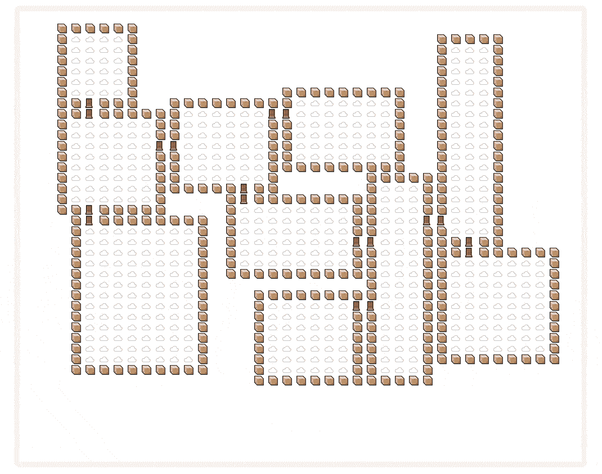
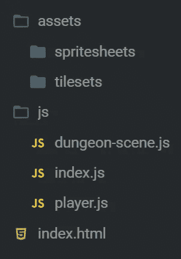
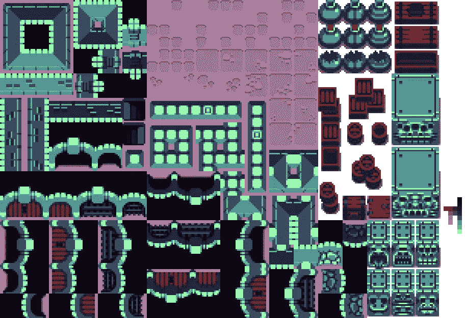
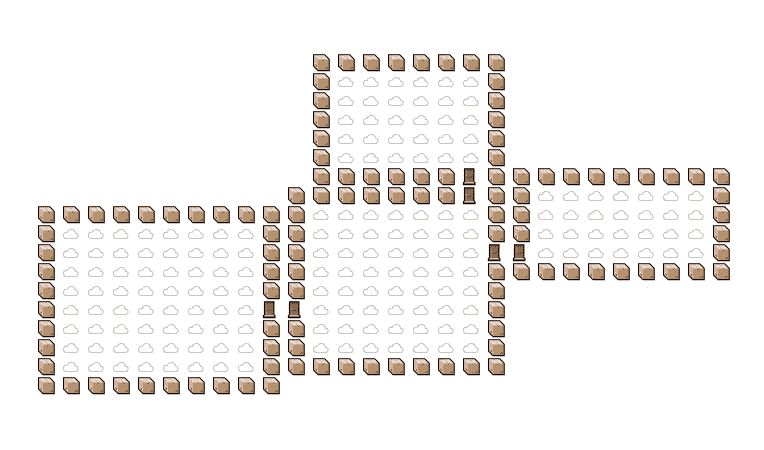
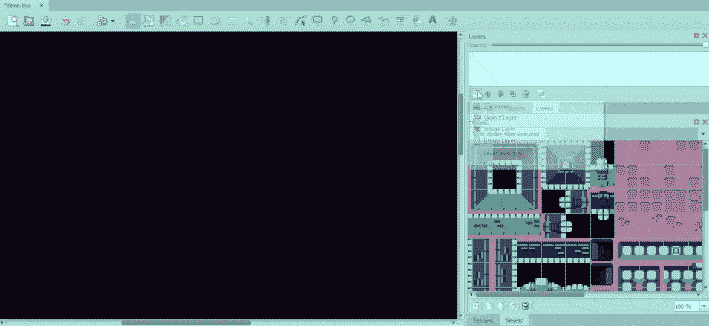
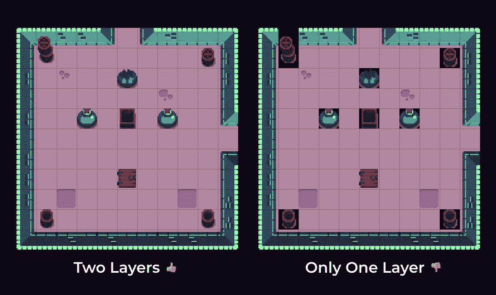
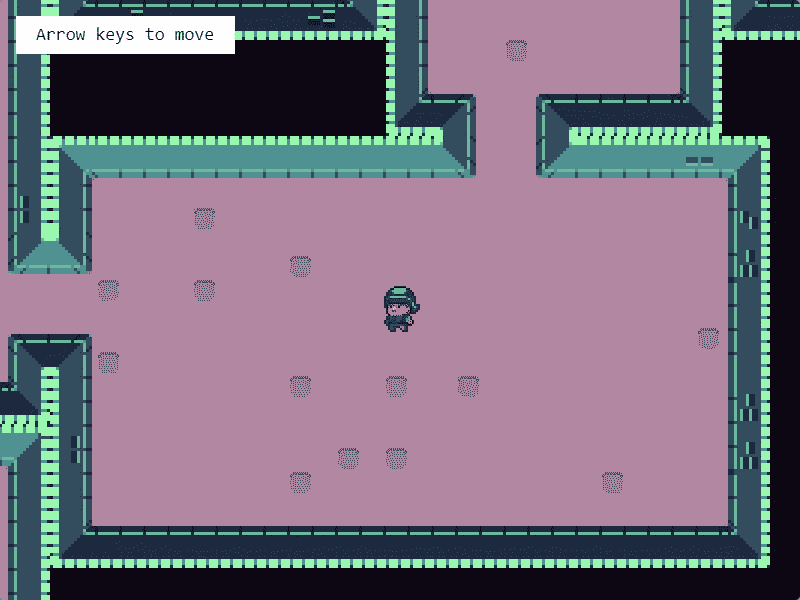
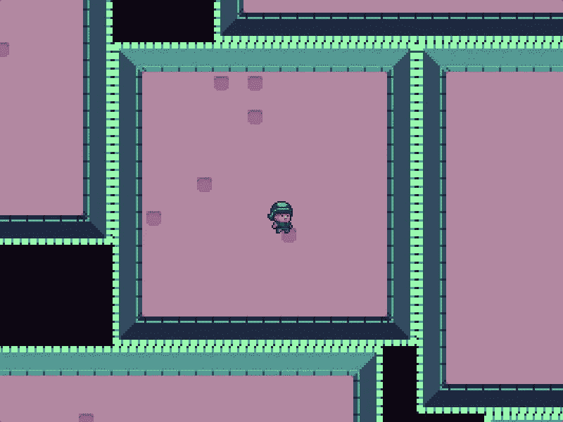
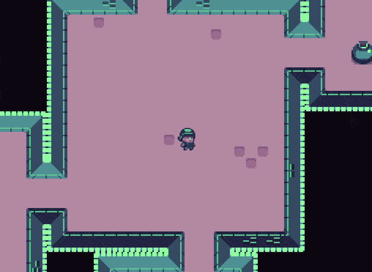

# Phaser 3 中的模块化游戏世界(tile maps # 3)——程序地牢

> 原文：<https://itnext.io/modular-game-worlds-in-phaser-3-tilemaps-3-procedural-dungeon-3bc19b841cd?source=collection_archive---------1----------------------->

这是一系列关于在 [Phaser 3](http://phaser.io/) 游戏引擎中使用 tilemaps 创建模块化世界的博客文章中的第三篇。在这个版本中，我们将创建一个无尽的，程序生成的地牢:

Tileset 和 Character by[Michele“Buch”Bucelli](https://opengameart.org/users/buch)

如果你还没有看过这个系列的前几篇文章，这里有一些链接:

1.  [静态磁贴地图&一个神奇宝贝风格的世界](https://medium.com/@michaelwesthadley/modular-game-worlds-in-phaser-3-tilemaps-1-958fc7e6bbd6)
2.  [动态磁贴地图&益智 y 平台](https://medium.com/@michaelwesthadley/modular-game-worlds-in-phaser-3-tilemaps-2-dynamic-platformer-3d68e73d494a)

在本系列的下一篇文章中，我们将研究如何在 tilemaps 中使用 [Matter.js](http://brm.io/matter-js/) 。

在我们开始之前，这篇文章附带的所有代码都在[这个库](https://github.com/mikewesthad/phaser-3-tilemap-blog-posts/tree/master/examples/post-1)中。这些教程使用截至 21 年 8 月 13 日的 Phaser 最新版本(v3.55.2)。

# 目标受众

如果你对 JavaScript(类、箭头函数和模块)、Phaser 和[平铺](https://www.mapeditor.org/)地图编辑器有一些经验，这篇文章将会很有意义。如果你不知道，你可能想从[系列](https://medium.com/@michaelwesthadley/modular-game-worlds-in-phaser-3-tilemaps-1-958fc7e6bbd6)的开头开始，或者继续阅读并把 Google、Phaser 教程和 Phaser [示例](https://labs.phaser.io/) & [文档](https://photonstorm.github.io/phaser3-docs/index.html)放在手边。

好吧，让我们开始吧！

# 概观

这篇文章建立在我们上次谈到的静态和动态 tilemap 层的概念之上。这篇文章中我们将要构建的代码是基于我对 [Phaser Labs](https://labs.phaser.io/) 的一个贡献。这绝对是我制作的最有趣的例子，它方便地涵盖了我们尚未涉及的动态 tilemap layer API 的许多附加部分——从随机平铺到使用每平铺透明来创建阴影。

我们将从熟悉使用普通 HTML & JS 的地牢生成器库开始。从那里，我们将开始引入相位器，逐步构建我们无尽的地牢世界。

# 地牢

我们将通过使用一个地下城生成器库 [mikewesthad/dungeon](https://github.com/mikewesthad/dungeon) 来开始生成世界。这是我更新的 [nickgravelyn/dungeon](https://github.com/nickgravelyn/dungeon) 的分支，它有一些新的功能，并在 npm 上发布。这是一个非常简单，蛮力地牢发电机。你给它一些配置信息，它会从地图的中心开始一个房间一个房间地随机建造一个地牢。

您可以通过 CDN、下载脚本或通过 npm ( [安装说明](https://github.com/mikewesthad/dungeon#installation))来加载库。一旦你加载了这个库，你就有了一个`Dungeon`类，你可以用它来构建一个地牢实例，如下所示:

我们可以通过`dungeon.drawToHtml`生成一些 HTML 来可视化随机地牢，它将地牢转换成一个`<pre><table> ... </table></pre>` HTML 元素。我们只需要指定地下城中每种类型的“牌”要使用哪些角色:

瞧，表情符号——天哪:

*查看*[*code sandbox*](https://codesandbox.io/s/xorr812k3p?hidenavigation=1&module=%2Fjs%2Findex.js&moduleview=1)*[*live 示例*](https://www.mikewesthad.com/phaser-3-tilemap-blog-posts/post-3/01-dungeon-html) *或者源代码* [*这里*](https://github.com/mikewesthad/phaser-3-tilemap-blog-posts/blob/master/examples/post-3/01-dungeon-html) *。**

*通过这篇文章中的交互式例子，你可以点击“在 CodeSandbox 上编辑”按钮，全屏查看代码，在这里你可以很容易地看到所有的文件。*

# *相位器和地牢*

*现在我们可以引入 Phaser，让玩家进入这些随机的世界。本系列的[上一篇文章](https://medium.com/@michaelwesthadley/modular-game-worlds-in-phaser-3-tilemaps-2-dynamic-platformer-3d68e73d494a)介绍了使用模块来更好地构建代码的思想。由于模块在 Phaser 示例中并不常见，我将在这里再次分解结构，以帮助简化转换。*

*请记住，如果您只是跟随而不是使用 CodeSandbox，您可以通过在 HTML 中使用``来访问代码中的模块(参见[示例](https://github.com/mikewesthad/phaser-3-tilemap-blog-posts/blob/master/examples/post-3/02-dungeon-simple-mapping))。当然，您也可以使用 Webpack、Parcel 或任何其他 JavaScript 构建工具。查看[phase 3-project-template](https://github.com/photonstorm/phaser3-project-template)获取 webpack 起始模板。*

*继续第一个例子。我们的目录结构如下所示:*

**

*“index.js”是我们代码的入口点。该文件通过创建启用了街机物理的 Phaser 游戏并加载我们的自定义场景来开始:*

*“dungeon-scene.js”是一个模块，它导出一个名为`DungeonScene`的单个`class`。它扩展了`[Phaser.Scene](https://photonstorm.github.io/phaser3-docs/Phaser.Scene.html)`，这意味着它可以通过属性访问 Phaser 的一系列功能(例如用于访问游戏对象工厂的`this.add`)。场景在`preload`加载一些资源，在`create`创建地牢和玩家，并在`update`的每一帧更新玩家。*

*一旦我们像上一个例子那样创建了一个`dungeon`，我们就可以使用`[createBlankLayer](https://photonstorm.github.io/phaser3-docs/Phaser.Tilemaps.Tilemap.html#createBlankLayer__anchor)`设置一个空白层的 tilemap:*

*`Dungeon`提供了一种通过`dungeon.getMappedTiles`获得 2D 拼贴数组的简单方法，Phaser 提供了一种通过`[putTilesAt](https://photonstorm.github.io/phaser3-docs/Phaser.Tilemaps.TilemapLayer.html#putTilesAt__anchor)`将拼贴数组插入图层的简单方法:*

*如果我们把这一切和一个基于本系列第一篇文章中的代码的播放器模块放在一起，我们最终会得到:*

**查看*[*code sandbox*](https://codesandbox.io/s/52v0nz348p?hidenavigation=1&module=%2Fjs%2Findex.js&moduleview=1)*[*live 示例*](https://www.mikewesthad.com/phaser-3-tilemap-blog-posts/post-3/02-dungeon-simple-mapping) *或源代码* [*此处*](https://github.com/mikewesthad/phaser-3-tilemap-blog-posts/blob/master/examples/post-3/02-dungeon-simple-mapping) *。***

# **地牢瓷砖布景的近距离观察**

**这是我们正在使用的 tileset:**

****

***未被挤出的影像，* [*地牢 tileset*](https://opengameart.org/content/top-down-dungeon-tileset) *由 Michele“Buch”Bucelli(tileset 艺术家)& Abram Connelly (tileset 赞助商)***

**我们希望使用这些磁贴，而不是之前用表情符号绘制的地下城，看起来像是:**

****

**我们需要选择地板、墙壁和门用哪种瓷砖。因为这个瓷砖有透视和定向照明，我们还需要在角落和北、西、南、东四面墙上使用不同的瓷砖。**

**以下是我们将用来打造房间的特定瓷砖:**

****

**在开始编写代码之前，我通常会在[平铺](https://www.mapeditor.org/)中摆弄一下瓷砖，感受一下瓷砖以及它们是如何组合在一起创建一个房间的。制定一个好的计划至关重要。这是我计划两个房间如何相交的一小段时间:**

****

***如果你想更紧密地跟随那个过程，这里有一个更慢的* [*视频版本*](https://vimeo.com/281170034/f62b5d0dfe) *。***

**需要注意的一点是，我在这里使用了两层。当我们使用 Phaser 时，我们至少需要两层——一层用于地面和墙壁，一层用于箱子/罐子等。—这样我们就可以使用透明背景的瓷砖。**

****

# **描绘我们的世界**

**既然我们已经有了如何使用瓷砖的计划，我们可以开始绘制地图了。在本节结束时，我们将有这样的设置:**

****

**我们将放弃`dungeon.getMappedTiles`方法，转而使用`dungeon.rooms`属性。`rooms`是一个包含每个房间信息的对象数组。一个`Room`实例具有以下属性:**

*   **`x`、`y` -房间左上角的位置(网格单位)**
*   **`width` & `height`**
*   **`top`、`left`、`bottom`、`right`**
*   **`centerX` & `centerY` -整数中心位置(对于偶数大小的房间向下舍入)**

**一种方法是:**

*   **`getDoorLocations` -获取相对于房间左上角的坐标中的门位置数组(`{x, y}`对象)**

**考虑到这些，我们可以开始规划我们的房间:**

**我们将使用动态层的`[fill](https://photonstorm.github.io/phaser3-docs/Phaser.Tilemaps.TilemapLayer.html#fill__anchor)`、`[putTileAt](https://photonstorm.github.io/phaser3-docs/Phaser.Tilemaps.TilemapLayer.html#putTileAt__anchor)`、`[putTilesAt](https://photonstorm.github.io/phaser3-docs/Phaser.Tilemaps.TilemapLayer.html#putTilesAt__anchor)`和`[weightedRandomize](https://photonstorm.github.io/phaser3-docs/Phaser.Tilemaps.TilemapLayer.html#weightedRandomize__anchor)`方法来构建我们的地图。让我们从`fill`和`weightedRandomize`开始，在放置地板和墙壁时进行初步检查:**

**最后我们会看到一个被困在没有门的世界里的角色:**

****

**`fill`直截了当。你可以只传入一个索引来填充整个图层，也可以传入`x`、`y`、`width`、&、`height`参数来填充特定区域。**

**`weightedRandomize`如果你没有使用过加权概率，它可能是新的。最后四个参数定义了我们想要随机化的区域(`x`、`y`、`width`、`height`)。第一个参数描述要放置哪些图块及其概率。它是一个包含一个索引(或一个索引数组)和一个权重的对象数组。任何给定索引被使用的概率为:`(the index's weight) / (sum of all weights for all indices)`。**

**我们已经做了一些工作，但是代码有点难读。你必须在心里记住瓷砖指数的含义。相反，让我们创建一个`tile-mapping.js`模块来完成这项工作:**

**然后回到我们的场景中，我们可以做如下的事情:**

**我开始省略代码，这样文章中就不会有大量重复的代码片段。如果你迷路了，跳到这一部分的底部，看看代码沙箱。现在，为了完成我们的映射，让我们添加一些门:**

**现在，我们可以添加回球员碰撞逻辑，类似于上一个例子:**

**最后我们得到了:**

***查看*[*code sandbox*](https://codesandbox.io/s/l54pq7lq7z?hidenavigation=1&module=%2Fjs%2Findex.js&moduleview=1)*[*live 示例*](https://www.mikewesthad.com/phaser-3-tilemap-blog-posts/post-3/03-dungeon-better-mapping) *或者源代码* [*这里*](https://github.com/mikewesthad/phaser-3-tilemap-blog-posts/blob/master/examples/post-3/03-dungeon-better-mapping) *。****

# **材料和可见性**

**这开始感觉更完整了，所以让我们在房间里随机放置一些东西，然后添加一个可见性算法来创建一个战争迷雾效果:**

****

**为了添加内容，我们需要另一层:**

**然后我们可以在房间里循环一遍，放一些东西。我们将跳过在第一个房间放置任何东西。我们还将指定一个随机选择的房间作为“目标”房间，它将有一个通往新地牢的楼梯。**

**然后一旦你在新的`stuffLayer`上激活碰撞，你将会得到:**

****

**如果没有某种灯光效果，一个类似罗格里的地牢会是什么样子？我们将用一些简单的东西来展示 tilemap 层 API，但是你也可以自己实现一些有趣的东西，比如[光线投射方法](https://www.redblobgames.com/articles/visibility/)。**

**Tilemap 图层可以具有每个图块的效果，如色调和 alpha。我们将利用这一点，创建第三个 tilemap 层，它将到处都是空白的黑色瓷砖。它们一开始是完全不透明的，但是当玩家进入房间时，我们会让房间“上方”的瓷砖透明，这样玩家就可以看到了。当他们离开一个房间时，我们将通过使瓷砖的黑色覆盖物半透明来“模糊”旧房间。**

**在我们场景的`create`中，我们将开始创建一个新的填充了黑色瓷砖的 tilemap 层，并将它交给一个尚未创建的新模块:**

**在“tilemap-visibility.js”中，我们将创建一个新的类来跟踪当前活动的房间，并根据需要使房间变暗/变亮:**

**最后，在我们场景的`update`中，我们只需要更新活动房间:**

**咻，我们最终得到了这样的结果:**

***查看*[*code sandbox*](https://codesandbox.io/s/3r0nvw2z2p?hidenavigation=1&module=%2Fjs%2Findex.js&moduleview=1)*[*live 示例*](https://www.mikewesthad.com/phaser-3-tilemap-blog-posts/post-3/04-dungeon-final) *或源代码* [*此处*](https://github.com/mikewesthad/phaser-3-tilemap-blog-posts/blob/master/examples/post-3/04-dungeon-final) *。****

# **临时演员:下楼梯**

**在最后一个代码示例中，我添加了几个额外的位。使用瓷砖索引回调，我们可以检测玩家何时到达楼梯，并重新启动场景，让玩家进入一个新的地牢。`[setTileIndexCallback](https://photonstorm.github.io/phaser3-docs/Phaser.Tilemaps.TilemapLayer.html#setTileIndexCallback__anchor)`将设置一个回调函数，在街机主体与给定索引的方块相交时运行。这在我们的游戏中很有用，因为我们只有一个移动的身体(玩家)。`create`里面的相关代码是这样的:**

**我还在场景中添加了一个`level`属性，这样我们就可以告诉玩家他们在哪个级别:**

# **下一个**

**查看下一篇[帖子](https://medium.com/@michaelwesthadley/modular-game-worlds-in-phaser-3-tilemaps-4-meet-matter-js-abf4dfa65ca1)，我们将使用更先进的物理引擎 [Matter.js](http://brm.io/matter-js/) 和 tilemaps 进行研究:**

****

**感谢您的阅读，如果您想在以后的帖子中看到什么，请告诉我！**

# **关于我**

**我是一名创意开发人员和教育家。我为 Phaser 3 编写了 Tilemap API，并创建了大量有指导的示例，但我希望将所有这些信息收集成一种更有指导、更易理解的格式，以便人们可以更容易地进入 Phaser 3。你可以看到更多我的作品，并在这里联系。**