# Phaser 3 中的模块化游戏世界(tile maps # 4)——见 Matter.js

> 原文：<https://itnext.io/modular-game-worlds-in-phaser-3-tilemaps-4-meet-matter-js-abf4dfa65ca1?source=collection_archive---------0----------------------->

这是一系列关于在 [Phaser 3](http://phaser.io/) 游戏引擎中使用 tilemaps 创建模块化世界的博文中的第四篇。在这一版中，我们将了解 Matter.js，以便我们可以建立一个具有“现实”物理的世界:

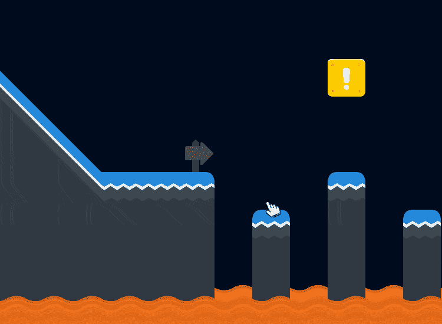

*空投*[twe moji](https://github.com/twitter/twemoji)

这将为下一篇文章做好准备，在下一篇文章中，我们将放弃表情符号，并添加一个在这个世界上跳跃的玩家。

如果你还没有看过这个系列的前几篇文章，这里有一些链接:

1.  [静态磁贴地图&一个神奇宝贝风格的世界](https://medium.com/@michaelwesthadley/modular-game-worlds-in-phaser-3-tilemaps-1-958fc7e6bbd6)
2.  [动态磁贴地图&益智 y 平台](https://medium.com/@michaelwesthadley/modular-game-worlds-in-phaser-3-tilemaps-2-dynamic-platformer-3d68e73d494a)
3.  [动态磁贴地图&程序地下城](https://medium.com/@michaelwesthadley/modular-game-worlds-in-phaser-3-tilemaps-3-procedural-dungeon-3bc19b841cd)

在我们开始之前，这篇文章的所有代码都在这个库中。这些教程使用截至 21 年 8 月 13 日的 Phaser 最新版本(v3.55.2)。

# 目标受众

如果你对 JavaScript(类、箭头函数和模块)、Phaser 和[平铺](https://www.mapeditor.org/)地图编辑器有一些经验，这篇文章将会很有意义。如果你不知道，你可能想从[系列](https://medium.com/@michaelwesthadley/modular-game-worlds-in-phaser-3-tilemaps-1-958fc7e6bbd6)的开头开始，或者继续阅读并把 Google、Phaser 教程和 Phaser [示例](https://labs.phaser.io/) & [文档](https://photonstorm.github.io/phaser3-docs/index.html)放在手边。

好吧，让我们开始吧！

# 概观

当我写这篇文章的时候，我意识到有太多的新概念要在一篇文章里完成，所以我把这篇文章分成两篇。这一个将介绍物质物理引擎本身，然后我们将带来相位器，tilemaps 和贴图平铺体。在第二篇文章中，我们将深入物质的碰撞逻辑，并建立一个平台。

快速补充:整个教程系列都是以 tilemap 为中心的，所以我们当然要在这里使用 tile map。也就是说，游戏/艺术/工具/等等。你想创建的东西可能不需要 tilemap，比如这个用 Matter 制作的[弹球游戏](https://codepen.io/lonekorean/pen/KXLrVX)。不要因为我们在这里使用 tilemaps 就觉得受其约束！在此过程中，您将学习物质的基本知识，因此，即使您不使用 tilemaps，您仍然会有所收获。

# 物质引论

Matter 是另一个 JavaScript 2D 物理引擎。Phaser 中的 arcade physics (AP)旨在快速简单(主要是轴对齐的边界框和圆)，Matter 是一个更现实的物理模拟引擎-复杂的身体形状、质量、密度、约束等。

如果你有一个可以用盒子和圆圈的游戏，AP 是完美的，但是如果你想做一些像在你的世界里创造物理谜题的事情(愤怒的小鸟，蜡笔物理，等等)。)，事在人为。例如，这是来自 Matter 网站的 slingshot 演示(单击并拖动左侧的蓝色形状):

Matter.js 的创建者 liabru 演示

你肯定想在 Matter 网站上玩玩其他的演示，感受一下 Matter 能做什么。你也会想把[物质文件](http://brm.io/matter-js/docs/)放在手边。

# 物质的第一步

Phaser 的实现是围绕底层 Matter 库的一个薄薄的包装器，所以如果我们想在 Phaser 中使用 Matter，我们应该从学习 Matter 本身开始。我们将创建一个简单的设置，您可以将任意形状放入世界中:

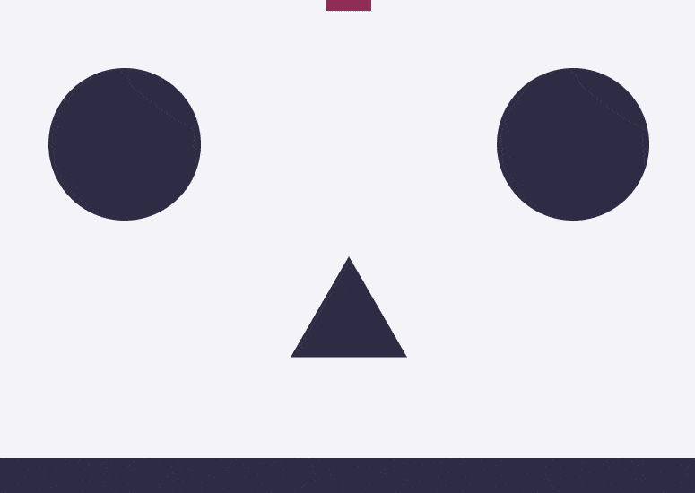

Matter 是围绕模块构建的，这些模块包含用于创建对象的工厂函数，以及可以操作这些对象的函数。例如，`Body`模块是关于创建&操纵[刚体](https://www.quora.com/What-is-a-rigid-body)的，所以它有`Body.create(...)`工厂，它将为我们创建一个新的身体对象，还有`Body.applyForce(...)`，它将对给定的身体对象施加一个力。因此，我们要采取的第一步是给几个模块起别名:

接下来，我们想要创建一个引擎和一个渲染器。Matter 附带了一个简单的画布渲染器，所以在开始使用 Phaser 之前，我们将利用它:

现在我们已经有了物理模拟引擎和渲染器，我们可以向世界添加一些身体:

我们来分析一下。`Bodies.rectangle(400, 0, 120, 80, { restitution: 0.25, angle: Math.PI / 4 })`将创建一个新的、矩形的物理实体。它使用身体的中心作为原点来定位。最后一个参数是一个对象，您可以传入它来覆盖默认的 [body 属性](http://brm.io/matter-js/docs/classes/Body.html#properties)。我们通过了数学考试。PI / 4 弧度(45 度)，这将覆盖默认的几何体旋转 0 弧度。我们在这里传递一个`restitution`属性，它指定了物体的弹性。默认情况下它是 0(无弹性)，所以我们覆盖它来创建一个稍微有弹性的矩形。其他有用的属性包括:`friction`、`frictionAir`、`frictionStatic`和`density`。

不能移动或旋转`floor`几何体，因为我们已经使用`isStatic`将其标记为静态几何体。所以我们的矩形会在地板不动的情况下反弹。

我们可以引入一些新的身体类型(多边形和圆形)来填充我们的世界:

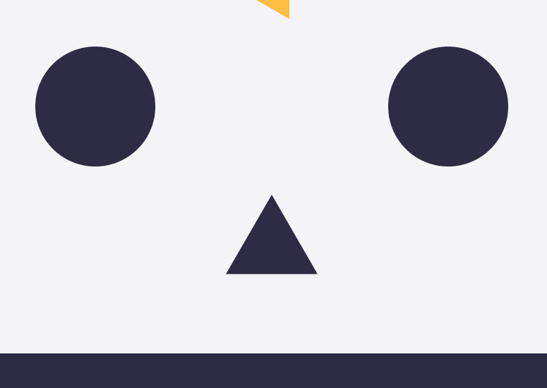

因为矩形具有最高的摩擦力和最低的恢复力，所以它是所有形状中最没有弹性和滑溜的。

我们还可以创建复合实体，即由多个部分连接在一起的实体。这些部分将作为一个物体一起移动:

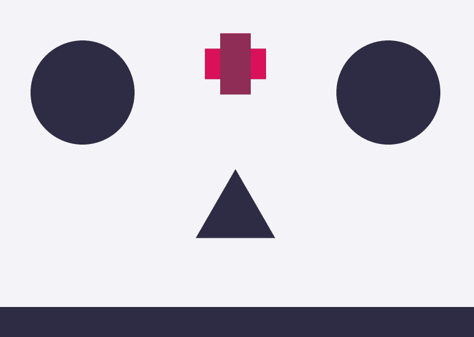

我们要添加的最后一项功能是，您可以随时在画布上单击来拖放新的多边形:

把所有这些放在一起:

*查看*[*code sandbox*](https://codesandbox.io/s/mq87yklq0p?hidenavigation=1&module=%2Fjs%2Findex.js)*，* [*live 示例*](https://www.mikewesthad.com/phaser-3-tilemap-blog-posts/post-4/01-matter) *或者源代码* [*这里*](https://github.com/mikewesthad/phaser-3-tilemap-blog-posts/blob/master/examples/post-4/01-matter) *。*

既然我们已经掌握了物质的基本原理，我们可以把注意力转向一起研究物质和相位器。如果你想更深入地探究物质本身，可以看看 Monty Shokeen 的教程系列[。](https://code.tutsplus.com/series/getting-started-with-matterjs--cms-1186)

# 物质和相位器

我们将创建类似于上一个例子的东西，除了我们将使用 tilemap 来定义世界，并且我们将删除一些表情符号(因为为什么不可以):

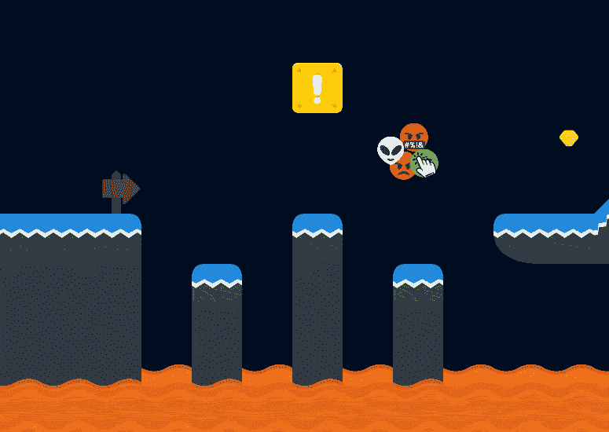

使用与本系列最后一个教程相同的结构，我们将创建一个`index.js`文件来创建我们的游戏并加载一个自定义场景:

让我们从创建`MainScene`开始，它加载 tilemap 并启用物理:

如果我们仔细观察，可以发现所有的新物体都是长方形的。在下一节中，我们将开始给瓷砖定制与它们的图形相匹配的主体。

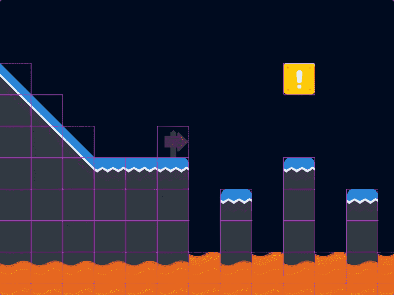

现在，我们可以使用`[this.matter.add.image](https://photonstorm.github.io/phaser3-docs/Phaser.Physics.Matter.Factory.html#image__anchor)`将几个有圆形身体的表情符号放到我们的场景中。像 AP 一样，我们可以使用`this.matter.add` [工厂方法](https://photonstorm.github.io/phaser3-docs/Phaser.Physics.Matter.Factory.html)创建物理图像和[精灵](https://photonstorm.github.io/phaser3-docs/Phaser.Physics.Matter.Factory.html#sprite__anchor)。工厂也有创建自然物体和约束的方法(没有任何图形)，例如`this.matter.add.rectangle`。

这些图像变量现在是`[Phaser.Physics.Matter.Image](https://photonstorm.github.io/phaser3-docs/Phaser.Physics.Matter.Image.html)`的实例。它们具有普通 Phaser 图像的属性和方法，但是增加了用于操纵底层物体的方法和属性。有一个`body`属性，可以让你访问原生物质体，还有`[setCircle](https://photonstorm.github.io/phaser3-docs/Phaser.Physics.Matter.Image.html#setCircle__anchor)`、`[setRectangle](https://photonstorm.github.io/phaser3-docs/Phaser.Physics.Matter.Image.html#setRectangle__anchor)`、`[setBody](https://photonstorm.github.io/phaser3-docs/Phaser.Physics.Matter.Image.html#setBody__anchor)`、`[setExistingBody](https://photonstorm.github.io/phaser3-docs/Phaser.Physics.Matter.Image.html#setExistingBody__anchor)`等方法。用于替换图像的当前正文。同样的想法也适用于`[Phaser.Phyiscs.Matter.Sprite](https://photonstorm.github.io/phaser3-docs/Phaser.Physics.Matter.Sprite.html)`。

就像上一节的例子一样，我们可以在每次按下鼠标左键时添加一些表情符号，方法是在我们的`create`方法中添加以下内容:

总的来说:

*查看*[*code sandbox*](https://codesandbox.io/s/mq6rr2jn5p?hidenavigation=1&module=%2Fjs%2Findex.js&moduleview=1)*[*live 示例*](https://www.mikewesthad.com/phaser-3-tilemap-blog-posts/post-4/02-matter-and-phaser) *或者源代码* [*这里*](https://github.com/mikewesthad/phaser-3-tilemap-blog-posts/blob/master/examples/post-4/02-matter-and-phaser) *。**

# *映射碰撞形状*

*我们已经把瓷砖和物质结合在一起了，但是我们有一个问题。我们的身体都是矩形的，但我们的瓷砖不都是矩形的:*

*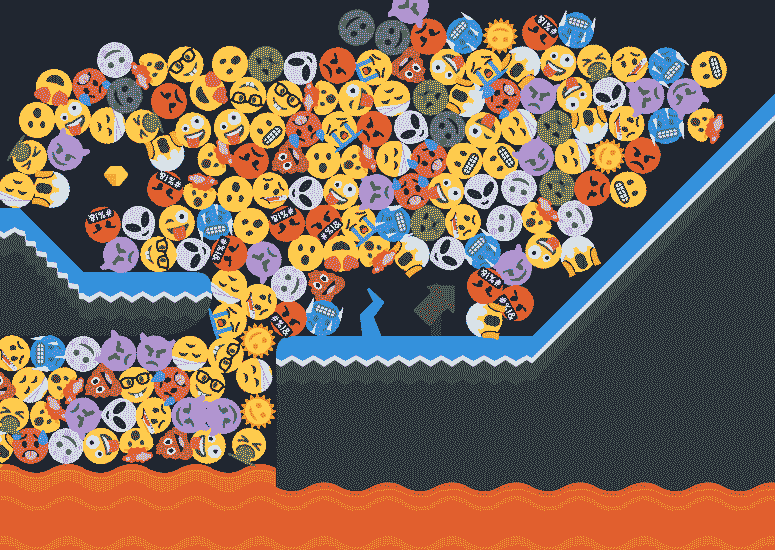*

*我们还没有真正利用物质不同的身体形状……还没有。在平铺模式下，我们可以使用内置的[碰撞编辑器](http://docs.mapeditor.org/en/stable/manual/editing-tilesets/)来绘制碰撞形状。当我们使用`this.matter.world.convertTilemapLayer(...)`时，Phaser 将自动解析出圆形、矩形、多边形和复合形状。*

*要绘制平铺的形状，我们需要:*

1.  *转到 tileset 属性窗口并打开碰撞编辑器。*
2.  *点击一个瓷砖，并绘制出它的身体。对所有需要自定义几何体的图块重复上述步骤。*
3.  *保存 tileset 并重新导出 tilemap。*

*Tiled 的用户界面可能会有点混乱，所以下面是打开碰撞编辑器的方法:*

*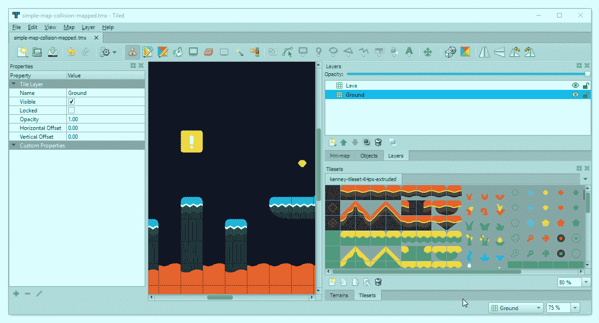*

*一旦我们选择了一个瓷砖，我们将有这个窗口来映射出瓷砖上的冲突形状:*

*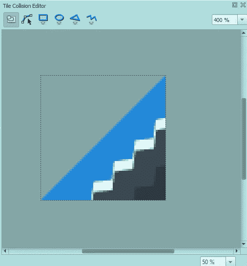*

*工具栏中从左到右依次是:选择对象、编辑多边形点、创建矩形、创建椭圆、创建多边形和创建折线。除了折线之外，我们将使用它们。*

*让我们来看一下绘制几个不同的瓷砖。目标是使用最少数量的形状/顶点，同时仍然获得体面的映射点击框。*

*首先，许多瓷砖仅用一个矩形就能很好地工作，就像这个瘦平台:*

*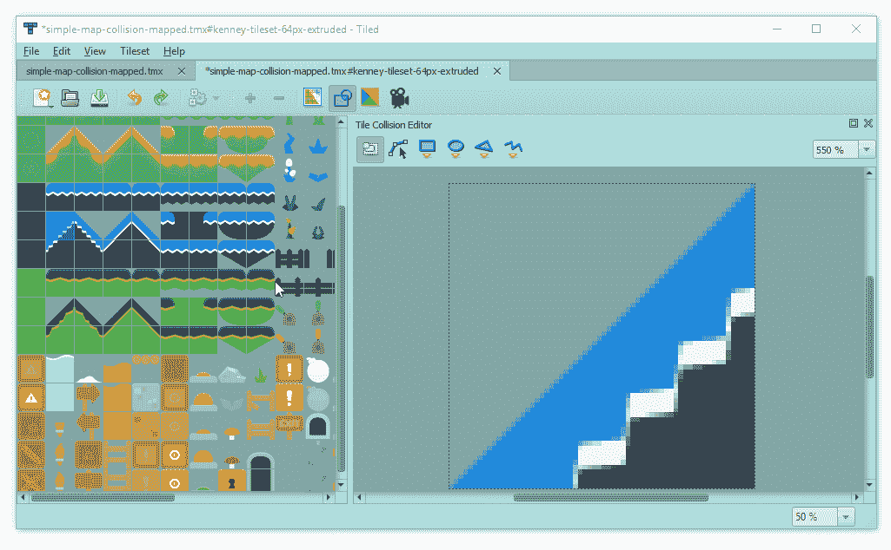*

*(工作时，您可能会发现启用或禁用捕捉设置很有用:顶部工具栏中的“视图”->“捕捉”。在这些 gif 中，我启用了像素对齐。)*

*有时候，你只需要一个圆圈:*

**

*这里有一个问题——Matter 不支持椭圆，因此您在 Tiled 中创建的任何“椭圆”都将在 Phaser 中转换为圆形。*

*由多个物体组成的复合物体——就像我们之前的十字架——非常方便，比如这个开关:*

*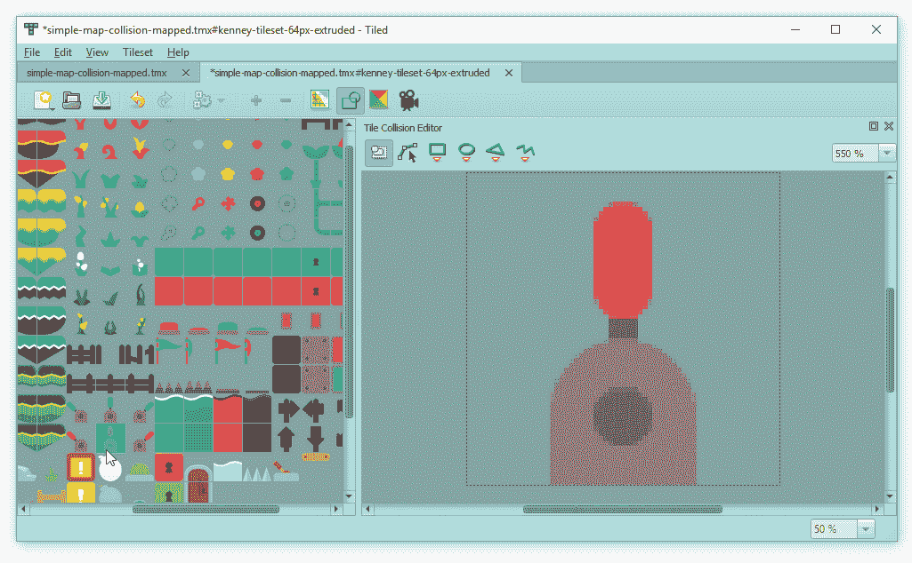*

*我们也可以绘制出多边形，就像对这个倾斜的瓷砖使用三角形一样。(绘制完最后一个顶点后，按 enter 键完成形状。)*

*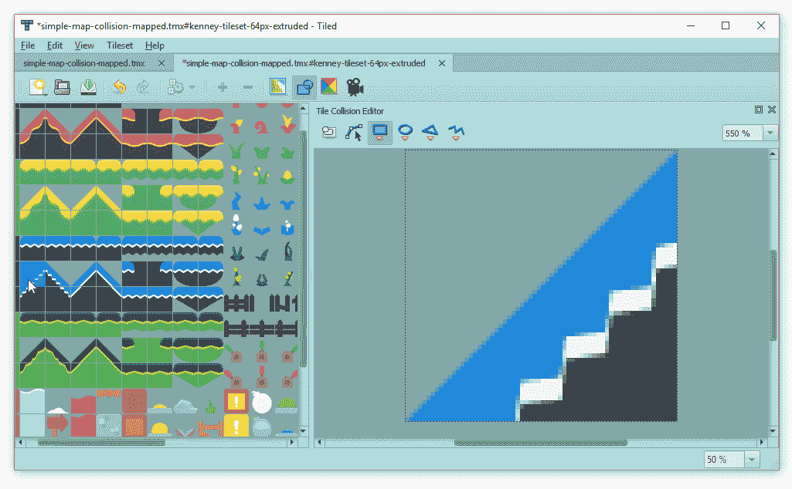*

*并非所有的多边形都是相同的。凸多边形通常比凹多边形更容易处理:*

*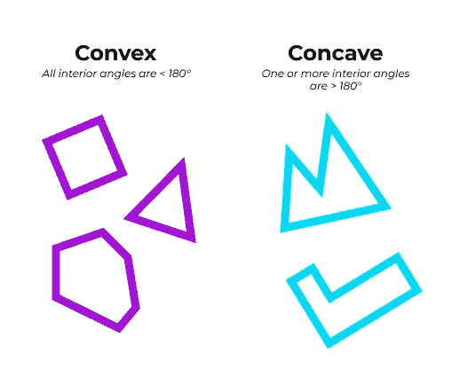*

**玩这个* [*工具*](https://www.mathopenref.com/polygonconvex.html) *看看我说的“内角”是什么意思**

*凸多边形将按预期工作。任何凹多边形体都会被物质分解成两个或两个以上凸多边形的复合体(使用 [poly-decomp.js](https://github.com/schteppe/poly-decomp.js) )。如果分解失败，身体将设置为[凸包](https://medium.com/@harshitsikchi/convex-hulls-explained-baab662c4e94)。更多信息见[事项文档](http://brm.io/matter-js/docs/classes/Bodies.html#method_fromVertices)。我建议坚持使用凸多边形，但出于演示目的，我们也可以绘制一个凹多边形:*

*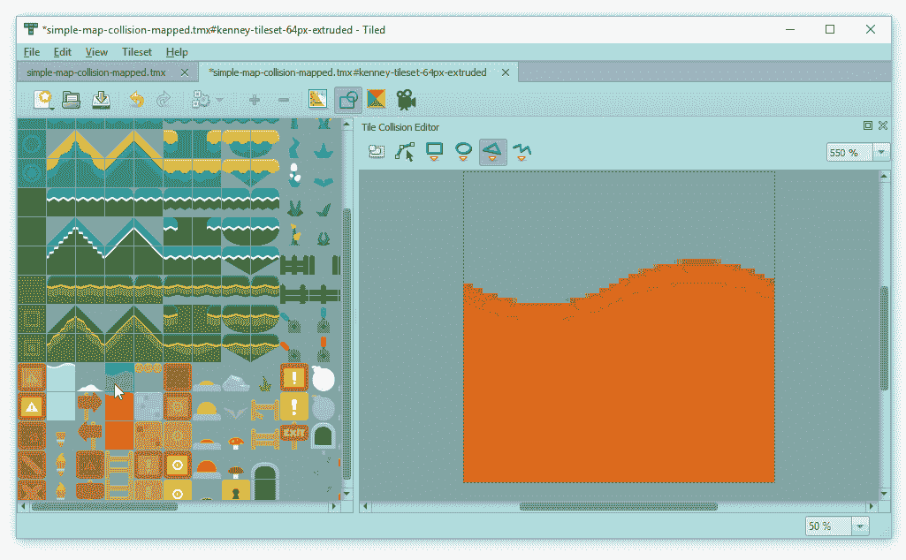*

*保存 tileset，重新导出地图，我们将有:*

*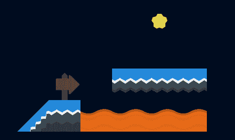*

*这与我们之前使用的地图不同，它只是一个小演示，展示我们刚刚绘制的图块。*注意，复合体(标志和熔岩)的调试渲染也渲染一个凸包。我们下次会详细讨论这一点。**

*在 codesandbox 中，我绘制出了我们正在使用的其余图块，并导出了新地图。加载这些新主体不需要修改任何代码:*

**查看*[*code sandbox*](https://codesandbox.io/s/rw3w7ln9qn?hidenavigation=1&module=%2Fjs%2Findex.js&moduleview=1)*，* [*live 示例*](https://www.mikewesthad.com/phaser-3-tilemap-blog-posts/post-4/03-mapping-tiles) *或者源代码* [*这里*](https://github.com/mikewesthad/phaser-3-tilemap-blog-posts/blob/master/examples/post-4/03-mapping-tiles) *。**

*如果我们需要更多地控制赋予图块的实体(或者如果我们没有使用 Tiled)，我们可以使用`layer.forEachTile`循环遍历图块，并使用`[this.matter.add.tileBody](https://photonstorm.github.io/phaser3-docs/Phaser.Physics.Matter.Factory.html#tileBody__anchor)`向每个图块添加自定义图块实体。*

# *下一个*

*敬请关注。接下来，我们将利用这些物质的基础知识来建造一个平台:*

*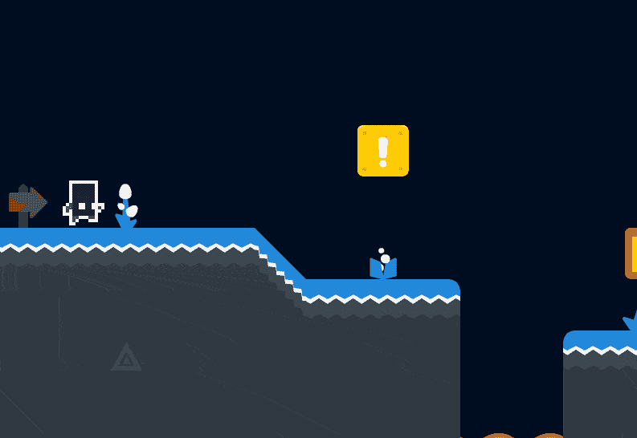*

*感谢您的阅读，如果您想在以后的帖子中看到什么，请告诉我！*

# *关于我*

*我是一名创意开发人员和教育家。我为 Phaser 3 编写了 Tilemap API，并创建了大量有指导的示例，但我希望将所有这些信息收集成一种更有指导、更易理解的格式，以便人们可以更容易地进入 Phaser 3。你可以看到更多我的作品，在这里联系。*