# Phaser 3 中的模块化游戏世界(tile maps # 5)——物质物理平台

> 原文：<https://itnext.io/modular-game-worlds-in-phaser-3-tilemaps-5-matter-physics-platformer-d14d1f614557?source=collection_archive---------0----------------------->

这是第五个(也是最后一个！)发表一系列关于在 [Phaser 3](http://phaser.io/) 游戏引擎中使用 tilemaps 创建模块化世界的博文。在这个版本中，我们将增加我们的 [Matter.js](http://brm.io/matter-js/) 知识，并创建一个小小的益智游戏平台:

*推着板条箱四处躲避钉子，跳过跷跷板平台*

如果你还没有看过这个系列的前几篇文章，这里有一些链接:

1.  [静态磁贴地图&一个神奇宝贝风格的世界](https://medium.com/@michaelwesthadley/modular-game-worlds-in-phaser-3-tilemaps-1-958fc7e6bbd6)
2.  [动态磁贴地图&益智 y 平台](https://medium.com/@michaelwesthadley/modular-game-worlds-in-phaser-3-tilemaps-2-dynamic-platformer-3d68e73d494a)
3.  [动态磁贴地图&程序地下城](https://medium.com/@michaelwesthadley/modular-game-worlds-in-phaser-3-tilemaps-3-procedural-dungeon-3bc19b841cd)
4.  [Meet Matter.js](https://medium.com/@michaelwesthadley/modular-game-worlds-in-phaser-3-tilemaps-4-meet-matter-js-abf4dfa65ca1)

在我们开始之前，这篇文章的所有代码都在这个库中。这些教程使用截至 21 年 8 月 13 日的 Phaser 最新版本(v3.55.2)。

# 目标受众

如果你对 JavaScript(类、箭头函数和模块)、Phaser 和[平铺](https://www.mapeditor.org/)地图编辑器有一些经验，这篇文章将会很有意义。如果你不知道，你可能想从[系列](https://medium.com/@michaelwesthadley/modular-game-worlds-in-phaser-3-tilemaps-1-958fc7e6bbd6)的开头开始，或者继续阅读并把 Google、Phaser 教程和 Phaser [示例](https://labs.phaser.io/) & [文档](https://photonstorm.github.io/phaser3-docs/index.html)放在手边。

# 概观

在[的最后一个帖子](https://medium.com/@michaelwesthadley/modular-game-worlds-in-phaser-3-tilemaps-4-meet-matter-js-abf4dfa65ca1)中，我们熟悉了 Matter.js 物理引擎，并在一个场景周围玩了扔弹性表情符号。现在，我们将在此知识的基础上逐步构建一个 2D 平台。我们将学习碰撞如何在 Matter 中工作，熟悉一个插件，它将允许我们在 Phaser 中整洁地观察碰撞，然后进入平台的核心。

# 物质中的碰撞

我们要做的关键是处理物质碰撞。如果我们想在游戏中使用物理，我们需要能够在某些物体相互碰撞时做出反应，例如，像一个玩家角色踩上了一扇活板门。由于 Phaser 的 Matter 实现是底层库的一层薄薄的包装，因此有必要重温一下上次的普通 Matter 示例，以了解 Matter 中的碰撞检测。如果你不耐烦，你*可以*跳过两个部分直接进入平台。但是，如果你想了解一些东西真正是如何工作的——我认为从长远来看这是值得的——那就和我呆在一起吧。

这是我们在这一部分的目标:

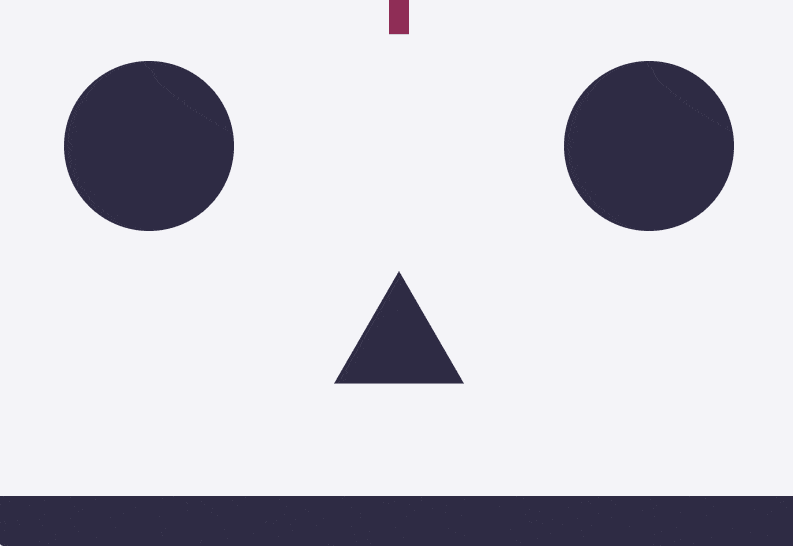

*形状相互碰撞时会变亮，碰到地板时会变成紫色。*

这里有一个 [CodeSandbox starter 项目](https://codesandbox.io/s/kw73yy6375?module=%2Fjs%2Findex.js)，与我们上次所做的相匹配。我建议打开它，然后一起编码。文件底部有一个注释，告诉你从哪里开始编码。设置与上次相同:

1.  我们创建一个渲染器和引擎。
2.  我们创造了一些不同形状的物体，它们将在世界各地反弹。
3.  我们添加一些静态物体——不能移动或旋转的物体——作为障碍。
4.  我们将一切添加到世界中，并启动渲染器和引擎循环。

为了开始监听冲突，我们需要在文件的顶部添加一个新的模块别名，`Events`:

`Events`允许我们在 Matter 中订阅事件发射器。我们将在这个演示中玩的两个事件是`[collisionStart](http://brm.io/matter-js/docs/classes/Engine.html#event_collisionStart)`和`[collisionEnd](http://brm.io/matter-js/docs/classes/Engine.html#event_collisionEnd)`。(参见其他[发动机事件](http://brm.io/matter-js/docs/classes/Engine.html#events)的文档。)

在引擎循环的每一次滴答中，物质会跟踪所有刚刚开始碰撞(`collisionStart`)、持续碰撞了多个滴答(`collisionActive`)或刚刚结束碰撞(`collisionEnd`)的物体对。这些事件具有相同的结构。每一个都提供了一个参数——一个对象——带有一个`pairs`属性，这是一个所有碰撞物体对的数组。每个`pair`都有`bodyA`和`bodyB`属性，这两个属性让我们可以访问两个物体发生了碰撞。在我们的事件侦听器中，我们可以循环所有对，寻找我们关心的冲突并做一些事情。让我们从制造稍微透明的碰撞开始(使用身体的[渲染属性](http://brm.io/matter-js/docs/classes/Body.html#property_render)):

现在我们可以扩展我们的`collisionStart`,基于哪些物体发生碰撞来建立一些条件逻辑:

在第一个条件中，我们检查一个物体是否是地板，然后我们调整另一个物体的颜色以匹配地板的颜色。在第二个条件中，我们检查圆圈是否落地，如果是，就杀死它。有了这些基础，我们可以在游戏世界中做很多事情——比如检查玩家是否按了按钮，或者是否有任何物体掉进了熔岩。

*查看*[*code sandbox*](https://codesandbox.io/s/yqv0qqjoj9?hidenavigation=1&module=%2Fjs%2Findex.js)*，* [*live 示例*](https://www.mikewesthad.com/phaser-3-tilemap-blog-posts/post-5/01-native-matter-collision) *或者源代码* [*这里*](https://github.com/mikewesthad/phaser-3-tilemap-blog-posts/blob/master/examples/post-5/01-native-matter-collision) *。*

尽管这种方法并不十分友好或模块化。我们不得不担心`bodyA`和`bodyB`的顺序——楼层是 A 还是 B？我们还必须有一个大的中央功能，知道所有的碰撞对。Matter 采取的方法是尽可能保持引擎本身的精简，并让用户添加他们处理碰撞的特定方式。如果你想在没有相位器的情况下更进一步，那么看看这个使碰撞处理更容易的 Matter 插件:[dxu/Matter-collision-events](https://github.com/dxu/matter-collision-events#readme)。当我们使用 Phaser 时，我们将使用一个插件来解决这个问题。

# 相位器中的简单碰撞

既然我们已经了解了物质中碰撞是如何工作的，让我们在 Phaser 中使用它们。在开始创建平台之前，让我们快速回顾一下上次的表情符号删除示例:

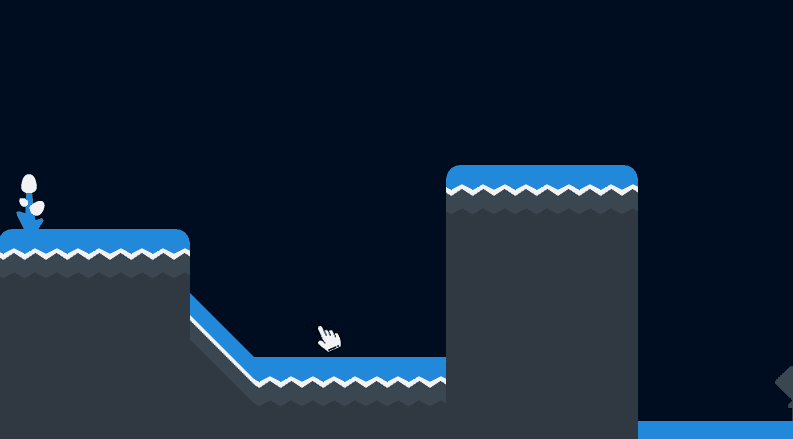

*像上次一样掉表情符号，只不过现在他们碰撞时会生气。*

当表情符号与某物发生碰撞时，我们会让它播放一小段愤怒的表情动画。这里是另一个[入门模板](https://codesandbox.io/s/l5ko8wo917?module=%2Fjs%2Fmain-scene.js)，你可以在这里编码。它有一个 tilesmap，在 tile 上设置了物体。注意:Phaser 和更低版本有一个关于物质的`collisionEnd`的 bug，但是现在在 3.12 和更高版本中已经被修补了。起始项目使用 3.12。

当玩家点击屏幕时，我们会放下一个启用事件的表情符号。上次我们用了一个`[Phaser.Physics.Matter.Image](https://photonstorm.github.io/phaser3-docs/Phaser.Physics.Matter.Image.html)`作为表情符号，但这次我们将使用一个`[Phaser.Physics.Matter.Sprite](https://photonstorm.github.io/phaser3-docs/Phaser.Physics.Matter.Sprite.html)`，这样我们就可以使用动画了。这进入了我们场景的`create`方法:

现在我们只需要处理碰撞(也在`create`):

熟悉吧？其结构与 native Matter 非常相似，只是 Phaser 将事件名小写以匹配其自身的约定。`bodyA`和`bodyB`是物质体，但是有一个附加属性。如果身体属于 Phaser 游戏对象(如精灵、图像、瓷砖等)。)，他们会有一个`gameObject`属性。然后，我们可以使用该属性来识别碰撞的内容:

我们的场景中有两种类型的碰撞物体——精灵和瓷砖。我们使用`[instanceof](https://developer.mozilla.org/en-US/docs/Web/JavaScript/Reference/Operators/instanceof)`来判断哪些身体是表情符号精灵。我们播放一个愤怒的动画，并使精灵半透明。我们也可以使用`collisionend`事件让精灵再次变得不透明:

*查看*[*code sandbox*](https://codesandbox.io/s/810yw745v9?hidenavigation=1&module=%2Fjs%2Fmain-scene.js)*[*live 示例*](https://www.mikewesthad.com/phaser-3-tilemap-blog-posts/post-5/02-simple-phaser-collisions) *或源代码* [*此处*](https://github.com/mikewesthad/phaser-3-tilemap-blog-posts/blob/master/examples/post-5/02-simple-phaser-collisions) *。**

*现在我们已经看到了自然物质事件和 Phaser 对这些物质事件的包装。如果没有更好的结构，这两者使用起来都有点混乱，但在我们开始使用插件来帮助我们管理冲突之前，了解它们是很重要的。如果你决定不想依赖我的插件，这一点尤其重要😉。*

# *碰撞插件*

*我创建了一个 Phaser 插件，让我们在 Phaser 中进行物质碰撞时的生活变得更加轻松:[Phaser-Matter-collision-plugin](https://github.com/mikewesthad/phaser-matter-collision-plugin)。我们将使用它来构建这个(这是我们用平台化产品增加复杂性之前的最后一站):*

*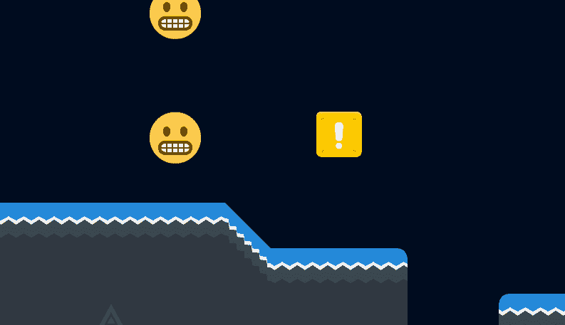*

**爱恨碰撞**

*有了这个插件，我们可以检测特定游戏对象之间的冲突，例如:*

*或者在游戏对象组之间:*

*或者在游戏对象和任何其他物体之间:*

*还有一些其他有用的功能——如果你想了解更多，请查看文档。我们将使用它，并在过程中解释它是如何工作的。*

*Phaser 的插件系统允许我们以结构化的方式连接到游戏引擎，并添加额外的功能。碰撞插件是一个场景插件(相对于一个全局插件，见[文档](https://photonstorm.github.io/phaser3-docs/Phaser.Plugins.PluginManager.html))，所以在我们通过`this.matterCollision`安装后，每个场景都可以访问一个实例。*

*这里有一个 [CodeSandbox starter 项目](https://codesandbox.io/s/316pq9j541?module=%2Fjs%2Findex.js)用于编码。它的依赖项 Phaser 和 PhaserMatterCollisionPlugin 已经作为依赖项安装。(这里有额外的说明关于如何从 CDN 加载插件或者在本地安装。)*

*在 index.js 中，我们可以加载安装了插件的游戏:*

*然后在 main-scene.js 里面，在`create`里面:*

*现在我们不必担心碰撞对的顺序，或者找到附加的游戏对象(或者处理复合体)。我们可以在我们认为合适的类/模块中组织我们的冲突逻辑——比如让播放器监听它在 player.js 中关心的冲突。*

*这是最终的代码，添加了一些额外的代码以使表情符号可拖动:*

*c*check 出*[*code sandbox*](https://codesandbox.io/s/v829vxpp8l?hidenavigation=1&module=%2Fjs%2Findex.js)*[*live 示例*](https://www.mikewesthad.com/phaser-3-tilemap-blog-posts/post-5/03-plugin-setup) *或者源代码* [*这里*](https://github.com/mikewesthad/phaser-3-tilemap-blog-posts/blob/master/examples/post-5/03-plugin-setup)**

# **平台玩家:创建玩家**

**现在我们已经有了碰撞的基本原理，我们可以处理一些更复杂的东西——一个平台。我们将分块构建它，从玩家类开始。在第一部分，我们将以以下内容结束:**

**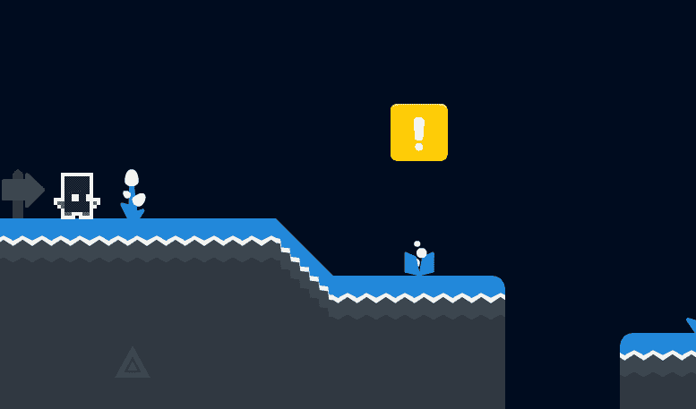**

**这里是最后一个 [starter CodeSandbox 项目](https://codesandbox.io/s/pmkmj7r8lm?module=%2Fjs%2Fplayer.js),你可以用它来编写这篇文章的剩余部分。它已经有一个加载了碰撞的贴图，并且为我们将要创建的不同模块准备了空文件。**

**我们将从创建我们的平台化“player.js”文件开始。像 Matter 这样的现实物理引擎带来的挑战之一是，它们在游戏环境中很难以可预测的方式控制。与我们在[帖子中的两个](/modular-game-worlds-in-phaser-3-tilemaps-2-dynamic-platformer-3d68e73d494a)的单一矩形身体相比，这个角色将有一个由四部分组成的复合身体:**

**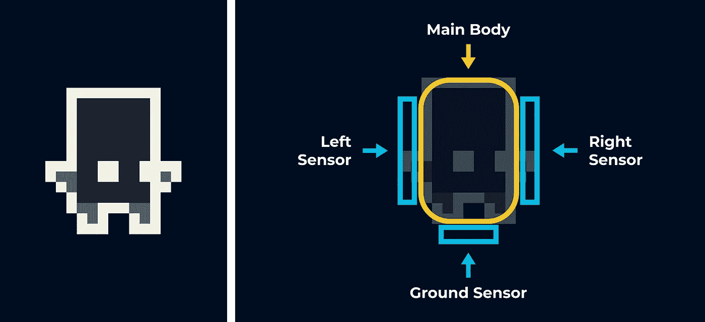**

**我们的播放器由一个主体和三个传感器组成。主体将像我们以前创建的矩形体，除了它将有圆角(倒角)。这有助于消除碰撞(这在后面会更有意义)。至于其他三个部分，传感器是一个不与世界上其他物体发生物理反应，但仍然会引发碰撞的物体。这将允许我们实现一些特殊的逻辑——例如，玩家下方的传感器将让我们知道玩家当前是否在地面上。**

**直接进入代码，我们将需要依赖本机物质 API，可在`Phaser.Physics.Matter.Matter`(是的，双物质)下访问，来构建主体:**

**如果我们在 main-scene.js 中创建播放器，从地图中的平铺对象(已经在 starter 模板的 level.json 文件中)加载它的位置:**

**我们最后会得到:**

**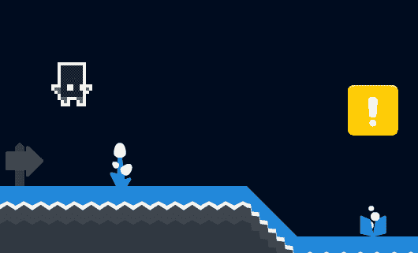**

**让我们回到播放器类，添加一些控件:**

**我们在这里做了一些事情。首先，为了更好地处理输入，我们使用了一个名为`MultiKey`的小类，这是我为我们提供的。源代码在沙箱中，但是对于我们的目的，我们需要知道的是我们传递给它尽可能多的 Phaser 键，然后`isDown()`方法会告诉我们是否有任何键被按下。这使得用 W/A/S/D 键或箭头键控制播放器变得很容易。**

**其次，我们将玩家的`update`方法与场景的生命周期`this.scene.events.on("update", this.update, this)`挂钩。在以前的帖子中，我们手动调用了播放器的更新方法，但现在每当场景更新时，播放器都会自行更新。**

**最后，在 update 中，我们向玩家施加一个力来水平移动他们以响应按键输入。因为我们在任何时候按下键时都在施加力，所以速度会随着我们按住键的时间越长而不断增加——直到精灵飞出屏幕的速度达到惊人的速度。我们需要手动设定(水平)速度限制。为了让玩家跳跃，我们也增加了 y 方向的速度。**

**我们有一个球员在世界各地移动，但我们有两个问题。首先，玩家可以在半空中跳跃，也就是超人:**

**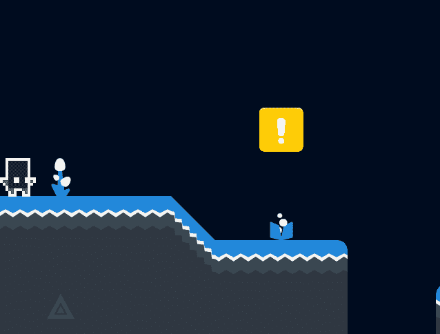**

**第二个是，因为玩家有一个有摩擦力的身体，玩家可以通过跳进一堵墙来粘在墙上，也就是蜘蛛侠:**

**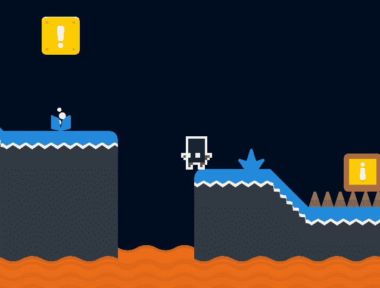**

**这就是那些传感器发挥作用的地方！我们可以使用地面传感器来知道玩家是在地面上还是在空中，这样我们就可以解决跳跃问题。我们可以使用左/右传感器来知道玩家何时靠墙，这样我们就可以取消蜘蛛侠贴墙的能力。我们将不得不修改一些东西:**

**我们添加了两个属性——`canJump`&`jumpCooldownTimer`——我们将在更新中使用。我们还添加了`isTouching`，这是我们如何跟踪世界上哪些传感器正在接触某些东西。我们挂钩到 Matter 的`beforeupdate`事件，它在任何碰撞事件之前运行，以将`isTouching`字段重置回`false`。使用物质碰撞插件，每当传感器击中场景中的另一个物体时，我们标记`isTouching`到`true`的适当区域。**

**我们还使用了事件事件中的`pair.separation`。这告诉我们物体要移动多远才能不再碰撞。我们推动玩家稍微远离左侧或右侧的任何墙壁(但留下 0.5px 的重叠，以便传感器继续碰撞)。玩家的`mainBody`——也就是与世界进行物理交互的东西——不再能被压在墙上，所以摩擦贴墙的问题就解决了。**

**回到更新，我们可以改变一些事情:**

**我们调整了移动速度，让你在空中移动得更慢，这样你就不能在空中推来推去了(这对我们给世界添加可移动的物体很重要)。我们还修改了跳跃，这样你只能在地面传感器与某样东西碰撞时跳跃。我们还使用了一个相位计时器来创造一个冷却时间，这样你就必须在跳跃之间等待 250 毫秒。**

**综上所述:**

***查看*[*code sandbox*](https://codesandbox.io/s/5vlzl8j9vp?hidenavigation=1&module=%2Fjs%2Findex.js)*[*live 示例*](https://www.mikewesthad.com/phaser-3-tilemap-blog-posts/post-5/04-platformer-step-1) *或源代码* [*此处*](https://github.com/mikewesthad/phaser-3-tilemap-blog-posts/blob/master/examples/post-5/04-platformer-step-1)***

**我已经在那个沙箱中添加了玩家动画，检查一下`create`和`update`方法，看看它们是如何工作的。**

# **关闭和销毁时整理**

**我们会想给我们的世界增加更多的互动性。我们将增加的第一件事是杀死玩家的能力，并在他们落在熔岩或尖钉上时重启场景。要做到这一点，我们需要负责任，让玩家实例自己清理。**

**在上一个教程中，我们有清理和破坏播放器的场景处理。因为我们将玩家直接挂钩到事件中，所以我们希望玩家监听`shutdown`和`destroy`场景事件。`shutdown`是在一个场景内调用`[this.scene.restart](https://photonstorm.github.io/phaser3-docs/Phaser.Scenes.ScenePlugin.html#restart__anchor)`或`[this.scene.stop](https://photonstorm.github.io/phaser3-docs/Phaser.Scenes.ScenePlugin.html#stop__anchor)`触发的。停止时，场景实例不会被破坏，因此如果场景再次启动，它将通过`init`和`create`(但不是构造函数)。杀死场景实例，如果我们再次开始那个场景，一个新的实例将被创建。在这两种情况下，我们都将取消监听器对任何事件的订阅，并销毁玩家的精灵。player.js 内部:**

**我们监听关闭和销毁，作为响应，触发播放器的`destroy`方法。这将取消订阅任何可能在玩家场景事件中触发代码的东西，比如碰撞插件回调，计时器。我们也摧毁了精灵。尽管这个方法是由场景事件自动调用的，但它是以这样一种方式编写的，即我们可以决定在任何时间点摧毁玩家，而不管场景事件。**

**我们还在代码中添加了一个`destroyed`标志。这是必要的，因为[事件发射器 3](https://github.com/primus/eventemitter3) 的工作方式。当事件被触发时，事件的任何事件侦听器都会在事件开始时被缓存。因此，在更新事件中被摧毁的玩家可能仍然会收到更多的更新事件，这是有可能的(在使用物理时经常发生)。我们可以在未来使用类似于[samme/phaser-update-plugin](https://github.com/samme/phaser-plugin-update)或[emotional-labs/phaser-life cycle-plugin](https://github.com/sporadic-labs/phaser-lifecycle-plugin)的插件来解决这个问题。两者都是场景事件的代理，所以如果您通过它们取消订阅侦听器，您可以相信事件不会再次调用侦听器。**

# **玩家 vs 致命牌**

**咻，现在我们可以继续通过添加一些简单的物理谜题来构建这个世界。首先，让我们在玩家落在长钉或熔岩上时杀死它。**

****

**在我们的主场景中:**

**我们正在设置玩家的精灵与世界上的任何东西发生碰撞。当它碰撞时，我们检查它碰撞的物体(`gameObjectB`)是否是瓷砖。如果是，而且是致命的磁贴(磁贴属性设置在磁贴中——见[“随物理移动”一节](https://medium.com/@michaelwesthadley/modular-game-worlds-in-phaser-3-tilemaps-1-958fc7e6bbd6#b92b))，我们淡出并重新开始场景。**

**播放器上的`freeze`方法(在 starter 模板中给出)只是让播放器的身体保持静止，这样它就不会在渐变期间移动。`unsubscribePlayerCollide`在这里真的很重要。这个函数——从`addOnCollideStart`返回——将移除我们添加的碰撞监听器，这样玩家只能死一次。**

**这是这篇文章的最后一个平台沙盒(包括致命瓷砖和接下来几节的代码):**

***查看*[*code sandbox*](https://codesandbox.io/s/j44k3844j3?hidenavigation=1&module=%2Fjs%2Findex.js)*[*live 示例*](https://www.mikewesthad.com/phaser-3-tilemap-blog-posts/post-5/04-platformer-step-2) *或源代码* [*此处*](https://github.com/mikewesthad/phaser-3-tilemap-blog-posts/blob/master/examples/post-5/04-platformer-step-2)***

# **板条箱和钉子拼图**

**地图上有尖刺的部分在没有帮助的情况下是不可跳跃的。让我们创建一个非常简单的物理难题来展示物质。我们会在玩家面前放一些板条箱，让他们敲下来，这样他们就可以越过钉子。因为我们使用平铺来构建关卡，所以我们将使用一个对象层。它已经在 starter 项目中设置好了，但下面是它的制作过程:**

**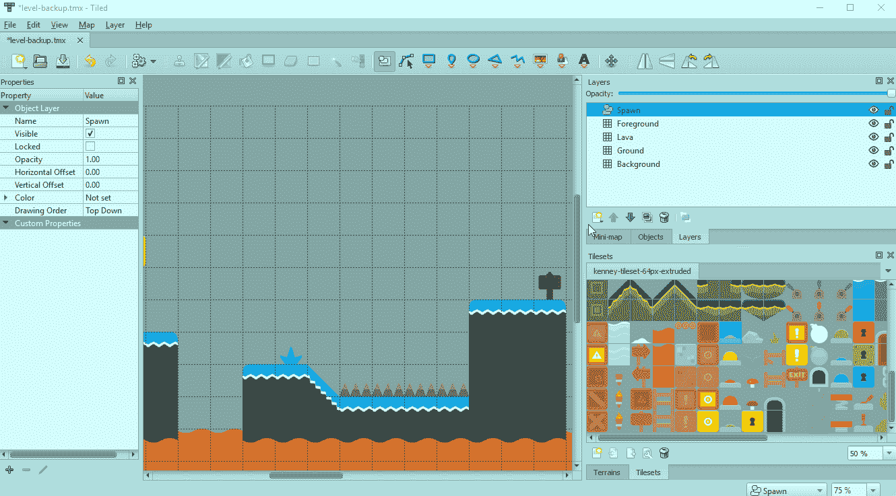**

***使用图块对象工具，该工具允许您在地图中放置图块图形***

**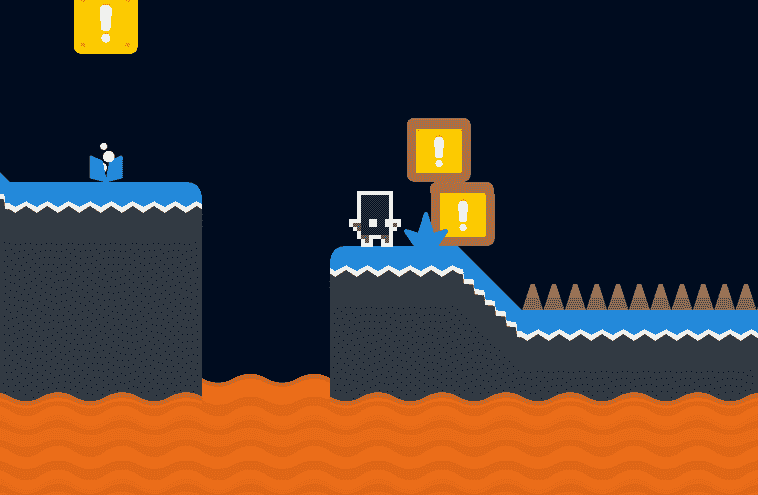**

# **约束和跷跷板平台**

**在尖峰之后，我们有一个充满熔岩的大裂缝，所以让我们在那个区域添加一些旋转平台来创建另一个简单的物理难题。平台将使用约束将它们固定在空间中，但它们将自由旋转:**

**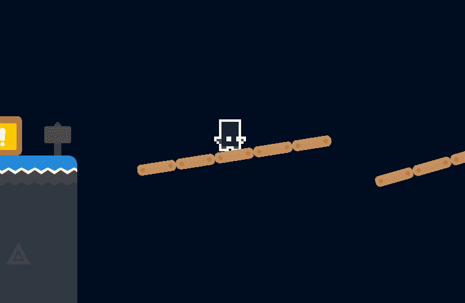**

**同样，它已经在 starter 项目中设置好了，但下面是如何使用 Tiled 来选择这些平台的位置:**

**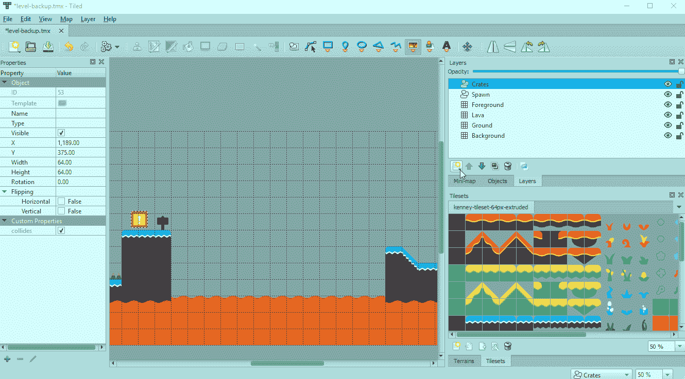**

**放置点对象，并按住 CTRL 键以捕捉到栅格位置**

**然后，我们可以使用尚未创建的模块来放置平台:**

**我们希望这些平台像一个静态物体一样呆在原地，但是我们不能在这里使用静态物体，因为这样平台就不能旋转。相反，我们将使用一种叫做约束的东西来将平台固定在一个固定的位置。从 Matter.js 查看[约束演示](http://brm.io/matter-js/demo/#constraints)和[源代码](https://github.com/liabru/matter-js/blob/master/examples/constraints.js)，我们可以将约束视为一种表达一个物体应该与空间中的另一个物体或点不可见地链接的方式。然后，该几何体将尝试与另一个几何体或点保持固定的距离(由您指定)。**

**在一个新文件“create-rotating-platform.js”中，我们可以导出一个创建平台的函数。(我们在这里并不真的需要一个类——我们只是在配置一个[tile script](https://photonstorm.github.io/phaser3-docs/Phaser.GameObjects.TileSprite.html)。)**

**我们正在利用 [TileSprite](https://photonstorm.github.io/phaser3-docs/Phaser.GameObjects.TileSprite.html) ，这样我们就可以使用我们的 tile 资产(64 x 64 像素)在世界中创建一个平台。我刚刚从 tileset 中提取了一个单独的图块，并将其裁剪为 64 x 18 像素。**

**约束可以带来很多乐趣。我们在普通物质中能做的任何事情，我们都可以用物质和相位器来做。查看 Matter 的[约束文档](http://brm.io/matter-js/docs/classes/Constraint.html)了解更多信息。**

**这是最后一个平台沙盒，其中包括这一部分的代码:**

***查看*[*code sandbox*](https://codesandbox.io/s/j44k3844j3?hidenavigation=1&module=%2Fjs%2Findex.js)*[*live 示例*](https://www.mikewesthad.com/phaser-3-tilemap-blog-posts/post-5/04-platformer-step-2) *或源代码* [*此处*](https://github.com/mikewesthad/phaser-3-tilemap-blog-posts/blob/master/examples/post-5/04-platformer-step-2)***

# **庆祝触发器**

**太好了——我们可以从屏幕的左侧看到右侧。当玩家这样做的时候，让我们做一些有趣的事情来庆祝。我们将创建一个不可见的传感器，当玩家碰到传感器时，我们会在玩家身上投放庆祝表情符号:**

**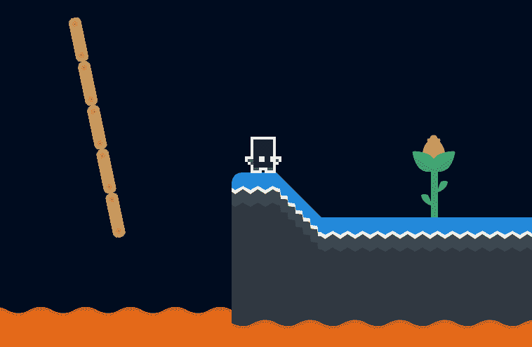**

**同样，已经在启动项目的 level.json 中创建了传感器，但是它是如何创建的:**

**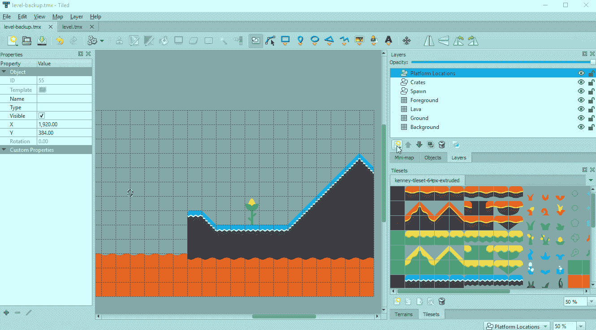**

**使用矩形对象工具，并给这个传感器一个特定的名称，以便它很容易在 Phaser 中找到**

**然后我们可以加载它，并在场景中监听碰撞:**

**这种隐形传感器的相同想法可以用于触发按钮，下降平台，加载下一级等。**

**这样，我们就有了一个很好的小的物理水平，你可以进行实验和扩展。**

**这又是最后一个平台沙盒(包括这段代码):**

***查看*[*code sandbox*](https://codesandbox.io/s/j44k3844j3?hidenavigation=1&module=%2Fjs%2Findex.js)*[*live 示例*](https://www.mikewesthad.com/phaser-3-tilemap-blog-posts/post-5/04-platformer-step-2) *或源代码* [*此处*](https://github.com/mikewesthad/phaser-3-tilemap-blog-posts/blob/master/examples/post-5/04-platformer-step-2)***

# **幽灵碰撞**

**在探索物质的某个时候，你可能会遇到常见的幽灵碰撞问题。如果你注意到一个玩家在瓷砖平台上行走时似乎没有被什么绊倒，你很可能遇到了幽灵碰撞。下面是它们的样子:**

**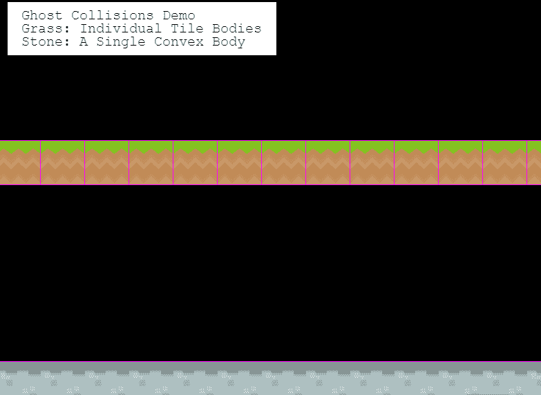**

**你可以看看我在 Phaser Labs 上创建的相应的现场演示。当蘑菇在顶部平台上移动时，你可以看到它们抓住了瓷砖的垂直边缘。这是由于物理引擎如何解决碰撞。当蘑菇碰撞瓷砖时，引擎将瓷砖视为独立的实体。它不知道它们形成一条直线，蘑菇不应该碰到任何垂直边缘。查看这篇文章以获得更多信息，并了解 Box2D 如何解决这个问题。**

**有几种方法可以缓解这种情况:**

*   **给物体添加倒角，例如，像我们在这篇文章中做的那样，或者使用圆形物体来减少幽灵碰撞的影响。**
*   **用尽可能少的形状来绘制关卡的生命盒，而不是给每个方块一个单独的实体。您仍然可以为此使用平铺。创建一个对象层，用形状填充它，在 Phaser 中将这些形状转换成物体。上面链接的演示代码就是这样做的。**
*   **或者，使用@hexus 的 [phaser-slopes](https://github.com/hexus/phaser-slopes) 插件。它解决了对 tilemaps 的幽灵碰撞，让你保持你的瓷砖作为单独的机构。**

# **系列大结局**

**感谢阅读。希望你喜欢阅读这个关于模块化游戏世界的系列。**

**虽然这个系列已经结束，但我仍将发布关于 Phaser 3 的帖子，所以如果您对格式有反馈，或者您希望在未来的帖子中看到一些内容，请告诉我！**

# **关于我**

**我是一名创意开发人员和教育家。我为 Phaser 3 编写了 Tilemap API，并创建了大量有指导的示例，但我希望将所有这些信息收集成一种更有指导、更易理解的格式，以便人们可以更容易地进入 Phaser 3。你可以看到更多我的作品，并在这里联系我。**